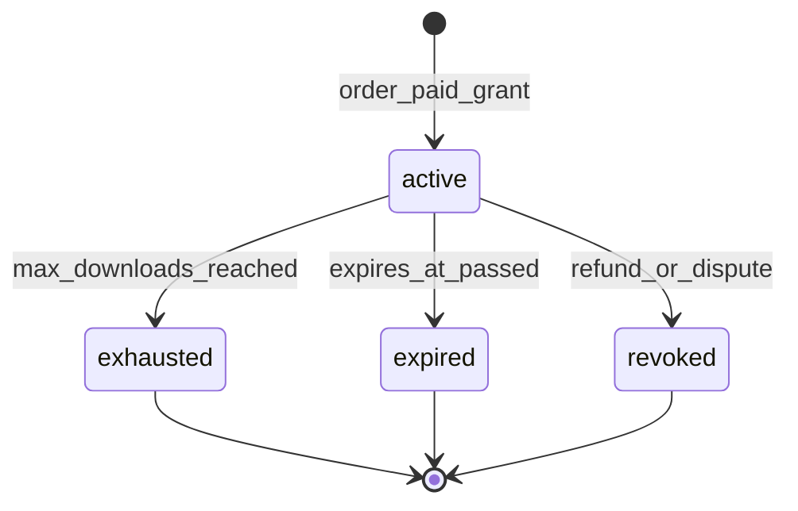
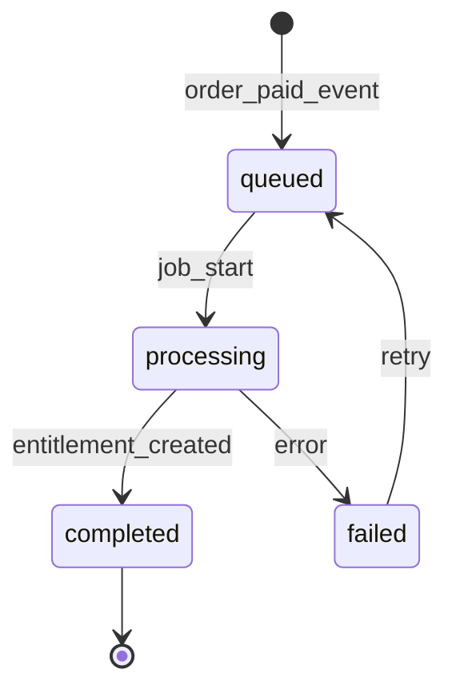

# Module: Digital Products and Services

**Document ID:** SCP-COM-005-14  
**Version:** 1.0.0  
**Status:** ✅ Active  
**Traceability:** FR-020, NFR-074, NFR-083, NFR-085

---

## Document Control

| Field | Value |
|-------|-------|
| Bounded Context | Digital Commerce |
| Aggregate Root | `DigitalAsset`, `ServiceBooking` (Phase 1.5) |
| Owner Module | `commerce.digital` |

---

## Purpose

Deliver downloadable files, license keys, and access-granted content immediately upon payment — aligned with Sapphital's education commerce roots — without inventory reservation and with NDPA-compliant access logging.

## Scope

- Digital product types: file download, license key, external URL grant, course enrollment hook (Volume 7)
- Secure download links with expiry and download limits
- Auto-fulfillment on OrderPaid
- Service products: appointment booking metadata (basic Phase 1)
- Watermarking hooks for PDF/video (Phase 2)

## Out of Scope

- DRM streaming infrastructure (integrate Vimeo/Cloudflare Stream Phase 2)
- Full calendaring (Volume 18)
- Course authoring (Volume 7 CMS)
- **Legacy separate Service listings module** — parallel service catalog without cart; superseded by unified `product.type = service` (Ch. 01) + Phase 3 [Ch. 22](./22-bookings-and-service-commerce.md)

## User Personas

Customer (buyer), Merchant (upload assets), System (fulfillment job).

## Business Capabilities

1. Attach files to digital product variant (max plan size)
2. Customer receives download link on order confirmation email
3. Limit downloads: 5 attempts, link expires 72h (configurable)
4. Generate unique license keys per purchase
5. Revoke access on refund/chargeback

---

## Entities and Value Objects

### Entities

| Entity | Key Fields |
|--------|------------|
| **DigitalAsset** | `id`, `tenant_id`, `variant_id`, `media_id`, `file_name`, `file_size`, `mime_type`, `version` |
| **DigitalEntitlement** | `id`, `tenant_id`, `order_item_id`, `customer_id`, `variant_id`, `status`, `license_key?`, `download_count`, `max_downloads`, `expires_at`, `granted_at`, `revoked_at` |
| **DownloadToken** | `id`, `entitlement_id`, `token`, `expires_at`, `used_at` |
| **ServiceDefinition** | `id`, `variant_id`, `duration_minutes`, `location_type` (`online`, `in_person`), `instructions` |

### Value Objects

| Value Object | Values |
|--------------|--------|
| **EntitlementStatus** | `active`, `expired`, `revoked`, `exhausted` |
| **DeliveryType** | `file`, `license_key`, `url`, `course_access` |

---

## Aggregate Roots

**DigitalEntitlement Aggregate** — access rights for one order line purchase.

**Invariants:**

1. Entitlement created only after OrderPaid
2. Download count ≤ max_downloads
3. Revoked entitlements reject all download attempts
4. Files served via signed URLs only — never public bucket paths

---

## Business Rules

| ID | Rule |
|----|------|
| BR-DIG-001 | Digital products skip inventory reservation (Ch.04) |
| BR-DIG-002 | Auto-fulfill on OrderPaid within 60 seconds |
| BR-DIG-003 | Default max_downloads=5, link TTL=72h — merchant override |
| BR-DIG-004 | License keys cryptographically random, unique globally |
| BR-DIG-005 | Refund revokes entitlement; download links invalidated |
| BR-DIG-006 | Large files (>100MB) use CDN signed URL with range support |
| BR-DIG-007 | Customer must accept terms for digital goods at checkout (no refund policy flag) |
| BR-DIG-008 | Course access entitlement calls CMS enrollment API (Volume 7) |
| BR-DIG-009 | NDPA: download access logged (customer_id, timestamp, IP) — RoPA category |
| BR-DIG-010 | Mixed cart: digital fulfilled immediately; physical follows shipping flow |

---

## State Machines

### Digital Entitlement

### Auto-Fulfillment Job

---

## API Contracts

**Admin:** `/api/v1/stores/{store_id}/digital`

| Method | Path | Description |
|--------|------|-------------|
| POST | `/variants/{id}/assets` | Attach digital file |
| GET | `/entitlements` | List entitlements |
| POST | `/entitlements/{id}/revoke` | Revoke access |
| POST | `/entitlements/{id}/reissue` | New download token |

**Customer:** `/storefront/v1/account/downloads`

| Method | Path | Description |
|--------|------|-------------|
| GET | `/downloads` | List active entitlements |
| POST | `/downloads/{entitlement_id}/token` | Generate download token |
| GET | `/downloads/file/{token}` | Download file (redirect to signed URL) |

**Internal:** `/internal/digital/fulfill` — triggered by OrderPaid

---

## Domain Events

| Event | Subscribers |
|-------|-------------|
| `DigitalEntitlementGranted` | Notifications, CMS enrollment, Webhooks |
| `DigitalDownloadCompleted` | Analytics |
| `DigitalEntitlementRevoked` | Notifications, CMS unenroll |
| `LicenseKeyGenerated` | Notifications (email key) |

---

## Background Jobs

| Job | Purpose |
|-----|---------|
| `DigitalFulfillmentJob` | On OrderPaid — create entitlements |
| `DigitalEntitlementExpiryJob` | Hourly — expire stale entitlements |
| `DigitalRevokeJob` | On refund — revoke and invalidate tokens |
| `OrphanAssetCleanupJob` | Weekly — unused assets without variant |

---

## Permissions and Authorization

- Customer: own entitlements only
- `digital:manage` — Merchant staff
- Download token: single-use optional per store setting

## Tenant Isolation

- Signed URLs include tenant-scoped path prefix
- RLS on entitlements; token validates entitlement store match

## Security Threat Model

| Threat | Mitigation |
|--------|------------|
| Hotlink sharing | Short-lived signed URLs; download limits |
| Token leakage | HTTPS only; token bound to customer session optional |
| Malware upload | MIME allowlist; async virus scan (ClamAV Phase 1.5) |
| Unauthorized download | Validate entitlement status before sign |

## Performance Requirements

- Fulfillment job p95 ≤ 5s (NFR-008)
- Signed URL generation p95 ≤ 100ms

## Caching Strategy

- Never cache download responses
- Entitlement list cache 30s for account page

## Observability

- Metrics: `digital.fulfillment.success`, `digital.downloads.count`
- Audit: download events with IP (NDPA lawful basis: contract)

## AI Opportunities

- Auto-generate product summary from uploaded PDF
- Detect piracy patterns (excessive IP diversity)

## Extension Points

- `DigitalDeliveryProvider` for course platforms, Zoom links
- Webhook: `digital/entitlement_granted`

## Testing Strategy

- Fulfillment on mixed cart
- Revoke invalidates active tokens
- Download limit enforcement

## Failure Modes

| Failure | Behavior |
|---------|----------|
| Media service unavailable | Retry fulfillment; customer sees "preparing download" |
| CMS enrollment fail | Alert merchant; entitlement still granted with manual fix queue |

---

## Acceptance Criteria

1. Digital order paid → entitlement active within 60s; email contains download link.
2. Sixth download attempt rejected when max_downloads=5.
3. Expired token returns 410 Gone with renewal option if entitlement active.
4. Full refund revokes entitlement; download returns 403.
5. License key unique across platform (collision test 10k keys).
6. Mixed order: digital available while physical still unfulfilled.
7. Download access log entry created with customer_id and timestamp (NDPA audit).
8. Cross-tenant entitlement inaccessible.

---

## ADRs

- ADR-004 (digital checkout same redirect payment flow)

## Sources

- Volume 1 Product types (digital, service)
- [Chapter 22 — Bookings & Service Commerce (Phase 3)](./22-bookings-and-service-commerce.md)
- Volume 7 CMS education commerce (integration hook)
- NDPA RoPA processing category — customer access logs
