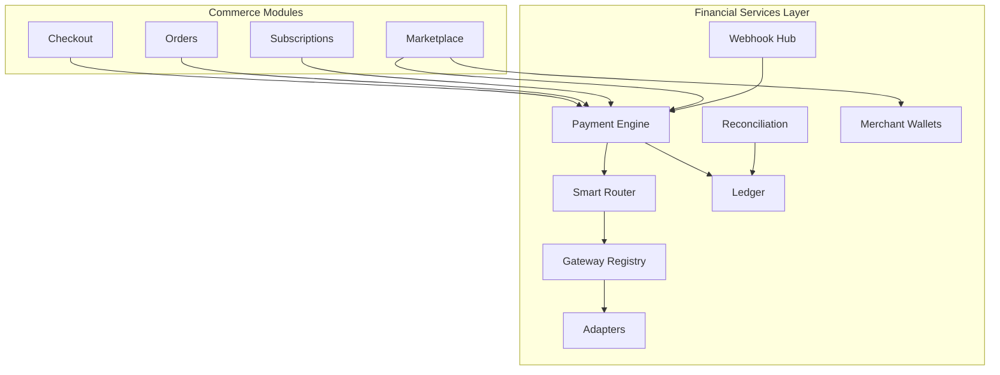
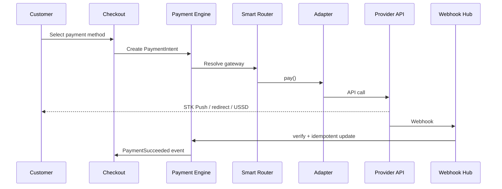

# Chapter 16: Financial Services Layer

**Document ID:** SCP-COM-005-16  
**Version:** 1.0.0  
**Status:** ✅ Active  
**Traceability:** ADR-019, ADR-004, NFR-044, NFR-083, FR-021  

---

## Purpose

Define the **Financial Services Layer (FSL)** — SCP's dedicated money-movement bounded context. Checkout, orders, marketplace, and subscriptions interact with FSL through interfaces; **no commerce module hardcodes a payment gateway**.

## Strategic Position

> **We support Africa.** Merchants do not ask "Can I connect Stripe?" first. They ask "Can I receive M-Pesa / bank transfer / mobile money?"

FSL makes that answer **yes**, per country, through one engine.

---

## 1. Bounded Context



**Module path:** `App\Domains\FinancialServices`  
**Database prefix:** `fs_*`  
**RLS:** All tables tenant-scoped (ADR-002)

---

## 2. Core Aggregates

| Aggregate | Responsibility |
|-----------|----------------|
| `PaymentIntent` | Customer payment attempt linked to order/checkout |
| `PaymentTransaction` | Provider-confirmed money movement |
| `Refund` | Reverse capture |
| `LedgerEntry` | Double-entry audit trail |
| `MerchantWallet` | Balance awaiting payout |
| `PayoutBatch` | Settlement to merchant/vendor bank/mobile money |
| `GatewayConfig` | Merchant credentials per adapter |
| `SplitInstruction` | Marketplace commission/tax/vendor splits |

---

## 3. Gateway Interface

```php
interface PaymentGatewayAdapter
{
    public function pay(PaymentRequest $request): PaymentResponse;
    public function authorize(PaymentRequest $request): PaymentResponse;
    public function capture(CaptureRequest $request): PaymentResponse;
    public function refund(RefundRequest $request): RefundResponse;
    public function verify(string $providerReference): PaymentResponse;
    public function cancel(string $providerReference): PaymentResponse;
    public function parseWebhook(Request $request): WebhookEvent;
    public function capabilities(): GatewayCapabilities;
}
```

`GatewayCapabilities` includes countries, methods, split support, currencies, sandbox availability.

---

## 4. Payment Engine Flow



---

## 5. Smart Routing Rules

| Priority | Rule |
|----------|------|
| 1 | Method must be supported by selected adapter |
| 2 | Customer country matches adapter country coverage |
| 3 | Currency settlement compatible |
| 4 | Merchant has valid credentials for adapter |
| 5 | Gateway health score ≥ threshold (circuit breaker) |
| 6 | Marketplace split requires `supports_split` or internal settlement |

**Fallback:** If primary fails, retry once on secondary adapter (same method class) when merchant enabled.

---

## 6. Split Payments

Example: Customer pays KSh 10,000

| Split | Recipient | Mechanism |
|-------|-----------|-----------|
| Vendor share | Vendor wallet | Adapter split or ledger credit |
| Platform commission | Platform revenue account | Ledger |
| Tax | Tax liability account | Tax Engine snapshot |
| Delivery partner | Partner wallet | Phase 3 |

If gateway lacks native split → **internal settlement workflow** after capture (nightly batch).

---

## 7. Ledger & Reconciliation

- Append-only `fs_ledger_entries` (debit/credit, account, reference)
- Daily reconciliation job: adapter settlement reports vs ledger
- Mismatch → SEV2 alert + merchant finance dashboard flag
- NDPA/audit: 7-year retention for financial records

---

## 8. Module Integration (Anti-Corruption)

| Consumer | Interface |
|----------|-----------|
| Checkout | `PaymentEngine::initialize(PaymentIntentDTO)` |
| Orders | Listens `PaymentSucceeded`, `PaymentFailed` |
| Marketplace | `SplitInstruction` on `OrderPaid` |
| Subscriptions | `PaymentEngine::chargeRecurring()` |
| Admin | `GatewayConfigService`, reconciliation reports |
| AI Advisor | Read-only analytics for failure rates |

**Forbidden:** `use Paystack\Client` outside `FinancialServices\Adapters\*`.

---

## 9. Offline & Manual Flows

| Method | FSL behavior |
|--------|--------------|
| Cash on delivery | `PaymentIntent` type `offline`; confirm on delivery |
| Bank deposit | Reference code; merchant or auto confirm via webhook |
| Pay on delivery | No capture until delivery event |
| Merchant confirmation | Admin confirms with audit + optional proof upload |

---

## 10. Phase Rollout

| Phase | Countries | Gateways |
|-------|-----------|----------|
| 1 | Nigeria | Paystack, Flutterwave, offline |
| 1b | Kenya | M-Pesa Daraja, Paystack KE |
| 2 | Ghana, Uganda, Tanzania, Rwanda | See Ch. 17 |
| 3 | South Africa | PayFast, Peach, Ozow, Yoco |
| Pan-African | All | Flutterwave, DPO, Cellulant, Pesapal aggregators |

---

## 11. Acceptance Criteria

- [ ] Zero direct PSP SDK imports outside adapter namespace
- [ ] Gateway interface implemented by all Phase 1 adapters
- [ ] Smart router selects gateway by country + method
- [ ] Webhook processing idempotent globally
- [ ] Split payment ledger balances to zero
- [ ] Reconciliation report generated daily per tenant
- [ ] Mobile money methods listed before cards in API `methods[]` order

---

## References

- [ADR-019](../00-meta/adr/019-financial-services-layer.md)
- [Chapter 17 — Gateway Adapters Africa](./17-payment-gateway-adapters-africa.md)
- [Chapter 08 — Payments (legacy module view)](./08-payments-nigeria-africa.md)
- [Volume 8 — Marketplace Payouts](../08-marketplace/README.md)
