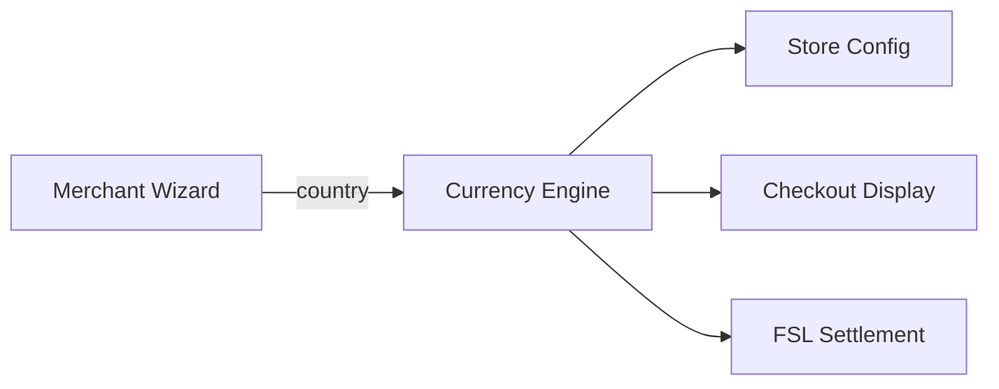

# Chapter 18: Regional Engines — Currency, Tax, Language

**Document ID:** SCP-COM-005-18  
**Version:** 1.0.0  
**Status:** ✅ Active  
**Traceability:** ADR-019, FR-021, NFR-083  

---

## Purpose

Define **configurable regional engines** — not hardcoded checkout logic — for currency, tax, and language across African markets. Multi-currency and localization are **core platform**, not add-ons.

---

## 1. Currency Engine

### Supported Currencies (Core)

| Code | Market |
|------|--------|
| NGN | Nigeria |
| KES | Kenya |
| UGX | Uganda |
| TZS | Tanzania |
| RWF | Rwanda |
| GHS | Ghana |
| ZAR | South Africa |
| USD | International / USD pricing |
| EUR | EU buyers / cross-border |

### Capabilities

| Feature | Description |
|---------|-------------|
| Store base currency | One per store; set by country wizard |
| Presentment currency | Customer sees local currency when configured |
| FX display | Optional mid-rate for display only (not settlement) |
| Rounding rules | Per currency minor units (NGN 2dp, no fractional KES in UI) |
| FSL integration | Settlement currency per gateway adapter |



---

## 2. Tax Engine

Per-country rules modeled as **data**, not `if (country === 'NG')` in checkout.

### Country Tax Profiles (Initial)

| Country | Default VAT/GST | Notes |
|---------|-----------------|-------|
| Nigeria | 7.5% VAT | Vatable goods; exemptions configurable |
| Kenya | 16% VAT | Standard rate profile |
| Ghana | 15% VAT + levies | NHIL/GETFund flags Phase 2 |
| South Africa | 15% VAT | |
| Rwanda | 18% VAT | |
| Tanzania | 18% VAT | |
| Uganda | 18% VAT | |

### Tax Engine Components

| Component | Role |
|-----------|------|
| `TaxProfile` | Country-level defaults |
| `TaxZone` | State/region overrides |
| `TaxRate` | Rate + product category applicability |
| `TaxLineSnapshot` | Immutable on order (Ch. 09) |

FSL split payments consume tax line amounts from Tax Engine at payment time.

---

## 3. Language Engine

### Launch Languages

| Code | Language | Priority Markets |
|------|----------|------------------|
| `en` | English | All |
| `sw` | Swahili | Kenya, Tanzania, Uganda |
| `fr` | French | Rwanda, West/Central Africa expansion |
| `ar` | Arabic | North Africa Phase 3 |
| `pt` | Portuguese | Angola, Mozambique Phase 3 |

### Requirements

- All customer-facing strings via i18n keys (storefront, checkout, emails, WhatsApp templates)
- Merchant can enable store languages; default from country wizard
- RTL support for Arabic (theme engine)
- AI translation assist for product copy (Volume 9) — human review for legal pages

---

## 4. Country-Driven Merchant Setup Wizard

On signup: **"Which country?"** → auto-provision:

| Setting | Example: Kenya |
|---------|----------------|
| Currency | KES |
| Languages | English, Swili |
| Payment gateways | M-Pesa, Airtel, Pesapal (recommended) |
| Tax profile | Kenyan VAT |
| Shipping | Local courier presets |
| Theme suggestions | Retail, agriculture, pharmacy verticals |

Wizard writes to: Store, FSL gateway recommendations, Tax profile, Currency, i18n defaults.

Implementation: Volume 16 SaaS onboarding + Volume 21 playbook.

---

## 5. Logistics Adapter Pattern (Parallel to Payments)

Same architecture as FSL gateways:

```text
Checkout / Fulfillment
        ↓
Shipping Engine
        ↓
Carrier Interface
        ↓
Carrier Adapter
        ↓
Provider API
```

Examples: GIG, Kwik (Nigeria), Sendy (Kenya), regional couriers, international carriers Phase 3.

See [Chapter 10 — Shipping](./10-shipping-and-logistics.md) for fulfillment entities; adapters extend carrier integration.

---

## 6. Acceptance Criteria

- [ ] New country tax profile addable without checkout code change
- [ ] Currency list includes all 9 core codes
- [ ] Storefront renders in 5 launch languages
- [ ] Country wizard provisions currency + tax + gateway recommendations
- [ ] Tax snapshots immutable on paid orders

---

## References

- [Chapter 09 — Taxes and Compliance](./09-taxes-and-compliance.md)
- [Chapter 16 — Financial Services Layer](./16-financial-services-layer.md)
- [Volume 16 — SaaS Tenant Lifecycle](../16-saas-platform/03-tenant-lifecycle-onboarding.md)
