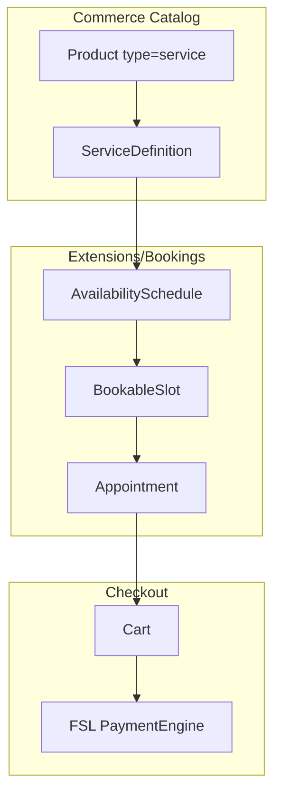

# Chapter 22: Bookings & Service Commerce (Phase 3 Extension)

**Document ID:** SCP-COM-005-22  
**Version:** 1.0.0  
**Status:** ✅ Active (Phase 3 gate — not Nigeria GA)  
**Traceability:** FR-020, ADR-023, Vol 3 Ch. 13, Vol 5 Ch. 01, Ch. 14  
**Legacy mapping:** `Modules/Service` — superseded by unified catalog + Bookings extension

---

## Purpose

Specify **`Modules/Extensions/Bookings/`** — the Phase 3 vertical for sellable **service products** with availability, appointments, and booking checkout. Replaces legacy parallel Service listings module without duplicating the product catalog.

## Scope

- Service product type with booking metadata (extends Ch. 01, Ch. 14)
- Availability schedules, blackout dates, staff/resources
- Customer appointment booking flow
- Booking checkout (deposit or full pay via FSL)
- Service listing pages via theme sections + CMS
- Admin: calendar, booking management, reminders
- Domain events and automation hooks (Vol 19)

## Out of Scope (Phase 3)

- Full ERP timesheets (Phase 4+ `Extensions/Projects/`)
- Multi-staff complex routing (Phase 3.5)
- Video conferencing provisioning (integrate Zoom/Meet via connector)
- **Legacy Service module clone** — no separate `Service` entity parallel to `Product`

## Phase Alignment

| Phase | Deliverable |
|-------|-------------|
| **Phase 1** | `product.type = physical \| digital` only at GA |
| **Phase 1.5** | `product.type = service` purchasable without calendar (fixed slot / manual confirm) |
| **Phase 3** | Bookings extension — calendar, availability, automated confirm |
| **Phase 3.5** | Staff assignment, resource rooms, marketplace service vendors |

---

## 1. Architecture

**Package:** `Modules/Extensions/Bookings/`  
**Depends on:** `Modules/Commerce/Catalog`, `Platform/Notifications`, `Platform/FinancialServices`  
**Rule:** Bookings extension references `product_id` / `variant_id` only — never duplicates product title/price.

---

## 2. Entities

| Entity | Key fields |
|--------|------------|
| **ServiceDefinition** | `variant_id`, `duration_minutes`, `buffer_minutes`, `location_type` (`online`, `in_person`, `phone`), `instructions`, `requires_staff` |
| **AvailabilitySchedule** | `tenant_id`, `store_id`, `resource_id?`, `day_of_week`, `starts_at`, `ends_at`, `timezone` |
| **AvailabilityBlackout** | `schedule_id`, `starts_at`, `ends_at`, `reason` |
| **BookableResource** | `name`, `type` (`staff`, `room`, `equipment`), `staff_user_id?` |
| **BookableSlot** | `variant_id`, `resource_id?`, `starts_at`, `ends_at`, `capacity`, `booked_count`, `status` |
| **Appointment** | `id`, `tenant_id`, `customer_id`, `order_id?`, `variant_id`, `slot_id`, `status`, `notes`, `confirmed_at`, `cancelled_at` |

---

## 3. Service Listings (Storefront)

Legacy service **category pages** map to SCP as:

| Legacy | SCP |
|--------|-----|
| `/service-category/{slug}` | Collection or CMS page with `services-grid` section |
| `/service/{slug}` | Product PDP where `type=service` |
| Brochure-only (no buy) | CMS page + CTA to contact form (Vol 7 Ch. 11) |

Theme sections (Vol 6): `services-grid`, `service-detail`, `booking-cta`, `team`, `process-steps`.

---

## 4. Booking Flow (Customer)

1. Customer opens service PDP → selects date from availability widget
2. System returns open slots (respects timezone, buffer, capacity)
3. Customer selects slot → adds to cart as line type `service_booking`
4. Checkout: FSL redirect (deposit % or full amount — merchant config)
5. On `OrderPaid` → `Appointment` confirmed; slot capacity decremented
6. Confirmation email + WhatsApp (Vol 19) with calendar `.ics` attachment

### Business rules

| ID | Rule |
|----|------|
| BR-BKG-001 | Double-booking prevented by row lock on `BookableSlot` |
| BR-BKG-002 | Cancellation policy: free cancel ≥ 24h before slot (merchant override) |
| BR-BKG-003 | Refund on cancel follows Vol 5 Ch. 12 + appointment status |
| BR-BKG-004 | No-show after 15 min → staff can mark `no_show`; no auto-refund unless policy |
| BR-BKG-005 | Slot generation job runs nightly for next 90 days |

---

## 5. Admin UI

**Commerce → Services → Bookings**

| Screen | Actions |
|--------|---------|
| Calendar | Day/week view, drag reschedule, block time |
| Appointments | List, filter, confirm, cancel, refund link |
| Availability | Weekly template, holidays, staff hours |
| Resources | Staff/room CRUD |

Permissions: `commerce.bookings.view`, `commerce.bookings.manage`.

---

## 6. APIs

Prefix: `/api/v1/admin/bookings/` and `/api/v1/storefront/bookings/`

| Method | Path | Description |
|--------|------|-------------|
| GET | `/storefront/services/{slug}/availability` | Open slots for date range |
| POST | `/storefront/bookings/hold` | Temporary slot hold (5 min) |
| POST | `/storefront/cart` | Add booking line (existing cart API extension) |
| GET | `/admin/appointments` | Paginated list |
| PATCH | `/admin/appointments/{id}` | Reschedule, cancel, confirm |

OpenAPI in `Modules/Extensions/Bookings/docs/API.md`.

---

## 7. Events

| Event | Consumers |
|-------|-----------|
| `AppointmentBooked` | Notifications, CRM timeline |
| `AppointmentConfirmed` | WhatsApp reminder workflow |
| `AppointmentCancelled` | Refund orchestration, slot release |
| `AppointmentReminderDue` | 24h / 1h reminder jobs |

---

## 8. Acceptance Criteria (Phase 3 gate)

- [ ] Service product with availability bookable end-to-end
- [ ] No double-booking under concurrent requests
- [ ] Cancel + refund path documented and tested
- [ ] Calendar admin reschedule updates slot and notifies customer
- [ ] Theme `services-grid` + booking widget render on reference theme
- [ ] No standalone Service entity table — all tied to `Product`
- [ ] Legacy Service module **not** ported

---

## References

- [Ch. 01 — Catalog and Products](./01-catalog-and-products.md)
- [Ch. 14 — Digital Products and Services](./14-digital-products-and-services.md)
- [Legacy Capability Matrix § Service listings](../00-meta/legacy-capability-matrix.md)
- [Vol 3 Ch. 13 — Platform OS Extensions](../03-architecture/13-platform-os-architecture.md)
- [Vol 6 Ch. 11 — Reference themes section catalog](../06-theme-engine/11-reference-themes-section-catalog.md)
