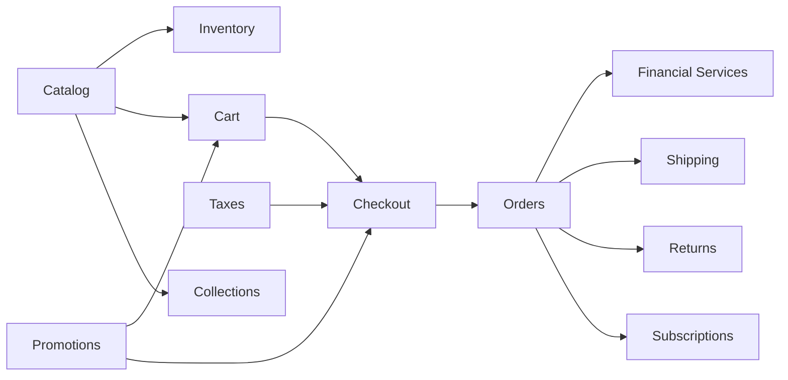

# Volume 5: Commerce Core Engine

**Document ID:** SCP-COM-005  
**Version:** 1.0.0  
**Status:** ✅ Active  
**Owner:** Sapphital Learning Company  
**Lead Architect:** Stephen Musyoka Makola  
**Traceability:** FR-020–025, NFR-003–004, NFR-012, NFR-040, NFR-044, NFR-071, NFR-083–085, ADR-004

---

## Purpose

Volume 5 defines the **Commerce Core Engine** and **Financial Services Layer (FSL)** — bounded contexts, aggregates, APIs, and African payment infrastructure. Nigeria launches first; Kenya, Ghana, Uganda, Tanzania, Rwanda, and South Africa expand through gateway adapters (ADR-019), not checkout rewrites.

## Scope

| In Scope | Out of Scope (Other Volumes) |
|----------|------------------------------|
| Product catalog, variants, pricing | Theme rendering (Volume 6) |
| Collections, categories, navigation hooks | CMS pages (Volume 7) |
| Inventory and warehouses | Marketplace commissions (Volume 8) |
| Cart, checkout orchestration | Identity and RBAC detail (Volume 3/11) |
| Orders, fulfillment, shipments | AI agents (Volume 9) |
| Financial Services Layer (FSL), gateway adapters, smart routing | Infrastructure deployment (Volume 10) |
| Regional currency, tax, language engines | Developer SDKs (Volume 12) |
| Taxes, promotions, returns, offline payments | POS offline sync (Volume 18) |
| Promotional campaigns, flash sales, catalog ops | — |
| Subscriptions, gift cards, digital goods | — |

## Architecture Principles

1. **Aggregate-first DDD** — External modules reference aggregate roots by ID only (FR-023).
2. **Event-driven integration** — Cross-context changes publish immutable domain events (FR-024).
3. **Money as integer minor units** — All prices stored as `amount_cents` + ISO 4217 currency (FR-021).
4. **Tenant isolation** — Every commerce entity carries `tenant_id`; PostgreSQL RLS enforced (FR-020, NFR-040).
5. **PSP redirect checkout** — No cardholder data on SCP infrastructure; SAQ A eligible (ADR-004, NFR-044).
6. **Financial Services Layer** — Gateway adapters, smart routing, ledger; checkout never hardcodes PSPs (ADR-019).
7. **Mobile money first** — M-Pesa, MTN MoMo, Airtel Money before cards in UX and API ordering.

## Bounded Context Map

## Chapter Index

| # | Chapter | Module | Status |
|---|---------|--------|--------|
| 01 | [Catalog and Products](./01-catalog-and-products.md) | Product Catalog | ✅ |
| 02 | [Variants, Attributes, Pricing](./02-variants-attributes-pricing.md) | Catalog / Pricing | ✅ |
| 03 | [Collections and Categories](./03-collections-and-categories.md) | Merchandising | ✅ |
| 04 | [Inventory and Warehouses](./04-inventory-and-warehouses.md) | Inventory | ✅ |
| 05 | [Cart and Session](./05-cart-and-session.md) | Cart | ✅ |
| 06 | [Checkout Architecture](./06-checkout-architecture.md) | Checkout | ✅ |
| 07 | [Orders and Fulfillment](./07-orders-and-fulfillment.md) | Orders | ✅ |
| 08 | [Payments — Nigeria & Africa](./08-payments-nigeria-africa.md) | Payments | ✅ |
| 09 | [Taxes and Compliance](./09-taxes-and-compliance.md) | Tax | ✅ |
| 10 | [Shipping and Logistics](./10-shipping-and-logistics.md) | Shipping | ✅ |
| 11 | [Promotions, Discounts, Coupons](./11-promotions-discounts-coupons.md) | Promotions | ✅ |
| 12 | [Returns, Refunds, Disputes](./12-returns-refunds-disputes.md) | Returns | ✅ |
| 13 | [Subscriptions and Gift Cards](./13-subscriptions-and-gift-cards.md) | Recurring / Stored Value | ✅ |
| 14 | [Digital Products and Services](./14-digital-products-and-services.md) | Digital Commerce | ✅ |
| 15 | [Community, Loyalty & Live Commerce](./15-community-loyalty-live-commerce.md) | Engagement | ✅ |
| 16 | [Financial Services Layer](./16-financial-services-layer.md) | FSL | ✅ |
| 17 | [Payment Gateway Adapters — Africa](./17-payment-gateway-adapters-africa.md) | FSL Adapters | ✅ |
| 18 | [Regional Engines — Currency, Tax, Language](./18-regional-engines-currency-tax-language.md) | Regional | ✅ |
| 19 | [Offline Payments & Mobile-Money-First UX](./19-offline-payments-mobile-money-ux.md) | FSL / UX | ✅ |
| 20 | [Promotional Campaigns & Flash Sales](./20-promotional-campaigns-and-flash-sales.md) | Campaigns | ✅ |
| 21 | [Catalog Operations — Compare, Clone, Badges](./21-catalog-operations-compare-clone-badges.md) | Catalog ops | ✅ |
| 22 | [Bookings & Service Commerce (Phase 3)](./22-bookings-and-service-commerce.md) | Bookings ext. | ✅ Phase 3 |

## Cross-Volume Dependencies

| Dependency | Volume | Usage |
|------------|--------|-------|
| Domain model entities | 01 Vision Ch.10 | Entity names and relationships |
| Checkout PSP model | ADR-004 | Redirect/hosted checkout only Phase 1 |
| Africa regulatory | 11 Security Ch.02 | NDPA checkout notice, data minimization |
| Multi-tenancy | 03 Architecture | RLS, store scoping |
| Webhooks | 12 Developer Platform | Order/payment event delivery |

## Phase 1 Launch Gate (Commerce)

Volume 5 is **Phase 1 complete** when:

- [ ] All 14 module acceptance criteria chapters pass integration tests
- [ ] Paystack and Flutterwave redirect flows verified in NGN sandbox
- [ ] M-Pesa STK Push verified in KES sandbox (Kenya launch gate)
- [ ] Tenant isolation suite: zero cross-tenant commerce data access
- [ ] Checkout completes in ≤ 60 seconds on 4G (NFR-012)
- [ ] No PAN/CVV stored or logged (NFR-044)

## Related ADRs

| ADR | Topic |
|-----|-------|
| [ADR-019](../00-meta/adr/019-financial-services-layer.md) | Financial Services Layer, gateway interface |
| [ADR-004](../00-meta/adr/004-checkout-psp-redirect-saq-a.md) | PSP redirect checkout, SAQ A |
| ADR-011 | Data residency Nigeria/West Africa |

## Sources

- Volume 1 Domain Model Overview
- PCI SSC SAQ A r1 (March 2025)
- Paystack API: https://paystack.com/docs/api/
- Flutterwave API: https://developer.flutterwave.com/docs
- Safaricom M-Pesa Daraja: https://developer.safaricom.co.ke/
