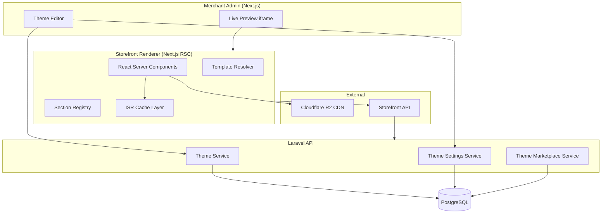

# Chapter 01: Theme Engine Overview

**Document ID:** SCP-THE-006-01  
**Version:** 1.0.0  
**Status:** 📝 Draft  
**Traceability:** ADR-003, PRD-004, PRD-006, NFR-001, NFR-009, NFR-035, NFR-047, NFR-058  

---

## 1. Purpose

Define the SAPPHITAL Commerce Platform (SCP) Theme Engine and **Storefront Engine** — extensibility for themes plus the eight-layer intelligent customer experience (Volume 6 Ch. 12). Delivers agency-quality, AI-native storefronts optimized for **Nigeria-first mobile performance** on 3G/4G networks.

## 2. Scope

- Theme package structure and lifecycle
- Relationship to Storefront API, CMS, and Commerce Engine
- Built-in themes and third-party Theme Store
- Merchant theme editor and live preview
- Theme SDK and CLI for developers
- Performance, security, and tenant isolation requirements
- Phase rollout (MVP → full ecosystem)

## 3. Out of Scope

- Admin dashboard UI (Volume 4 — SAPPHITAL Design System)
- CMS page builder internals (Volume 7)
- Payment/checkout business logic (Volume 5; ADR-004 governs checkout template lockdown)
- Plugin/app runtime beyond theme **app blocks** (Volume 12)

## 4. User and Business Value

| Persona | Value |
|---------|-------|
| **Nigerian merchant (SME)** | Professional storefront in minutes; customize on mobile without a developer |
| **Theme developer** | npm/TypeScript ecosystem; publish to Theme Store; earn 70% revenue share |
| **Shopper (mobile-first)** | Fast pages (LCP ≤ 2.0s on 4G); accessible, localized Naira pricing display |
| **Platform (Sapphital)** | Differentiation vs fixed-template builders; marketplace commission (PRD-006) |

## 5. Architecture Impact

The Theme Engine is a **decoupled bounded context** within the modular monolith. Core platform code never imports theme packages directly at compile time in the Laravel API layer; the **Next.js Storefront Renderer** loads theme packages at build/deploy time per tenant configuration.

**Hard rules (ADR-003):**

1. Themes are **npm packages** with React components; page structure is **JSON only**.
2. Themes consume data via **Storefront API** — no direct database access.
3. Merchant-editable settings are **schema-validated** (Zod); no arbitrary code in JSON.
4. Checkout uses a **platform-locked template** — themes cannot inject scripts on checkout (ADR-004).

## 6. Domain Ownership

| Aggregate | Owner Module | Tenant Scoped |
|-----------|--------------|---------------|
| `Theme` (catalog entry) | Theme Marketplace | No (platform catalog) |
| `ThemeVersion` | Theme Marketplace | No |
| `ThemeInstallation` | Theme Engine | Yes (`store_id`) |
| `ThemeSetting` | Theme Engine | Yes (`store_id`) |
| `ThemeTemplate` | Theme Engine | Yes (`store_id`, per-template JSON) |
| `ThemePreviewSession` | Theme Engine | Yes (`store_id`) |
| `ThemeAsset` | Media + Theme Engine | Yes (`tenant_id`) |

## 7. Core Concepts

| Term | Definition |
|------|------------|
| **Theme** | Versioned npm package: components + JSON templates + assets + settings schema |
| **Template** | JSON file defining ordered sections for a page type (`index`, `product`, `collection`, etc.) |
| **Section** | Configurable page region (Hero, ProductGrid, Footer) with typed settings |
| **Block** | Child content unit inside a section (Heading, Image, Button) |
| **App block** | Block contributed by an installed plugin via Theme App Extension API |
| **Preset** | Default section/block configuration bundled with a theme |
| **Design tokens** | Colors, typography, spacing from Volume 4 SDS — mapped into theme settings |

## 8. Built-in Themes (Phase 1)

| Theme ID | Name | Target Merchant | Notes |
|----------|------|-----------------|-------|
| `scp-dawn` | Dawn NG | General retail | Default; optimized for mobile Lagos 4G |
| `scp-market` | Market | Multi-vendor | Vendor spotlight sections |
| `scp-catalog` | Catalog | B2B / wholesale | Dense product tables, MOQ display |

Built-in themes ship with the platform. Third-party themes enter via Theme Store in Phase 3.

## 9. Phase Rollout

| Phase | Capability | Launch Gate |
|-------|------------|-------------|
| **Phase 1** | 3 built-in themes; global settings (logo, colors, fonts); template JSON read-only | Nigeria GA |
| **Phase 2** | Section/block editor; live preview; template customization; theme duplication | 500 active merchants |
| **Phase 3** | Theme SDK, CLI, Theme Store, third-party publishing | PRD-006 |
| **Phase 3+** | App blocks, headless theme rendering via Storefront API only | Developer ecosystem scale |

## 10. Nigeria Mobile Performance Context

Nigeria is the primary market (NFR-058: functional on 3G at 768 Kbps).

| Constraint | Theme Engine Response |
|------------|----------------------|
| High mobile share (~85% of African e-commerce traffic) | Mobile-first section defaults; touch targets ≥ 44px (NFR-051) |
| Variable latency (Lagos 4G p75 ~800ms RTT) | ISR + CDN; RSC minimizes client JS |
| Data cost sensitivity | Theme JS budget **≤ 100 KB gzipped** (stricter than platform 150 KB) |
| Intermittent connectivity | Skeleton states; progressive image loading; offline cart via service worker (Phase 2) |

## 11. Integration Points

| System | Integration |
|--------|-------------|
| **Volume 4 — SDS** | Design tokens exported as CSS variables; theme settings reference token keys |
| **Volume 5 — Commerce** | Product/collection/cart data via Storefront API |
| **Volume 7 — CMS** | CMS pages select theme templates; shared block types |
| **Volume 11 — Security** | CSP, sandbox, theme review, supply chain (Chapter 09) |
| **Volume 12 — Developer Platform** | Theme SDK, OAuth for app blocks, webhooks on theme publish |

## 12. Observability

| Signal | Metric | Alert Threshold |
|--------|--------|-----------------|
| Render latency | `theme.render.duration_ms` p95 | > 500ms |
| ISR cache hit rate | `theme.isr.hit_ratio` | < 80% |
| Theme JS weight | `theme.bundle.size_bytes_gzip` | > 100 KB |
| Lighthouse CI | `theme.lighthouse.performance` | < 85 (Theme Store gate) |
| Preview session errors | `theme.preview.error_rate` | > 1% |

## 13. Risks and Tradeoffs

| Risk | Mitigation |
|------|------------|
| React skill barrier for theme devs | Starter templates, CLI scaffolding, documentation |
| Theme bundle bloat | Enforced budgets in CI; lazy sections below fold |
| Malicious theme package | Review pipeline, SBOM, signed packages (Chapter 07, 09) |
| Merchant breaks layout | Undo stack, preset restore, non-destructive draft/publish |
| PCI scope from checkout customization | Locked checkout template (ADR-004) |

## 14. Acceptance Criteria (Volume Gate)

Volume 6 Phase 1 is complete when:

- [ ] All 11 chapters approved and cross-linked
- [ ] Built-in theme renders homepage, product, collection, cart with LCP ≤ 2.0s mobile (NFR-001)
- [ ] Theme settings persist per store with tenant isolation verified (NFR-040)
- [ ] JSON template schema validates 100% of merchant-editable fields
- [ ] Checkout template rejects theme-injected scripts (ADR-004)
- [ ] Theme editor live preview functional on 375px viewport (iPhone SE class)
- [ ] WCAG 2.2 AA on built-in theme storefront surfaces (NFR-047)

## 15. Related ADRs and Sources

- [ADR-003: Theme Engine — React + JSON Schema](../00-meta/adr/003-theme-engine-react-json-schema.md)
- [ADR-004: Checkout PSP Redirect](../00-meta/adr/004-checkout-psp-redirect-saq-a.md)
- [ADR-008: Edge Security — Cloudflare](../00-meta/adr/008-edge-security-cloudflare.md)
- Shopify Online Store 2.0 themes: https://shopify.dev/docs/storefronts/themes/architecture (E1)
- Next.js Server Components: https://nextjs.org/docs/app/building-your-application/rendering/server-components (E1)
- Shopify Hydrogen architecture patterns: https://shopify.dev/docs/api/hydrogen (E2)
