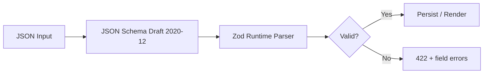

# Chapter 02: Template Schema Specification

**Document ID:** SCP-THE-006-02  
**Version:** 1.0.0  
**Status:** 📝 Draft  
**Traceability:** ADR-003, NFR-037, NFR-039  

---

## 1. Purpose

Define the canonical JSON schema for SCP theme templates, theme settings, and section/block configuration. All merchant customization and theme developer authoring must validate against these schemas before persistence or render.

## 2. Scope

- `theme.schema.json` — global theme settings
- Page template files (`templates/*.json`)
- Section and block instance schemas
- Zod validation rules and error handling
- Schema versioning and backward compatibility

## 3. Out of Scope

- React component implementation (Chapter 03, 04)
- CMS rich-text HTML schema (Volume 7)

## 4. Schema Architecture

```text
theme.schema.json          → Global settings (colors, typography, layout)
templates/index.json       → Page layout (ordered section instances)
sections/*.schema.json       → Per-section setting definitions (in theme package)
blocks/*.schema.json         → Per-block setting definitions (in theme package)
```

Validation pipeline:



## 5. Theme Settings Schema (`theme.schema.json`)

Global settings apply across all templates. Stored in `theme_settings.settings` (JSONB).

```json
{
  "$schema": "https://json-schema.org/draft/2020-12/schema",
  "$id": "https://scp.sapphital.com/schemas/theme-settings/v1",
  "type": "object",
  "required": ["schema_version", "settings"],
  "properties": {
    "schema_version": {
      "type": "string",
      "const": "1.0.0"
    },
    "settings": {
      "type": "object",
      "properties": {
        "color_scheme": {
          "type": "string",
          "enum": ["light", "dark", "system"]
        },
        "primary_color": {
          "type": "string",
          "pattern": "^#([A-Fa-f0-9]{6}|[A-Fa-f0-9]{3})$"
        },
        "accent_color": { "type": "string", "pattern": "^#([A-Fa-f0-9]{6}|[A-Fa-f0-9]{3})$" },
        "font_heading": {
          "type": "string",
          "enum": ["inter", "plus-jakarta", "dm-sans", "system"]
        },
        "font_body": {
          "type": "string",
          "enum": ["inter", "plus-jakarta", "dm-sans", "system"]
        },
        "logo_media_id": { "type": "string", "format": "uuid" },
        "favicon_media_id": { "type": "string", "format": "uuid" },
        "currency_display": {
          "type": "string",
          "enum": ["symbol", "code", "symbol_code"],
          "default": "symbol"
        },
        "show_vendor_name": { "type": "boolean", "default": false }
      },
      "additionalProperties": false
    }
  },
  "additionalProperties": false
}
```

**Business rules:**

- `primary_color` and `accent_color` must meet WCAG 2.2 AA contrast against background (validated server-side, NFR-050).
- Font choices map to Volume 4 SDS token subsets — only preloaded font files allowed (performance).
- `logo_media_id` must reference tenant-owned media (authorization check).

## 6. Page Template Schema (`templates/*.json`)

Each page type has a template file listing ordered section instances.

```json
{
  "$schema": "https://scp.sapphital.com/schemas/page-template/v1",
  "schema_version": "1.0.0",
  "template_key": "index",
  "label": "Homepage",
  "sections": [
    {
      "id": "hero-main",
      "type": "hero",
      "settings": {
        "heading": "Welcome to our store",
        "subheading": "Shop the latest in Lagos",
        "image_media_id": "550e8400-e29b-41d4-a716-446655440000",
        "cta_label": "Shop now",
        "cta_url": "/collections/all",
        "text_alignment": "center",
        "overlay_opacity": 40
      },
      "blocks": [
        {
          "id": "hero-badge-1",
          "type": "badge",
          "settings": {
            "text": "Free delivery in Lagos",
            "variant": "success"
          }
        }
      ],
      "block_order": ["hero-badge-1"]
    },
    {
      "id": "featured-products",
      "type": "product-grid",
      "settings": {
        "heading": "Featured products",
        "collection_id": "col_abc123",
        "products_to_show": 8,
        "columns_mobile": 2,
        "columns_desktop": 4,
        "show_quick_add": true
      },
      "blocks": [],
      "block_order": []
    }
  ],
  "order": ["hero-main", "featured-products"]
}
```

### 6.1 Supported Template Keys

| `template_key` | Page | Locked |
|----------------|------|--------|
| `index` | Homepage | No |
| `product` | Product detail | No |
| `collection` | Collection listing | No |
| `cart` | Cart | Partial (layout only) |
| `checkout` | Checkout redirect shell | **Yes** — platform controlled |
| `search` | Search results | No |
| `page` | CMS page | No |
| `404` | Not found | No |
| `password` | Store password gate | Yes |

### 6.2 Section Instance Rules

| Rule ID | Description |
|---------|-------------|
| TS-001 | Each section `id` must be unique within the template |
| TS-002 | Section `type` must exist in theme section registry |
| TS-003 | `settings` keys must match section schema; unknown keys rejected |
| TS-004 | Maximum 50 sections per template |
| TS-005 | Maximum 50 blocks per section |
| TS-006 | `block_order` must contain exactly the block ids defined in `blocks` |

## 7. Setting Field Types

Theme section schemas declare settings using a Shopify-inspired type system:

| Type | JSON Schema | UI Control | Example |
|------|-------------|------------|---------|
| `text` | `string`, max 500 | Single-line input | Heading |
| `textarea` | `string`, max 5000 | Multiline | Description |
| `richtext` | `string` (sanitized HTML subset) | Rich text editor | Body copy |
| `number` | `number` + min/max | Number input | Products to show |
| `range` | `integer` + min/max/step | Slider | Overlay opacity |
| `checkbox` | `boolean` | Toggle | Show vendor |
| `select` | `string` enum | Dropdown | Text alignment |
| `color` | hex pattern | Color picker | Background |
| `media` | UUID | Media picker | Hero image |
| `collection` | string (collection handle) | Resource picker | Featured collection |
| `product` | string (product handle) | Resource picker | Spotlight product |
| `url` | string (relative or https) | URL input | CTA link |
| `font` | enum | Font picker | Heading font |

**Security rules for setting values:**

- `url`: Relative paths (`/collections/...`) or `https://` only; no `javascript:`, `data:`, or protocol-relative URLs.
- `richtext`: Allowlist tags (`p`, `strong`, `em`, `a`, `ul`, `ol`, `li`, `h2`, `h3`); `a[href]` same rules as `url`.
- `media`: Must resolve to tenant media; MIME allowlist (`image/jpeg`, `image/png`, `image/webp`, `image/svg+xml` with sanitization).

## 8. Section Schema Definition (Theme Package)

Each section exports a schema file consumed at theme build time:

```json
{
  "name": "hero",
  "label": "Hero banner",
  "category": "promotional",
  "settings": [
    {
      "id": "heading",
      "type": "text",
      "label": "Heading",
      "default": "Welcome"
    },
    {
      "id": "image_media_id",
      "type": "media",
      "label": "Background image"
    },
    {
      "id": "text_alignment",
      "type": "select",
      "label": "Text alignment",
      "options": [
        { "value": "left", "label": "Left" },
        { "value": "center", "label": "Center" },
        { "value": "right", "label": "Right" }
      ],
      "default": "center"
    }
  ],
  "blocks": [
    {
      "type": "badge",
      "label": "Promotional badge",
      "limit": 3,
      "settings": [
        { "id": "text", "type": "text", "label": "Badge text" },
        {
          "id": "variant",
          "type": "select",
          "options": [
            { "value": "default", "label": "Default" },
            { "value": "success", "label": "Success" }
          ]
        }
      ]
    }
  ],
  "presets": [
    {
      "name": "Default hero",
      "settings": { "heading": "Welcome to our store" }
    }
  ],
  "max_blocks": 3
}
```

## 9. Zod Validation (Runtime)

Theme Engine uses Zod schemas generated from JSON Schema at build time:

```typescript
// Illustrative — implementation in packages/theme-validator
import { z } from 'zod';

const HexColor = z.string().regex(/^#([A-Fa-f0-9]{6}|[A-Fa-f0-9]{3})$/);

export const ThemeSettingsV1 = z.object({
  schema_version: z.literal('1.0.0'),
  settings: z.object({
    color_scheme: z.enum(['light', 'dark', 'system']).optional(),
    primary_color: HexColor.optional(),
    accent_color: HexColor.optional(),
    font_heading: z.enum(['inter', 'plus-jakarta', 'dm-sans', 'system']).optional(),
    font_body: z.enum(['inter', 'plus-jakarta', 'dm-sans', 'system']).optional(),
    logo_media_id: z.string().uuid().optional(),
    favicon_media_id: z.string().uuid().optional(),
    currency_display: z.enum(['symbol', 'code', 'symbol_code']).default('symbol'),
    show_vendor_name: z.boolean().default(false),
  }).strict(),
}).strict();
```

Validation occurs at:

1. **Theme publish** — full package validation (CLI + platform)
2. **Merchant save** — template/settings PATCH endpoints
3. **Render time** — fail-closed: invalid template → fallback section + error logged

## 10. Data Model

### 10.1 Tables

```sql
-- Platform theme catalog (not tenant-scoped)
CREATE TABLE themes (
    id              UUID PRIMARY KEY DEFAULT gen_random_uuid(),
    slug            VARCHAR(100) UNIQUE NOT NULL,
    name            VARCHAR(255) NOT NULL,
    author_id       UUID REFERENCES theme_authors(id),
    status          VARCHAR(20) NOT NULL DEFAULT 'draft', -- draft, review, published, archived
    created_at      TIMESTAMPTZ NOT NULL DEFAULT now(),
    updated_at      TIMESTAMPTZ NOT NULL DEFAULT now()
);

CREATE TABLE theme_versions (
    id              UUID PRIMARY KEY DEFAULT gen_random_uuid(),
    theme_id        UUID NOT NULL REFERENCES themes(id),
    version         VARCHAR(50) NOT NULL, -- semver
    package_url     TEXT NOT NULL,         -- R2 signed URL / npm tarball ref
    schema_version  VARCHAR(20) NOT NULL,
    checksum_sha256 CHAR(64) NOT NULL,
    lighthouse_score SMALLINT,
    published_at    TIMESTAMPTZ,
    UNIQUE (theme_id, version)
);

-- Per-store installation
CREATE TABLE theme_installations (
    id              UUID PRIMARY KEY DEFAULT gen_random_uuid(),
    store_id        UUID NOT NULL REFERENCES stores(id),
    theme_version_id UUID NOT NULL REFERENCES theme_versions(id),
    role            VARCHAR(20) NOT NULL DEFAULT 'live', -- live, draft
    installed_at    TIMESTAMPTZ NOT NULL DEFAULT now(),
    UNIQUE (store_id, role)
);

CREATE TABLE theme_settings (
    id              UUID PRIMARY KEY DEFAULT gen_random_uuid(),
    store_id        UUID NOT NULL REFERENCES stores(id),
    installation_id UUID NOT NULL REFERENCES theme_installations(id),
    settings        JSONB NOT NULL DEFAULT '{}',
    updated_at      TIMESTAMPTZ NOT NULL DEFAULT now(),
    UNIQUE (store_id, installation_id)
);

CREATE TABLE theme_templates (
    id              UUID PRIMARY KEY DEFAULT gen_random_uuid(),
    store_id        UUID NOT NULL REFERENCES stores(id),
    installation_id UUID NOT NULL REFERENCES theme_installations(id),
    template_key    VARCHAR(50) NOT NULL,
    content         JSONB NOT NULL,
    updated_at      TIMESTAMPTZ NOT NULL DEFAULT now(),
    UNIQUE (store_id, installation_id, template_key)
);
```

### 10.2 RLS

All `store_id`-scoped tables enforce RLS via `app.tenant_id` (ADR-002, ADR-005).

## 11. API Surfaces

### 11.1 Get Theme Settings

```http
GET /api/v1/stores/{store_id}/theme/settings
Authorization: Bearer {merchant_token}
```

**Response 200:**

```json
{
  "schema_version": "1.0.0",
  "settings": {
    "primary_color": "#006644",
    "logo_media_id": "550e8400-e29b-41d4-a716-446655440000",
    "currency_display": "symbol"
  },
  "installation": {
    "theme_slug": "scp-dawn",
    "version": "1.2.0",
    "role": "live"
  }
}
```

### 11.2 Update Theme Settings

```http
PATCH /api/v1/stores/{store_id}/theme/settings
Content-Type: application/json

{
  "settings": {
    "primary_color": "#004433"
  }
}
```

**Response 422 (validation failure):**

```json
{
  "type": "https://scp.sapphital.com/errors/validation",
  "title": "Validation Error",
  "status": 422,
  "errors": [
    {
      "field": "settings.primary_color",
      "code": "contrast_insufficient",
      "message": "Primary color does not meet WCAG AA contrast against background"
    }
  ]
}
```

### 11.3 Get / Update Template

```http
GET /api/v1/stores/{store_id}/theme/templates/{template_key}
PUT /api/v1/stores/{store_id}/theme/templates/{template_key}
```

Permissions: `theme:read`, `theme:write` (merchant staff with `design` permission).

## 12. Domain Events

| Event | Payload | Subscribers |
|-------|---------|-------------|
| `ThemeSettingsUpdated` | `store_id`, `installation_id`, `changed_keys[]` | Storefront cache purge, Audit |
| `ThemeTemplateUpdated` | `store_id`, `template_key`, `section_count` | ISR revalidation, Audit |
| `ThemeTemplateValidationFailed` | `store_id`, `errors[]` | Observability alert |

## 13. Background Jobs

| Job | Trigger | Action |
|-----|---------|--------|
| `ValidateThemeTemplateJob` | Template PUT | Full schema + contrast validation |
| `PurgeThemeCacheJob` | Settings/template update | Cloudflare + Next.js tag revalidation |
| `GenerateThemePreviewJob` | Preview session create | Render snapshot for editor |

## 14. Test Strategy

- **Unit:** Zod schema edge cases (invalid URLs, XSS in richtext)
- **Integration:** API PUT → DB → render pipeline round-trip
- **Property-based:** Random valid templates always parse
- **Regression:** Golden JSON fixtures per built-in theme

## 15. Acceptance Criteria

- [ ] JSON Schema published at stable `$id` URLs (documentation registry)
- [ ] 100% of built-in theme templates validate against schema v1
- [ ] Merchant PATCH with invalid `javascript:` URL returns 422
- [ ] Contrast validation blocks inaccessible color combinations
- [ ] Template with duplicate section ids rejected
- [ ] Schema version migration path documented for v1 → v2

## 16. Sources

- JSON Schema 2020-12: https://json-schema.org/draft/2020-12/json-schema-validation.html (E1)
- Shopify theme settings schema: https://shopify.dev/docs/storefronts/themes/architecture/settings (E1)
- Zod: https://zod.dev (E1)
