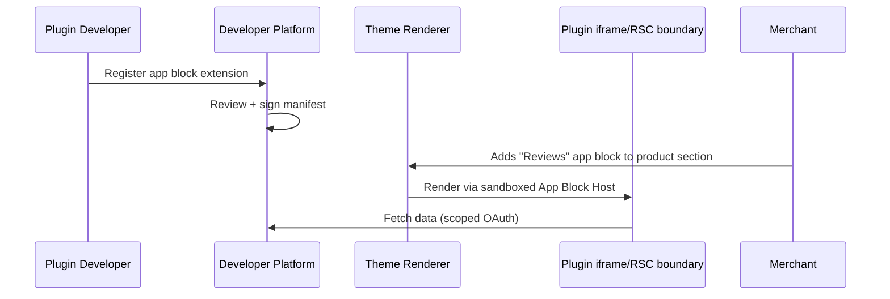

# Chapter 03: Sections, Blocks, and App Blocks

**Document ID:** SCP-THE-006-03  
**Version:** 1.0.0  
**Status:** 📝 Draft  
**Traceability:** ADR-003, PRD-006, NFR-047, NFR-051  

---

## 1. Purpose

Specify the Shopify Online Store 2.0–inspired **sections and blocks** model for SCP themes, including theme-native blocks, presets, section groups, and **app blocks** contributed by third-party plugins.

## 2. Scope

- Section and block registry architecture
- Theme package component conventions
- App block extension API (Phase 3)
- Merchant editor interactions (add, reorder, configure, delete)
- Built-in section catalog for `scp-dawn`

## 3. Out of Scope

- Full plugin runtime (Volume 12)
- CMS block types shared with page builder (Volume 7 — cross-reference only)

## 4. Conceptual Model

```text
Page Template
 └── Section Instance (type: "hero", id: "hero-main")
      ├── Section Settings (merchant-editable)
      └── Block Instances[]
           ├── Block (type: "badge", id: "badge-1")
           └── Block (type: "button", id: "cta-1")
```

**Sections** are layout regions. **Blocks** are repeatable content units within a section. This mirrors Shopify's architecture (E1) while using React components instead of Liquid.

## 5. Section Registry

Each theme package exports a section registry consumed at build time:

```typescript
// themes/scp-dawn/sections/registry.ts
import { Hero } from './Hero';
import { ProductGrid } from './ProductGrid';
import { Footer } from './Footer';
import heroSchema from './hero.schema.json';

export const sectionRegistry = {
  hero: {
    component: Hero,
    schema: heroSchema,
  },
  'product-grid': {
    component: ProductGrid,
    schema: productGridSchema,
  },
  footer: {
    component: Footer,
    schema: footerSchema,
  },
} as const;

export type SectionType = keyof typeof sectionRegistry;
```

### 5.1 Section Categories (Editor UI)

| Category | Sections | Merchant Use |
|----------|----------|--------------|
| **Promotional** | hero, split-hero, campaign-banner, announcement-bar | Campaigns, seasonal sales |
| **Product** | product-grid, featured-product, best-sellers, recommendations, comparison | Merchandising |
| **Content** | rich-text, image-with-text, video-story, social-gallery | Brand story |
| **Navigation** | header, footer, mega-menu, mobile-bottom-nav | Store structure |
| **Trust** | testimonials, reviews-summary, trust-bar, payment-icons | Conversion (Nigeria: enabled local PSPs) |
| **AI & Search** | ai-product-finder, search-box, product-questions-ai | Intent discovery |
| **Vertical** | menu-groups, case-studies, course-curriculum, interactive-demo | Industry-specific selling |
| **Utility** | newsletter, WhatsApp opt-in, contact-form, map | Engagement |

The authoritative complete catalog, portability mapping, and preset matrix are in [Chapter 11](./11-reference-themes-section-catalog.md).

## 6. Block Model

Blocks inherit constraints from their parent section schema:

| Property | Description |
|----------|-------------|
| `type` | Block type identifier |
| `limit` | Max instances of this block type in section |
| `settings` | Block-level merchant settings |
| `@app` | Reserved namespace for app blocks (Phase 3) |

### 6.1 Example: Hero Section Blocks

| Block Type | Limit | Settings |
|------------|-------|----------|
| `badge` | 3 | text, variant |
| `button` | 2 | label, url, style |
| `countdown` | 1 | end_date, label (Phase 2) |

### 6.2 Block Ordering

Merchants reorder blocks via drag-and-drop. Persisted as `block_order: string[]` in template JSON. Server validates order matches block ids exactly (TS-006).

## 7. React Component Contract

Every section and block component follows this contract:

```typescript
// packages/theme-types
export interface SectionProps<TSettings = Record<string, unknown>> {
  id: string;
  settings: TSettings;
  blocks: BlockInstance[];
  blockOrder: string[];
  // Injected by renderer — never from merchant JSON
  store: StorefrontContext;
  locale: string;
  designTokens: DesignTokens;
}

export interface BlockInstance {
  id: string;
  type: string;
  settings: Record<string, unknown>;
  source?: 'theme' | 'app'; // app blocks only
  appId?: string;
}

// Section components are Server Components by default
export default async function Hero({ settings, blocks, blockOrder, store }: SectionProps<HeroSettings>) {
  const badges = resolveBlocks(blocks, blockOrder, 'badge');
  return (
    <section aria-label={settings.heading} className="hero">
      {/* RSC: data fetched via Storefront API inside component */}
    </section>
  );
}
```

**Rules:**

- Sections fetch their own data (colocation) via Storefront API — no prop drilling from page.
- Client Components (`'use client'`) allowed only for interactive blocks; must be lazy-loaded.
- Each section declares `data-scp-section="{type}"` for editor overlay targeting.

## 8. Presets

Presets accelerate merchant onboarding (PRD-001, PRD-002):

```json
{
  "name": "Hero with badges",
  "category": "promotional",
  "sections": [
    {
      "type": "hero",
      "settings": {
        "heading": "New arrivals",
        "text_alignment": "center"
      },
      "blocks": [
        { "type": "badge", "settings": { "text": "Pay with Paystack" } }
      ]
    }
  ]
}
```

**Preset library (scp-dawn):**

| Preset ID | Description |
|-----------|-------------|
| `homepage-retail` | Hero + product grid + testimonials + newsletter |
| `homepage-fashion` | Slideshow + collection list + image-with-text |
| `homepage-marketplace` | Vendor spotlight + multi-collection grid |

AI-assisted onboarding (PRD-002) selects preset based on merchant industry vertical.

## 9. App Blocks (Phase 3)

App blocks let installed plugins inject UI into theme sections without forking the theme.

### 9.1 Architecture



### 9.2 App Block Manifest

```json
{
  "extension_type": "app_block",
  "name": "product-reviews",
  "target_section_types": ["product-main", "featured-product"],
  "settings_schema": "settings.schema.json",
  "render_url": "https://apps.scp.sapphital.com/reviews/render",
  "sandbox": {
    "csp_frame_src": ["https://apps.scp.sapphital.com"],
    "capabilities": ["storefront:read:products"]
  }
}
```

### 9.3 App Block Rules

| Rule | Description |
|------|-------------|
| AB-001 | App blocks render in isolated iframe or server-side proxy — no direct DOM access to theme |
| AB-002 | OAuth scope must match data accessed |
| AB-003 | App block JS budget: ≤ 30 KB gzipped per block |
| AB-004 | Merchant must explicitly add app block (no auto-injection) |
| AB-005 | Uninstalling app removes all app block instances from templates |

## 10. Built-in Section Catalog (`scp-dawn`)

| Section | Phase | Mobile Notes |
|---------|-------|--------------|
| `announcement-bar` | 1 | Single line; dismissible; 44px tap target |
| `header` | 1 | Sticky; hamburger ≤ 768px; search icon |
| `hero` | 1 | `fetchpriority="high"` on hero image; ≤ 200 KB WebP |
| `product-grid` | 1 | 2-col mobile; skeleton cards |
| `featured-product` | 1 | Swipe gallery on mobile |
| `collection-list` | 2 | Horizontal scroll on mobile |
| `rich-text` | 1 | Readable 16px base on 320px |
| `testimonials` | 2 | Carousel with reduced-motion fallback |
| `newsletter` | 2 | Phone number field optional (Nigeria SMS marketing) |
| `footer` | 1 | Collapsible link groups on mobile |
| `payment-icons` | 1 | Paystack, Flutterwave, bank transfer badges |
| `mega-menu` | 1.1 | Keyboard accessible; drill-down sheet on mobile |
| `mobile-bottom-nav` | 1.1 | Home, Categories, Search, Wishlist, Account |
| `best-sellers` | 1.1 | Analytics-backed; no fabricated ranking |
| `campaign-banner` | 1.1 | Bound to active Promotion entity |
| `ai-product-finder` | 2 | Lazy runtime; native product cards |
| `faq` | 1.1 | CMS FAQ source with structured data |
| `social-gallery` | 2 | Server-cached media; no heavy embed SDK |

## 11. Merchant Workflows

### 11.1 Add Section

1. Merchant opens Theme Editor → selects template (e.g., Homepage)
2. Clicks **Add section** → browses categories or presets
3. Section inserted at chosen position → default settings applied
4. Changes saved to **draft** installation
5. **Publish** promotes draft → live

### 11.2 Configure Block

1. Click block in preview overlay
2. Settings panel shows block schema fields
3. Live preview updates via WebSocket (`ThemePreviewUpdated` event)
4. Undo/redo stack (max 50 actions)

### 11.3 Remove Section

1. Confirm dialog (prevent accidental deletion)
2. Section removed from `order` array
3. Audit event logged

## 12. Permissions

| Action | Role |
|--------|------|
| View theme editor | `staff` with `theme:read` |
| Edit sections/blocks | `staff` with `theme:write` |
| Publish theme | `owner` or `staff` with `theme:publish` |
| Install apps (app blocks) | `owner` or `admin` |

## 13. API Surfaces

### Add Section to Template

```http
POST /api/v1/stores/{store_id}/theme/templates/{template_key}/sections
Content-Type: application/json

{
  "type": "hero",
  "position": { "after": "header-main" },
  "preset": "default"
}
```

### Reorder Sections

```http
PATCH /api/v1/stores/{store_id}/theme/templates/{template_key}/order
Content-Type: application/json

{
  "order": ["header-main", "hero-main", "featured-products", "footer-main"]
}
```

## 14. Domain Events

| Event | When |
|-------|------|
| `ThemeSectionAdded` | Section POST |
| `ThemeSectionRemoved` | Section DELETE |
| `ThemeSectionReordered` | Order PATCH |
| `ThemeBlockAdded` | Block POST |
| `ThemeAppBlockInstalled` | App block first added |

## 15. Accessibility Requirements

- Section landmarks: `<header>`, `<main>`, `<footer>`, `aria-label` on promotional sections
- Block carousels: keyboard navigable; `aria-live="polite"` for slide changes
- Focus management: adding section moves focus to new section in editor
- Color settings validated for contrast (Chapter 02)

## 16. Acceptance Criteria

- [ ] Merchant can add, reorder, configure, and remove sections on homepage (Phase 2)
- [ ] Block limit enforced (e.g., max 3 badges in hero)
- [ ] App block sandbox prevents access to parent document (Phase 3)
- [ ] All built-in sections render correctly at 320px width
- [ ] Section registry mismatch (unknown type) fails gracefully with fallback
- [ ] Payment icons section displays Nigeria PSP badges
- [ ] Canonical catalog and vertical section families validate against Chapter 11
- [ ] Fixed mobile sections declare collision priority
- [ ] Portable section fields survive reference-theme switching

## 17. Sources

- Shopify sections and blocks: https://shopify.dev/docs/storefronts/themes/architecture/sections (E1)
- Shopify app blocks: https://shopify.dev/docs/apps/build/online-store/theme-app-extensions (E1)
