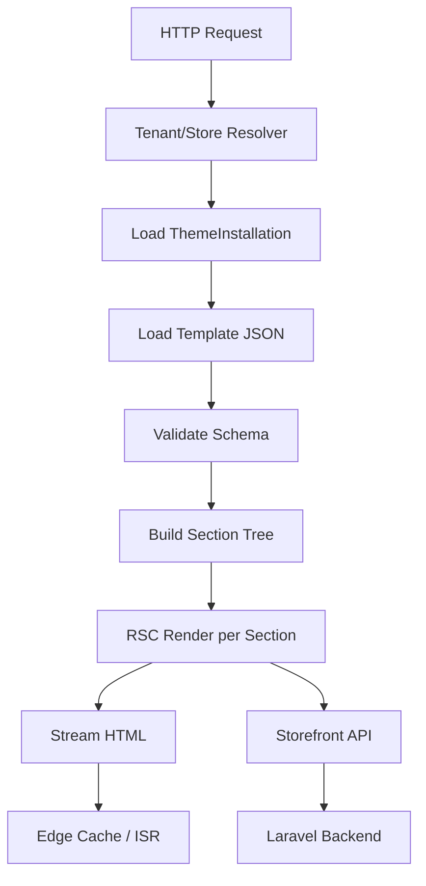

# Chapter 04: Rendering Pipeline (React Server Components)

**Document ID:** SCP-THE-006-04  
**Version:** 1.0.0  
**Status:** 📝 Draft  
**Traceability:** ADR-003, NFR-001, NFR-003, NFR-009, NFR-058  

---

## 1. Purpose

Define how SCP resolves JSON templates into HTML using **Next.js App Router**, **React Server Components (RSC)**, and **Incremental Static Regeneration (ISR)** — meeting Nigeria mobile performance targets while keeping themes decoupled from the Laravel API.

## 2. Scope

- Storefront renderer service architecture
- Template resolution and section rendering pipeline
- Storefront API data fetching patterns
- Caching, ISR, and cache invalidation
- Streaming, Suspense, and error boundaries
- Headless rendering mode (Phase 3)

## 3. Out of Scope

- Laravel API implementation details (Volume 3, Volume 5)
- Admin theme editor frontend (Chapter 05)

## 4. High-Level Pipeline



```text
Request → Tenant Context → Template JSON → Section Registry → RSC Components → SSR/ISR → HTML
                                    ↑                ↑
                            Theme Settings    Storefront API (products, collections, cart)
                                    ↑
                            Design Tokens (Volume 4 SDS)
```

## 5. Storefront Renderer Service

| Property | Value |
|----------|-------|
| Runtime | Node.js 20 LTS |
| Framework | Next.js 15+ App Router |
| Deployment | Per-region containers (Nigeria Lagos primary, Kenya Nairobi Phase 2) |
| Tenant routing | Host header → `store_id` lookup (Redis cache, 5 min TTL) |

### 5.1 Request Context

Every render receives an immutable context object:

```typescript
interface RenderContext {
  tenantId: string;
  storeId: string;
  storeHandle: string;
  locale: string;           // e.g., en-NG
  currency: string;         // e.g., NGN
  themeInstallationId: string;
  themeVersion: string;
  templateKey: string;
  role: 'live' | 'preview';
  previewSessionId?: string;
  designTokens: DesignTokens;
}
```

**Fail-closed:** Missing tenant/store context → 404 (not default store). Aligns with NFR-040 and Volume 11 exceptional conditions.

## 6. Template Resolution

### 6.1 Resolution Order

1. Match URL path to `template_key` (e.g., `/products/{handle}` → `product`)
2. Load `theme_templates.content` for active installation (`live` or `preview`)
3. Merge **platform overrides** for locked templates (`checkout`, `password`)
4. Validate against schema (Chapter 02)
5. Resolve section order from `order` array

### 6.2 Dynamic vs Static Routes

| Route | Rendering Strategy | Revalidate |
|-------|-------------------|------------|
| `/` (index) | ISR | 60s |
| `/products/{handle}` | ISR + on-demand | 60s; on `ProductUpdated` |
| `/collections/{handle}` | ISR | 120s |
| `/cart` | Dynamic (SSR) | No cache |
| `/checkout` | Dynamic (SSR) | No cache; locked template |
| `/search?q=` | Dynamic (SSR) | No cache |

## 7. Section Rendering

### 7.1 Parallel Section Rendering

Independent sections render in parallel via `Promise.all`:

```typescript
export default async function PageRenderer({ context, template }: Props) {
  const sections = template.order.map((sectionId) => {
    const instance = template.sections.find((s) => s.id === sectionId)!;
    const entry = sectionRegistry[instance.type];
    if (!entry) return <FallbackSection type={instance.type} />;
    const Component = entry.component;
    return (
      <Suspense key={instance.id} fallback={<SectionSkeleton type={instance.type} />}>
        <Component
          id={instance.id}
          settings={instance.settings}
          blocks={instance.blocks}
          blockOrder={instance.block_order}
          store={context}
        />
      </Suspense>
    );
  });
  return <main>{sections}</main>;
}
```

### 7.2 Data Fetching Rules

| Rule | Description |
|------|-------------|
| RF-001 | Sections call Storefront API via typed client — no raw `fetch` to Laravel |
| RF-002 | Request deduplication via React `cache()` per render pass |
| RF-003 | Product pages: single product query + recommendations query max |
| RF-004 | No sequential waterfall > 2 levels deep |
| RF-005 | API errors → section-level error boundary, not full page 500 |

### 7.3 Storefront API Client (Illustrative)

```typescript
// packages/storefront-client
export const getProduct = cache(async (handle: string, storeId: string) => {
  const res = await storefrontFetch(`/stores/${storeId}/products/${handle}`, {
    next: { tags: [`product:${handle}`, `store:${storeId}`] },
  });
  if (res.status === 404) return null;
  return ProductSchema.parse(await res.json());
});
```

## 8. Client Components and Hydration

### 8.1 Hydration Budget

Theme total client JS: **≤ 100 KB gzipped** (ADR-003). Platform budget NFR-009: 150 KB — themes are stricter.

| Allowed Client Use | Examples |
|--------------------|----------|
| Cart drawer toggle | Header cart icon |
| Product variant selector | Size/color picker |
| Image zoom | Product gallery |
| Accordion / tabs | FAQ section |

| Prohibited | Reason |
|------------|--------|
| Full-page client render | Performance |
| Client-side routing of catalog | SEO + LCP |
| Third-party analytics in theme | CSP + supply chain — use platform injection |

### 8.2 Lazy Loading

Below-fold sections with client components use `next/dynamic`:

```typescript
const ProductQuickAdd = dynamic(() => import('./ProductQuickAdd'), {
  loading: () => <QuickAddSkeleton />,
});
```

## 9. ISR and Caching Strategy

### 9.1 Cache Layers

```text
Browser → Cloudflare CDN → Next.js ISR Cache → Origin Renderer → Storefront API → PostgreSQL
```

| Layer | TTL | Invalidation |
|-------|-----|--------------|
| Cloudflare CDN (static assets) | 1 year (immutable hash) | New theme version deploy |
| Cloudflare CDN (HTML) | Respect `Cache-Control` from origin | Purge API on theme publish |
| Next.js ISR | 60s default (product pages) | `revalidateTag()` on domain events |
| Redis (tenant/store lookup) | 5 min | Store settings update |

### 9.2 Revalidation Triggers

| Domain Event | Tags Revalidated |
|--------------|------------------|
| `ProductUpdated` | `product:{handle}`, `store:{id}` |
| `ThemeSettingsUpdated` | `store:{id}`, `theme:{store_id}` |
| `ThemeTemplateUpdated` | `theme:{store_id}`, all page tags |
| `CollectionUpdated` | `collection:{handle}` |
| `InventoryChanged` | `product:{handle}` (availability badge) |

### 9.3 Nigeria CDN Strategy

Cloudflare African PoPs (Johannesburg, Lagos peering) serve theme assets from R2 (ADR-008). Hero images use responsive `srcset` with Nigeria-optimized default width (640w mobile, 1280w desktop).

## 10. Live Preview Rendering

Preview mode uses `role: 'preview'` installation:

| Aspect | Live | Preview |
|--------|------|---------|
| Installation | `theme_installations.role = 'live'` | `role = 'draft'` |
| Cache | ISR enabled | **No CDN cache** |
| robots | index | `noindex, nofollow` |
| Banner | None | "Preview mode" dismissible bar |
| Auth | Public | Merchant token in iframe query |

Preview URL pattern:

```text
https://{store}.scp.store/?preview_session={uuid}&token={signed_jwt}
```

JWT: 15-minute expiry, `theme:read` scope, bound to `store_id`.

## 11. Streaming and Core Web Vitals

Target metrics (Nigeria mobile 4G, NFR-001):

| Metric | Target | Technique |
|--------|--------|-----------|
| LCP | ≤ 2.0s | Priority hero image; RSC HTML first |
| INP | ≤ 100ms | Minimal client JS |
| CLS | ≤ 0.05 | Explicit image dimensions; skeleton sizes |

**Streaming:** HTML streams section-by-section. Hero section flushes first (Chapter 08 `fetchpriority`).

## 12. Error Handling

| Failure | Behavior |
|---------|----------|
| Unknown section type | Render `FallbackSection` + log warning |
| Schema validation fail | Block save (API); render live last-valid template |
| Storefront API timeout | Section skeleton + retry once; stale-while-revalidate |
| Theme package missing | Platform default theme fallback |
| Complete render failure | Branded 500 page; no stack trace (Volume 11) |

## 13. Headless Mode (Phase 3)

Same JSON template + section registry usable without Next.js UI:

- **Storefront API** exposes `GET /storefront/v1/render?path=/products/{handle}` returning HTML fragment or component tree JSON
- Mobile apps and third-party frontends consume render output
- Theme developer tests via CLI `scp-theme render`

## 14. Observability

| Span Name | Attributes |
|-----------|------------|
| `theme.resolve_template` | `template_key`, `store_id` |
| `theme.render_section` | `section_type`, `duration_ms` |
| `theme.fetch_storefront` | `endpoint`, `status` |
| `theme.isr` | `hit`, `revalidate_reason` |

**SLO:** p95 full page render (origin) ≤ 400ms excluding Storefront API.

## 15. API Surfaces (Internal)

### Render Health

```http
GET /_theme/health
```

### On-Demand Revalidation (internal, mTLS)

```http
POST /_theme/revalidate
Content-Type: application/json
X-SCP-Internal-Token: {token}

{
  "tags": ["product:ankara-dress", "store:550e8400-e29b-41d4-a716-446655440000"]
}
```

## 16. Domain Events (Consumed)

Renderer subscribes via queue worker pushing revalidation requests — it does not consume Kafka directly in Phase 1.

## 17. Test Strategy

- **Snapshot:** RSC HTML output per section (deterministic fixtures)
- **Performance:** Lighthouse CI on 3 templates × 3 built-in themes
- **Load:** 100 concurrent renders per store — p95 ≤ 400ms
- **Network:** WebPageTest on 3G Fast profile (Lagos emulator)
- **Isolation:** Store A template never renders Store B settings

## 18. Acceptance Criteria

- [ ] Homepage LCP ≤ 2.0s on mobile Lighthouse CI (NFR-001)
- [ ] Product page ISR revalidates within 60s of `ProductUpdated`
- [ ] Preview mode serves `noindex` and bypasses CDN cache
- [ ] Unknown section type does not crash page render
- [ ] Theme JS ≤ 100 KB gzipped on built-in themes
- [ ] Cart and checkout routes are never ISR-cached
- [ ] Parallel section rendering verified (no sequential waterfall > 2)

## 19. Sources

- Next.js ISR: https://nextjs.org/docs/app/building-your-application/data-fetching/incremental-static-regeneration (E1)
- React Server Components: https://react.dev/reference/rsc/server-components (E1)
- Web Vitals: https://web.dev/vitals/ (E1)
