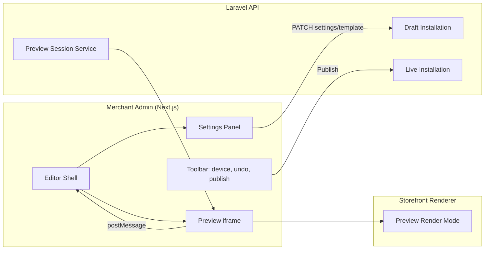
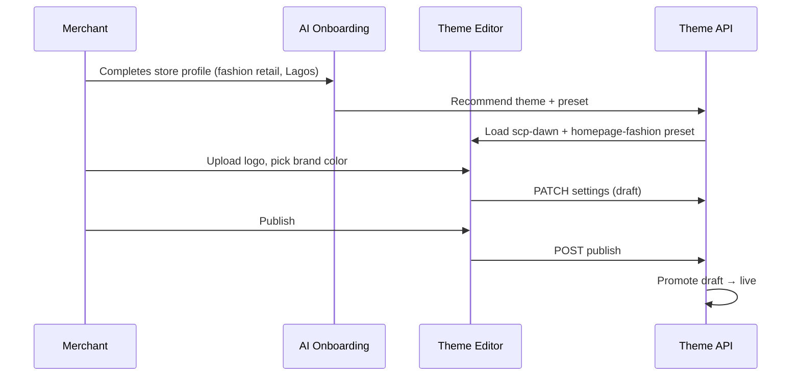
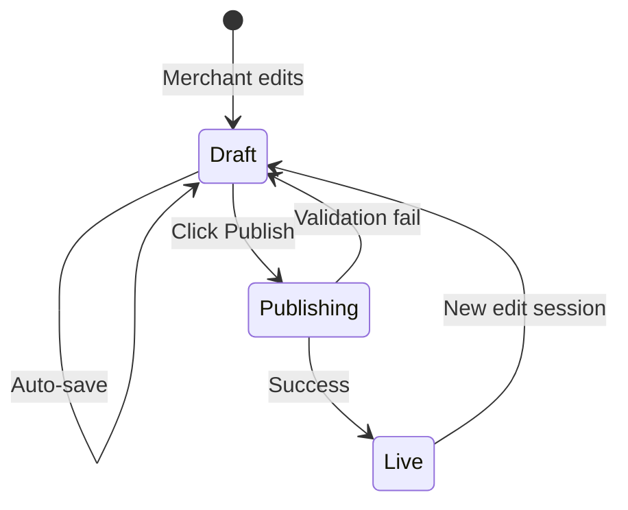

# Chapter 05: Theme Editor and Merchant UX

**Document ID:** SCP-THE-006-05  
**Version:** 1.0.0  
**Status:** 📝 Draft  
**Traceability:** PRD-001, PRD-002, NFR-047, NFR-051, NFR-006  

---

## 1. Purpose

Specify the merchant-facing **Theme Editor** — the visual interface for customizing themes, managing sections/blocks, previewing changes, and publishing to live storefronts. Optimized for **mobile-first merchants in Nigeria** who often manage stores from smartphones.

## 2. Scope

- Theme Editor layout and interaction model
- Live preview iframe integration
- Draft/publish workflow
- Mobile editor experience
- AI-assisted theme setup (PRD-002 integration points)
- Undo/redo and revision history

## 3. Out of Scope

- Full admin dashboard navigation (Volume 4)
- Product/catalog management UI (Volume 5)

## 4. Editor Architecture



## 5. Entry Points

| Entry | Path | Persona |
|-------|------|---------|
| Theme library | `/admin/store/design/themes` | Owner selecting theme |
| Customize | `/admin/store/design/editor` | Staff editing live theme |
| Onboarding | `/admin/onboarding/theme` | New merchant (PRD-002) |
| Mobile quick edit | `/admin/store/design/quick` | Owner on phone — global settings only (Phase 1) |

## 6. Editor Layout

### 6.1 Desktop (≥ 1024px)

```text
┌─────────────────────────────────────────────────────────────┐
│ Toolbar: [Undo][Redo] | Device: Desktop/Tablet/Mobile | Publish │
├──────────────┬──────────────────────────────────────────────┤
│ Section tree │  Live preview iframe (storefront origin)      │
│ or Settings  │                                               │
│ panel        │                                               │
│ (320px)      │                                               │
└──────────────┴──────────────────────────────────────────────┘
```

### 6.2 Mobile (≤ 768px)

```text
┌─────────────────────────┐
│ Preview (full width)    │
│                         │
├─────────────────────────┤
│ Bottom sheet: Settings  │
│ [Sections][Theme][Publish]│
└─────────────────────────┘
```

**Nigeria context:** 85%+ of merchants may first access editor on mobile. Phase 1 ships **Quick Edit** (logo, colors, fonts) without full section tree. Phase 2 adds full section editing on mobile via bottom sheet pattern.

## 7. Core Workflows

### 7.1 First-Time Theme Setup (Onboarding)



**Steps:**

1. Select theme (3 built-in cards with live thumbnails)
2. AI suggests preset based on industry (PRD-002)
3. Configure global settings (logo, colors, fonts)
4. Optional: customize homepage sections
5. Preview on mobile device frame
6. Publish

**Target:** ≤ 15 minutes (PRD-001).

### 7.2 Edit Section Settings

1. Click section in preview → highlight overlay (`data-scp-section`)
2. Settings panel loads schema-driven form fields
3. Each change debounced 300ms → PATCH draft template
4. Preview iframe receives `postMessage` → soft reload section via `?section=hero-main`
5. Validation errors inline (contrast, URL format)

### 7.3 Publish Draft



| Step | Action |
|------|--------|
| 1 | Validate all templates + settings |
| 2 | Run contrast + URL security checks |
| 3 | Copy draft installation → live (atomic transaction) |
| 4 | Purge CDN + ISR tags |
| 5 | Emit `ThemePublished` event |
| 6 | Show success toast with "View store" link |

**Rollback:** Merchant can revert to previous publish snapshot (last 10 retained, 30 days).

### 7.4 Switch Theme

1. Browse Theme Library (built-in + installed + Theme Store)
2. Click **Try theme** → creates draft installation with mapped settings
3. Preview side-by-side (Phase 3) or sequential preview
4. Review portability report: mapped, adapted, needs input, unsupported
5. **Publish** replaces live theme; previous theme archived

Setting mapping rules are in Chapters 10 and 11. Merchant-owned Commerce, CMS, Navigation, and Media content is never silently deleted.

## 8. Live Preview Protocol

### 8.1 iframe Configuration

```html
<iframe
  src="https://{store}.scp.store/?preview_session={id}&token={jwt}"
  sandbox="allow-scripts allow-same-origin allow-forms"
  title="Store preview"
/>
```

### 8.2 postMessage API

| Message | Direction | Payload |
|---------|-----------|---------|
| `scp:section:click` | iframe → editor | `{ sectionId, blockId? }` |
| `scp:editor:highlight` | editor → iframe | `{ sectionId }` |
| `scp:editor:reload` | editor → iframe | `{ scope: 'section' \| 'page', id? }` |
| `scp:preview:ready` | iframe → editor | `{ url, loadTimeMs }` |

**Security:** Origin validation on both sides; reject messages from unknown origins.

### 8.3 Device Preview

| Device | Viewport | Use Case |
|--------|----------|----------|
| Mobile | 375 × 667 | Primary Nigeria QA |
| Mobile large | 414 × 896 | iPhone Plus class |
| Tablet | 768 × 1024 | |
| Desktop | 1280 × 800 | |

## 9. Settings Panel (Schema-Driven UI)

Form fields generated from section/block schema (Chapter 02):

| Schema Type | UI Component |
|-------------|--------------|
| `text` | `<Input />` |
| `color` | `<ColorPicker />` with contrast indicator |
| `media` | `<MediaPicker />` — tenant media library |
| `collection` | `<ResourcePicker type="collection" />` |
| `select` | `<Select />` |

**Volume 4 SDS:** All editor controls use SAPPHITAL Design System components — no custom unstyled inputs.

### 9.1 Standard Setting Groups

Section settings use this stable order so merchants do not relearn controls per theme:

1. **Content** — heading, subheading, body, buttons
2. **Data source** — collection, products, content entries, recommendation strategy
3. **Style** — color scheme, typography role, alignment, width, spacing
4. **Media** — desktop/mobile image, video poster, focal point
5. **Behavior** — carousel, reveal motion, sticky behavior
6. **Visibility** — breakpoints, schedule/release, customer segment

Advanced groups remain collapsed until opened.

### 9.2 Storefront Quality Coach

Before publish, the editor displays actionable checks:

| Check | Example warning |
|-------|-----------------|
| Five-second clarity | “Your hero does not identify what you sell.” |
| Primary action | “Three primary buttons compete above the fold.” |
| Trust | “Add a delivery, returns, review, or secure-payment proof point.” |
| Media | “Upload a mobile crop to avoid cutting off the product.” |
| Accessibility | “Button text does not meet contrast requirements.” |
| Performance | “Hero image is 480 KB; target is 200 KB.” |

Warnings become blocking only when they violate accessibility, security, schema, or hard performance limits.

## 10. Undo / Redo

| Property | Value |
|----------|-------|
| Stack depth | 50 actions |
| Granularity | Per field change (debounced batch) |
| Persistence | Session-only (Phase 2: cross-session via `theme_revisions`) |
| Scope | Settings + template structure |

## 11. Revision History (Phase 2)

```sql
CREATE TABLE theme_revisions (
    id              UUID PRIMARY KEY,
    store_id        UUID NOT NULL,
    installation_id UUID NOT NULL,
    snapshot        JSONB NOT NULL,  -- full templates + settings
    created_by      UUID NOT NULL,
    created_at      TIMESTAMPTZ NOT NULL DEFAULT now(),
    label           VARCHAR(255)     -- optional merchant label
);
```

Merchant can restore any revision → creates new draft from snapshot.

## 12. Permissions and Audit

| Action | Permission | Audit Event |
|--------|------------|-------------|
| Open editor | `theme:read` | — |
| Edit draft | `theme:write` | `ThemeTemplateUpdated` |
| Publish | `theme:publish` | `ThemePublished` |
| Switch theme | `theme:publish` | `ThemeInstallationChanged` |
| Restore revision | `theme:publish` | `ThemeRevisionRestored` |

## 13. API Surfaces

### Create Preview Session

```http
POST /api/v1/stores/{store_id}/theme/preview-sessions
Authorization: Bearer {token}

{
  "installation_role": "draft"
}
```

**Response 201:**

```json
{
  "id": "prev_abc123",
  "preview_url": "https://store.scp.store/?preview_session=prev_abc123&token=eyJ...",
  "expires_at": "2026-07-12T13:11:00Z"
}
```

### Publish Draft

```http
POST /api/v1/stores/{store_id}/theme/publish
Authorization: Bearer {token}
```

**Response 200:**

```json
{
  "published_at": "2026-07-12T12:56:00Z",
  "installation_id": "inst_live_xyz",
  "revision_id": "rev_001"
}
```

## 14. Accessibility (Editor)

| Requirement | Implementation |
|-------------|----------------|
| NFR-048 Keyboard nav | Tab order: toolbar → panel → preview; Escape closes panels |
| NFR-047 WCAG AA | Editor chrome meets contrast; not subject to merchant color choices |
| NFR-051 Touch targets | 44×44px minimum on mobile toolbar |
| Screen readers | Section tree as accessible tree view; live region for save status |

## 15. Empty and Error States

| State | Message | Action |
|-------|---------|--------|
| No theme installed | "Choose a theme to get started" | Link to theme library |
| Preview load fail | "Preview unavailable — check connection" | Retry button (common on 3G) |
| Publish validation fail | Field-level errors | Scroll to first error |
| Concurrent edit | "Another team member is editing" | View-only mode |

## 16. Performance (Admin)

Theme Editor initial load TTI ≤ 3.0s (NFR-006). Preview iframe load separate — show skeleton until `scp:preview:ready`.

## 17. Acceptance Criteria

- [ ] Merchant completes onboarding theme setup in ≤ 15 min (usability test n≥5)
- [ ] Live preview updates within 1s of setting change on 4G
- [ ] Publish promotes draft atomically; live site reflects changes ≤ 30s
- [ ] Mobile Quick Edit works at 375px for global settings (Phase 1)
- [ ] Full section editing on mobile bottom sheet (Phase 2)
- [ ] postMessage origin validation blocks cross-origin injection
- [ ] Undo restores previous setting value correctly
- [ ] Editor keyboard navigable without mouse (NFR-048)
- [ ] Standard Content/Data/Style/Media/Behavior/Visibility groups used consistently
- [ ] Quality Coach evaluates five-second clarity, trust, mobile crop, contrast, and media weight
- [ ] Theme switching shows a portability report before publish

## 18. Sources

- Shopify theme editor UX patterns (E3 — industry observation)
- Volume 4 SDS admin patterns (internal)
- PRD-002 AI onboarding flow (Volume 1)
