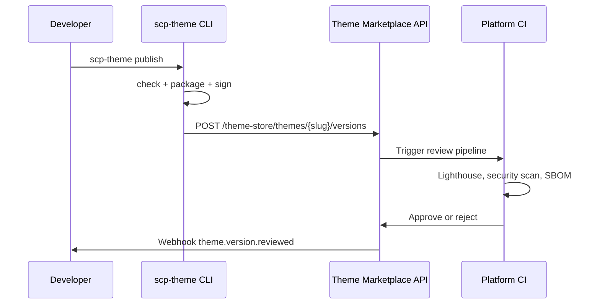

# Chapter 06: Theme SDK and CLI

**Document ID:** SCP-THE-006-06  
**Version:** 1.0.0  
**Status:** 📝 Draft  
**Traceability:** ADR-003, PRD-006, PRD-009, NFR-042  

---

## 1. Purpose

Define the **SCP Theme SDK** (`@scp/theme-sdk`) and **`scp-theme` CLI** — the developer toolkit for creating, validating, previewing, testing, and publishing themes to the Theme Store.

## 2. Scope

- npm package structure and APIs
- CLI commands and workflows
- Local development and preview server
- Theme validation and performance gates
- Publishing pipeline integration
- TypeScript types and testing utilities

## 3. Out of Scope

- General Developer Platform CLI (Volume 12)
- Plugin SDK (Volume 12)

## 4. Package Ecosystem

| Package | Purpose |
|---------|---------|
| `@scp/theme-sdk` | Core types, registry helpers, setting schema builders |
| `@scp/theme-cli` | `scp-theme` binary |
| `@scp/theme-validator` | JSON Schema + Zod validation |
| `@scp/storefront-client` | Typed Storefront API client for themes |
| `@scp/theme-testing` | Render testing, Lighthouse helpers |

**Distribution:** Public npm registry (`@scp/*` scope) from Phase 3. Phase 1–2: private registry for internal built-in themes.

## 5. Theme Package Structure

```text
my-scp-theme/
├── package.json              # scp-theme metadata block required
├── theme.schema.json         # Global settings schema
├── scp.theme.config.ts       # Theme config (optional overrides)
├── templates/
│   ├── index.json
│   ├── product.json
│   ├── collection.json
│   └── cart.json
├── sections/
│   ├── Hero.tsx
│   ├── hero.schema.json
│   ├── ProductGrid.tsx
│   ├── product-grid.schema.json
│   └── registry.ts
├── blocks/
│   ├── Badge.tsx
│   ├── badge.schema.json
│   └── registry.ts
├── assets/
│   ├── styles/
│   │   └── theme.css
│   └── images/
│       └── placeholder.webp
├── locales/
│   ├── en.default.json
│   └── en-NG.json
└── tests/
    ├── sections/
    │   └── Hero.test.tsx
    └── templates/
        └── index.valid.json
```

### 5.1 `package.json` Metadata

```json
{
  "name": "@acme/lagos-boutique",
  "version": "1.0.0",
  "scp-theme": {
    "label": "Lagos Boutique",
    "author": "acme-themes",
    "schema_version": "1.0.0",
    "min_scp_version": "1.0.0",
    "supported_templates": ["index", "product", "collection", "cart", "search", "page", "404"],
    "industry_tags": ["fashion", "retail"],
    "markets": ["NG", "KE", "GH"]
  },
  "peerDependencies": {
    "@scp/theme-sdk": "^1.0.0",
    "react": "^19.0.0",
    "react-dom": "^19.0.0"
  }
}
```

## 6. CLI Commands

### 6.1 Command Reference

| Command | Description | Phase |
|---------|-------------|-------|
| `scp-theme init [name]` | Scaffold new theme from starter template | 3 |
| `scp-theme dev` | Start local preview server with hot reload | 2 |
| `scp-theme check` | Validate schemas, types, assets, budgets | 2 |
| `scp-theme render <template>` | Static HTML render to stdout/file | 3 |
| `scp-theme test` | Run section unit tests + template validation | 2 |
| `scp-theme lighthouse` | Run Lighthouse CI against local preview | 3 |
| `scp-theme package` | Build tarball with checksum | 3 |
| `scp-theme publish` | Upload to Theme Store (authenticated) | 3 |
| `scp-theme pull` | Download theme for customization fork | 3 |

### 6.2 `scp-theme init`

```bash
scp-theme init lagos-boutique --template fashion --author acme-themes
```

Creates package from starter with:

- Section registry boilerplate
- Sample templates with presets
- Test fixtures
- `scp.theme.config.ts`

### 6.3 `scp-theme dev`

```bash
scp-theme dev --store demo-lagos --port 3001
```

| Feature | Behavior |
|---------|----------|
| Hot reload | Section/component changes reload preview |
| Mock data | Default Storefront API fixtures (Nigeria NGN products) |
| Live data | `--store` connects to dev store via API token |
| Device toolbar | Built-in mobile/desktop preview |
| Settings panel | Local settings editor mirroring merchant UX |

**Environment variables:**

```bash
SCP_STORE_ID=550e8400-e29b-41d4-a716-446655440000
SCP_API_TOKEN=scp_dev_...
SCP_API_BASE=https://api.dev.scp.sapphital.com
```

### 6.4 `scp-theme check`

Validation gates (exit code 1 on failure):

| Check | Rule |
|-------|------|
| Schema validity | All JSON templates pass `@scp/theme-validator` |
| Section registry | Every template section type registered |
| Block registry | Every block type registered |
| Asset references | All media placeholders exist |
| JS budget | Client bundle ≤ 100 KB gzipped |
| CSS budget | ≤ 50 KB gzipped |
| Forbidden patterns | No `eval`, `dangerouslySetInnerHTML` without allowlist |
| Checkout template | Must not exist or must match platform stub |
| i18n | Default locale file present |

**Output example:**

```text
✓ theme.schema.json valid
✓ templates/index.json valid (4 sections)
✓ section registry complete
✗ JS budget exceeded: 112 KB > 100 KB (sections/ProductGallery.tsx)
✗ checkout template modification detected — remove custom checkout/

2 errors, 0 warnings — fix before publish
```

### 6.5 `scp-theme publish`

```bash
scp-theme publish --version 1.0.0
```



**Authentication:** OAuth device flow or API token with `theme:publish` scope (Volume 12).

## 7. SDK API (`@scp/theme-sdk`)

### 7.1 Setting Schema Builder

```typescript
import { defineSection, setting } from '@scp/theme-sdk';

export default defineSection({
  name: 'hero',
  label: 'Hero banner',
  category: 'promotional',
  settings: [
    setting.text('heading', { label: 'Heading', default: 'Welcome' }),
    setting.media('image_media_id', { label: 'Background image' }),
    setting.select('text_alignment', {
      label: 'Alignment',
      options: ['left', 'center', 'right'],
      default: 'center',
    }),
  ],
  blocks: [
    defineBlock({
      type: 'badge',
      label: 'Badge',
      limit: 3,
      settings: [setting.text('text'), setting.select('variant', { options: ['default', 'success'] })],
    }),
  ],
});
```

### 7.2 Storefront Context Hook (Server)

```typescript
import { useStorefront } from '@scp/theme-sdk/server';

export async function ProductGrid({ settings }: SectionProps) {
  const { fetchCollection } = useStorefront();
  const collection = await fetchCollection(settings.collection_id);
  // ...
}
```

### 7.3 Design Token Access

```typescript
import { tokens } from '@scp/theme-sdk/tokens';

// Maps Volume 4 SDS tokens to CSS variables
const spacing = tokens.space[4]; // 16px
```

## 8. Testing Utilities

### 8.1 Section Render Test

```typescript
import { renderSection } from '@scp/theme-testing';
import Hero from '../sections/Hero';

test('Hero renders heading', async () => {
  const html = await renderSection(Hero, {
    settings: { heading: 'Test Store' },
    blocks: [],
    blockOrder: [],
  });
  expect(html).toContain('Test Store');
});
```

### 8.2 Template Fixture Validation

```typescript
import { validateTemplate } from '@scp/theme-validator';
import indexTemplate from '../templates/index.json';

test('index template valid', () => {
  expect(validateTemplate(indexTemplate)).toEqual({ valid: true, errors: [] });
});
```

## 9. Starter Templates

| Starter | Industry | Included Sections |
|---------|----------|-------------------|
| `default` | General retail | hero, product-grid, footer |
| `fashion` | Apparel | slideshow, collection-list, image-with-text |
| `marketplace` | Multi-vendor | vendor-spotlight, product-grid |
| `minimal` | Digital goods | rich-text, featured-product |

## 10. CI Integration (Theme Developer)

Recommended GitHub Actions workflow:

```yaml
name: Theme CI
on: [push, pull_request]
jobs:
  validate:
    runs-on: ubuntu-latest
    steps:
      - uses: actions/checkout@v4
      - uses: actions/setup-node@v4
        with:
          node-version: '20'
      - run: npm ci
      - run: npx scp-theme check
      - run: npx scp-theme test
      - run: npx scp-theme lighthouse --assert-performance 85
```

## 11. Platform CI (Theme Store Review)

When `scp-theme publish` uploads a version:

| Stage | Tool | Pass Criteria |
|-------|------|---------------|
| Schema validation | `@scp/theme-validator` | Zero errors |
| Dependency audit | npm audit | Zero critical/high |
| SBOM generation | Syft | Artifact stored |
| Lighthouse | Lighthouse CI | Performance ≥ 85, A11y ≥ 90 |
| Security scan | Semgrep theme rules | Zero blocking findings |
| Manual review | Theme reviewer | UX quality, Nigeria market fit |

## 12. Versioning

- Theme packages follow **semver**
- `schema_version` in theme config independent of package version
- Breaking schema changes require major package bump + migration guide

## 13. API Surfaces (Publishing)

### Upload Theme Version

```http
POST /api/v1/theme-store/themes/{slug}/versions
Authorization: Bearer {developer_token}
Content-Type: multipart/form-data

package: {tarball}
checksum_sha256: {hash}
changelog: "Initial release"
```

### Get Review Status

```http
GET /api/v1/theme-store/themes/{slug}/versions/{version}/review
```

## 14. Domain Events

| Event | When |
|-------|------|
| `ThemeVersionSubmitted` | publish upload |
| `ThemeVersionReviewPassed` | CI + manual approve |
| `ThemeVersionReviewFailed` | CI or manual reject |
| `ThemeVersionPublished` | Available in Theme Store |

## 15. Acceptance Criteria

- [ ] `scp-theme init` scaffolds valid theme passing `scp-theme check`
- [ ] `scp-theme dev` serves preview with hot reload ≤ 3s restart
- [ ] `scp-theme check` catches JS budget violation
- [ ] `scp-theme publish` requires authenticated developer account
- [ ] Published theme version immutable (no overwrite)
- [ ] SDK TypeScript types exported for all setting field types
- [ ] Starter templates include Nigeria NGN mock fixtures

## 16. Sources

- Shopify CLI theme commands: https://shopify.dev/docs/storefronts/themes/tools/cli (E1)
- npm package best practices (E2)
- ADR-003 Theme CLI specification (internal)
