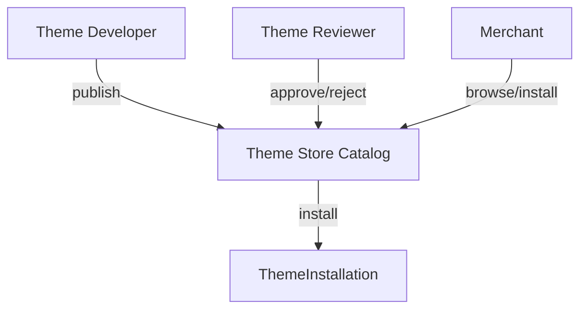
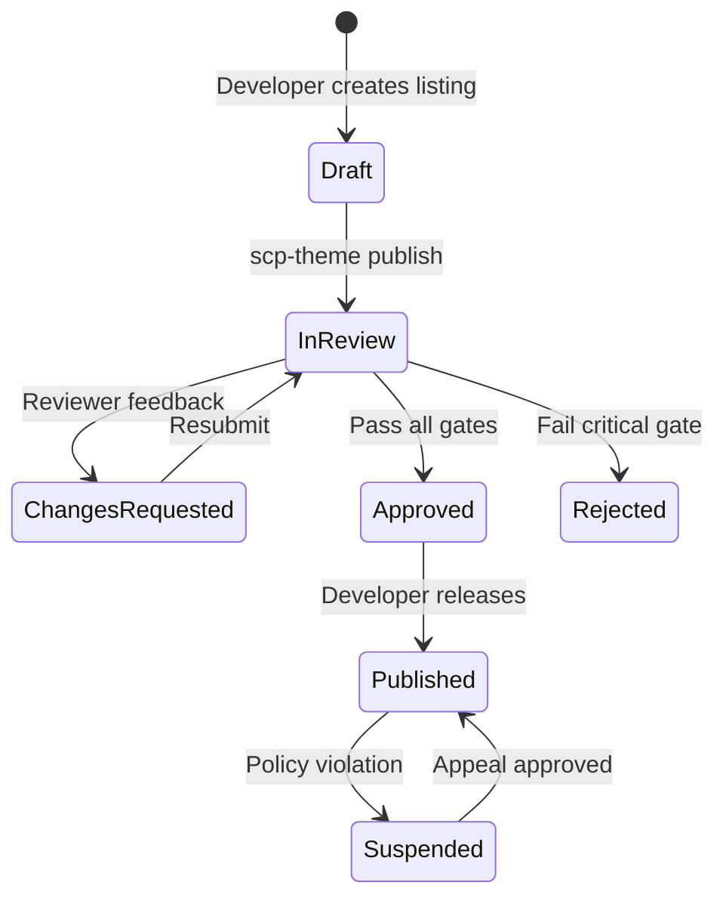
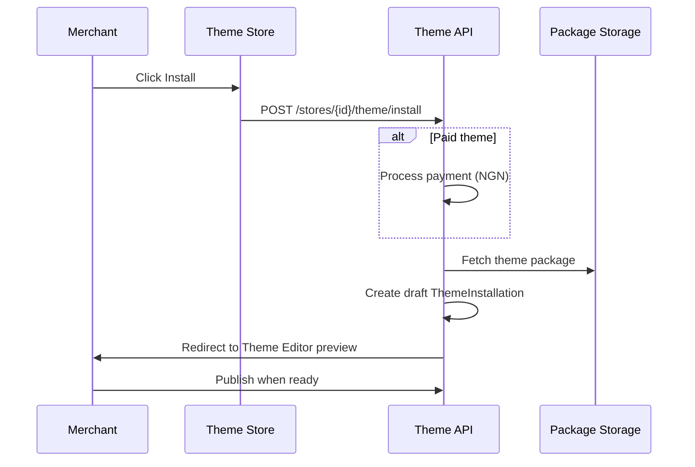

# Chapter 07: Theme Marketplace

**Document ID:** SCP-THE-006-07  
**Version:** 1.0.0  
**Status:** 📝 Draft  
**Traceability:** PRD-006, ADR-003  

---

## 1. Purpose

Specify the **SCP Theme Store** — the marketplace where third-party developers publish, sell, and maintain themes, and merchants discover, purchase, install, and update them.

## 2. Scope

- Theme Store catalog and discovery
- Developer accounts and publishing workflow
- Pricing models and revenue share
- Review and quality gates
- Installation, licensing, and updates
- Nigeria/Africa market considerations

## 3. Out of Scope

- General app/plugin marketplace (Volume 8, Volume 12)
- Payment payout mechanics detail (Volume 8 — commission engine)

## 4. Business Model

| Revenue Stream | Split | Notes |
|----------------|-------|-------|
| Paid theme sale | 70% developer / 30% platform | PRD-006 |
| Free theme | 0% — discovery funnel | Must still pass review |
| Theme subscription (Phase 3+) | 70/30 | Monthly updates support |
| Enterprise custom theme | Off-platform contract | Not Theme Store |

**Nigeria context:** Prices displayed in **NGN** by default; USD reference for international developers. Payouts via platform developer wallet → bank (Naira) or Paystack transfer.

## 5. Actor Model



| Actor | Registration | Verification |
|-------|--------------|--------------|
| Theme developer | Developer Platform account | Identity + tax info for payouts (Nigeria: TIN optional Phase 1) |
| Theme reviewer | Platform staff | Internal |
| Merchant | Store owner/staff | Store subscription active |

## 6. Catalog Data Model

```sql
CREATE TABLE theme_authors (
    id              UUID PRIMARY KEY,
    developer_id    UUID NOT NULL REFERENCES developers(id),
    display_name    VARCHAR(255) NOT NULL,
    slug            VARCHAR(100) UNIQUE NOT NULL,
    bio             TEXT,
    website_url     TEXT,
    verified        BOOLEAN DEFAULT false,
    created_at      TIMESTAMPTZ NOT NULL DEFAULT now()
);

CREATE TABLE theme_listings (
    id              UUID PRIMARY KEY,
    theme_id        UUID NOT NULL REFERENCES themes(id),
    tagline         VARCHAR(255),
    description     TEXT,
    demo_url        TEXT,
    screenshot_urls JSONB NOT NULL DEFAULT '[]',
    industry_tags   TEXT[] DEFAULT '{}',
    market_tags     TEXT[] DEFAULT '{NG}',
    price_ngn       INTEGER,          -- kobo; NULL = free
    price_usd_cents INTEGER,
    status          VARCHAR(20) DEFAULT 'draft', -- draft, review, published, suspended
    featured        BOOLEAN DEFAULT false,
    install_count   INTEGER DEFAULT 0,
    avg_rating      DECIMAL(3,2),
    published_at    TIMESTAMPTZ
);

CREATE TABLE theme_reviews_merchant (
    id              UUID PRIMARY KEY,
    listing_id      UUID NOT NULL REFERENCES theme_listings(id),
    store_id        UUID NOT NULL REFERENCES stores(id),
    rating          SMALLINT CHECK (rating BETWEEN 1 AND 5),
    body            TEXT,
    created_at      TIMESTAMPTZ NOT NULL DEFAULT now(),
    UNIQUE (listing_id, store_id)
);

CREATE TABLE theme_purchases (
    id              UUID PRIMARY KEY,
    store_id        UUID NOT NULL,
    listing_id      UUID NOT NULL,
    amount_ngn      INTEGER NOT NULL,
    commission_ngn  INTEGER NOT NULL,
    developer_payout_ngn INTEGER NOT NULL,
    purchased_at    TIMESTAMPTZ NOT NULL DEFAULT now()
);

CREATE TABLE theme_licenses (
    id              UUID PRIMARY KEY,
    store_id        UUID NOT NULL,
    theme_version_id UUID NOT NULL,
    purchase_id     UUID REFERENCES theme_purchases(id),
    license_type    VARCHAR(20) NOT NULL, -- free, purchased, subscription
    valid_until     TIMESTAMPTZ,
    UNIQUE (store_id, theme_version_id)
);
```

## 7. Discovery and Browse UX

### 7.1 Merchant Theme Library

Path: `/admin/store/design/themes/store`

| Filter | Options |
|--------|---------|
| Price | Free, Paid, All |
| Industry | Fashion, Food, Electronics, Grocery, Services, Education, Digital, Marketplace |
| Market | Nigeria, Kenya, Pan-Africa |
| Performance | Lighthouse ≥ 90 |
| Sort | Popular, Newest, Highest rated, Price |

### 7.2 Listing Page

Each listing displays:

- Screenshot carousel (mobile + desktop)
- Live demo link (sandbox store)
- Performance badge (Lighthouse score from review)
- Developer profile + other themes
- Merchant reviews (verified purchase only)
- Changelog / version history
- **Try before buy** — install to draft preview

### 7.3 Featured Themes (Nigeria Launch)

Platform curates Nigeria-optimized themes:

- NGN currency formatting built-in
- Paystack/Flutterwave payment icon sections
- Mobile-first layouts
- Low-bandwidth asset defaults

## 8. Publishing Workflow



### 8.1 Review Gates

| Gate | Automated | Manual |
|------|-----------|--------|
| Schema validation | ✓ | |
| JS/CSS budgets | ✓ | |
| Lighthouse ≥ 85 | ✓ | |
| npm audit clean | ✓ | |
| SBOM generated | ✓ | |
| Security Semgrep | ✓ | |
| UX quality | | ✓ |
| Five-second comprehension | | ✓ |
| UX distinctiveness score | ✓ | ✓ |
| Theme-switch portability | ✓ | ✓ |
| Mobile fixed-layer collisions | ✓ | ✓ |
| Nigeria market fit | | ✓ |
| Screenshot accuracy | | ✓ |
| License/compatibility | | ✓ |

**SLA:** Review completed within **5 business days** (Phase 3 launch target).

### 8.2 Rejection Reasons (Standard Codes)

| Code | Description |
|------|-------------|
| `PERF_BUDGET` | Exceeds JS/CSS limits |
| `LIGHTHOUSE` | Performance score < 85 |
| `SECURITY` | Forbidden patterns detected |
| `SCHEMA_INVALID` | Template validation failure |
| `UX_QUALITY` | Broken mobile layout |
| `MISLEADING` | Screenshots don't match theme |
| `CHECKOUT_MOD` | Unauthorized checkout customization |
| `FIVE_SECOND_FAIL` | Product category, trust evidence, or primary action is unclear |
| `UX_DISTINCTIVENESS` | Theme differs from an existing theme only superficially |
| `PORTABILITY` | Canonical content/resource mappings are missing or destructive |
| `MOBILE_COLLISION` | Purchase, nav, AI, consent, or popup layers overlap |
| `VERTICAL_MISMATCH` | Claimed vertical lacks its specialized section contracts |

## 9. Installation Flow



### 9.1 Install Rules

| Rule | Description |
|------|-------------|
| TI-001 | Install creates **draft** installation first — never auto-publish |
| TI-002 | One live + one draft installation per store max |
| TI-003 | Paid theme requires valid license before live publish |
| TI-004 | Free theme install unlimited |
| TI-005 | Trial: 14-day preview of paid theme on draft (Phase 3) |

## 10. Updates and Versioning

| Scenario | Behavior |
|----------|----------|
| Patch update (1.0.x) | Merchant notified; one-click update on draft |
| Minor update (1.x.0) | Changelog shown; optional new sections |
| Major update (x.0.0) | Setting migration tool runs (Chapter 10) |
| Developer deprecates theme | Existing installs supported 12 months |

**Auto-update policy:** Off by default. Merchant opts in to patch auto-update on draft.

## 11. API Surfaces

### Browse Theme Store

```http
GET /api/v1/theme-store/listings?market=NG&industry=fashion&sort=popular
```

**Response 200:**

```json
{
  "data": [
    {
      "slug": "lagos-boutique",
      "name": "Lagos Boutique",
      "tagline": "Mobile-first fashion theme",
      "price_ngn": 1500000,
      "price_display": "₦15,000",
      "avg_rating": 4.8,
      "install_count": 342,
      "lighthouse_score": 92,
      "screenshot_url": "https://cdn.scp.sapphital.com/themes/lagos-boutique/hero.webp"
    }
  ],
  "meta": { "page": 1, "total": 48 }
}
```

### Install Theme

```http
POST /api/v1/stores/{store_id}/theme/install
Content-Type: application/json

{
  "listing_slug": "lagos-boutique",
  "version": "1.2.0"
}
```

### Submit Review (Developer)

```http
POST /api/v1/theme-store/listings/{slug}/submit-review
Authorization: Bearer {developer_token}
```

## 12. Domain Events

| Event | Subscribers |
|-------|-------------|
| `ThemeListingPublished` | Search index, Email (followers), Analytics |
| `ThemePurchased` | Billing, Developer payout, Audit |
| `ThemeInstalled` | Analytics, Developer notification |
| `ThemeReviewSubmitted` | Review queue, Slack |
| `ThemeVersionSuspended` | Affected merchants email, Admin alert |

## 13. Webhooks (Developer)

| Event | Payload |
|-------|---------|
| `theme.version.reviewed` | `{ slug, version, status, reasons[] }` |
| `theme.purchased` | `{ store_id, amount_ngn, listing_slug }` |
| `theme.installed` | `{ store_id, listing_slug }` |
| `theme.review_received` | `{ rating, store_id }` |

## 14. Fraud and Abuse Prevention

| Threat | Control |
|--------|---------|
| Stolen theme republishing | Checksum match + author verification |
| Fake reviews | Verified purchase required |
| Malicious update | Re-review on major version; diff scan |
| License sharing | License bound to `store_id` |
| SEO spam themes | Manual review + post-publish monitoring |

## 15. Kenya / Pan-Africa Expansion

| Market | Adaptation |
|--------|------------|
| Kenya | KES pricing option; M-Pesa icon sections encouraged |
| Ghana | GHS pricing Phase 2 |
| Pan-Africa | `market_tags` filter; avoid Nigeria-only copy in global themes |

## 16. Acceptance Criteria

- [ ] Merchant can browse, preview, install free theme to draft
- [ ] Paid theme purchase records license before live publish
- [ ] Review pipeline blocks theme with Lighthouse < 85
- [ ] Developer receives webhook on review completion
- [ ] Revenue split 70/30 recorded on purchase
- [ ] Suspended theme cannot be newly installed
- [ ] Theme listing displays NGN price for Nigeria merchants
- [ ] Verified-purchase-only reviews enforced
- [ ] Five-second, distinctiveness, portability, and mobile-collision gates pass
- [ ] Listing identifies supported vertical presets and canonical section mappings

## 17. Sources

- Shopify Theme Store requirements: https://shopify.dev/docs/storefronts/themes/store/requirements (E1)
- PRD-006 marketplace requirement (Volume 1)
- Volume 8 marketplace commission engine (internal cross-ref)
