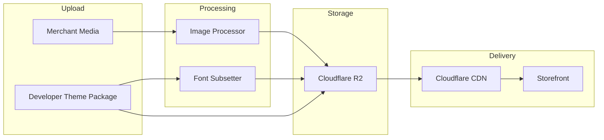

# Chapter 08: Assets and Performance

**Document ID:** SCP-THE-006-08  
**Version:** 1.0.0  
**Status:** 📝 Draft  
**Traceability:** ADR-003, ADR-008, NFR-001, NFR-009, NFR-010, NFR-011, NFR-058  

---

## 1. Purpose

Define asset management, delivery, and performance budgets for SCP themes — ensuring storefronts meet **Nigeria mobile performance targets** on 3G/4G networks while supporting rich visual merchandising.

## 2. Scope

- Theme asset types and storage
- CDN delivery via Cloudflare R2
- Image optimization pipeline
- Font loading strategy
- JavaScript and CSS budgets
- Lighthouse gates and monitoring
- Nigeria-specific optimizations

## 3. Out of Scope

- Platform-wide CDN configuration (Volume 10, ADR-008)
- Product media upload pipeline (Volume 5 Media module)

## 4. Performance Targets

### 4.1 Core Web Vitals (Storefront)

| Metric | Target | Context | ID |
|--------|--------|---------|-----|
| LCP (mobile p75) | ≤ 2.0s | Nigeria 4G | NFR-001 |
| LCP (desktop p75) | ≤ 1.5s | | NFR-002 |
| INP | ≤ 100ms | | Engineering Principles |
| CLS | ≤ 0.05 | | Engineering Principles |
| TTI | ≤ 2.5s | Homepage mobile | Engineering Principles |

### 4.2 Theme Resource Budgets

| Resource | Platform Max (NFR) | Theme Max (ADR-003) | Measurement |
|----------|-------------------|---------------------|-------------|
| JavaScript (initial, gzip) | 150 KB | **100 KB** | `@next/bundle-analyzer` |
| CSS (gzip) | 50 KB | **50 KB** | Build output |
| Fonts (subset) | 100 KB | **80 KB** | Transfer size |
| Hero image | 200 KB | **200 KB** | CDN analytics |
| Total page weight (mobile) | — | **≤ 800 KB** | WebPageTest 3G Fast |

### 4.3 Lighthouse Gates

| Surface | Performance | Accessibility | Best Practices | SEO |
|---------|-------------|---------------|----------------|-----|
| Built-in themes (Phase 1) | ≥ 90 | ≥ 95 | ≥ 95 | ≥ 95 |
| Theme Store publish gate | ≥ **85** | ≥ 90 | ≥ 90 | ≥ 90 |
| Merchant customized (monitored) | ≥ 75 warn, ≥ 60 alert | ≥ 90 | — | — |

## 5. Asset Architecture



## 6. Asset Types

| Type | Source | Storage Path | Cache |
|------|--------|--------------|-------|
| Theme static CSS/JS | Theme package build | `themes/{slug}/{version}/assets/` | 1 year immutable |
| Theme images (bundled) | Theme package | `themes/{slug}/{version}/images/` | 1 year immutable |
| Merchant logo/favicon | Media library | `tenants/{tenant_id}/media/{id}` | 30 days + revalidate |
| Section background images | Media library | Same | Responsive variants |
| Product images | Commerce Media | `tenants/{tenant_id}/products/` | Responsive variants |
| Fonts | SDS + theme overrides | `fonts/{family}/{subset}.woff2` | 1 year immutable |

## 7. Image Optimization

### 7.1 Processing Pipeline

On upload or theme publish:

1. Validate MIME type (allowlist)
2. Strip EXIF (privacy — GPS in Nigeria phone photos)
3. Generate variants:

| Variant | Width | Format | Quality |
|---------|-------|--------|---------|
| `thumb` | 150w | WebP | 80 |
| `mobile` | 640w | WebP | 82 |
| `tablet` | 1024w | WebP | 85 |
| `desktop` | 1280w | WebP | 85 |
| `retina` | 2560w | WebP | 85 |
| `mobile-avif` | 640w | AVIF | 75 |

4. Store manifest in `media.variants` JSONB
5. Serve via `` from section components

### 7.2 Hero Image Rules (LCP)

| Rule | Implementation |
|------|----------------|
| HP-001 | First visible section image uses `fetchpriority="high"` |
| HP-002 | Preload hero image in page `<head>` via RSC metadata |
| HP-003 | Explicit `width` and `height` to prevent CLS |
| HP-004 | No CSS background-image for LCP element |
| HP-005 | Hero ≤ 200 KB at mobile variant (NFR-011) |

### 7.3 Lazy Loading

| Content | Strategy |
|---------|----------|
| Above fold | Eager load |
| Below fold sections | `loading="lazy"` on images |
| Product grid | Intersection Observer skeleton → load |
| Client section JS | `next/dynamic` with loading state |

## 8. Font Strategy

### 8.1 Approved Font Families (Volume 4 SDS)

| Family | Subsets | Max Weight |
|--------|---------|------------|
| Inter | Latin, Latin Extended | 80 KB |
| Plus Jakarta Sans | Latin | 80 KB |
| DM Sans | Latin | 80 KB |
| System stack | — | 0 KB |

### 8.2 Loading Pattern

```html
<link rel="preload" href="/fonts/inter-latin.woff2" as="font" type="font/woff2" crossorigin />
<style>
  @font-face {
    font-family: 'Inter';
    src: url('/fonts/inter-latin.woff2') format('woff2');
    font-display: swap;
  }
</style>
```

**Nigeria note:** System font fallback prioritized on 3G (`font-display: swap` + system-ui stack) to ensure text visible < 1s even if webfont pending.

## 9. JavaScript Budget Enforcement

### 9.1 Build-Time Analysis

Theme build produces `bundle-stats.json`:

```json
{
  "client_js_gzip_bytes": 87432,
  "client_css_gzip_bytes": 12400,
  "chunks": [
    { "name": "header", "gzip_bytes": 8200 },
    { "name": "product-gallery", "gzip_bytes": 15200 }
  ]
}
```

`scp-theme check` fails if `client_js_gzip_bytes > 102400`.

### 9.2 Client Component Allowlist

Themes must declare client components in `scp.theme.config.ts`:

```typescript
export default {
  clientComponents: [
    'sections/Header/CartDrawer.tsx',
    'sections/ProductGallery/Zoom.tsx',
  ],
};
```

Undeclared `'use client'` files fail validation.

## 10. CSS Strategy

| Approach | Detail |
|----------|--------|
| Primary | Tailwind CSS with SDS preset (Volume 4) |
| Scope | Section-scoped class prefixes `.scp-section-{type}` |
| Critical CSS | Inline above-fold styles for hero (Phase 2) |
| Purge | Content paths include all section TSX files |

## 11. Nigeria Network Optimization

NFR-058: Functional on 3G (768 Kbps); optimized for 4G.

| Technique | 3G Impact | Implementation |
|-----------|-----------|----------------|
| RSC minimal JS | High | Server-render catalog HTML |
| ISR caching | High | 60s product page cache |
| Responsive images | High | 640w default on mobile |
| SVG icons | Medium | Lucide tree-shaken |
| Prefetch disabled on 3G | Medium | `Save-Data` / Network Information API |
| Service worker (Phase 2) | Medium | Cache shell + offline cart |
| Reduce third-party scripts | High | No theme analytics — platform injects |

### 11.1 Save-Data Support

```typescript
// packages/theme-sdk/server
export function shouldReduceData(request: Request): boolean {
  return request.headers.get('Save-Data') === 'on';
}
```

When true:

- Serve lower quality image variants
- Disable autoplay video sections
- Skip non-critical client hydration

### 11.2 WebPageTest Profiles

CI runs weekly against:

| Profile | Location | Connection |
|---------|----------|------------|
| Lagos Mobile | EC2 af-south-1 | 4G |
| Lagos 3G | EC2 af-south-1 | 3G Fast |
| Nairobi Mobile | EC2 af-south-1 | 4G |

## 12. CDN Configuration

Per ADR-008:

| Header | Value |
|--------|-------|
| `Cache-Control` (theme assets) | `public, max-age=31536000, immutable` |
| `Cache-Control` (HTML ISR) | `public, s-maxage=60, stale-while-revalidate=300` |
| `Cache-Control` (preview) | `private, no-store` |
| `Content-Encoding` | br, gzip |

**Purge triggers:** Theme publish, settings change (tag-based purge via Cloudflare API).

## 13. Monitoring

| Metric | Tool | Alert |
|--------|------|-------|
| LCP p75 per store | CrUX / synthetic | > 2.5s |
| Theme bundle size | Build CI | > 100 KB |
| CDN cache hit ratio | Cloudflare analytics | < 90% |
| Image processing queue | Horizon | Depth > 100 |
| Lighthouse score drop | Weekly cron | > 10 point drop |

### 13.1 Merchant Performance Dashboard (Phase 2)

Path: `/admin/store/design/performance`

Shows:

- Current Lighthouse scores (homepage, product)
- JS/CSS budget usage
- Recommendations ("Hero image 340 KB — compress to ≤ 200 KB")
- Comparison to theme baseline

## 14. Background Jobs

| Job | Trigger | Action |
|-----|---------|--------|
| `ProcessThemeAssetsJob` | Theme version publish | Optimize bundled images |
| `GenerateMediaVariantsJob` | Media upload | Create responsive variants |
| `RunStorefrontLighthouseJob` | Weekly schedule | Synthetic audit per active store |
| `NotifyPerformanceRegressionJob` | Score drop > 10 | Email merchant |

## 15. API Surfaces

### Get Theme Performance Report

```http
GET /api/v1/stores/{store_id}/theme/performance
```

**Response 200:**

```json
{
  "lighthouse": {
    "homepage": { "performance": 91, "accessibility": 96, "measured_at": "2026-07-10T08:00:00Z" },
    "product": { "performance": 88, "accessibility": 95, "measured_at": "2026-07-10T08:00:00Z" }
  },
  "budgets": {
    "js_gzip_bytes": 87432,
    "js_budget_bytes": 102400,
    "css_gzip_bytes": 12400
  },
  "recommendations": [
    {
      "code": "HERO_IMAGE_LARGE",
      "message": "Hero image is 340 KB; compress to ≤ 200 KB",
      "section_id": "hero-main"
    }
  ]
}
```

## 16. Acceptance Criteria

- [ ] Built-in `scp-dawn` homepage LCP ≤ 2.0s on Lighthouse mobile CI
- [ ] Theme JS budget enforced in `scp-theme check`
- [ ] Hero images served with srcset and fetchpriority
- [ ] 3G WebPageTest profile completes homepage load ≤ 5s (functional, NFR-058)
- [ ] Theme Store rejects themes with Lighthouse performance < 85
- [ ] Save-Data header reduces image quality tier
- [ ] Font transfer ≤ 80 KB per theme
- [ ] CDN cache hit ratio ≥ 90% for theme static assets (production)

## 17. Sources

- Web Vitals thresholds: https://web.dev/vitals/ (E1)
- Cloudflare R2 + CDN: ADR-008 (internal)
- NFR-001, NFR-058 (Volume 1)
- Shopify theme performance recommendations (E2)
