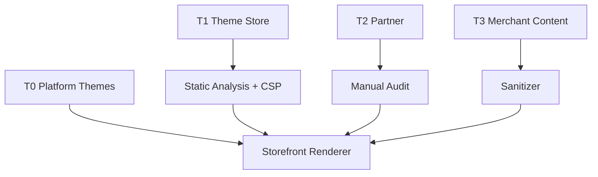

# Chapter 09: Security, Sandbox, and CSP

**Document ID:** SCP-THE-006-09  
**Version:** 1.0.0  
**Status:** ✅ Active  
**Traceability:** ADR-003, ADR-008, NFR-029 – NFR-038, NFR-040, OWASP ASVS V5

---

## Purpose

Define **security boundaries** for theme and storefront rendering — Content Security Policy (CSP), sandbox rules for third-party theme code, and safe handling of merchant-supplied content in a multi-tenant Nigeria-primary platform.

## Scope

- CSP directives for storefront and preview
- Theme code trust tiers (platform, marketplace, merchant)
- App Block and third-party script allowlists
- XSS prevention in section settings and rich text
- Preview mode isolation
- Security review requirements for Theme Store

## Out of Scope

- Platform admin CSP (Volume 11)
- Plugin server-side sandbox (Volume 12 Ch. 07)
- WAF configuration (Volume 10 Ch. 05, ADR-008)

---

## 1. Threat Model (Theme Surface)

| Threat | Vector | Impact |
|--------|--------|--------|
| **Stored XSS** | Malicious section HTML/JS | Shopper session theft |
| **Supply chain** | Compromised Theme Store package | Cross-tenant storefront defacement |
| **Data exfiltration** | Theme calls external API with shopper cookies | PII leak (NDPA violation) |
| **Cryptojacking** | Third-party script in app block | Performance / reputation |
| **Clickjacking** | Missing frame ancestors | Checkout hijack |

**Nigeria context:** Merchants often paste Instagram/WhatsApp embed codes — high XSS risk if unsanitized.

---

## 2. Trust Tiers

| Tier | Source | Trust Level | Review |
|------|--------|-------------|--------|
| **T0 — Platform** | Sapphital built-in themes | Full trust | Internal security review |
| **T1 — Verified** | Theme Store approved | Trusted with CSP | Automated + manual review |
| **T2 — Partner** | Agency custom themes | Sandboxed | Contract + code audit |
| **T3 — Merchant edits** | Section content only | Untrusted input | Schema validation + sanitization |



---

## 3. Content Security Policy

### 3.1 Production Storefront CSP

```http
Content-Security-Policy:
  default-src 'self';
  script-src 'self' 'nonce-{per-request}' https://challenges.cloudflare.com;
  style-src 'self' 'unsafe-inline';
  img-src 'self' data: https://*.r2.cloudflarestorage.com https://*.cloudflare.com;
  font-src 'self';
  connect-src 'self' https://api.sapphital.com;
  frame-src https://checkout.paystack.com https://checkout.flutterwave.com;
  frame-ancestors 'none';
  base-uri 'self';
  form-action 'self' https://checkout.paystack.com https://checkout.flutterwave.com;
  upgrade-insecure-requests;
```

| Directive | Rationale |
|-----------|-----------|
| `script-src` nonce | Per-request nonce for inline hydration scripts only |
| No `unsafe-eval` | Blocks dynamic code execution |
| `frame-src` | PSP redirect checkout only (ADR-004) |
| `frame-ancestors 'none'` | Clickjacking protection |
| `connect-src` | Storefront API only; no arbitrary exfil endpoints |

### 3.2 Preview Mode CSP (Stricter)

Preview (`?preview_token=`) adds:

```http
X-Robots-Tag: noindex, nofollow
Content-Security-Policy: ... connect-src 'self' only;
```

Preview tokens expire in 1 hour; scoped to single tenant.

### 3.3 Report-Only Phase

New CSP versions deploy in `Content-Security-Policy-Report-Only` for 7 days before enforcement. Violations logged to Sentry.

---

## 4. Third-Party Scripts Policy

| Phase | Allowed Scripts |
|-------|-----------------|
| Phase 1 | Cloudflare Turnstile (bot protection), platform RUM |
| Phase 2 | Merchant-selected: Google Analytics 4, Meta Pixel (via app block) |
| Phase 3 | Theme App Extensions with declared `script_urls` in manifest |

**Default deny:** No merchant `<script>` tags in section settings.

### 4.1 App Block Script Manifest

```json
{
  "type": "app_block",
  "scripts": [
    {
      "src": "https://cdn.partner.com/widget.js",
      "integrity": "sha384-...",
      "async": true,
      "purpose": "live_chat"
    }
  ]
}
```

Scripts without SRI hash rejected at theme publish.

---

## 5. Input Sanitization

| Input | Sanitizer | Allowed |
|-------|-----------|---------|
| Section text fields | Plain text escape | No HTML |
| Rich text (BlockNote) | Trusted renderer → HTML cache | Allowlist marks only |
| URL fields | URL parser + scheme allowlist | `https:`, `mailto:`, `tel:` |
| oEmbed | Provider allowlist | YouTube, Vimeo, Twitter/X |
| Color values | HEX regex | `#RGB`, `#RRGGBB` |
| Media references | Tenant-scoped media ID | No external hotlink in schema |

**Forbidden globally:** `javascript:`, `data:text/html`, event handlers (`onclick`), `<iframe>` except oEmbed proxy.

---

## 6. Theme Package Static Analysis

Theme Store CI pipeline scans:

| Check | Tool | Fail Condition |
|-------|------|----------------|
| Dependency CVE | npm audit | High/critical |
| Dangerous APIs | Semgrep | `eval`, `document.write`, `innerHTML =` |
| Network calls | AST analysis | `fetch` to non-allowlist domains |
| Secret patterns | gitleaks | Any match |
| Bundle size | Analyzer | JS > 100 KB (Ch. 08) |

---

## 7. Server-Side Rendering Safety

| Rule | Implementation |
|------|----------------|
| No `dangerouslySetInnerHTML` without sanitizer | ESLint rule `scp/no-raw-html` |
| JSON-LD structured data | Server-generated only |
| User content in SSR | Escaped or sanitized HTML cache |
| Error pages | Generic message; no stack traces |

React Server Components default — client components require explicit boundary.

---

## 8. Subresource Integrity

| Asset Type | SRI Required |
|------------|--------------|
| Theme JS chunks | Yes (build pipeline) |
| Third-party app block scripts | Yes (manifest) |
| Google Fonts | No — self-hosted instead |
| CDN images | N/A (not scripts) |

---

## 9. Theme Store Security Review

| Stage | Checks |
|-------|--------|
| Automated | Semgrep, npm audit, bundle budget, CSP compatibility |
| Manual | Authored XSS payloads in section settings, preview token scope |
| Re-review | Required on major version bump or new script declaration |
| Incident | Theme suspension API within 15 minutes |

---

## 10. Acceptance Criteria

- [ ] Production CSP documented with nonce-based scripts and PSP frame-src
- [ ] Trust tiers T0–T3 defined with review requirements
- [ ] Third-party scripts default-deny; app block manifest with SRI
- [ ] Section input sanitization rules for URLs, rich text, oEmbed
- [ ] Theme Store static analysis pipeline checks listed
- [ ] Preview mode uses noindex and stricter connect-src
- [ ] `frame-ancestors 'none'` on storefront responses
- [ ] ESLint rule blocks raw `dangerouslySetInnerHTML`

---

## References

- [ADR-003: Theme Engine](../00-meta/adr/003-theme-engine-react-json-schema.md)
- [ADR-008: Cloudflare](../00-meta/adr/008-edge-security-cloudflare.md)
- [Volume 11 Ch. 04 — Security Architecture](../11-security/04-security-architecture.md)
- [Volume 12 Ch. 11 — SSRF & Rate Limits](../12-developer-platform/11-security-ssrf-rate-limits.md)
- [Chapter 08 — Assets & Performance](./08-assets-and-performance.md)
