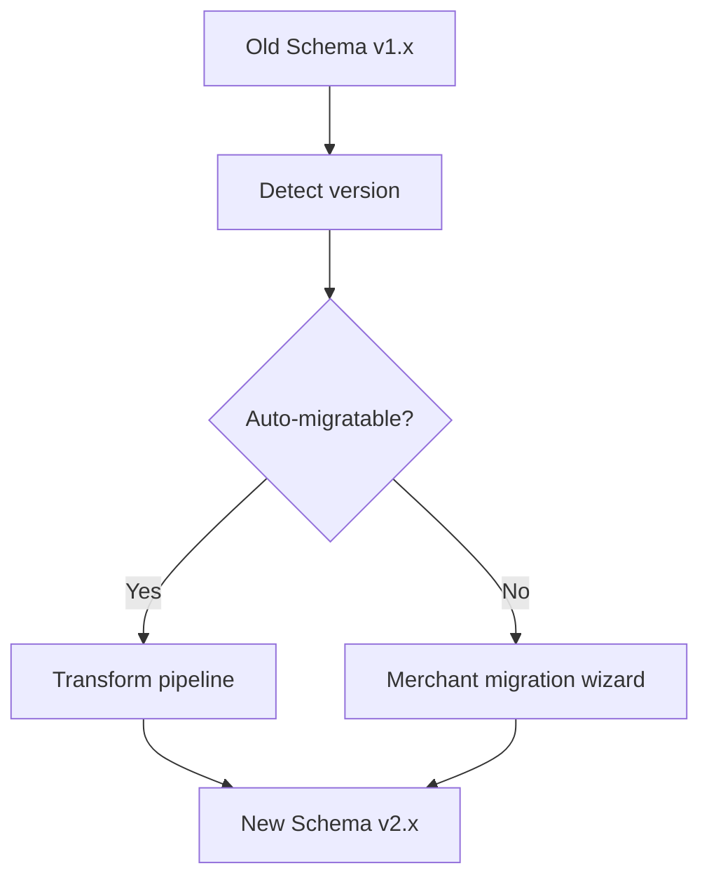
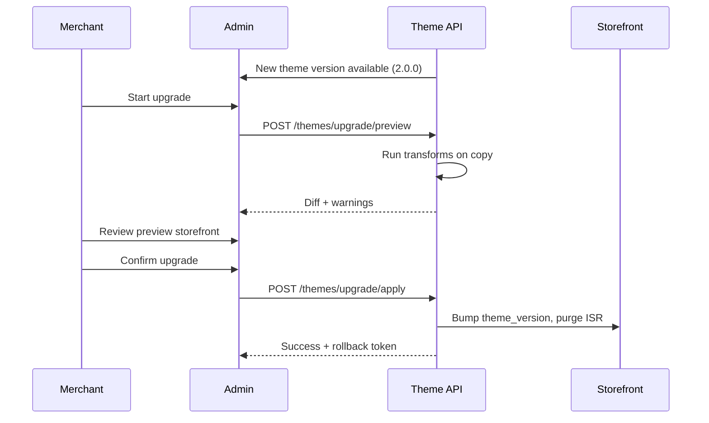

# Chapter 10: Migration and Versioning

**Document ID:** SCP-THE-006-10  
**Version:** 1.0.0  
**Status:** ✅ Active  
**Traceability:** ADR-003, NFR-076, FR-THE-005 – FR-THE-008

---

## Purpose

Define **theme schema versioning**, upgrade paths, and migration tooling so merchants and theme developers can adopt new Theme Engine capabilities without breaking live Nigeria storefronts.

## Scope

- Theme manifest versioning (SemVer)
- Section/block schema evolution
- Automated migration transforms
- Merchant upgrade workflow
- Breaking change policy
- Rollback and compatibility windows

## Out of Scope

- Platform database migrations (Volume 10)
- CMS content migrations (Volume 7 Ch. 08)
- WordPress theme import

---

## 1. Versioning Model

| Artifact | Scheme | Example |
|----------|--------|---------|
| Theme package | SemVer 2.0 | `lagos-theme@2.1.0` |
| `theme.json` schema | SemVer | `schema_version: "2.0"` |
| Section type definition | SemVer per type | `hero@1.3.0` |
| Merchant `theme_settings` | Integer revision | `revision: 42` |
| Storefront API | Date-based | `storefront/v2026-07` |

**Compatibility rule:** Patch and minor theme updates must not require merchant action. Major updates may require migration wizard.

---

## 2. Schema Evolution Strategies



| Change Type | Strategy | Merchant Impact |
|-------------|----------|-----------------|
| Add optional setting | Auto-default | None |
| Rename setting | Transform map | None if automated |
| Remove setting | Deprecation period 2 releases | Warning in editor |
| Split section type | Wizard maps old → new | Manual confirm |
| Change block structure | Transform + preview | Review required |

---

## 3. Migration Transform Pipeline

### 3.1 Transform Registry

```php
// Conceptual — Theme module
ThemeMigration::register('hero', '1.x', '2.0', HeroV1ToV2Transform::class);
```

Each transform:

1. Reads section JSON at old version
2. Outputs new JSON + migration log
3. Never drops content silently — unmapped fields go to `_migration_warnings`

### 3.2 CLI Commands

```bash
scp theme:migrate --theme=lagos --from=1.2.0 --to=2.0.0 --dry-run
scp theme:migrate --tenant=uuid --apply
scp theme:validate --tenant=uuid
```

Dry-run produces diff report for merchant review.

---

## 4. Merchant Upgrade Workflow



| State | Live Storefront | Draft |
|-------|-----------------|-------|
| Preview upgrade | Unchanged | Transformed copy |
| Applied upgrade | New version | Published |
| Rollback (72h) | Previous version restored | Archived |

Rollback token valid 72 hours; stores previous `theme_settings` + section JSON snapshot in R2.

---

## 5. Breaking Change Policy

| Release | Breaking Changes Allowed | Notice |
|---------|-------------------------|--------|
| Patch | Never | — |
| Minor | Never (deprecate only) | Editor deprecation badge |
| Major | Yes | 30-day notice; migration guide |

**Theme Store:** Major bumps require re-review and changelog.

### 5.1 Deprecation Timeline

```text
Release N:   Mark setting deprecated; show editor warning
Release N+1: Auto-migrate on preview; still accept old key
Release N+2: Remove old key; transform required
```

---

## 6. Platform Schema Upgrades

When SCP platform adds new section types:

| Action | Behavior |
|--------|----------|
| New section type | Available in editor immediately |
| Updated platform section | Themes inherit if not overridden |
| Removed platform section | Existing instances grandfathered; no new adds |

Platform upgrades run transforms in **maintenance window** with zero-downtime deploy (NFR-076). Transforms are idempotent.

---

## 7. Import / Export

| Format | Use |
|--------|-----|
| `theme-export.json` | Full theme + settings + templates |
| `sections-only.json` | Page layouts without assets |
| Zip package | Theme Store distribution |

Import validates schema version; offers upgrade path if older.

### 7.1 Nigeria Agency Workflow

Agencies build on staging tenant → export → import to merchant production tenant. Import runs tenant isolation check — no cross-tenant media IDs.

---

## 8. API Version Compatibility

| Storefront API Version | Theme SDK Min | Theme SDK Max |
|------------------------|---------------|---------------|
| `v2026-01` | 1.0.0 | 1.x |
| `v2026-07` | 1.2.0 | 2.x |

Theme `package.json` declares `engines.storefrontApi`. Mismatch blocks publish with actionable error.

---

## 9. Testing Migrations

| Test | Requirement |
|------|-------------|
| Unit | Every transform: input fixture → expected output |
| Integration | Golden themes migrate without warnings |
| E2E | Preview upgrade shows correct PDP/PLP |
| Rollback | Restored snapshot matches checksum |

Migration tests run in CI on theme schema changes — blocking merge.

---

## 10. Acceptance Criteria

- [ ] SemVer policy for theme packages and section types documented
- [ ] Transform pipeline with dry-run CLI commands defined
- [ ] Merchant upgrade workflow includes preview and 72h rollback
- [ ] Breaking change policy: major only with 30-day notice
- [ ] Deprecation spans 2 releases before removal
- [ ] Import/export formats with tenant isolation on media IDs
- [ ] Migration tests blocking in CI
- [ ] Storefront API `engines` compatibility check on publish

---

## References

- [ADR-003: Theme Engine](../00-meta/adr/003-theme-engine-react-json-schema.md)
- [Volume 3 Ch. 08 — API Versioning](../03-architecture/08-api-architecture-and-versioning.md)
- [Volume 6 Ch. 02 — Template Schema](./02-template-schema-specification.md)
- [Volume 10 — Zero-Downtime Migrations](../10-infrastructure/07-environments-and-config.md)
