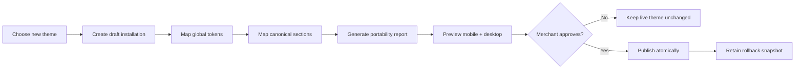

# Chapter 11: Reference Themes, Section Catalog & Portability

**Document ID:** SCP-THE-006-11  
**Version:** 1.0.0  
**Status:** ✅ Active  
**Traceability:** ADR-003, ADR-012, PRD-001, PRD-006, NFR-001, NFR-039, NFR-047–NFR-053  

---

## Purpose

Define the **reference theme portfolio**, complete platform section catalog, preset contracts, and theme-switching portability rules required to deliver agency-quality storefronts without coupling merchant content to one theme.

## Design Principle

> Themes own presentation and composition. SCP owns commerce behavior, content identity, accessibility baselines, and portable data contracts.

Reference themes are distinct art directions over the same stable platform contracts. They must not be one layout with different colors.

---

## 1. Reference Theme Portfolio

### 1.1 Launch Themes

| Theme | Primary verticals | Art direction | Product card | Navigation |
|-------|-------------------|---------------|--------------|------------|
| **Lagos Atelier** | Fashion, beauty, jewelry | Editorial, high-contrast type, portrait media, generous whitespace | Editorial | Centered logo + visual mega menu |
| **Savanna Market** | Grocery, general retail, marketplace | Warm, practical, category-dense, trust-forward | Standard / marketplace | Search-first + category rail |
| **Terminal Tech** | Electronics, software, digital | Precision grid, dark/light modes, spec-led composition | Comparison-ready | Mega menu + strong search |

These replace ambiguous references to “Lagos, Savanna, Terminal” with normative names and intended outcomes.

### 1.2 African Industry Theme Marketplace

Themes must reflect **African business verticals**, not generic Western retail templates:

| Vertical | Workflow highlights |
|----------|---------------------|
| Retail / Wholesale | Bulk pricing, MOQ, stock badges |
| Supermarket | Category density, delivery slots |
| Pharmacy | Prescription upload, regulated product flags |
| Agriculture | Seasonal produce, farm-to-table trust |
| School | Fees, uniforms, book lists |
| Church / NGO | Donations, events, membership |
| Hospital / Clinic | Appointments, service catalog |
| Restaurant / Hotel | Menus, reservations, room booking |
| Electronics | Spec comparison, warranty |
| Fashion | Lookbook, size guides |
| Hardware | SKU density, contractor accounts |

Each vertical ships industry-specific sections on the shared section catalog (§2).

### 1.3 Expansion Theme Families

| Family | Reference theme | Specialized needs |
|--------|-----------------|-------------------|
| Food | **Chop & Serve** | Menu groups, dietary badges, hours, delivery radius |
| Services | **Studio Pro** | Case studies, outcomes, team, booking |
| Education | **Academy Path** | Curriculum, instructor, outcomes, cohorts |
| Digital | **Launchpad** | Demo, feature comparison, licenses, subscriptions |

### 1.4 Differentiation Scorecard

Every reference or marketplace theme is scored 0–2 on:

- Typography composition
- Grid and whitespace rhythm
- Media art direction
- Header/navigation model
- Product-card treatment
- Vertical-specific sections
- Mobile composition
- Motion personality

Themes scoring below **10/16**, or differing from an existing theme only by color/font, fail `UX_DISTINCTIVENESS`.

---

## 2. Canonical Section Catalog

### 2.1 Global & Navigation

| Section type | Purpose | Required capabilities |
|--------------|---------|-----------------------|
| `announcement-bar` | Offer/trust message | Dismissible, schedule, link |
| `header` | Identity and utility | Logo, search, account, wishlist, cart |
| `mega-menu` | Large-catalog discovery | Link groups, one promo tile, keyboard support |
| `mobile-bottom-nav` | Thumb-zone discovery | Five-item contract; collision handling |
| `breadcrumbs` | Hierarchy | Structured data; mobile back mode |
| `footer` | Support/legal/navigation | Link groups, contact, locale, payments |

### 2.2 Promotional & Storytelling

| Section type | Purpose | Settings highlights |
|--------------|---------|---------------------|
| `hero` | Five-second proposition | Desktop/mobile media, CTA, proof points, focal point |
| `split-hero` | Copy + media | Ratio, order by breakpoint |
| `campaign-banner` | Active promotion | Promotion ID, start/end, factual countdown |
| `image-with-text` | Brand story | Media, alignment, width |
| `video-story` | Demonstration/story | Poster, caption, no autoplay sound |
| `logo-cloud` | Brands/clients | Logo media, links, grayscale/color |
| `social-gallery` | Social proof/media | Cached source; no heavy third-party embed |
| `press-mentions` | Authority | Publication, quote, source URL |

### 2.3 Merchandising

| Section type | Purpose | Data source |
|--------------|---------|-------------|
| `category-tiles` | Route shoppers by intent | Collections/categories |
| `product-grid` | General merchandising | Collection/manual/query |
| `product-carousel` | Compact discovery | Collection/recommendation |
| `featured-product` | Product spotlight | Product |
| `best-sellers` | Proven products | Analytics ranking |
| `new-arrivals` | Recently launched | Product date/query |
| `flash-sale` | Time-bound sale | Promotion entity |
| `brand-directory` | Browse brands | Product vendors/brand content |
| `recently-viewed` | Session continuity | Customer/session history |
| `recommendations` | Personalized products | Recommendation API |
| `frequently-bought-together` | Basket expansion | Association API |
| `comparison-table` | Spec comparison | Selected products |

### 2.4 Trust & Conversion

| Section type | Purpose | Integrity rule |
|--------------|---------|----------------|
| `trust-bar` | Delivery/payment/returns | Factual merchant settings |
| `testimonials` | Qualitative proof | Source attribution |
| `reviews-summary` | Rating proof | Verified review aggregate |
| `merchant-verification` | Marketplace trust | Platform status only |
| `delivery-promise` | Shipping expectation | Shipping quote/rule API |
| `payment-icons` | Payment confidence | Enabled methods only |
| `faq` | Objection handling | CMS FAQ entries |
| `newsletter` | Email retention | Explicit marketing consent |
| `whatsapp-opt-in` | Messaging retention | Separate consent and template policy |

### 2.5 AI & Search

| Section type | Purpose | Runtime |
|--------------|---------|---------|
| `ai-product-finder` | Natural-language intent discovery | Lazy after interaction/idle |
| `search-box` | Keyword/typeahead search | Server-rendered shell |
| `search-no-results-assistant` | Recover failed search | Query context |
| `product-questions-ai` | PDP grounded questions | Current product + policy RAG |

### 2.6 Vertical Sections

| Vertical | Section types |
|----------|---------------|
| Food | `menu-groups`, `dietary-filter`, `opening-hours`, `delivery-radius` |
| Services | `services-grid`, `case-studies`, `team`, `booking-cta`, `process-steps` |
| Education | `course-curriculum`, `instructor-profile`, `learning-outcomes`, `cohort-dates` |
| Digital | `feature-comparison`, `interactive-demo`, `license-options`, `changelog` |
| Marketplace | `vendor-spotlight`, `vendor-directory`, `verified-sellers` |

---

## 3. Canonical Section Contract

Every section definition includes:

```typescript
interface CanonicalSectionDefinition {
  type: string;
  contractVersion: string;
  category: SectionCategory;
  supportedTemplates: TemplateKey[];
  requiredCapabilities: string[];
  settingsSchema: JSONSchema;
  portableFields: PortableFieldMap;
  performanceBudget: {
    initialJsKb: number;
    imageBudgetKb: number;
  };
  accessibility: {
    landmark?: string;
    keyboardModel?: string;
    requiresHeading: boolean;
  };
  collisionPriority?: 'navigation' | 'commerce' | 'assistant' | 'marketing';
}
```

### 3.1 Required Setting Groups

```json
{
  "groups": [
    { "id": "content", "label": "Content" },
    { "id": "data", "label": "Data source" },
    { "id": "style", "label": "Style" },
    { "id": "media", "label": "Media" },
    { "id": "behavior", "label": "Behavior" },
    { "id": "visibility", "label": "Visibility" }
  ]
}
```

Not every section exposes every group, but matching controls use these labels and ordering.

### 3.2 Hero Minimum Contract

| Group | Required fields |
|-------|-----------------|
| Content | heading, subheading, primary CTA, optional secondary CTA, proof points |
| Media | desktop image, mobile image, focal point, optional video poster |
| Style | color scheme, alignment, content width, section height |
| Behavior | reveal motion, media position; autoplay off by default |
| Visibility | breakpoint visibility, optional release schedule |

The editor warns when the hero lacks a category-specific heading, CTA, or trust evidence.

---

## 4. Page Presets

### 4.1 Homepage Presets

| Preset ID | Family | Default sequence |
|-----------|--------|------------------|
| `home-fashion-editorial` | Retail | announcement, header, split-hero, category-tiles, new-arrivals, campaign, social-gallery, reviews, newsletter, footer |
| `home-electronics-search` | Retail | announcement, search-header, hero, categories, best-sellers, ai-product-finder, comparison, brands, FAQ, footer |
| `home-grocery-utility` | Retail/Food | delivery-promise, search-header, categories, promotions, product-grid, reorder, trust, footer |
| `home-food-order-now` | Food | hours, hero, menu-groups, dietary-filter, best-sellers, reviews, delivery-radius, footer |
| `home-services-authority` | Services | header, hero, client-logos, services, case-studies, process, team, booking, FAQ, footer |
| `home-education-outcomes` | Education | header, hero, outcomes, courses, instructor, testimonials, curriculum-preview, FAQ, footer |
| `home-digital-demo` | Digital | header, hero, demo, features, comparison, reviews, pricing, FAQ, footer |

### 4.2 Product Presets

| Preset | Intended products | Distinct composition |
|--------|-------------------|----------------------|
| `pdp-retail-standard` | General retail | Gallery + sticky purchase panel |
| `pdp-fashion` | Apparel | Portrait gallery, size guide, fit/returns |
| `pdp-electronics` | Electronics | Specs, compare, warranty, compatibility |
| `pdp-food` | Food/menu | Modifiers, dietary details, prep time |
| `pdp-course` | Education | Outcomes, curriculum, instructor, enrollment CTA |
| `pdp-digital` | Download/software | Demo, version/license, instant delivery |

---

## 5. Portable Merchant Content

### 5.1 Portability Layers

| Layer | Owner | Portable across themes? |
|-------|-------|-------------------------|
| Products, collections, prices | Commerce | Always |
| Pages, blog, FAQ, testimonials | CMS | Always |
| Navigation menus | CMS/Navigation | Always |
| Media assets and alt text | Media library | Always |
| Theme tokens | Theme installation | Mapped where compatible |
| Section composition | Theme installation | Mapped by canonical type |
| Theme-specific decorative settings | Theme package | Best-effort only |

### 5.2 Stable Content References

Theme JSON stores resource references, not duplicated merchant content:

```json
{
  "type": "testimonials",
  "settings": {
    "content_source": {
      "content_type": "testimonial",
      "query": { "status": "published", "limit": 6 }
    }
  }
}
```

Switching themes retains the CMS entries and resolves them into the new theme's testimonials component.

### 5.3 Canonical Type Mapping

Theme manifests declare:

```json
{
  "portable_sections": {
    "hero-editorial": "hero",
    "products-masonry": "product-grid",
    "quotes-filmstrip": "testimonials"
  }
}
```

Migration maps:

1. Canonical type
2. Portable field IDs
3. Resource references
4. Visibility/scheduling rules
5. Unmapped settings to migration report

No content is silently deleted.

---

## 6. Theme Switching Experience



### 6.1 Portability Report

| Status | Meaning | Editor action |
|--------|---------|---------------|
| Mapped | Content and behavior retained | None |
| Adapted | Retained with visual/layout change | Review preview |
| Needs input | Required setting missing | Complete field |
| Unsupported | No equivalent section | Choose replacement or omit |

The report must distinguish lost **presentation** from lost **content**. Merchant-owned content remains in CMS/media even when a target theme lacks a renderer.

---

## 7. Layer Collision Rules

Mobile fixed UI is coordinated by a platform layout manager:

| Priority | Layer |
|----------|-------|
| 1 (highest) | Checkout/purchase action and critical consent |
| 2 | System error/recovery |
| 3 | Mobile bottom navigation |
| 4 | AI assistant launcher |
| 5 | Marketing popup |

Rules:

- PDP sticky purchase bar may collapse bottom navigation.
- AI launcher shifts above a visible bottom bar and hides during checkout.
- Marketing popups cannot appear on checkout or during open AI/search overlays.
- Only one bottom sheet/modal is active at a time.

---

## 8. Marketplace Review Additions

In addition to Chapter 07 gates, Theme Store review requires:

| Code | Gate |
|------|------|
| `FIVE_SECOND_FAIL` | Category, trust, or primary CTA unclear |
| `UX_DISTINCTIVENESS` | Insufficient differentiation from existing themes |
| `PORTABILITY` | Canonical mapping missing or destroys references |
| `MOBILE_COLLISION` | Fixed layers overlap at 320/375 px |
| `PDP_CONVERSION` | Purchase action or delivery/returns information unclear |
| `MOTION_EXCESS` | Motion blocks interaction or ignores reduced motion |
| `VERTICAL_MISMATCH` | Claimed vertical lacks required specialized sections |

Manual reviewers assess all golden routes from Volume 4 Chapter 13.

---

## 9. Acceptance Criteria

- [ ] Three launch themes have distinct scorecards ≥ 10/16.
- [ ] Canonical catalog covers navigation, promotion, merchandising, trust, AI, and five vertical families.
- [ ] Hero, Product Card, PDP, mega-menu, and mobile navigation contracts have reference implementations.
- [ ] Seven homepage and six PDP presets validate against template schema.
- [ ] Theme switching retains all Commerce, CMS, Navigation, and Media resources.
- [ ] Portability report identifies mapped, adapted, needs-input, and unsupported sections.
- [ ] No unsupported section silently deletes merchant content.
- [ ] Mobile layer manager prevents overlap among purchase, navigation, AI, consent, and marketing UI.
- [ ] Marketplace review includes five-second, distinctiveness, portability, and collision gates.
- [ ] All reference themes meet Volume 4 performance and accessibility budgets.

---

## References

- [Volume 4 Ch. 13 — Storefront Visual Direction](../04-design-system/13-storefront-visual-direction.md)
- [Chapter 02 — Template Schema](./02-template-schema-specification.md)
- [Chapter 03 — Sections & Blocks](./03-sections-blocks-app-blocks.md)
- [Chapter 05 — Theme Editor](./05-theme-editor-merchant-ux.md)
- [Chapter 07 — Theme Marketplace](./07-theme-marketplace.md)
- [Chapter 10 — Migration & Versioning](./10-migration-and-versioning.md)
- [ADR-012 — Hybrid CMS](../00-meta/adr/012-hybrid-cms-theme-sections-content-types.md)
