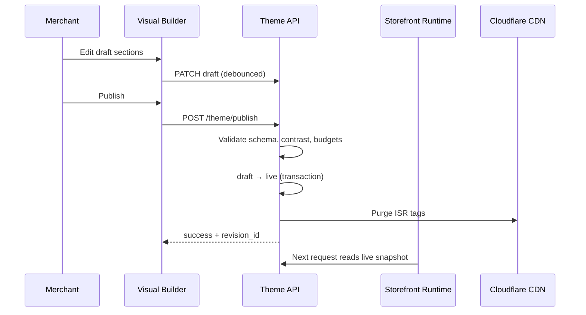

# Chapter 13: Storefront Runtime, Visual Builder & Theme Engine

**Document ID:** SCP-THE-006-13  
**Version:** 1.0.0  
**Status:** ✅ Active  
**Traceability:** ADR-017, ADR-003, NFR-001, NFR-006  

---

## Purpose

Operational specification for **three independent storefront systems** — deployment boundaries, contracts, publish flow, and failure isolation.

---

## 1. System Definitions

### 1.1 Storefront Runtime

**Repository:** `apps/storefront`  
**Audience:** Shoppers (public internet)  
**SLO:** 99.9% availability; LCP p75 ≤ 2.0s mobile Nigeria

| Responsibility | Not responsible |
|----------------|-----------------|
| Render templates via RSC + ISR | Merchant editing UI |
| Execute search, cart, checkout shell | Theme package authoring |
| Lazy-load AI, voice, visual search widgets | Business rule authoring |
| Apply personalization + ASI **active snapshot** | Direct PostgreSQL access |
| Enforce CSP, rate limits, bot protection | Publishing draft JSON |

**Tech:** Next.js App Router, edge middleware, Redis tenant cache, Storefront API client.

### 1.2 Visual Builder

**Repository:** `apps/admin` module `store-design`  
**Audience:** Merchant staff  
**SLO:** TTI ≤ 3s; preview update ≤ 1s on 4G

| Responsibility | Not responsible |
|----------------|-----------------|
| Section drag-and-drop, settings forms | Customer traffic serving |
| Live preview iframe + postMessage | Theme npm package build |
| Draft save, publish, rollback | Payment processing |
| Quality Coach + ASI proposal inbox | Runtime performance tuning |
| Theme switch portability report | |

**Tech:** SDS admin components, schema-driven forms, WebSocket preview sync.

### 1.3 Theme Engine

**Repository:** `packages/themes/*`, `packages/theme-sdk`, `packages/theme-types`  
**Audience:** Theme developers, platform built-in themes  
**SLO:** CI validation < 5 min per theme PR

| Responsibility | Not responsible |
|----------------|-----------------|
| Section/block React components + JSON schemas | Live merchant data |
| Theme SDK, CLI, manifest | Admin authentication |
| Theme Store listing metadata | Checkout logic |
| Portability mapping declarations | Analytics aggregation |
| Performance budget declarations per section | |

---

## 2. Contract: Theme Artifact

Published store state = **immutable snapshot**:

```json
{
  "theme_package": "lagos-atelier@2.1.0",
  "settings": { "primary_color": "#006644", "..." },
  "templates": {
    "index": { "sections": [...], "order": [...] },
    "product": { "..." }
  },
  "asi_snapshot_id": "asi_20260712_001",
  "published_at": "2026-07-12T10:00:00Z",
  "revision": 42
}
```

| Consumer | Reads |
|----------|-------|
| Storefront Runtime | `live` installation snapshot only |
| Visual Builder | `draft` + optional preview overlay |
| Theme Engine CI | Validates against registry + budgets |

---

## 3. Publish Pipeline



**Failure isolation:** Publish validation failure leaves live unchanged.

---

## 4. Preview Protocol

Preview URL uses signed JWT + `preview_session` — never shares live cache keys.

| Mode | Behavior |
|------|----------|
| Draft preview | Runtime reads draft installation |
| ASI proposal preview | Overlay `asi_proposal_id` on draft |
| Theme try-before-buy | Temporary draft installation |

---

## 5. Deployment Independence

| System | Deploy trigger | Can ship without others? |
|--------|----------------|--------------------------|
| Runtime | Storefront release train | Yes — reads backward-compatible snapshots |
| Visual Builder | Admin release train | Yes — if API contract version compatible |
| Theme package | Theme Store / built-in bump | Yes — merchants opt-in upgrade |

**API compatibility:** Storefront API date-versioned; theme `engines.storefrontApi` must match Runtime support matrix (Chapter 10).

---

## 6. Shared Packages (allowed coupling)

| Package | Used by |
|---------|---------|
| `@scp/design-tokens` | All three |
| `@scp/theme-types` | Theme Engine + Runtime |
| `@scp/commerce-ui` | Theme Engine + Runtime |
| `@scp/section-schemas` | Theme Engine + Visual Builder validation |

**Forbidden:** Importing `apps/admin/*` from `apps/storefront/*`.

---

## 7. Observability Split

| Metric | System |
|--------|--------|
| LCP, INP, CLS | Runtime RUM |
| Preview load time | Visual Builder |
| Theme CI budget failures | Theme Engine pipeline |
| Publish error rate | API Theme Service |
| ASI accept rate | AI + Builder analytics |

---

## 8. Security Split

| Control | Runtime | Builder | Theme Engine |
|---------|---------|---------|--------------|
| CSP strict | ✅ | N/A (admin CSP separate) | Declares script budget |
| Merchant HTML injection | Blocked | N/A | Sanitized settings only |
| SSRF from theme | N/A | N/A | Review + allowlist URLs |
| Auth | Shopper session | Staff MFA | Developer OAuth |

---

## 9. Acceptance Criteria

- [ ] Runtime, Builder, and Theme Engine deploy on independent pipelines
- [ ] No admin/editor code in storefront production bundle (bundle analyzer gate)
- [ ] Publish is atomic; failed validation never touches live
- [ ] Preview uses signed sessions; cannot leak draft to anonymous users
- [ ] Theme package version pinned in live snapshot
- [ ] ASI snapshot ID optional field on publish artifact
- [ ] Cross-system integration tests: edit → publish → render ≤ 30s

---

## References

- [ADR-017](../00-meta/adr/017-three-system-storefront-architecture.md)
- [Chapter 05 — Theme Editor](./05-theme-editor-merchant-ux.md)
- [Chapter 04 — Rendering Pipeline](./04-rendering-pipeline-rsc.md)
- [Volume 10 — CI/CD](../10-infrastructure/README.md)
