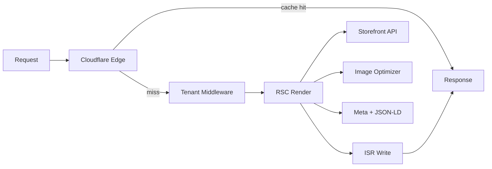

# Chapter 14: Storefront Performance Engine

**Document ID:** SCP-THE-006-14  
**Version:** 1.0.0  
**Status:** ✅ Active  
**Traceability:** NFR-001, NFR-009, NFR-011, ADR-017  

---

## Purpose

Specify the **automatic performance engine** — platform-owned optimizations invisible to shoppers but critical for conversion on Nigeria 3G/4G. Merchants do not configure Web Vitals; SCP enforces them.

---

## 1. Philosophy

> Speed is part of the design. A beautiful storefront that loads slowly is a failed storefront.

The Performance Experience layer (Chapter 12) runs **without merchant expertise**.

---

## 2. Automatic Optimizations

| Optimization | Trigger | Implementation |
|--------------|---------|----------------|
| Image format | Upload + request | AVIF/WebP via Cloudflare Images; JPEG fallback |
| Responsive sizes | Render | `srcset` from breakpoints; DPR-aware |
| Lazy load | Below fold | Native `loading="lazy"` + intersection for sections |
| LCP preload | PDP/home hero | `<link rel="preload">` first hero image |
| Font subset | Theme publish | Only weights used in theme; self-hosted |
| JS splitting | Build | Route + section-level dynamic import |
| CSS critical | SSR | Inline critical path; defer rest |
| Prefetch | Navigation intent | Cart, checkout, likely PLP on hover/viewport |
| ISR | Catalog pages | 60s default; webhook revalidate |
| CDN cache | Static + HTML | Cloudflare edge; tenant-scoped keys |
| Minify | Assets | Build pipeline |
| Structured data | PDP/collection | JSON-LD generated server-side |
| Meta/OG | All templates | From CMS + catalog; no client-only SEO |
| Bundle budget | Theme publish | Block if section exceeds declared KB |

---

## 3. Runtime Performance Pipeline

---

## 4. Merchant-Facing Visibility

Merchants see **outcomes**, not knobs:

| UI surface | Message |
|------------|---------|
| Theme editor Quality Coach | “Hero image 480 KB — compress to pass budget” |
| Store health dashboard | LCP p75, CLS, INP trend |
| Email alert | “Store slowed 7 days — review images” |
| Theme Store badge | Lighthouse score from review |

No raw “enable lazy load” toggle — always on.

---

## 5. Third-Party Script Policy

| Allowed | Blocked on storefront |
|---------|----------------------|
| Platform RUM (sampled) | Arbitrary merchant `<script>` |
| Consented analytics (Phase 2) | Heavy Instagram/TikTok embed SDKs |
| Paystack redirect (checkout) | Autoplay video with sound |

Social feeds use **server-cached tiles** (Volume 6 Ch. 11 `social-gallery`).

---

## 6. Core Web Vitals Targets

Same as Volume 4 Ch. 12 — enforced at Runtime deploy and theme publish.

| Metric | Mobile Nigeria p75 |
|--------|------------------|
| LCP | ≤ 2.0s |
| INP | ≤ 100ms |
| CLS | ≤ 0.05 |

Regression > 10% blocks theme publish or Runtime release (Volume 13).

---

## 7. Nigeria-Specific

| Technique | Benefit |
|-----------|---------|
| NGN price in HTML | Meaningful paint without JS |
| Self-hosted fonts | Avoid Google Fonts RTT |
| Edge in Lagos region | Lower TTFB (ADR-011) |
| WhatsApp share links | Zero SDK weight |
| Limit autoplay video | Save data plan |
| Section lazy hydration | AI/voice load after idle |

---

## 8. Acceptance Criteria

- [ ] Images auto-convert to WebP/AVIF with size caps
- [ ] PDP LCP candidate preloaded
- [ ] Storefront initial JS ≤ 100 KB gzip (enforced CI)
- [ ] JSON-LD Product on all PDPs
- [ ] No merchant third-party scripts on checkout
- [ ] RUM sampled 10% with merchant dashboard
- [ ] Theme publish blocked when budgets exceeded

---

## References

- [Volume 4 Ch. 12 — Performance Budgets](../04-design-system/12-performance-and-ux-budgets.md)
- [Chapter 08 — Assets & Performance](./08-assets-and-performance.md)
- [Volume 13 Ch. 06 — Performance Testing](../13-testing/06-performance-k6-lighthouse.md)
