# Chapter 01: CMS Overview

**Document ID:** SCP-CMS-001-01  
**Version:** 1.0.0  
**Status:** 📝 Draft  
**Traceability:** ADR-001, ADR-002, ADR-003, FR-CMS-001–012, NFR-001, NFR-040  

---

## Purpose

Define the role of CMS within SCP, its bounded contexts, module map, competitive rationale, and non-negotiable architectural rules so implementers do not invent a second page-builder stack beside the Theme Engine.

## Scope

- Platform positioning and hybrid architecture
- Bounded contexts (`Content`, `Learning`)
- Submodule map and ownership
- Personas and business value
- Architecture impact and integration contracts

## Out of Scope

Detailed entity schemas (Chapter 02), builder internals (Chapter 03), education curriculum (Chapter 09), API contracts (Chapter 10).

## User / Business Value

| Persona | Value |
|---------|-------|
| Solo merchant (Amina) | Launch About, FAQ, and promo landing pages without a developer |
| SME owner (James) | Coordinated campaign pages + blog SEO for organic traffic |
| Education merchant / Sapphital Academy | Sell courses with the same checkout as physical goods |
| Agency / theme developer | Extend section registry; never fork CMS layout format |
| Platform admin | Tenant-isolated content with audit trail |

**Primary market note:** Nigeria-first merchants often market via WhatsApp and Instagram. CMS landing pages must load fast on 3G/4G (NFR-001) and support mobile-first editors.

## Architecture Decision: Hybrid CMS

**Proposed ADR-012** → [ADR-012](../00-meta/adr/012-hybrid-cms-theme-sections-content-types.md) — Hybrid CMS (Theme sections + structured content types).

| Layer | Pattern | SCP implementation |
|-------|---------|-------------------|
| Storefront layout | Shopify OS 2.0 sections/blocks | Theme Engine JSON (ADR-003) |
| Structured content | Webflow collections / Contentful types | Tenant `ContentType` schemas |
| Rich text / blog | Notion-like blocks | BlockNote JSON (proposed ADR-013) |
| Headless delivery | Contentful / Sanity | Admin REST + Storefront GraphQL |
| Education commerce | Teachable / Thinkific | `Learning` on Catalog + Orders (proposed ADR-016) |

**Rejected alternatives:**

| Alternative | Why rejected |
|-------------|--------------|
| Pure headless CMS only | Too heavy for African SME merchants; slow time-to-first-page |
| Separate Webflow-style builder | Diverges from ADR-003; doubles maintenance |
| WordPress-in-a-box | Isolation, performance, and multi-tenant ops fail at SaaS scale |

**Design principle:** CMS feeds theme sections, structured entries, and learning products through a unified API. It does **not** execute arbitrary merchant HTML/JS.

## Bounded Contexts

```mermaid
graph TB
    subgraph Content["Content Module"]
        PAGES[Pages]
        BLOG[Blog]
        CT[Content Types]
        NAV[Navigation]
        MEDIA[Media Library]
        SEO[SEO Manager]
        LOC[Localization]
        PB[Page Builder]
        PUB[Publishing]
        VER[Versioning]
        REL[Releases]
    end

    subgraph Learning["Learning Module"]
        COURSE[Courses]
        LESSON[Lessons]
        ENROLL[Enrollments]
        PROG[Progress]
        CERT[Certifications]
        EVENT[Events]
        DRIP[Drip Schedule]
    end

    subgraph External["Integration Points"]
        THEME[Theme Engine Vol 6]
        CATALOG[Catalog Vol 5]
        ORDER[Orders Vol 5]
        SEARCH[Search]
        AI[AI Platform Vol 9]
    end

    PB --> THEME
    PAGES --> THEME
    BLOG --> SEARCH
    CT --> THEME
    SEO --> THEME
    COURSE --> CATALOG
    ENROLL --> ORDER
    PUB --> SEARCH
    AI --> SEO
```



### Domain Ownership

| Context | Owns | Does not own |
|---------|------|--------------|
| **Content** | Pages, posts, content types/entries, nav, media metadata, SEO profiles, releases | Theme packages, product pricing, payment capture |
| **Learning** | Curriculum graph, enrollments, progress, certificates, drip, events | Checkout, subscriptions billing engine, video CDN infra contracts (uses Media) |

Cross-context communication uses domain events and published interfaces only (FR-024).

## Submodule Map

| ID | Submodule | Purpose |
|----|-----------|---------|
| CMS-01 | Pages | Standard, landing, and system pages |
| CMS-02 | Blog | Multi-blog articles with BlockNote body |
| CMS-03 | Content Types | Merchant-defined structured schemas |
| CMS-04 | Page Builder | Visual composition via Theme section registry |
| CMS-05 | Navigation | Header/footer/mobile menus |
| CMS-06 | Media Library | Tenant assets + CDN variants |
| CMS-07 | SEO Manager | Metadata, JSON-LD, sitemaps, redirects |
| CMS-08 | Localization | Locales, fallbacks, hreflang |
| CMS-09 | Publishing | Draft → review → schedule → publish |
| CMS-10 | Versioning | Snapshots, diff, restore |
| LEARN-01–05 | Education | Courses, digital goods, events, certs, memberships |

## Architecture Impact

| Concern | Impact |
|---------|--------|
| Modular monolith (ADR-001) | `Modules/Content` and `Modules/Learning` packages; no separate CMS deployable in Phase 3 |
| Multi-tenancy (ADR-002) | Every content table has `tenant_id` + RLS |
| Theme Engine (ADR-003) | Page `layout_json` validates against theme section/block schema |
| Storefront | Next.js ISR revalidation on publish events |
| Edge (ADR-008) | Preview tokens, upload endpoints, oEmbed behind WAF rate limits |

### Rendering Flow

```text
Merchant edits (Admin React)
        ↓
Validated layout_json / body_blocks (Zod + section registry)
        ↓
PostgreSQL (RLS) + Media (R2)
        ↓
Publish → events → Search index + ISR revalidate
        ↓
Next.js Theme Runtime → SSR/ISR HTML (CDN)
```

## Data Ownership Summary

| Aggregate | Owner module |
|-----------|--------------|
| Page, Post, ContentEntry, Navigation, MediaAsset, ContentRelease, SeoProfile | Content |
| Course, Enrollment, Certificate | Learning |
| Product (type digital_course) | Catalog (Vol 5) with Learning extension |

## Business Capabilities

1. Compose and publish marketing and legal pages
2. Operate content marketing blogs with commerce embeds
3. Manage menus without theme code changes
4. Score and fix SEO before publish
5. Store and reuse media with alt text and variants
6. Schedule campaigns via single-entity or release bundles
7. Sell and deliver Sapphital courses with progress and certificates

## UI Surfaces

| Surface | Audience |
|---------|----------|
| Content Hub | Merchants |
| Page Builder | Merchants, agencies |
| Blog / Course editors | Content authors |
| SEO panel | All editors |
| Storefront pages / blog / course player | Customers |
| Platform CMS abuse tools | Platform admins |

## API Surfaces (Summary)

- Admin REST: CRUD, publish, schedule, media, releases, courses
- Storefront GraphQL: published pages, posts, nav, courses, enrollments
- Webhooks: `content.*.published`, `learning.*`

Full contracts in Chapter 10.

## Events (Summary)

`PagePublished`, `PostPublished`, `ContentReleasePublished`, `NavigationUpdated`, `MediaUploaded`, `EnrollmentCreated`, `CourseCompleted`, `CertificateIssued`.

## Background Jobs

- Scheduled publish / unpublish / revision swap
- Release atomic publish
- Sitemap regeneration
- Media variant generation
- Drip unlock notifications
- Certificate PDF generation

## Security Considerations

- Section registry allowlist — no arbitrary scripts in settings
- HTMLPurifier / BlockNote sanitization for rich text
- SSRF allowlist for oEmbed and remote media import
- Upload MIME/magic-byte validation and tenant-prefixed storage keys
- Preview tokens short-lived and scoped
- Zero cross-tenant content (NFR-040)

Details in Chapter 10 and Volume 11.

## Performance Targets

| Metric | Target |
|--------|--------|
| Storefront CMS page LCP (mobile p75) | ≤ 2.0s (NFR-001) |
| Admin builder TTI | ≤ 3.0s (NFR-006) |
| Publish → storefront visibility (ISR) | ≤ 60s p95 |
| Content API read p95 | ≤ 200ms (NFR-003) |

## Observability

- Publish success/failure counters per tenant
- ISR revalidation latency histogram
- Media upload failure rate
- Scheduled job lag (target ±60s)
- Audit events on publish, restore, release (ADR-009)

## Tenant Isolation Rules

1. Resolve tenant before any CMS query
2. Eloquent global scope + PostgreSQL RLS (`SET LOCAL app.tenant_id`)
3. Media object keys: `tenants/{tenant_id}/...`
4. Preview/search indexes namespaced by tenant
5. Isolation suite covers Page, Post, Media, Course, Enrollment

## Operational Implications

- Plan quotas: pages, storage GB, locales, custom content types
- Soft delete 30 days (FR-025)
- Nigeria residency for primary storage (ADR-011)

## Risks and Tradeoffs

| Risk | Mitigation |
|------|------------|
| Builder scope creep | Strict theme section registry; reuse ADR-003 |
| Education/commerce boundary blur | Catalog owns Product; Learning owns curriculum |
| SEO parity with WordPress plugins | Ship JSON-LD + checklist day one |
| Heavy landing pages | Lazy-load below-fold sections; theme JS budget |

## Acceptance Criteria

- [ ] Merchant creates a ≥3-section landing page without code in ≤10 minutes
- [ ] Published page appears on storefront ≤60s p95
- [ ] Page builder rejects unregistered section types
- [ ] All CMS aggregates pass tenant isolation suite
- [ ] Education course purchase uses standard checkout path

## Sources and References

- Shopify Sections & Blocks: https://help.shopify.com/en/manual/online-store/themes/theme-structure/sections-and-blocks
- Shopify Metaobjects webpages: https://help.shopify.com/en/manual/custom-data/metaobjects/webpages
- Webflow CMS: https://webflow.com/webflow-way/cms/collection-pages
- Sanity page building: https://www.sanity.io/docs/page-building
- Teachable vs Thinkific (education commerce patterns)

## Related ADRs

- [ADR-001](../00-meta/adr/001-modular-monolith-over-microservices.md)
- [ADR-002](../00-meta/adr/002-multi-tenancy-shared-db-rls.md)
- [ADR-003](../00-meta/adr/003-theme-engine-react-json-schema.md)
- Proposed ADR-012, ADR-016
