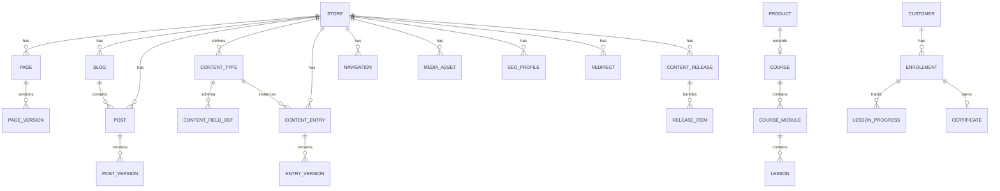
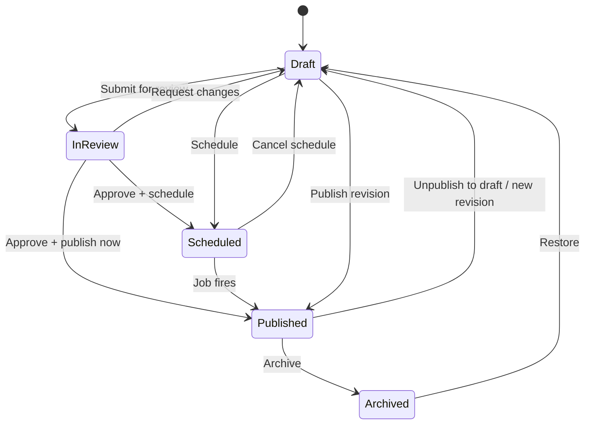

# Chapter 02: Content Model

**Document ID:** SCP-CMS-001-02  
**Version:** 1.0.0  
**Status:** 📝 Draft  
**Traceability:** FR-020, FR-021, FR-024, FR-025, FR-CMS-001–011, ADR-002, ADR-003  

---

## Purpose

Specify entities, aggregates, value objects, state machines, and business rules for SCP content so engineers implement one coherent schema across pages, blog, structured CMS, SEO, releases, and learning extensions.

## Scope

- ER model and aggregate boundaries
- Entity attribute schemas
- Publishing and localization rules
- Soft delete and retention

## Out of Scope

UI workflows (Chapter 05), SEO field UX (Chapter 06), media binary pipeline (Chapter 08), curriculum lesson types detail (Chapter 09).

## Domain Ownership

Content module owns all tables listed under Content aggregates. Learning owns course/enrollment aggregates. Catalog owns `products` rows referenced by courses.

## Entities and Value Objects

### Entity Relationship Overview



### Aggregate Roots

| Aggregate | Root | Consistency boundary |
|-----------|------|----------------------|
| Page | `Page` | Page + versions + linked SEO profile |
| Post | `Post` | Post + versions + tag associations |
| ContentEntry | `ContentEntry` | Entry + versions; schema by reference only |
| Navigation | `Navigation` | Menu + nested items |
| MediaAsset | `MediaAsset` | Asset metadata + variants + usage refs |
| ContentRelease | `ContentRelease` | Release + items |
| Course | `Course` | Course + modules + lessons |
| Enrollment | `Enrollment` | Enrollment + progress + certificate |

**Rule:** External modules reference aggregates by ID only.

### Value Objects

| Object | Attributes | Used in |
|--------|------------|---------|
| Slug | value, locale, uniqueness scope | pages, posts, entries |
| BlockDocument | blocks[], schema_version | blog/lesson body |
| SectionTree | sections[], settings | page builder |
| SeoMetadata | title, description, og, jsonld | routable entities |
| LocaleTag | BCP 47 code, fallback chain | localization |
| ReleaseToken | release_id, expires_at | preview URLs |
| Entitlement | resource_type, resource_id, expires_at | memberships |

## Entity Schemas

### `pages`

| Field | Type | Notes |
|-------|------|-------|
| id | uuid | PK |
| tenant_id | uuid | FR-020; RLS |
| store_id | uuid | |
| type | enum | `standard`, `landing`, `system` |
| title | string | |
| slug | slug | unique per `(store_id, locale)` |
| locale | string | BCP 47 |
| status | enum | see state machine |
| visibility | enum | `public`, `password`, `private` |
| password_hash | string\|null | Argon2id if password |
| template_id | string\|null | theme template key |
| layout_json | jsonb | ADR-003 SectionTree |
| body_blocks | jsonb\|null | BlockNote for simple pages |
| seo_profile_id | uuid | |
| published_at | timestamptz\|null | |
| scheduled_publish_at | timestamptz\|null | |
| scheduled_unpublish_at | timestamptz\|null | |
| author_id | uuid | |
| version_current | int | |
| created_at, updated_at, deleted_at | timestamptz | soft delete |

### `posts`

| Field | Type | Notes |
|-------|------|-------|
| id, tenant_id, store_id, blog_id | uuid | |
| title, slug, locale, excerpt | string | |
| body_blocks | jsonb | BlockNote canonical |
| body_html | text | rendered cache |
| featured_media_id | uuid\|null | |
| author_id | uuid | |
| tags | string[] | |
| category_ids | uuid[] | |
| reading_time_minutes | int | computed |
| seo_profile_id | uuid | |
| status, published_at, scheduled_publish_at | | |
| related_product_ids | uuid[] | catalog refs |
| related_course_ids | uuid[] | learning refs |

### `content_types` / `content_entries`

```yaml
content_types:
  id, tenant_id, store_id, name, slug, description
  fields: jsonb   # [{key, type, required, localized, validation}]
  template_keys: string[]
  url_prefix: string
  seo_title_pattern: string|null
  seo_description_pattern: string|null

content_entries:
  id, tenant_id, content_type_id, store_id, locale
  slug, status, data: jsonb
  published_at, version_current
```

**Field types:** text, richtext, number, boolean, date, enum, reference, media, json, location, money (integer cents + currency — FR-021).

### `seo_profiles`

| Field | Type |
|-------|------|
| entity_type | page \| post \| product \| course \| content_entry \| collection |
| entity_id | uuid |
| locale | string |
| meta_title, meta_description | string |
| canonical_url | string\|null |
| robots | string |
| og_title, og_description, og_image_id | |
| twitter_card | enum |
| structured_data_json | jsonb |
| focus_keyword | string\|null |
| seo_score | int\|null |

### `navigations`

```yaml
id, tenant_id, store_id, handle, name, locale
items: jsonb  # tree: [{id, type, label, target, children[]}]
# item types: page|blog|collection|product|course|url|dropdown|mega
```

### `redirects`

| Field | Notes |
|-------|-------|
| from_path | unique per store |
| to_path_or_url | internal path or absolute https URL |
| status_code | 301 default; 302 allowed |
| created_reason | `slug_change` \| `manual` \| `import` |

### `content_releases` / `release_items`

```yaml
content_releases:
  id, tenant_id, store_id, name, slug
  status: draft|scheduled|published|cancelled
  scheduled_at, preview_token_hash, published_at

release_items:
  id, release_id, entity_type, entity_id, version_id
  action: publish|update|unpublish
```

### Learning (summary — detail in Chapter 09)

```yaml
courses: id, product_id, store_id, level, duration_minutes, drip_enabled, drip_schedule, certificate_template_id, passing_score
lessons: id, course_module_id, position, type, title, content_blocks, video_media_id, is_preview_free, quiz_id
enrollments: id, customer_id, course_id, order_id, status, progress_percent, expires_at
certificates: id, enrollment_id, verification_code, pdf_url, issued_at
```

## Business Rules

1. Slug uniqueness is per `(store_id, locale, entity_type_scope)`.
2. `system` pages cannot be hard-deleted; only soft-archived with platform approval path.
3. Publishing requires SEO meta title when `robots` includes `index` (AC-CMS-005).
4. `layout_json` must validate against the active theme’s section/block Zod schemas before save.
5. Content entries must validate `data` against their `content_types.fields` definition.
6. Cross-module references store IDs only; never denormalize mutable product price into CMS.
7. Soft-deleted entities excluded from sitemaps and Storefront API within 30-day recovery window.
8. Locale publish independence: in **independent mode**, `en` may be published while `sw` remains draft.
9. Password-protected pages never appear in public sitemaps.
10. Money fields always use integer minor units + ISO 4217 currency.

## State Machines

### Content publishing



**Authorization:** Authors create/edit drafts; Editors submit review; Publishers publish/schedule/archive (RBAC).

### Scheduled revision

When a live page needs a future update:

1. Create draft revision from current published snapshot
2. Edit draft; set `scheduled_publish_at`
3. Live content remains unchanged until job runs
4. Job atomically sets published version pointer and emits `PagePublished`

## Localization Model (Proposed ADR-015)

| Mode | When | Behavior |
|------|------|----------|
| Field-level | Shared structure (nav labels, short fields) | Same document; per-locale field overrides |
| Document-level | Distinct body (blog, long pages) | Separate documents linked by `translation_group_id` |

**Fallback chain** (example Nigeria/Kenya): `sw-KE → en-KE → en`. Configurable per store.

**URL strategy:** Locale prefix for non-primary locales (`/en/about`, `/sw/kuhusu`). Primary locale may omit prefix when merchant setting `locale_prefix_primary = false`.

## Indexes and Performance

```text
UNIQUE (store_id, locale, slug) WHERE deleted_at IS NULL  -- pages, posts, entries
INDEX (tenant_id, store_id, status, published_at)
INDEX (tenant_id, scheduled_publish_at) WHERE status = 'scheduled'
GIN (layout_json) -- optional for admin search; not storefront critical path
```

## Permissions and Authorization

| Permission | Capability |
|------------|------------|
| `content.pages.read/write` | Page CRUD |
| `content.pages.publish` | Publish/schedule |
| `content.blog.write` | Posts |
| `content.types.manage` | Schema builder |
| `content.media.write` | Uploads |
| `content.seo.manage` | SEO overrides |
| `content.releases.manage` | Releases |
| `learning.courses.manage` | Curriculum |
| `learning.enrollments.read` | Admin enrollment list |

Deny-by-default policies; permission **and** tenant membership required.

## Tenant Isolation

- All tables include `tenant_id` with RLS `FORCE`
- Foreign keys never cross tenants
- Version snapshots store `tenant_id` denormalized for restore safety
- Isolation tests assert IDOR on UUID guessing across tenants

## Security Threat Model (Data Layer)

| Threat | Control |
|--------|---------|
| IDOR on page UUID | Policy + RLS |
| XSS in `body_html` | Sanitize on write; auto-escape on read paths that bypass cache |
| Oversized `layout_json` | Max section count and JSON byte limit per plan |
| Password page brute force | Rate limit + Turnstile after N failures |

## Caching Strategy

| Data | Cache |
|------|-------|
| Published page JSON | Redis + ISR (revalidate on publish) |
| Navigation | Redis key `nav:{tenant}:{store}:{handle}:{locale}` |
| `body_html` | Column cache invalidated on body change |
| Drafts | Never CDN-cached |

## Observability

- Entity version growth metrics (retention cleanup job)
- Validation failure rates on `layout_json`
- Orphan media (no usage refs) weekly report

## AI Opportunities

- Auto-generate excerpts and reading time
- Suggest content type schemas from merchant industry
- Detect missing locale translations

## Extension Points

- Custom field types via plugin SDK (Phase 3+, Vol 12) — must register serializers
- Theme templates bind to content type slugs

## Testing Strategy

- Unit: slug uniqueness, schema validation, state transitions
- Contract: Storefront GraphQL returns only published public content
- Isolation: cross-tenant matrix for every aggregate
- Property: money fields never float

## Failure Modes

| Failure | Behavior |
|---------|----------|
| Scheduled job delay | Retry; alert if lag > 5 min |
| Invalid layout after theme upgrade | Block publish; show migration UI |
| Partial release publish | Transaction rollback; release stays scheduled |

## Acceptance Criteria

- [ ] Creating two pages with same slug+locale rejected
- [ ] Soft-deleted page absent from Storefront API and sitemap
- [ ] Content entry rejects data that violates field schema
- [ ] Scheduled revision does not change live HTML until fire time
- [ ] Fallback locale returns content when preferred locale draft-only
- [ ] All content tables covered by RLS isolation tests

## Sources

- Contentful content modeling: https://www.contentful.com/developers/docs/concepts/data-model/
- Sanity schemas: https://www.sanity.io/docs/schema-types
- Shopify metaobjects: https://shopify.dev/docs/apps/build/custom-data/metaobjects

## Related ADRs

- ADR-002, ADR-003
- Proposed ADR-012, ADR-014, ADR-015, ADR-016
