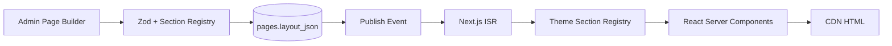

# Chapter 03: Page Builder Architecture

**Document ID:** SCP-CMS-001-03  
**Version:** 1.0.0  
**Status:** 📝 Draft  
**Traceability:** ADR-003, Proposed ADR-012, FR-CMS-001, FR-CMS-012, NFR-001, NFR-009  

---

## Purpose

Specify how the visual page builder composes storefront pages using the **same React section/block JSON schema** as the Theme Engine, ensuring one rendering pipeline for themes and CMS landing pages.

## Scope

- Builder ↔ Theme Engine contract
- Section tree validation and registries
- Preview, sandbox, and publish pipeline
- Reusable saved sections
- Dynamic data sources

## Out of Scope

Individual block catalog (Chapter 04), editor chrome UX (Chapter 05), theme package authoring (Volume 6).

## Architecture Alignment with ADR-003

ADR-003 defines:

```text
JSON Template → Section Registry → React Components → SSR/ISR → HTML
```

CMS pages store `layout_json` that **is** a theme template fragment (ordered sections with nested blocks and settings). Merchants do not write React; they compose registered sections.



## Modes of Composition

| Mode | Input | Output |
|------|-------|--------|
| **Section builder** | Landing / marketing pages | `layout_json` SectionTree |
| **Simple page** | Legal / FAQ text-first | `body_blocks` BlockNote (+ optional thin layout) |
| **Content type template** | Structured entries | Theme template key + entry fields as dynamic sources |
| **Blog body** | Posts | BlockNote only (Chapter 07) |

## SectionTree Schema

```json
{
  "schema_version": 1,
  "sections": [
    {
      "id": "sec_01",
      "type": "hero",
      "settings": {
        "heading": "Learn commerce the Sapphital way",
        "image": { "media_id": "uuid" },
        "cta_label": "Browse courses",
        "cta_link": { "type": "course_collection", "handle": "academy" }
      },
      "blocks": [
        {
          "id": "blk_01",
          "type": "button",
          "settings": { "style": "primary", "label": "Enroll" }
        }
      ]
    }
  ]
}
```

### Validation Rules

1. `type` must exist in the **active theme** section registry (or platform core sections).
2. Settings validated by section’s Zod schema; unknown keys stripped or rejected (strict mode).
3. Max sections per page: plan limit (Starter 20, Growth 50, Enterprise 100).
4. Max JSON payload: 512 KB uncompressed.
5. No `script`, `html_raw`, or arbitrary `iframe` settings except allowlisted embed blocks (Chapter 04 / 10).
6. Media references must resolve to same-tenant `media_assets`.

## Section Registry

```text
Platform Core Sections  → always available
Active Theme Sections   → from installed theme package
App Blocks (plugins)    → Phase 3+ via Plugin SDK (Vol 12)
Saved Section Presets   → merchant library (JSON clones)
```

**Decoupling rule:** Core never imports a merchant theme package at compile time. Runtime loads the store’s active theme registry.

## Preview Architecture

| Preview type | Mechanism |
|--------------|-----------|
| Editor live preview | Authenticated iframe; `postMessage` for selection/highlight |
| Shareable preview | Signed token URL, TTL ≤ 72h, role-gated |
| Release timeline preview | Token encodes `release_id` + optional datetime (proposed ADR-014) |
| Device breakpoints | 375 / 768 / 1280 CSS viewports in iframe |

Preview routes **must not** be cached on CDN. Tokens bind to `tenant_id` + `store_id` + resource.

## Publish Pipeline

1. Publisher clicks Publish (or schedule job fires)
2. Re-validate SectionTree against **current** theme registry
3. Persist published version snapshot
4. Emit `PagePublished`
5. Subscribers: Meilisearch upsert, ISR `revalidateTag/path`, webhook fan-out, sitemap dirty flag

**Theme upgrade safety:** If a section type disappears after theme switch, page enters `needs_migration` and publish is blocked until merchant remaps or removes sections.

## Reusable Saved Sections (FR-CMS-012)

| Concept | Behavior |
|---------|----------|
| Save to library | Snapshot section JSON into `saved_sections` |
| Insert | Deep-copy into page (default) |
| Linked instance | Optional: store `saved_section_id`; “Push updates” propagates to linked pages |
| Scope | Store-level library; never cross-tenant |

**Tradeoff:** Linked updates can surprise merchants — require confirmation dialog listing affected pages.

## Dynamic Data Sources

Inspired by Shopify dynamic sources. Block settings may bind to:

| Source | Example |
|--------|---------|
| Product | `product.title`, `product.price` |
| Collection | `collection.products` |
| Content entry | `entry.fields.quote` |
| Course | `course.title`, `course.lesson_count` |
| Store settings | `shop.name` |

Bindings resolve at **render time** via Storefront API — never denormalize live prices into `layout_json`.

## Performance Requirements

| Requirement | Target |
|-------------|--------|
| Theme JS budget (ADR-003) | ≤ 100 KB gzipped |
| Below-fold sections | Lazy hydrate / lazy load |
| Builder preview first paint | ≤ 3s on broadband |
| Storefront LCP | ≤ 2.0s mobile p75 |

## Security Considerations

- Settings are data, not code — React components render safely
- CSP from Volume 11 applies to storefront; builder admin uses nonce scripts
- Preview tokens: single-use optional for high-sensitivity system pages
- App Blocks sandboxed like themes (no direct DB)

## Tenant Isolation

Registry resolution is store-scoped; saved sections query always includes `tenant_id`. Isolation tests include “insert saved section from tenant B” → denied.

## Observability

- Validation failure counter by section type
- Theme migration blocked pages gauge
- Preview token issuance / redeem rates

## AI Opportunities

- Suggest section order for industry templates (fashion, electronics, academy)
- Generate hero copy from product catalog

## Testing Strategy

- Schema fuzz tests against Zod registries
- Visual regression of core sections (Chromatic or equivalent)
- Publish blocks when section type missing
- ISR revalidation integration test

## Failure Modes

| Failure | Handling |
|---------|----------|
| Theme registry unload | Fail closed — show error, keep last good published HTML |
| Preview iframe crash | Reload with error toast; autosave draft |
| Oversized layout | Reject save with actionable message |

## Acceptance Criteria

- [ ] Landing page with ≥3 registered sections saves and publishes
- [ ] Unregistered section type rejected on save and publish
- [ ] Preview iframe matches published HTML for same `layout_json` (modulo draft watermark)
- [ ] Saved section inserts onto three pages successfully
- [ ] Theme switch with missing section blocks publish with migration prompt
- [ ] Dynamic product price reflects catalog at render time, not stale JSON

## Sources

- Shopify Online Store 2.0 sections/blocks
- ADR-003 Theme Engine
- Next.js App Router ISR documentation

## Related ADRs

- [ADR-003](../00-meta/adr/003-theme-engine-react-json-schema.md)
- Proposed ADR-012, ADR-014
