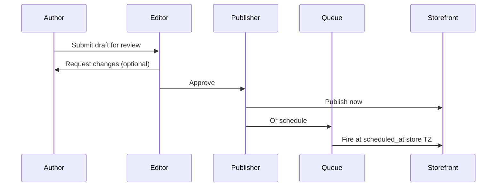

# Chapter 05: Editor UX & Workflows

**Document ID:** SCP-CMS-001-05  
**Version:** 1.0.0  
**Status:** 📝 Draft  
**Traceability:** FR-CMS-006–008, FR-CMS-011, Proposed ADR-014, NFR-006, WCAG 2.2 AA  

---

## Purpose

Specify merchant-facing editor surfaces, publishing workflows, versioning UX, content releases (Timeline), autosave behavior, and accessibility so Content Hub experiences match SCP UX principles (clarity, speed, mobile-ready admin).

## Scope

- Content Hub IA
- Page builder, blog, course, navigation editor layouts
- Draft → review → schedule → publish journeys
- Releases and preview tokens
- Version history and restore
- Collaboration readiness (Phase 4)

## Out of Scope

SDS component tokens (Volume 4), full AI agent chat UX (Volume 9).

## User Personas

| Persona | Primary workflows |
|---------|-------------------|
| Fatima-style content lead | Blog + landing campaigns |
| Amina solo merchant | Quick About + promo page |
| Academy instructor | Course outline + lessons |
| Agency builder | Multi-page releases + saved sections |

## Admin Surfaces

| Surface | Editor type |
|---------|-------------|
| Content Hub | Dashboard: pages, blog, media, SEO health, releases |
| Page Builder | Split-pane section tree + live preview |
| Blog Editor | BlockNote + metadata sidebar |
| Content Type Manager | Schema field builder |
| Navigation Editor | Tree drag-drop + link picker |
| Course Builder | Outline + lesson panels |
| SEO Panel | Unified tab on every routable entity |

## Page Builder Layout

```text
┌─────────────────────────────────────────────────────────┐
│ Toolbar: Save · Preview · Schedule · Publish · Device   │
├──────────────┬──────────────────────────────────────────┤
│ Section Tree │ Live Preview (storefront iframe)         │
│ Block list   │                                          │
│ Add Section  │                                          │
│ Saved Library│                                          │
├──────────────┴──────────────────────────────────────────┤
│ Settings: Section | Block | SEO | Locale | Schedule     │
└─────────────────────────────────────────────────────────┘
```

### Interactions

- Drag sections/blocks to reorder
- Slash `/` in text contexts (BlockNote)
- Locale switcher with override indicators
- Autosave every 30s + on blur; “Saved” / “Saving…” / “Offline — retry”
- Undo/redo stack for builder operations (min 50 steps in-session)

## Blog Editor UX

- Title, slug, featured image above canvas
- Slash menu for P0 blocks (Chapter 04)
- Sidebar: status, tags, categories, SEO, schedule, related products/courses
- Inline AI actions (Vol 9): improve tone, expand, generate excerpt — optional, never blocking

## Course Builder UX

- Outline tree: modules → lessons; bulk reorder
- Lesson type panels: video, text, quiz, assignment, live
- Drip timeline (days after enrollment)
- “Preview as student” with simulated enrollment date
- Analytics strip: enrollments, completion rate (read models)

## Publishing Workflow



### Business Rules (UX-enforced)

1. Publish disabled until validation passes (schema + required SEO if indexable)
2. Store timezone displayed explicitly next to schedule controls (Nigeria WAT / Kenya EAT common)
3. Password visibility prompts for password set/confirm
4. Unpublish requires confirm; system pages warn stronger

## Content Releases (Proposed ADR-014)

Inspired by Contentful Timeline:

1. Create release (“Ramadan Sale 2027”, “Academy Launch”)
2. Attach pages/posts/entries + target versions
3. Share preview URL with token
4. Schedule atomic publish
5. On failure: all-or-nothing rollback; notify publisher

**UI:** Release board with items checklist, conflict detection (same entity in two open releases).

## Version History

- Timeline of snapshots (debounced saves + explicit “Named version”)
- Block/section-level diff (added / removed / changed)
- Restore → creates **new draft** from snapshot; never silently overwrites live
- Retention: 90 days default; Enterprise configurable

## Localization UX

- Per-field override dots in field-level mode
- Translation group switcher in document-level mode
- “Mark translation ready” before locale publish
- Warn when publishing primary while secondary empty (optional gate)

## Empty / Loading / Error States

| State | Behavior |
|-------|----------|
| Empty Content Hub | Templates: About, FAQ, Landing, Course landing |
| Loading preview | Skeleton matching layout |
| Offline autosave fail | Banner + local IndexedDB draft backup |
| Validation errors | Inline on settings + summary toast |

## Accessibility

- Full keyboard operation for tree and canvas focus mode
- Screen reader labels on drag handles
- Focus trap in publish confirmation dialogs
- Prefer reduced motion: disable preview parallax
- Target SUS ≥ 80 for “Create landing page” task in usability tests

## Performance Targets

| Metric | Target |
|--------|--------|
| Content Hub TTI | ≤ 3.0s |
| Autosave p95 | ≤ 500ms API |
| Preview refresh after setting change | ≤ 300ms perceived (optimistic) |

## Permissions Mapping

| Role | Can |
|------|-----|
| Author | Create/edit own drafts |
| Editor | Edit all drafts, submit/approve review (configurable) |
| Publisher | Publish, schedule, releases |
| Owner | All + content type schema |

## Observability

- Funnel: draft created → published
- Time-to-publish median
- Autosave conflict rate
- Release publish success rate

## AI Opportunities

- Template recommendation at empty state
- Internal link suggestions while writing
- SEO checklist auto-fixes (copy variants)

## Testing Strategy

- Playwright journeys: create page, schedule, restore version, publish release
- Accessibility: axe + keyboard-only script
- Chaos: kill network mid-autosave → recover

## Failure Modes

| Failure | UX |
|---------|-----|
| Concurrent edit (Phase 3) | Last-write-wins with banner showing other user |
| Concurrent edit (Phase 4) | Yjs CRDT presence |
| Schedule in past | Reject with message |
| Release conflict | Block schedule until resolved |

## Acceptance Criteria

- [ ] Autosave recovers content after browser crash
- [ ] Non-publisher cannot publish (API + UI)
- [ ] Scheduled publish fires within ±60s of target (store TZ)
- [ ] Version restore leaves live page unchanged until new publish
- [ ] Release preview token renders future bundle state
- [ ] WCAG 2.2 AA critical issues = 0 on builder chrome

## Sources

- Contentful Timeline: https://www.contentful.com/blog/introducing-timeline/
- Shopify theme editor interaction patterns (E3)
- BlockNote collaboration notes

## Related ADRs

- Proposed ADR-013, ADR-014, ADR-015
