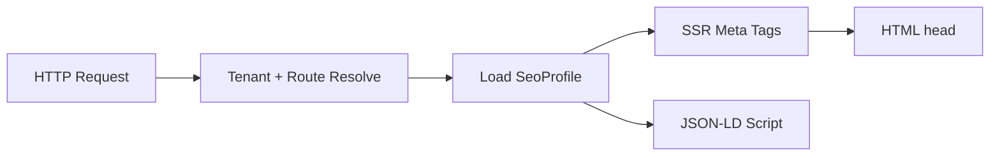

# Chapter 06: SEO & Metadata

**Document ID:** SCP-CMS-001-06  
**Version:** 1.0.0  
**Status:** ✅ Active  
**Traceability:** FR-CMS-004, FR-CMS-005, Proposed ADR-015, NFR-001, NFR-055

---

## Purpose

Define **SEO metadata model**, rendering rules, sitemaps, redirects, and Nigeria-relevant search optimization for all routable CMS and commerce entities.

## Scope

- `SeoProfile` entity and field schema
- Meta tags, Open Graph, Twitter cards, JSON-LD
- Canonical URLs and hreflang (hybrid localization)
- XML sitemap generation
- Redirect management
- Robots and noindex rules
- SEO health checks in Content Hub

## Out of Scope

- Paid ads / SEM campaigns
- Google Search Console account setup (merchant responsibility)
- Product feed ads (Volume 5)

---

## 1. SeoProfile Model

Every routable entity links to one `SeoProfile`:

| Field | Type | Required | Default |
|-------|------|----------|---------|
| `title` | string (60 char warn) | Yes | Entity title |
| `description` | string (160 char warn) | Recommended | Auto-truncate excerpt |
| `slug` | slug | Yes | Derived from title |
| `canonical_url` | URL | No | Self URL |
| `robots` | enum | Yes | `index,follow` |
| `og_image_id` | media ref | Recommended | Featured image |
| `og_type` | enum | Yes | `website`, `article`, `product` |
| `twitter_card` | enum | Yes | `summary_large_image` |
| `structured_data` | JSON-LD (server-generated) | Auto | See §3 |
| `locale` | BCP-47 | Yes | `en-NG` default |
| `hreflang_alternates` | array | If localized | Proposed ADR-015 |

**Ownership:** Content module owns `seo_profiles` table.

---

## 2. Rendering Rules (Storefront)



| Tag | Source | Notes |
|-----|--------|-------|
| `<title>` | `seo.title` + store name suffix | Max 60 chars displayed warn |
| `<meta name="description">` | `seo.description` | |
| `<link rel="canonical">` | `canonical_url` or computed | Prevents duplicate PLP filters |
| `<meta property="og:*">` | SeoProfile + media CDN URL | Absolute URLs only |
| `<meta name="twitter:*">` | Mirror OG | |
| `<link rel="alternate" hreflang="x">` | Localization map | `en-NG`, `en-KE` Phase 2 |
| JSON-LD | Server template | No user-authored JSON-LD |

Preview and draft pages: `robots: noindex,nofollow` always.

---

## 3. Structured Data (JSON-LD)

Server-generated only — merchants cannot inject raw schema.

| Entity | Schema.org Type | Key Fields |
|--------|-----------------|------------|
| Store homepage | `Organization` | name, url, logo, `areaServed: NG` |
| Product (commerce) | `Product` | name, sku, offers (NGN), availability |
| Blog post | `Article` | headline, author, datePublished |
| Course | `Course` | name, provider, offers |
| Breadcrumb | `BreadcrumbList` | Auto from nav |
| FAQ page | `FAQPage` | From FAQ section block |

**Nigeria:** `priceCurrency: "NGN"` on all Offer objects; `availability` reflects real inventory.

---

## 4. XML Sitemap

| Sitemap | URL | Contents |
|---------|-----|----------|
| Index | `/sitemap.xml` | References sub-sitemaps |
| Pages | `/sitemap-pages.xml` | Published pages |
| Blog | `/sitemap-posts.xml` | Published posts |
| Products | `/sitemap-products.xml` | Active products (Commerce API) |
| Collections | `/sitemap-collections.xml` | Active collections |

```xml
<!-- Example entry -->
<url>
  <loc>https://merchant.sapphital.shop/blog/lagos-fashion-trends</loc>
  <lastmod>2026-07-01T10:00:00+01:00</lastmod>
  <changefreq>weekly</changefreq>
  <priority>0.7</priority>
</url>
```

- Regenerated on `ContentPublished`, `ProductUpdated` events
- Cached at CDN; max 50,000 URLs per file (split if exceeded)
- Submitted via Search Console by merchant; platform provides URL

---

## 5. Redirects

| Type | Use Case | Status Code |
|------|----------|-------------|
| Permanent | Slug change, domain migration | 301 |
| Temporary | Campaign alias | 302 |
| Vanity | `/sale` → collection | 302 |

**Rules:**

- Max chain length: 1 (A→B only; no A→B→C)
- Loop detection on save
- Wildcard redirects: Phase 2 only; regex limited to platform patterns
- Import CSV for agency migrations

---

## 6. Localization (Proposed ADR-015)

| Mode | Applies To |
|------|------------|
| Field-level | `seo.title`, `seo.description`, slug per locale |
| Document-level | BlockNote body per locale |
| Fallback | `en-NG` → `en` → store default |

`hreflang` alternates auto-generated when ≥ 2 locales published.

---

## 7. SEO Health Panel (Content Hub)

| Check | Severity | Message |
|-------|----------|---------|
| Missing meta description | Warning | Add description for search snippets |
| Title > 60 chars | Warning | May truncate in Google |
| Duplicate slug | Error | Block publish |
| Broken canonical (off-domain) | Error | Must match store domain |
| Missing OG image | Warning | Social shares lack image |
| Orphan page (no nav link) | Info | Consider adding to menu |
| LCP risk (hero > 200 KB) | Warning | Compress image |

Health score 0–100 displayed on Content Hub dashboard.

---

## 8. Nigeria SEO Considerations

| Factor | SCP Response |
|--------|--------------|
| Mobile-first indexing | SSR content; no critical SEO in client-only JS |
| Local intent | Support city landing pages (Lagos, Abuja, PH) |
| Naira pricing in snippets | JSON-LD Offer with NGN |
| WhatsApp sharing | OG tags optimized for link previews |
| Slow networks | Lightweight meta; no extra SEO script tags |

---

## 9. APIs

| Endpoint | Method | Purpose |
|----------|--------|---------|
| `/admin/v1/seo-profiles/{entity}` | GET/PATCH | CRUD |
| `/admin/v1/redirects` | CRUD | Redirect management |
| `/storefront/v1/sitemap.xml` | GET | Public sitemap |
| `/admin/v1/seo/health` | GET | Aggregate health report |

All tenant-scoped; RLS enforced.

---

## 10. Events

| Event | Consumers |
|-------|-----------|
| `SeoProfileUpdated` | Cache purge, sitemap regen job |
| `RedirectCreated` | Edge cache rule sync (Phase 2) |
| `ContentPublished` | Sitemap, search index |

---

## 11. Acceptance Criteria

- [ ] SeoProfile schema with title, description, slug, robots, OG fields
- [ ] JSON-LD server-generated for Product, Article, Course, Organization
- [ ] Sitemap index + sub-sitemaps with 50k URL split rule
- [ ] Redirect loop and chain validation
- [ ] Draft/preview always `noindex`
- [ ] hreflang support documented for Proposed ADR-015
- [ ] SEO health panel checks listed with severity levels
- [ ] NGN currency in structured data Offer objects

---

## References

- [Chapter 02 — Content Model](./02-content-model.md)
- [Chapter 05 — Editor UX](./05-editor-ux-workflows.md)
- [Volume 5 — Catalog](../05-commerce-engine/01-catalog-and-products.md)
- [Volume 4 Ch. 12 — Performance Budgets](../04-design-system/12-performance-and-ux-budgets.md)
