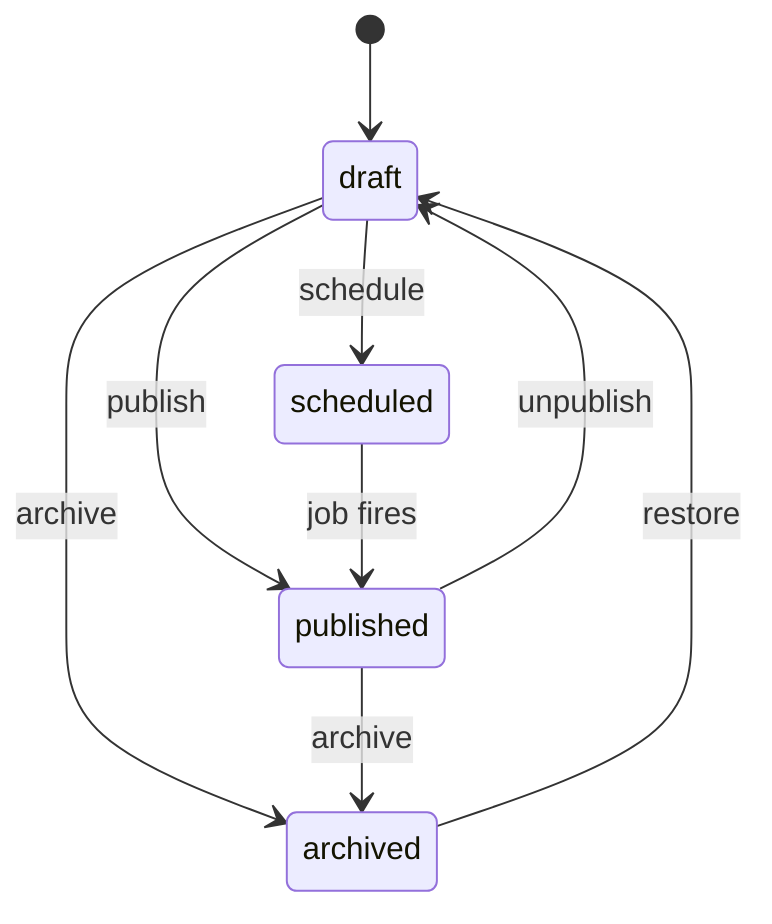
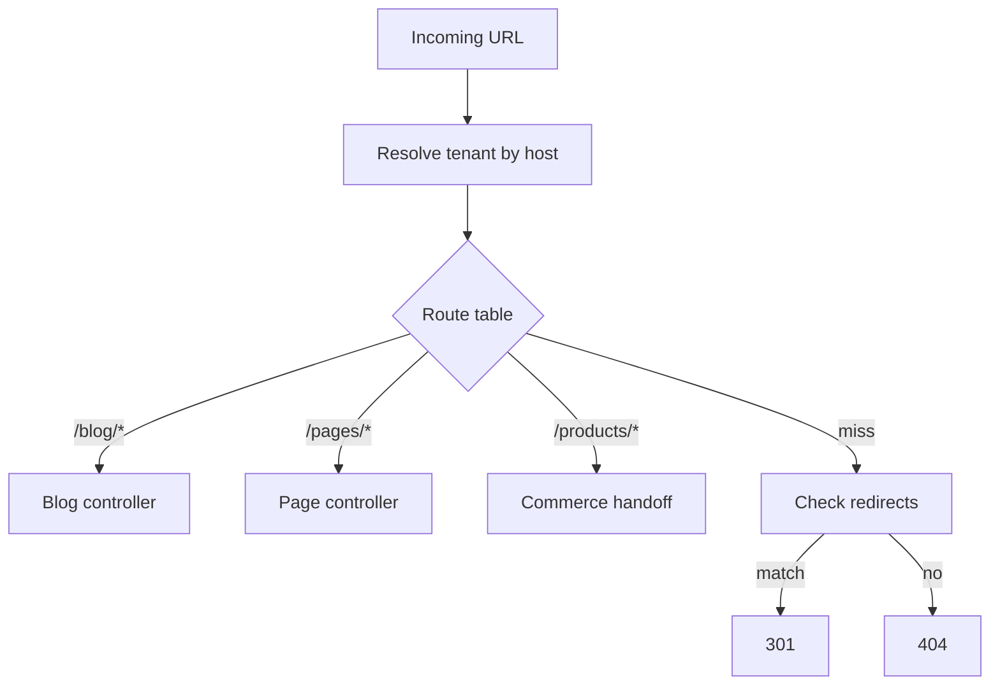

# Chapter 07: Blog & Navigation

**Document ID:** SCP-CMS-001-07  
**Version:** 1.0.0  
**Status:** ✅ Active  
**Traceability:** FR-CMS-002, FR-CMS-003, Proposed ADR-013, NFR-040

---

## Purpose

Specify the **blog engine**, **navigation system**, and **URL routing** for content-driven traffic — critical for Nigerian merchants acquiring customers via organic search and social link-in-bio flows.

## Scope

- Blog and post model
- BlockNote rich-text pipeline
- Categories, tags, authors
- RSS/Atom feeds
- Navigation menus and link types
- URL routing and conflicts
- Storefront rendering integration

## Out of Scope

- Comment systems (Phase 3 — moderation heavy)
- Newsletter/email campaigns (Volume 15)
- Full forum/community (roadmap)

---

## 1. Blog Model

| Entity | Key Fields |
|--------|------------|
| **Blog** | `id`, `tenant_id`, `handle` (default `news`), `title`, `seo_profile_id` |
| **Post** | `id`, `blog_id`, `title`, `slug`, `status`, `author_id`, `published_at`, `excerpt`, `featured_media_id` |
| **PostVersion** | `id`, `post_id`, `body_blocknote` (JSON), `body_html_cache`, `version`, `created_at` |
| **Category** | `id`, `name`, `slug`, `parent_id?` |
| **Tag** | `id`, `name`, `slug` |

### 1.1 Post State Machine

---

## 2. BlockNote Rich Text (ADR-013)

| Aspect | Rule |
|--------|------|
| Canonical storage | `body_blocknote` JSON |
| Render cache | `body_html_cache` generated on save |
| Allowed blocks | Paragraph, heading 2–4, bullet/ordered list, quote, code, image, embed, divider, callout |
| Embeds | Product card, course card, CTA button, YouTube/Vimeo oEmbed |
| Paste | Strip styles; plain text fallback |
| Images | Media library refs only |

**Security:** HTML cache produced by trusted server renderer — never merchant raw HTML.

---

## 3. Blog URLs

| Pattern | Example |
|---------|---------|
| Blog index | `/blog` or `/blogs/{handle}` |
| Post | `/blog/{slug}` |
| Category | `/blog/category/{slug}` |
| Tag | `/blog/tag/{slug}` |
| Author | `/blog/author/{slug}` |

Slug uniqueness enforced per tenant across pages, posts, and products.

---

## 4. RSS / Atom

| Feed | URL | Items |
|------|-----|-------|
| RSS 2.0 | `/blog/feed.xml` | Last 50 published posts |
| Atom | `/blog/feed.atom` | Same |

Includes `enclosure` for featured image; `content:encoded` from HTML cache.

---

## 5. Navigation Model

| Entity | Key Fields |
|--------|------------|
| **Navigation** | `id`, `tenant_id`, `handle` (`main-menu`, `footer`), `title` |
| **NavigationItem** | `id`, `navigation_id`, `parent_id`, `position`, `type`, `label`, `url?`, `resource_type?`, `resource_id?` |

### 5.1 Link Types

| Type | Resolves To |
|------|-------------|
| `page` | CMS page by ID |
| `collection` | Catalog collection |
| `product` | Product PDP |
| `blog` | Blog index |
| `custom_url` | External HTTPS URL |
| `email` | `mailto:` |
| `phone` | `tel:+234...` |
| `whatsapp` | `https://wa.me/234...` (Nigeria pattern) |
| `dropdown` | Parent only; children nested |

**Max depth:** 3 levels. Max items per menu: 100.

### 5.2 Navigation Editor UX

- Drag-drop tree with undo
- Link picker searches pages, collections, products
- "Open in new tab" flag for external URLs
- Mobile menu preview (hamburger)

---

## 6. Routing Resolution

Route precedence:

1. Exact redirect match
2. System routes (`/cart`, `/checkout`)
3. Commerce routes
4. CMS pages (custom slugs)
5. Blog routes
6. 404 page (merchant-customizable)

---

## 7. Storefront Rendering

Blog post template uses theme section `blog_post`:

- Featured image (LCP-optimized)
- Title, author, date, reading time
- BlockNote HTML body
- Related products (optional section setting)
- Share buttons (WhatsApp, X, copy link) — no heavy SDKs

Category/tag pages use `blog_list` section with pagination (12 posts/page).

---

## 8. Multi-Author Support

| Role | Capabilities |
|------|--------------|
| Author | Create/edit own drafts |
| Editor | Publish any post |
| Admin | Delete, manage categories |

Author profile: name, bio, avatar, social links, `author` slug for archive page.

---

## 9. APIs

| Endpoint | Purpose |
|----------|---------|
| `GET /storefront/v1/blog/posts` | List with filters |
| `GET /storefront/v1/blog/posts/{slug}` | Single post |
| `GET /storefront/v1/navigation/{handle}` | Resolved menu tree |
| `POST /admin/v1/blog/posts` | Create post |
| `POST /admin/v1/blog/posts/{id}/publish` | Publish |

---

## 10. Events

| Event | Consumers |
|-------|-----------|
| `PostPublished` | Sitemap, search index, optional webhook |
| `PostUnpublished` | Cache purge |
| `NavigationUpdated` | Storefront ISR purge |

---

## 11. Acceptance Criteria

- [ ] Post state machine: draft, scheduled, published, archived
- [ ] BlockNote canonical + HTML cache pipeline documented
- [ ] Navigation link types include WhatsApp for Nigeria
- [ ] Slug uniqueness across pages, posts, products
- [ ] RSS feed at `/blog/feed.xml`
- [ ] Route precedence and redirect fallback defined
- [ ] Menu max depth 3, max 100 items
- [ ] Related products embed in blog template

---

## References

- [Chapter 04 — Block Library](./04-block-library.md)
- [Chapter 06 — SEO](./06-seo-and-metadata.md)
- [Volume 6 — Theme Sections](../06-theme-engine/03-sections-blocks-app-blocks.md)
