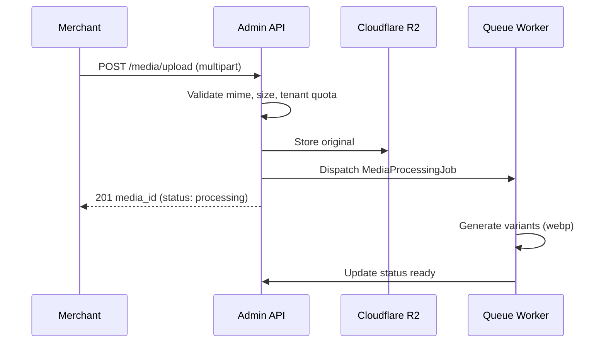

# Chapter 08: Media Library

**Document ID:** SCP-CMS-001-08  
**Version:** 1.0.0  
**Status:** ✅ Active  
**Traceability:** FR-CMS-007, ADR-008, NFR-040, NFR-058, NDPA NFR-083

---

## Purpose

Define the **tenant-scoped media library** — upload, storage, transformation, delivery, and usage tracking for images, documents, and video references across CMS, catalog, and themes.

## Scope

- MediaAsset entity and variants
- Upload pipeline and validation
- Cloudflare R2 storage layout
- Image optimization and responsive URLs
- Access control and signed URLs
- Usage references and orphan cleanup
- Nigeria bandwidth considerations

## Out of Scope

- Video transcoding (Phase 2 — Cloudflare Stream)
- DAM enterprise workflows (Phase 4)
- Product-only media rules detail (Volume 5 — cross-referenced)

---

## 1. MediaAsset Model

| Field | Type | Notes |
|-------|------|-------|
| `id` | UUID | |
| `tenant_id` | UUID | RLS |
| `filename` | string | Original name sanitized |
| `mime_type` | string | Allowlist validated |
| `byte_size` | int | |
| `width`, `height` | int? | Images/video posters |
| `alt_text` | string? | Required for storefront images (a11y) |
| `storage_key` | string | R2 path |
| `variants` | JSON | Generated sizes |
| `uploaded_by` | user_id | Audit |
| `status` | enum | `processing`, `ready`, `failed` |

---

## 2. Storage Layout (R2)

```text
r2://scp-media-prod/
  tenants/{tenant_id}/
    originals/{media_id}/{filename}
    variants/{media_id}/{width}x{height}.webp
    documents/{media_id}.pdf
```

**Rules:**

- No cross-tenant prefix access — IAM scoped per bucket policy + app validation
- Public URLs via Cloudflare CDN custom domain
- Private assets (course PDFs) use signed URLs only

---

## 3. Upload Pipeline



### 3.1 Validation Rules

| Check | Limit |
|-------|-------|
| Max file size (image) | 10 MB |
| Max file size (document) | 50 MB |
| Allowed images | JPEG, PNG, WebP, GIF, SVG (sanitized) |
| Allowed documents | PDF |
| Max dimensions | 8000×8000 px |
| SVG | Strip scripts; rasterize if suspicious |
| Quota per plan | Starter 5 GB, Growth 50 GB, Pro 500 GB |

### 3.2 Nigeria Upload UX

- Chunked uploads for flaky 4G (5 MB chunks)
- Resume token for interrupted uploads
- Client-side compression hint before upload on mobile

---

## 4. Image Variants

| Variant | Width | Format | Use |
|---------|-------|--------|-----|
| `thumb` | 150 | WebP | Admin grid |
| `small` | 400 | WebP | PLP cards |
| `medium` | 800 | WebP | PDP gallery |
| `large` | 1200 | WebP | Zoom/lightbox |
| `og` | 1200×630 | JPEG | Social |

Cloudflare Image Resizing or pre-generated variants stored in R2.

Responsive image helper:

```html

```

---

## 5. Access Control

| Asset Class | Public CDN | Signed URL |
|-------------|------------|------------|
| Storefront images | Yes | — |
| Theme assets | Yes | — |
| Course downloads | No | 72h expiry, download limit |
| KYC documents (vendor) | No | Admin-only; Volume 8 |

Signed URL generation: HMAC token with `tenant_id`, `media_id`, `expires_at`.

---

## 6. Usage Tracking

`media_references` table links media to entities:

| Referencer Type | Example |
|-----------------|---------|
| `page_section` | Hero image |
| `post` | Featured image |
| `product` | Gallery |
| `theme_settings` | Logo |

Orphan cleanup job (weekly): assets unreferenced for 30 days → notify merchant → delete after 60 days.

---

## 7. Admin Media Library UX

| Feature | Description |
|---------|-------------|
| Grid/list view | Filter by type, date, usage |
| Search | Filename, alt text |
| Bulk upload | Drag-drop up to 20 files |
| Alt text editor | Required before storefront publish gate |
| Folder tags | Virtual folders via tags (Phase 2) |
| Usage panel | "Used in 3 pages, 1 product" |

---

## 8. APIs

| Endpoint | Purpose |
|----------|---------|
| `POST /admin/v1/media/upload` | Upload |
| `GET /admin/v1/media` | List/filter |
| `PATCH /admin/v1/media/{id}` | Update alt text |
| `DELETE /admin/v1/media/{id}` | Soft delete if referenced → warn |
| `GET /storefront/v1/media/{id}` | Public metadata + URLs |

---

## 9. Events

| Event | Consumers |
|-------|-----------|
| `MediaUploaded` | Processing job |
| `MediaReady` | Notify uploader if async |
| `MediaDeleted` | CDN purge |

---

## 10. Security

| Threat | Control |
|--------|---------|
| Malware in upload | Mime sniff + ClamAV scan (Phase 2) |
| SVG XSS | Sanitize or reject |
| Cross-tenant URL guess | UUID media IDs; auth on admin |
| Hotlink abuse | CDN referrer policy optional |

---

## 11. Acceptance Criteria

- [ ] R2 path `tenants/{tenant_id}/` documented
- [ ] Upload validation: mime allowlist, size caps, plan quotas
- [ ] Image variants thumb through large documented
- [ ] Alt text required for storefront publish
- [ ] Signed URLs for private course documents
- [ ] Orphan cleanup policy 30/60 days
- [ ] Chunked upload for mobile Nigeria
- [ ] SVG sanitization rule stated

---

## References

- [ADR-008: Cloudflare R2](../00-meta/adr/008-edge-security-cloudflare.md)
- [Volume 10 Ch. 05 — Storage CDN](../10-infrastructure/05-storage-cdn-cloudflare.md)
- [Volume 4 Ch. 12 — Image Budgets](../04-design-system/12-performance-and-ux-budgets.md)
- [Volume 5 — Digital Products](../05-commerce-engine/14-digital-products-and-services.md)
