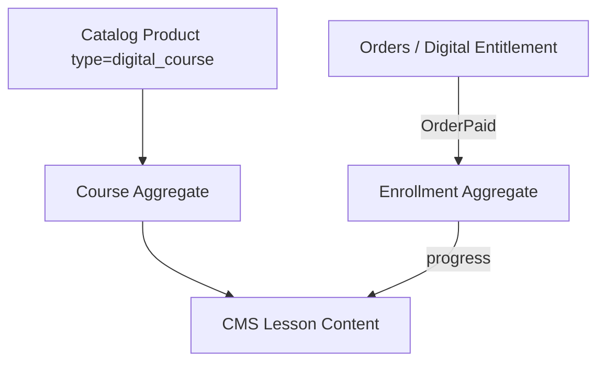
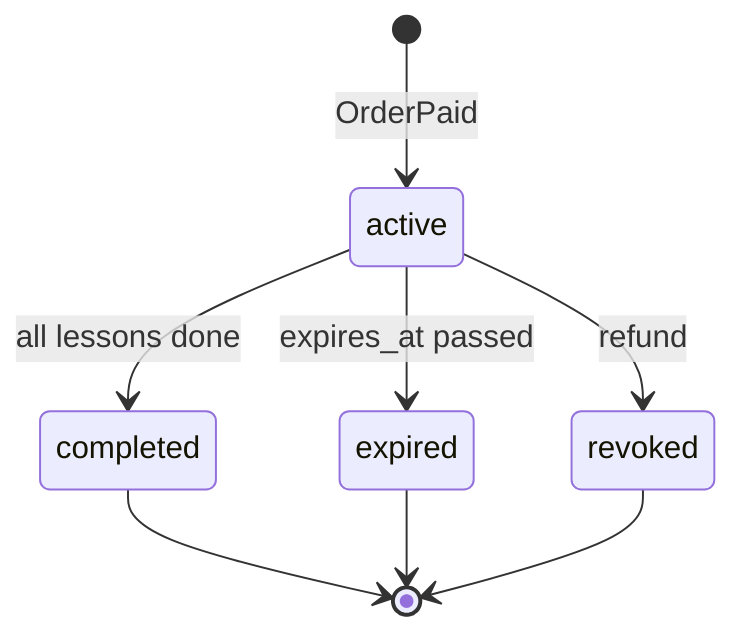

# Chapter 09: Education Commerce Pages

**Document ID:** SCP-CMS-001-09  
**Version:** 1.0.0  
**Status:** ✅ Active  
**Traceability:** FR-CMS-009, FR-CMS-010, Proposed ADR-016, PRD-012, NFR-083

---

## Purpose

Specify **education commerce** surfaces — courses, lessons, enrollments, progress, drip content, and certificates — as catalog extensions integrated with SCP checkout, CMS, and Sapphital Academy positioning.

## Scope

- Course as `Product.type = digital_course`
- Curriculum model (modules, lessons)
- Enrollment and progress tracking
- Drip scheduling and prerequisites
- Certificate generation
- Storefront course pages and lesson player
- Nigeria education market context

## Out of Scope

- SCORM packaging (Phase 4)
- Live video conferencing (integrate Zoom/Meet Phase 3)
- National accreditation compliance (merchant responsibility)
- Full LMS gradebook (enterprise roadmap)

---

## 1. Architecture Decision (ADR-016)

**Learning is a catalog extension**, not a separate product silo.

| Benefit | Detail |
|---------|--------|
| Unified checkout | Paystack flow identical to physical goods |
| Unified admin | One product list |
| Digital fulfillment | Reuses Volume 5 Ch. 14 entitlements |
| Academy brand | Sapphital differentiator in Nigeria edtech |

---

## 2. Course Model

| Entity | Key Fields |
|--------|------------|
| **Course** | `id`, `product_id`, `tenant_id`, `level`, `duration_hours`, `certificate_enabled` |
| **CourseModule** | `id`, `course_id`, `title`, `position`, `drip_days?` |
| **Lesson** | `id`, `module_id`, `title`, `slug`, `content_type`, `body_blocknote?`, `video_url?`, `duration_minutes`, `position` |
| **Enrollment** | `id`, `customer_id`, `course_id`, `order_item_id`, `status`, `enrolled_at`, `expires_at?` |
| **LessonProgress** | `enrollment_id`, `lesson_id`, `status`, `completed_at`, `time_spent_seconds` |
| **Certificate** | `id`, `enrollment_id`, `issued_at`, `pdf_media_id`, `verification_code` |

### 2.1 Lesson Content Types

| Type | Delivery |
|------|----------|
| `text` | BlockNote rendered HTML |
| `video` | Embedded YouTube/Vimeo or signed R2 stream |
| `quiz` | Multiple choice (Phase 2) |
| `download` | Signed PDF from media library |
| `assignment` | File upload (Phase 3) |

---

## 3. Enrollment State Machine

**Trigger:** `OrderPaid` event → create `Enrollment` + `DigitalEntitlement` (delivery_type: `course_access`).

---

## 4. Drip Content

| Mode | Behavior |
|------|----------|
| Immediate | All modules available on enroll |
| Module drip | `drip_days` after enrollment per module |
| Lesson drip | Days after previous lesson completed |
| Fixed date | Available on `available_at` (cohort courses) |

Locked lessons show title + unlock date — not hidden entirely (reduces support tickets).

---

## 5. Storefront Pages

| URL | Template |
|-----|----------|
| `/courses` | Course catalog (collection-style) |
| `/courses/{slug}` | Sales page: curriculum outline, instructor, price NGN |
| `/learn/{course_slug}` | Enrolled student dashboard |
| `/learn/{course_slug}/{lesson_slug}` | Lesson player |

### 5.1 Course Sales Page Sections

- Hero with outcome promise
- Curriculum accordion (modules/lessons)
- Instructor bio
- Social proof / testimonials
- FAQ
- CTA: Add to cart (same as product PDP)

### 5.2 Lesson Player

- Progress sidebar (desktop) / bottom sheet (mobile)
- Video + text split layout
- Mark complete button
- Next lesson navigation
- Offline: text lessons cached in PWA Phase 3

---

## 6. Certificates

| Attribute | Value |
|-----------|-------|
| Trigger | 100% lessons complete + optional quiz pass |
| Format | PDF generated server-side |
| Verification | `https://{store}/certificates/verify/{code}` |
| Branding | Merchant logo + Sapphital "Powered by" footer |
| Language | English Phase 1; French Phase 3 (West Africa) |

---

## 7. Nigeria Education Market

| Segment | SCP Fit |
|---------|---------|
| Professional upskilling (Lagos) | Short courses, mobile lessons, NGN pricing |
| Vocational skills | Video + downloadable guides |
| Creator educators | Low platform fee vs Teachable USD pricing |
| Institutions | Bulk enrollment codes Phase 3 |
| Cohort programs | Fixed-date drip, WhatsApp community links in lessons |

**Connectivity:** Text-first lessons with optional video; download for offline.

---

## 8. APIs

| Endpoint | Purpose |
|----------|---------|
| `GET /storefront/v1/courses` | Public catalog |
| `GET /storefront/v1/courses/{slug}` | Sales page data |
| `GET /storefront/v1/learn/enrollments` | Student's courses (auth) |
| `GET /storefront/v1/learn/lessons/{slug}` | Lesson content (auth + entitlement) |
| `POST /storefront/v1/learn/lessons/{id}/complete` | Mark progress |
| `POST /admin/v1/courses` | Create course product |

---

## 9. Events

| Event | Consumers |
|-------|-----------|
| `EnrollmentCreated` | Welcome email, analytics |
| `LessonCompleted` | Drip unlock job, progress webhooks |
| `CourseCompleted` | Certificate job, celebration email |
| `EnrollmentRevoked` | Access denial, audit |

---

## 10. Security

| Control | Detail |
|---------|-------|
| Lesson access | Enrollment + tenant + customer auth triple check |
| Video URLs | Signed; expire 4 hours |
| Certificate verify | Public read-only; no PII beyond name |
| Progress API | Rate limited 60/min |

---

## 11. Acceptance Criteria

- [ ] Course extends catalog `digital_course` product type
- [ ] Enrollment created on OrderPaid via digital entitlement
- [ ] Drip modes: immediate, module drip, lesson drip, fixed date
- [ ] Lesson player with progress tracking documented
- [ ] Certificate PDF with public verification URL
- [ ] Storefront URLs `/courses/*` and `/learn/*` defined
- [ ] Nigeria mobile-first: text-first, optional video
- [ ] Revoked enrollment blocks lesson access

---

## References

- [Volume 5 Ch. 14 — Digital Products](../05-commerce-engine/14-digital-products-and-services.md)
- [Chapter 02 — Content Model](./02-content-model.md)
- [Volume 15 Ch. 05 — Academy Integration](../15-future-roadmap/05-sapphital-academy-integration.md)
- [Proposed ADR-016](../00-meta/research-and-synthesis-program.md)
