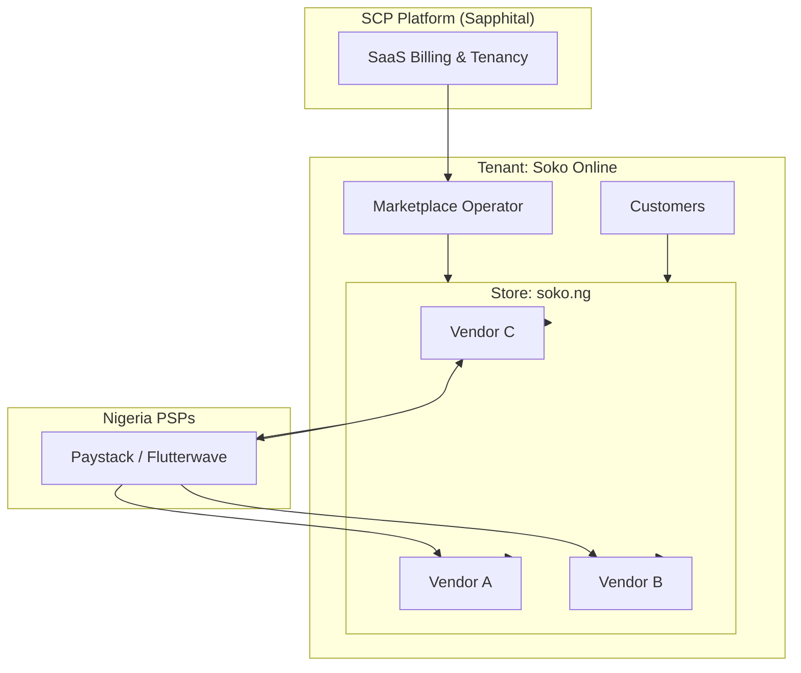

# Chapter 01: Marketplace Overview

**Document ID:** SCP-MKT-001-01  
**Version:** 1.0.0  
**Status:** ✅ Active  
**Traceability:** PRD-008, FR-006, FR-020, NFR-040, NFR-083  

---

## 1. Purpose

Define SCP's multi-vendor marketplace architecture: who participates, how money and data flow, and how the marketplace module integrates with the commerce core. This chapter is the entry point for engineers, product, and operators building Nigeria-first marketplace experiences.

## 2. Scope

- Marketplace operating models within SCP
- Actor roles and permissions
- High-level architecture and module boundaries
- Nigeria market positioning vs Jumia and local alternatives
- Phase 1 capability matrix

## 3. Out of Scope

- Detailed KYC field specs (Chapter 02)
- PSP API payloads (Chapter 05)
- Individual API endpoint schemas (Chapter 10)

## 4. User & Business Value

| Actor | Value |
|-------|-------|
| **Marketplace operator** (tenant) | Runs a branded multi-vendor store; earns commission on GMV; owns customer relationship |
| **Vendor** (seller) | Self-service listing, order fulfillment, transparent NGN payouts |
| **Customer** | Single checkout across vendors; unified trust signals |
| **Sapphital (platform)** | Marketplace plan revenue + optional platform commission on ecosystem GMV |

## 5. Marketplace Operating Models

SCP supports one primary model in Phase 1 with extension hooks for Phase 2.

### 5.1 Operator-Led Marketplace (Phase 1)

A **tenant** enables marketplace mode on a **store**. The tenant is the marketplace operator (e.g., Fatima's "Soko Online"). Vendors are invited sellers scoped to that store.



**Key rule:** Vendors belong to **one store** under **one tenant**. They are not platform-level tenants.

### 5.2 Vendor Micro-Storefront (Phase 2)

Each approved vendor receives a slug path (`soko.ng/vendors/amara-fashion`) or optional subdomain. Catalog and branding remain operator-governed; vendor manages their slice.

## 6. Actor Roles

| Role | Scope | Primary Surfaces |
|------|-------|------------------|
| `platform_admin` | Entire SCP | Platform admin (support, impersonation per ADR-010) |
| `merchant_owner` | Tenant | Operator dashboard, marketplace settings |
| `merchant_staff` | Tenant | Operator dashboard (scoped permissions) |
| `vendor_owner` | Single vendor record | Vendor portal |
| `vendor_staff` | Single vendor record | Vendor portal (fulfillment, catalog subset) |
| `customer` | Store | Storefront checkout |

A user may hold `vendor_owner` on Vendor A and `customer` on the same store — identities are linked but authorization contexts are separate.

## 7. Architecture Impact

### 7.1 Bounded Context

Marketplace is a domain module in the modular monolith:

```text
App\Domains\Marketplace\
├── Models\          Vendor, VendorProfile, VendorKyc, CommissionRule, Commission,
│                    Payout, PayoutLine, Dispute, VendorTrustScore, VendorStrike
├── Actions\         ApproveVendor, CalculateCommission, CreatePayoutBatch, ...
├── Events\          VendorApproved, CommissionAccrued, PayoutCompleted, ...
├── Policies\        VendorPolicy, PayoutPolicy, DisputePolicy
├── Services\        CommissionEngine, PayoutScheduler, TrustScoreCalculator
└── Integrations\    PaystackSubaccountClient, FlutterwaveSplitClient
```

### 7.2 Integration with Commerce Core

| Commerce Module | Marketplace Interaction |
|-----------------|-------------------------|
| **Catalog** | Products carry `vendor_id`; operator moderation queue |
| **Cart/Checkout** | Multi-vendor cart splits into vendor line groups at order creation |
| **Orders** | Parent order + vendor sub-orders (`order_vendor_splits`) |
| **Payments** | Single customer payment; PSP split to operator + vendor subaccounts |
| **Inventory** | Vendor-scoped stock; vendor fulfills their lines |
| **Customers** | Operator owns customer record; vendor sees fulfillment-minimum PII |
| **Shipping** | Per-vendor fulfillment; operator may offer unified delivery label |

### 7.3 Data Ownership

| Data | Owner | Vendor Access |
|------|-------|---------------|
| Customer account | Operator (tenant) | Fulfillment fields only (name, phone, address for their lines) |
| Order (parent) | Operator | Sub-order for their vendor_id only |
| Product listing | Vendor (within operator rules) | Full CRUD on own products |
| Commission ledger | Operator + platform audit | Own commission deductions visible |
| KYC documents | Operator + platform processor | Own documents only |
| Payout bank details | Vendor | Own records only; encrypted at rest |

## 8. Nigeria Market Context — Jumia Lessons

Evidence class **E3** (industry observation): Jumia's marketplace model shaped buyer expectations but created vendor friction documented across African e-commerce discourse.

| Pain Point | Jumia Pattern | SCP Design Response |
|------------|---------------|---------------------|
| High commission | Category fees often 10–20%+ with promotions | Operator sets transparent tiers; default template 5–12% |
| Payout delays | Weekly/bi-weekly settlement; dispute holds | Configurable T+1 to T+7; clear hold reasons in portal |
| No customer ownership | Platform email/SMS; retargeting by Jumia | Customer belongs to operator tenant; exportable per NDPA |
| Quality variance | Mixed seller standards | Trust score, strikes, listing moderation |
| Opaque chargebacks | Vendor learns late | Real-time dispute notifications; evidence upload SLA |

**SCP positioning:** Give operators **Jumia-class marketplace mechanics** without forcing vendors onto a centralized national marketplace. The operator owns the brand and customer relationship.

## 9. Business Capabilities (Phase 1)

| Capability | Description | Priority |
|------------|-------------|----------|
| Marketplace mode toggle | Enable multi-vendor on a store | P0 |
| Vendor invitation & application | Email invite or public apply form | P0 |
| KYC collection & review | Nigeria BVN/NIN/CAC verification workflow | P0 |
| Vendor portal | Dashboard, products, orders, payouts | P0 |
| Commission engine | Per-vendor, per-category, default rate | P0 |
| PSP split at checkout | Paystack Subaccount / Flutterwave Split | P0 |
| NGN payout batches | Scheduled settlement to vendor bank | P0 |
| Dispute workflow | Customer → operator → vendor escalation | P0 |
| Trust & strikes | Automated score from fulfillment metrics | P1 |
| Vendor analytics | Sales, conversion, payout history | P1 |
| Listing moderation | Operator approve/reject product publish | P0 |

## 10. Tenant Isolation Rules

1. Every marketplace entity includes `tenant_id` and `store_id`.
2. PostgreSQL RLS policies enforce `tenant_id = current_setting('app.tenant_id')`.
3. Vendor-scoped queries additionally filter `vendor_id = current_setting('app.vendor_id')` when context is vendor portal.
4. Cross-vendor reads within a tenant are **denied** at API and RLS layers except for operator roles.
5. Platform admin access requires impersonation audit trail (ADR-010).

## 11. Performance Targets

| Operation | Target (p95) | Reference |
|-----------|--------------|-----------|
| Vendor portal dashboard load | ≤ 2.5s TTI | NFR-006 |
| Commission calculation on order paid | ≤ 500ms | NFR-004 |
| Payout batch generation (500 vendors) | ≤ 30s job | NFR-008 |
| Marketplace product search | ≤ 200ms | NFR-003 |

## 12. Observability

| Metric | Type | Alert Threshold |
|--------|------|-----------------|
| `marketplace.gmv.ngn` | Counter | — |
| `marketplace.payout.failed` | Counter | > 0 in 1h |
| `marketplace.kyc.pending` | Gauge | > 100 per tenant |
| `marketplace.dispute.open` | Gauge | Operator-configurable |
| `marketplace.cross_vendor_access_blocked` | Counter | > 0 (security incident) |

Structured logs include `tenant_id`, `store_id`, `vendor_id`, `order_id`, `payout_id`.

## 13. Risks & Tradeoffs

| Risk | Mitigation |
|------|------------|
| PSP split API differences | Abstraction layer; primary Paystack, secondary Flutterwave |
| Vendor fraud (fake KYC) | Manual review + Phase 2 API verification partners |
| Multi-vendor cart complexity | Parent order + immutable vendor splits at placement |
| NDPA cross-vendor leak | RLS + vendor context middleware + isolation test suite |

## 14. Acceptance Criteria (Chapter)

1. Marketplace mode can be enabled per store without affecting single-vendor stores on same tenant.
2. Module boundary documented; no direct cross-module model mutation.
3. Actor roles map to authorization policies with test matrix.
4. Nigeria positioning and Jumia differentiation documented for product marketing review.

## 15. Sources

- SCP Volume 1: Personas (Fatima), Competitive positioning (Jumia)
- Paystack Split Payments: https://paystack.com/docs/payments/split-payments/
- Flutterwave Split Payments: https://developer.flutterwave.com/docs/split-payments
- NDPA 2023: https://ndpc.gov.ng/

## 16. Related ADRs

- ADR-001 Modular monolith
- ADR-004 PSP redirect checkout
- ADR-005 RLS + PgBouncer
- ADR-011 Nigeria data residency
