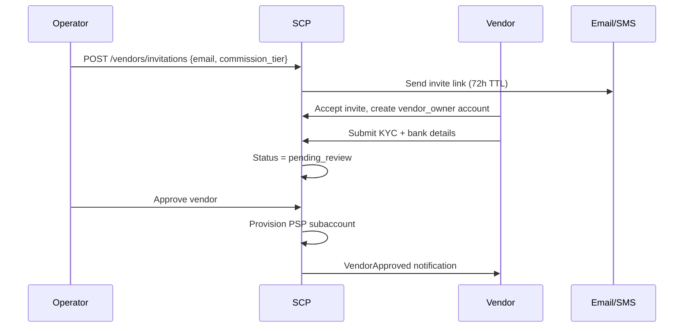
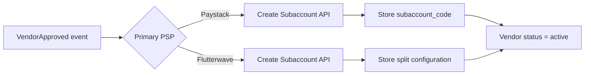

# Chapter 02: Vendor Onboarding & KYC

**Document ID:** SCP-MKT-001-02  
**Version:** 1.0.0  
**Status:** ✅ Active  
**Traceability:** FR-006, NFR-031, NFR-040, NFR-083, NFR-085  

---

## 1. Purpose

Specify how vendors join a marketplace store, submit Know-Your-Customer (KYC) evidence for Nigeria regulatory and trust requirements, and transition through approval states before they can list products and receive payouts.

## 2. Scope

- Vendor application and invitation flows
- Nigeria KYC data requirements (individual and business)
- Document upload, encryption, and retention
- Operator review queue and approval/rejection
- Paystack/Flutterwave subaccount provisioning triggers
- NDPA data walls during onboarding

## 3. Out of Scope

- Operator tenant signup (Volume 7 SaaS)
- Product listing after approval (Chapter 07)
- International KYC (Kenya IPRS — Phase 2)

## 4. User Personas

| Persona | Journey |
|---------|---------|
| **Amara** (vendor) | Receives invite → completes profile → uploads CAC + bank → awaits approval |
| **Fatima** (operator) | Reviews KYC queue → approves/rejects → monitors vendor quality |
| **Platform support** | Assists stuck applications via impersonation (ADR-010) |

## 5. Onboarding Channels

### 5.1 Operator Invitation

### 5.2 Public Application

Store exposes `/become-a-vendor` when `marketplace.public_application_enabled = true`. Applications enter the same review queue with source tag `public_application`.

### 5.3 Bulk Migration

Operator uploads CSV (max 500 rows/job):

| Column | Required |
|--------|----------|
| `business_name` | Yes |
| `contact_email` | Yes |
| `contact_phone` | Yes (E.164) |
| `vendor_type` | `individual` or `business` |
| `commission_tier_id` | Optional |
| `legacy_external_id` | Optional |

Invitations sent asynchronously; vendors complete KYC themselves.

## 6. Vendor Types

| Type | Nigeria Requirements | Payout Account |
|------|---------------------|----------------|
| **Individual** | Full legal name, NIN, BVN, valid ID scan, selfie (liveness Phase 2) | Personal NGN bank (NUBAN) |
| **Business** | Registered business name, CAC registration number, TIN (optional Phase 1), director ID | Corporate NGN bank account |

**Assumption:** CAC API verification via third-party provider in Phase 2. Phase 1 uses manual document review.

## 7. KYC Data Model

### 7.1 Entities

**Vendor** (aggregate root)

| Field | Type | Notes |
|-------|------|-------|
| `id` | UUID | |
| `tenant_id` | UUID | RLS |
| `store_id` | UUID | |
| `status` | enum | See state machine Ch. 09 |
| `vendor_type` | enum | `individual`, `business` |
| `business_name` | string | Display name |
| `slug` | string | Unique per store |
| `commission_tier_id` | UUID | FK |
| `contact_email` | encrypted | |
| `contact_phone` | encrypted | E.164 |
| `created_at` | timestamp | |

**VendorKyc**

| Field | Type | Notes |
|-------|------|-------|
| `id` | UUID | |
| `vendor_id` | UUID | |
| `nin` | encrypted | 11 digits; hashed for dedup |
| `bvn` | encrypted | 11 digits |
| `cac_number` | encrypted | Business only |
| `cac_document_media_id` | UUID | Encrypted storage |
| `id_document_media_id` | UUID | Passport, NIN slip, driver's license |
| `proof_of_address_media_id` | UUID | Utility bill ≤ 3 months |
| `review_status` | enum | `draft`, `submitted`, `approved`, `rejected` |
| `rejection_reason` | text | Operator-visible |
| `reviewed_by_user_id` | UUID | |
| `reviewed_at` | timestamp | |
| `expires_at` | timestamp | 24 months; re-KYC trigger |

**VendorBankAccount**

| Field | Type | Notes |
|-------|------|-------|
| `id` | UUID | |
| `vendor_id` | UUID | |
| `bank_code` | string | CBN bank code |
| `account_number` | encrypted | 10-digit NUBAN |
| `account_name` | string | From Paystack resolve API |
| `is_verified` | boolean | |
| `verified_at` | timestamp | |
| `psp_subaccount_code` | string | Paystack subaccount_code |
| `psp_split_id` | string | Flutterwave split ID |

### 7.2 Bank Verification (Nigeria)

On bank details submit:

1. Call **Paystack Resolve Account** (`GET /bank/resolve?account_number=&bank_code=`) or Flutterwave equivalent.
2. Compare returned account name with KYC legal name (fuzzy match ≥ 85% or manual review flag).
3. Store verification result; do not expose other vendors' bank data.

## 8. Business Rules

| ID | Rule |
|----|------|
| BR-VON-001 | Vendor cannot publish products until `status = active` |
| BR-VON-002 | Vendor cannot receive payouts until KYC approved AND bank verified |
| BR-VON-003 | Duplicate BVN/NIN across vendors in same store → block; across tenants → allow (different operators) |
| BR-VON-004 | KYC document uploads: PDF/JPG/PNG only; max 5 MB; virus scan before storage |
| BR-VON-005 | Rejected vendor may re-submit KYC after 24h cooldown (max 3 attempts before operator manual unlock) |
| BR-VON-006 | Bank account change requires MFA + 72h payout hold (NFR security pattern) |
| BR-VON-007 | Minor corrections (typo in business name) do not require new PSP subaccount; bank change does |
| BR-VON-008 | All KYC access logged to immutable audit log (ADR-009) |

## 9. NDPA Vendor Data Walls

Marketplace onboarding processes **vendor personal data** (NIN, BVN, ID scans). SCP acts as **processor** on behalf of the marketplace operator (controller).

| Control | Implementation |
|---------|----------------|
| Purpose limitation | KYC used only for identity verification, payout compliance, dispute resolution |
| Storage encryption | AES-256 at rest for `nin`, `bvn`, `account_number`, document blobs (NFR-031) |
| Access control | `vendor_owner` sees own KYC; operator sees review queue; no cross-vendor access |
| Retention | Active vendor: life of account + 7 years financial; rejected application: delete after 90 days unless dispute |
| Export | Vendor can request KYC export; operator receives processor-assisted bundle |
| Subprocessors | Paystack/Flutterwave listed in DPA; bank verification calls documented in RoPA |

**Cross-vendor wall test:** Vendor A token cannot read Vendor B KYC via any API route — enforced by policy + RLS on `vendor_id`.

## 10. Operator Review UI

| View | Features |
|------|----------|
| KYC Queue | Filter: pending, flagged, resubmitted; sort by wait time |
| Vendor Detail | Documents viewer (watermarked), bank match score, duplicate signals |
| Bulk Actions | Approve selected (max 50), reject with template reason |
| Audit Trail | Who approved, when, from which IP |

Rejection reason templates:

- Document illegible or expired
- Name mismatch with bank account
- Duplicate identity detected
- Prohibited category (see operator policy)
- Incomplete submission

## 11. PSP Subaccount Provisioning

On `VendorApproved`:

**Paystack:** `POST /subaccount` with `business_name`, `settlement_bank`, `account_number`, `percentage_charge` (vendor share of split — typically 0; platform takes commission separately).

**Flutterwave:** Subaccount creation via `POST /subaccounts` with settlement details.

Failure handling: vendor remains `approved_pending_psp`; retry job with exponential backoff; operator alert after 3 failures.

## 12. API Surfaces (Summary)

| Method | Path | Role |
|--------|------|------|
| POST | `/api/v1/stores/{store}/vendors/invitations` | merchant_staff+ |
| POST | `/api/v1/vendor/applications` | public (store context) |
| GET | `/api/v1/vendor/kyc` | vendor_owner |
| PUT | `/api/v1/vendor/kyc` | vendor_owner |
| POST | `/api/v1/vendor/bank-account/verify` | vendor_owner |
| GET | `/api/v1/stores/{store}/vendors/kyc-queue` | merchant_staff+ |
| POST | `/api/v1/stores/{store}/vendors/{id}/approve` | merchant_owner |
| POST | `/api/v1/stores/{store}/vendors/{id}/reject` | merchant_owner |

Full schemas in Chapter 10.

## 13. Background Jobs

| Job | Trigger | SLA |
|-----|---------|-----|
| `SendVendorInvitation` | Invitation created | ≤ 30s |
| `VerifyBankAccount` | Bank submit | ≤ 10s |
| `ProvisionPspSubaccount` | Vendor approved | ≤ 60s |
| `ExpireStaleInvitations` | Cron daily | — |
| `KycExpiryReminder` | 30 days before expiry | — |

## 14. Security Considerations

- ID document URLs are signed, 15-minute TTL, no CDN caching
- KYC download requires `merchant_owner` + re-auth for bulk export
- Rate limit public application: 5/hour/IP per store
- NIN/BVN never logged in plain text; log hashed fingerprint only

## 15. Testing Strategy

| Test | Expectation |
|------|-------------|
| Isolation | Vendor A cannot GET Vendor B KYC |
| Duplicate BVN | Second application blocked in same store |
| Bank resolve failure | User-friendly error; no partial verify |
| Approve flow | PSP subaccount job enqueued; event emitted |
| Reject cooldown | Re-submit blocked for 24h |

## 16. Acceptance Criteria

1. Invitation and public application flows complete end-to-end in staging.
2. Nigeria individual and business KYC fields enforced server-side.
3. Bank verification integrated with Paystack resolve (Flutterwave fallback documented).
4. KYC documents encrypted at rest; access audit logged.
5. Cross-vendor KYC isolation verified in automated suite.

## 17. Sources

- Paystack Resolve Account: https://paystack.com/docs/identity-verification/verify-account-number/
- Paystack Subaccounts: https://paystack.com/docs/payments/split-payments/
- CBN NUBAN standards (E3 industry reference)
- NDPA 2023 §38 processor obligations
