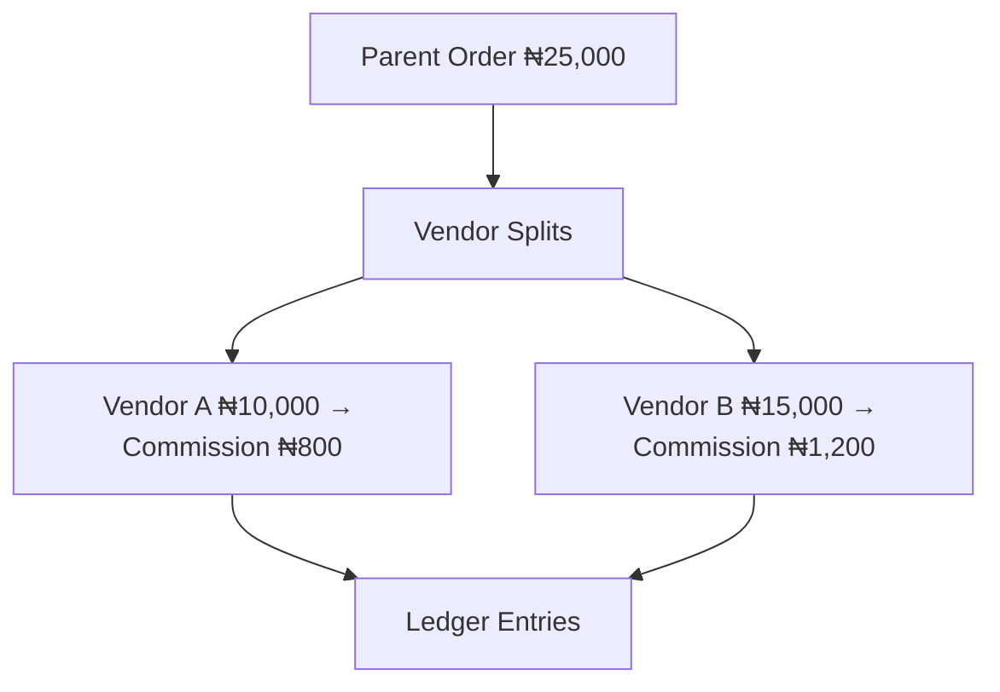

# Chapter 04: Commissions & Fees

**Document ID:** SCP-MKT-001-04  
**Version:** 1.0.0  
**Status:** ✅ Active  
**Traceability:** FR-021, PRD-008, PRD-020  

---

## 1. Purpose

Define how SCP calculates, accrues, and records marketplace commissions and fees on vendor sales — transparent, auditable, and configurable by the marketplace operator without the opaque fee stacking common on Jumia-class platforms.

## 2. Scope

- Commission rate configuration (default, tier, category, vendor override)
- Fee types: platform commission, payment processing pass-through, fixed per-order fees
- Calculation timing and ledger entries
- Refund and partial refund commission reversal
- Multi-vendor order allocation
- NGN/kobo precision rules

## 3. Out of Scope

- SCP SaaS subscription billing (tenant → Sapphital)
- Tax computation (Chapter 11)
- PSP interchange (handled by Paystack/Flutterwave; SCP records pass-through only)

## 4. Fee Philosophy

| Principle | Implementation |
|-----------|----------------|
| Transparency | Vendor sees fee breakdown on every order line |
| Predictability | Rates locked at order placement time |
| Operator control | Fatima sets tiers; not hardcoded by platform |
| No surprise stacking | Max 3 fee line types per order in Phase 1 |

**Jumia lesson:** Vendors cite unexpected promotional chargebacks and category fee changes. SCP snapshots commission rules on `OrderPlaced`.

## 5. Fee Types

| Code | Name | Paid To | Default |
|------|------|---------|---------|
| `COMMISSION` | Marketplace commission | Operator | 8% of line subtotal |
| `PLATFORM_FEE` | SCP SaaS usage fee on GMV | Sapphital (optional) | 0% Phase 1; plan-based Phase 2 |
| `PAYMENT_FEE` | PSP fee pass-through | Configurable | Operator absorbs default |
| `FIXED_FEE` | Per-order flat fee | Operator | ₦0 |

## 6. Commission Configuration

### 6.1 Commission Tier Entity

| Field | Type | Description |
|-------|------|-------------|
| `id` | UUID | |
| `store_id` | UUID | |
| `name` | string | e.g., "Standard", "Premium Brand" |
| `rate_bps` | integer | Basis points (800 = 8.00%) |
| `fixed_fee_kobo` | integer | Optional flat per sub-order |
| `is_default` | boolean | One default per store |

### 6.2 Override Precedence (highest wins at order time)

```text
1. Vendor-specific override (CommissionRule.vendor_id)
2. Category override (CommissionRule.category_id)
3. Vendor tier (vendor.commission_tier_id)
4. Store default tier
```

### 6.3 CommissionRule

| Field | Type |
|-------|------|
| `store_id` | UUID |
| `vendor_id` | UUID nullable |
| `category_id` | UUID nullable |
| `rate_bps` | integer |
| `fixed_fee_kobo` | integer |
| `effective_from` | date |
| `effective_to` | date nullable |

Rules versioned; historical orders reference `commission_snapshot_id`.

## 7. Calculation Model

All amounts use **Money** value object: integer **kobo**, currency **NGN** (FR-021).

### 7.1 Line-Level Calculation

For each `order_item` where `vendor_id = V`:

```text
line_subtotal_kobo = unit_price_kobo × quantity
discount_allocated_kobo = proportional share of order-level discount
taxable_base_kobo = line_subtotal_kobo - discount_allocated_kobo

commission_kobo = floor(taxable_base_kobo × rate_bps / 10000)
fixed_fee_kobo = rule.fixed_fee_kobo

vendor_gross_kobo = taxable_base_kobo
vendor_net_kobo = vendor_gross_kobo - commission_kobo - fixed_fee_kobo - payment_fee_pass_through_kobo
```

**Rounding:** Floor toward operator for commission; remainder tracked in `rounding_adjustment_kobo` on parent order (sum zero across vendors).

### 7.2 Example (NGN)

| Item | Value |
|------|-------|
| Vendor A line subtotal | ₦10,000.00 |
| Commission 8% | ₦800.00 |
| Fixed fee | ₦50.00 |
| Vendor net (before PSP) | ₦9,150.00 |

### 7.3 Multi-Vendor Cart

Single checkout; commission calculated independently per vendor sub-order. Operator commission pool = sum of all `COMMISSION` lines.



## 8. Ledger & Accrual

### 8.1 Commission Entity

| Field | Type |
|-------|------|
| `id` | UUID |
| `tenant_id`, `store_id`, `vendor_id` | UUID |
| `order_id`, `order_item_id` | UUID |
| `commission_snapshot_id` | UUID |
| `type` | enum |
| `amount_kobo` | integer |
| `currency` | `NGN` |
| `status` | `accrued`, `released`, `reversed`, `held` |
| `released_at` | timestamp nullable |

### 8.2 Accrual Timing

| Event | Action |
|-------|--------|
| `OrderPaid` | Create commission records `status = accrued`; apply hold if return window active |
| `OrderDelivered` + return window elapsed | `accrued → released` |
| `RefundIssued` | Proportional `reversed` |
| `DisputeLost` (vendor fault) | Reverse + optional penalty fee |

**Return window default:** 7 calendar days after delivery (operator configurable 3–14).

## 9. Payment Fee Pass-Through

PSP charges (Paystack ~1.5% + ₦100 cap domestically — verify current tariff at integration time) may be:

| Mode | Behavior |
|------|----------|
| `operator_absorbs` | Not deducted from vendor (default) |
| `vendor_share` | Deduct proportional PSP fee from vendor net |
| `split_checkout` | Customer pays convenience fee (displayed at checkout) |

Mode stored on `store.marketplace_settings.payment_fee_mode`.

## 10. Promotions & Coupons

| Scenario | Commission Base |
|----------|-----------------|
| Operator-funded coupon | Full pre-discount subtotal |
| Vendor-funded coupon | Post-discount subtotal |
| Platform SCP coupon | Configurable; default pre-discount |

Coupon funding source set on promotion entity (Volume 5); commission engine reads `discount_funded_by`.

## 11. Operator Dashboard Views

| Report | Contents |
|--------|----------|
| Commission summary | By vendor, category, period |
| Rate management | CRUD tiers and overrides |
| Pending releases | Held commissions with reason |
| Export | CSV for accounting (7-year retention) |

## 12. Business Rules

| ID | Rule |
|----|------|
| BR-COM-001 | Commission rates snapshotted at order placement; mid-order rate changes do not apply |
| BR-COM-002 | Minimum commission per line: 0 kobo (operator may set floor in Phase 2) |
| BR-COM-003 | Refund reverses commission proportionally to refunded amount |
| BR-COM-004 | Cancelled unpaid orders: no commission records |
| BR-COM-005 | Vendor net cannot go negative on single order; floor at 0, operator absorbs excess |
| BR-COM-006 | All commission mutations append-only; corrections via reversal entries |

## 13. API Surfaces (Summary)

| Method | Path | Role |
|--------|------|------|
| GET | `/api/v1/stores/{store}/commission-tiers` | merchant_staff+ |
| POST | `/api/v1/stores/{store}/commission-tiers` | merchant_owner |
| GET | `/api/v1/stores/{store}/commission-rules` | merchant_staff+ |
| POST | `/api/v1/stores/{store}/commission-rules` | merchant_owner |
| GET | `/api/v1/vendor/commissions` | vendor_owner |
| GET | `/api/v1/stores/{store}/commissions/report` | merchant_staff+ |

## 14. Events

| Event | Payload Highlights |
|-------|-------------------|
| `CommissionAccrued` | order_id, vendor_id, amount_kobo, type |
| `CommissionReleased` | commission_id, vendor_id |
| `CommissionReversed` | commission_id, reason, refund_id |

## 15. Performance

Commission calculation runs synchronously on `OrderPaid` handler; target p95 ≤ 100ms for 10 vendor lines. Batch release job processes 10,000 commissions in ≤ 5 min.

## 16. Acceptance Criteria

1. Multi-vendor order produces isolated commission rows per vendor.
2. Rate snapshot immutable after order placed.
3. Refund of 50% line quantity reverses 50% commission.
4. Vendor portal displays matching breakdown to ledger.
5. All amounts integer kobo; no floating point in code paths.

## 17. Sources

- Volume 1: Jumia commission positioning (10–20% industry observation)
- Paystack pricing: https://paystack.com/pricing (verify at build time)
- FR-021 Money value object
