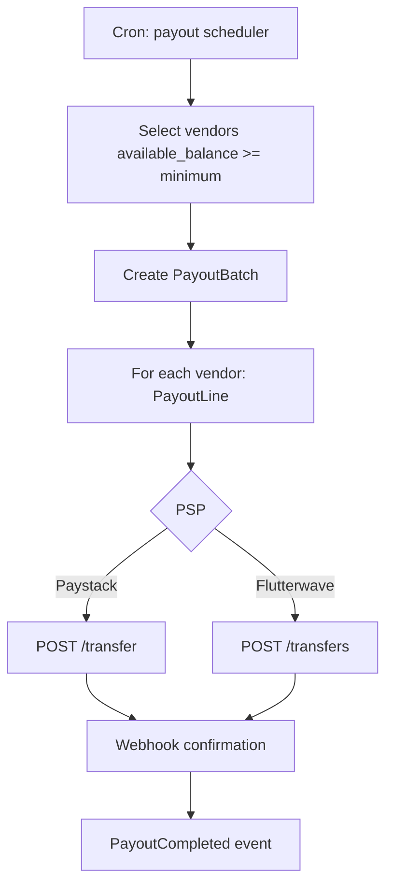

# Chapter 05: Split Payments & Naira Payouts (Nigeria)

**Document ID:** SCP-MKT-001-05  
**Version:** 1.0.0  
**Status:** ✅ Active  
**Traceability:** ADR-004, NFR-044, NFR-071, FR-021  

---

## 1. Purpose

Specify how SCP collects customer payments in **Nigerian Naira (NGN)**, splits funds between marketplace operator and vendors via **Paystack** and **Flutterwave**, and settles vendor balances through scheduled **Naira bank payouts** — without SCP ever storing cardholder data.

## 2. Scope

- Checkout payment flow for multi-vendor orders (PSP redirect per ADR-004)
- Paystack Transaction Splits and Subaccounts
- Flutterwave Split Payments and subaccounts
- Escrow/hold model before vendor settlement
- Payout batch scheduling and reconciliation
- Failed payout retry and manual resolution
- Webhook handling and idempotency

## 3. Out of Scope

- Kenya M-Pesa splits (Phase 2)
- Cross-border FX (USD vendor payouts — Phase 3)
- SCP platform SaaS billing to operators

## 4. Payment Architecture Overview

```mermaid
sequenceDiagram
    participant C as Customer
    participant SF as Storefront
    participant SCP as SCP Commerce
    participant PS as Paystack
    participant Op as Operator Account
    participant V as Vendor Subaccount

    C->>SF: Checkout multi-vendor cart
    SF->>SCP: Create payment session
    SCP->>PS: Initialize transaction + split config
    PS->>C: Redirect hosted checkout
    C->>PS: Pay (card/USSD/transfer)
    PS->>SCP: Webhook charge.success
    SCP->>SCP: Mark order paid; accrue commissions
    PS->>Op: Operator share settled
    PS->>V: Vendor share to subaccount (pending settlement)
    Note over SCP,V: Vendor NGN payout batch after hold period
    SCP->>PS: Transfer / settlement to vendor bank
```

**PCI scope:** SCP remains **SAQ A** — all card entry on PSP-hosted pages (ADR-004).

## 5. Money Flow Model

### 5.1 Layers

| Layer | Description |
|-------|-------------|
| **Customer payment** | Single NGN charge for parent order |
| **PSP split** | Real-time or T+0 allocation per split rules |
| **Vendor balance** | Internal ledger (available, pending, held) |
| **Payout** | Batch transfer from PSP subaccount/settlement wallet to vendor NUBAN |

### 5.2 Internal Ledger Accounts (per vendor)

| Account | Meaning |
|---------|---------|
| `pending_balance_kobo` | Paid orders in return/dispute window |
| `available_balance_kobo` | Eligible for next payout batch |
| `held_balance_kobo` | Operator or dispute hold |
| `paid_out_lifetime_kobo` | Cumulative successful payouts |

Ledger is **append-only** double-entry; balances derived from entries.

## 6. Paystack Integration

### 6.1 Subaccount Setup

Created on vendor approval (Chapter 02):

```json
POST https://api.paystack.co/subaccount
{
  "business_name": "Amara Fashion Ltd",
  "settlement_bank": "058",
  "account_number": "0123456789",
  "percentage_charge": 0,
  "description": "SCP vendor subaccount"
}
```

Response `subaccount_code` stored on `VendorBankAccount.psp_subaccount_code`.

### 6.2 Split Configuration on Initialize

When initializing payment for multi-vendor order:

```json
POST https://api.paystack.co/transaction/initialize
{
  "email": "customer@example.com",
  "amount": 2500000,
  "currency": "NGN",
  "reference": "scp_ord_abc123",
  "callback_url": "https://store.example/checkout/callback",
  "split": {
    "type": "flat",
    "bearer_type": "account",
    "subaccounts": [
      { "subaccount": "ACCT_vendor_a", "share": 915000 },
      { "subaccount": "ACCT_vendor_b", "share": 1372500 }
    ]
  }
}
```

**Split math:**

- Vendor shares = vendor net after commission (from Chapter 04)
- Operator share = remainder (commissions + operator product lines if any)
- Sum of shares **must equal** total transaction amount in kobo

### 6.3 Paystack Settlement Timeline

Paystack settles to subaccounts per their schedule (typically T+1 business day to Nigerian banks for eligible merchants). SCP internal hold may be **longer** than PSP settlement for buyer protection.

### 6.4 Webhooks

| Event | SCP Action |
|-------|------------|
| `charge.success` | Verify HMAC; idempotency key; mark paid; accrue ledger |
| `transfer.success` | Mark payout line completed |
| `transfer.failed` | Retry + alert operator |
| `chargeback` | Hold vendor balance; open dispute |

Verification: HMAC-SHA512 of raw body with secret; reject if timestamp > 5 minutes (Volume 11).

## 7. Flutterwave Integration

Secondary PSP for redundancy and operator choice.

### 7.1 Subaccount

```json
POST https://api.flutterwave.com/v3/subaccounts
{
  "account_name": "Amara Fashion Ltd",
  "email": "vendor@example.com",
  "mobilenumber": "+2348012345678",
  "bank_code": "058",
  "account_number": "0123456789",
  "split_type": "flat",
  "split_value": 0
}
```

### 7.2 Split Payment

On payment creation, pass `subaccounts` split array with `id` and `transaction_split_ratio` or flat amounts matching SCP ledger calculation.

Flutterwave reference stored on payment entity for reconciliation.

### 7.3 PSP Selection

| Rule | Behavior |
|------|----------|
| Store default PSP | Operator setting |
| Failover | If primary initialize fails, retry secondary once |
| Per-vendor | All vendors on same PSP per store Phase 1 |

## 8. Payout Scheduling

### 8.1 Operator Configuration

| Setting | Options | Default |
|---------|---------|---------|
| `payout_schedule` | `daily`, `weekly`, `biweekly`, `manual` | `weekly` |
| `payout_day` | Mon–Fri for weekly | `Friday` |
| `minimum_payout_kobo` | integer | `500000` (₦5,000) |
| `hold_days_after_delivery` | 3–14 | `7` |

### 8.2 Payout Batch Job



**PayoutBatch** groups lines for operator review (if manual approval enabled) and accounting export.

### 8.3 Payout Entity

| Field | Type |
|-------|------|
| `id` | UUID |
| `vendor_id` | UUID |
| `batch_id` | UUID |
| `amount_kobo` | integer |
| `currency` | `NGN` |
| `status` | see Ch. 09 |
| `psp_reference` | string |
| `period_start`, `period_end` | date |
| `failure_reason` | text nullable |

### 8.4 Naira Payout Rules (Nigeria)

| Rule | Detail |
|------|--------|
| Currency | NGN only Phase 1 |
| Bank | Must be CBN-licensed bank; NUBAN validated |
| Minimum | Default ₦5,000 to reduce transfer fees |
| Maximum | ₦50,000,000 per single transfer (operator configurable; bank limits apply) |
| Naming | Payout narration: `{store_name} settlement {period}` |
| Fees | PSP transfer fee deducted per operator policy |

## 9. Holds & Escrow

| Hold Reason | Release Trigger |
|-------------|-----------------|
| Return window | `now > delivered_at + hold_days` |
| Open dispute | Dispute closed in vendor favor |
| Bank change cooldown | 72h after verification |
| Operator manual | Operator clears hold |
| Chargeback | Resolution or loss absorption |

## 10. Reconciliation

Daily job compares:

1. SCP ledger sum(`available`) + sum(`paid_out`)
2. Paystack settlement reports API
3. Flutterwave transaction query

Discrepancy > ₦1.00 triggers operator alert and `reconciliation_exception` record.

## 11. Refunds

| Scenario | Flow |
|----------|------|
| Full refund before payout | PSP refund API; reverse splits proportionally |
| Partial refund | Refund amount from vendor subaccount balance or operator reserve |
| Post-payout refund | Deduct from vendor `available` or next payout; operator clawback if insufficient |

Paystack: `POST /refund` with transaction reference. Commission reversed per Chapter 04.

## 12. Business Rules

| ID | Rule |
|----|------|
| BR-PAY-001 | Split shares must sum to payment amount exactly |
| BR-PAY-002 | No payout if KYC expired or vendor suspended |
| BR-PAY-003 | Webhook processing idempotent on `psp_event_id` |
| BR-PAY-004 | Failed payout retries 3× over 48h then operator queue |
| BR-PAY-005 | Customer payment success never depends on split creation success — reconcile async |
| BR-PAY-006 | All PSP secrets in vault (ADR-007) |

## 13. Security

- Webhook endpoints: IP allowlist where PSP publishes ranges + signature verify
- Transfer initiation: requires `merchant_owner` or system job role
- Vendor cannot trigger own payout early Phase 1
- Audit log on every payout initiation and bank change

## 14. Observability

| Metric | Alert |
|--------|-------|
| `payment.split_mismatch` | > 0 critical |
| `payout.failed_rate` | > 2% over 24h |
| `webhook.lag_seconds` | p95 > 120 |
| `reconciliation.variance_ngn` | > 100000 kobo |

## 15. Failure Modes

| Failure | Mitigation |
|---------|------------|
| Split config error at initialize | Block checkout; show operator support message |
| Vendor missing subaccount | Route 100% to operator; flag vendor |
| PSP outage | Failover PSP; queue retries |
| Insufficient vendor balance for refund | Operator reserve fund |

## 16. Acceptance Criteria

1. Multi-vendor checkout initializes Paystack split with correct kobo amounts.
2. Flutterwave documented as secondary with equivalent split behavior.
3. Weekly payout batch transfers to verified NUBAN; webhook updates status.
4. Return window hold prevents premature payout release.
5. Webhook replay does not double-credit ledger.
6. Reconciliation job runs daily with alert on variance.

## 17. Sources

- Paystack Split Payments: https://paystack.com/docs/payments/split-payments/
- Paystack Subaccounts: https://paystack.com/docs/payments/split-payments/#subaccounts
- Paystack Transfers: https://paystack.com/docs/transfers/
- Flutterwave Split Payments: https://developer.flutterwave.com/docs/split-payments
- ADR-004 PSP redirect / SAQ A
- CBN cashless policy (E3 — NGN electronic settlement norms)
