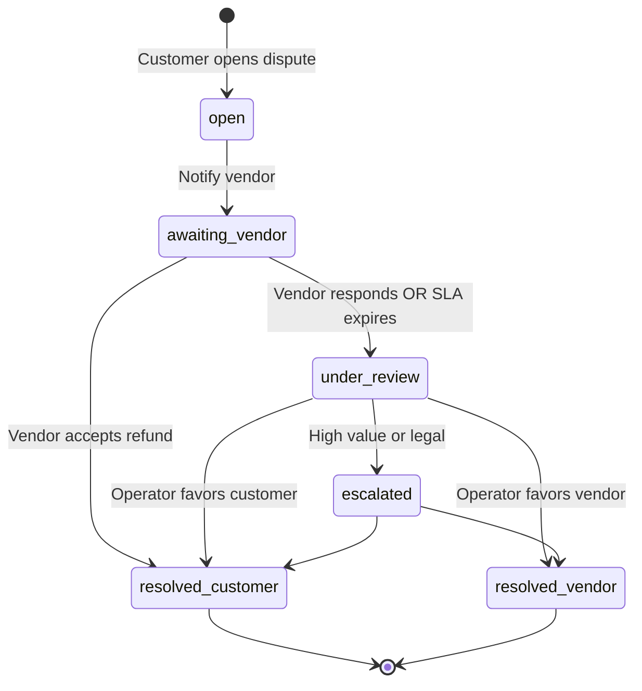

# Chapter 06: Disputes, Trust & Safety

**Document ID:** SCP-MKT-001-06  
**Version:** 1.0.0  
**Status:** ✅ Active  
**Traceability:** NFR-040, NFR-083, Volume 11 Threat Model  

---

## 1. Purpose

Define dispute resolution workflows, vendor trust scoring, strike enforcement, and fraud prevention controls that protect customers and honest vendors — addressing the trust deficit that drives buyers toward Jumia's buyer protection while giving operators finer control.

## 2. Scope

- Dispute types and lifecycle
- Evidence collection and SLAs
- Operator arbitration
- Vendor trust score algorithm
- Strike and suspension policy
- Counterfeit and prohibited goods handling
- Nigeria-specific fraud patterns

## 3. Out of Scope

- Chargeback representation at card network level (PSP-managed)
- Criminal fraud reporting to EFCC/Nigeria Police (legal escalation playbook in Volume 14)

## 4. Dispute Model

### 4.1 Dispute Entity

| Field | Type |
|-------|------|
| `id` | UUID |
| `tenant_id`, `store_id` | UUID |
| `order_id`, `order_vendor_split_id` | UUID |
| `vendor_id` | UUID |
| `customer_id` | UUID |
| `type` | enum |
| `status` | enum (Ch. 09) |
| `amount_disputed_kobo` | integer |
| `reason_code` | string |
| `customer_statement` | text |
| `vendor_response` | text nullable |
| `operator_decision` | enum nullable |
| `resolution_amount_kobo` | integer nullable |
| `opened_at`, `closed_at` | timestamp |

### 4.2 Dispute Types

| Type | Description | Typical Resolution |
|------|-------------|------------------|
| `not_received` | Order not delivered | Refund or reship |
| `not_as_described` | Product mismatch | Partial/full refund |
| `damaged` | Damaged in transit | Partial/full refund |
| `counterfeit` | Fake goods alleged | Full refund + vendor strike |
| `wrong_item` | Incorrect SKU sent | Refund or exchange |
| `unauthorized` | Customer denies purchase | Operator + PSP investigation |

### 4.3 Dispute Lifecycle



**SLAs:**

| Stage | SLA |
|-------|-----|
| Vendor response | 48 hours |
| Operator review | 72 hours after escalation |
| Customer update | Notification within 1 hour of status change |

Auto-escalation: if vendor silent 48h → `under_review` with default lean toward customer for `not_received`.

## 5. Opening Disputes

| Rule | Detail |
|------|--------|
| Eligibility window | 14 days from delivery (or expected delivery + 7 days) |
| Max open disputes per order line | 1 |
| Minimum evidence | Customer description + optional photos |
| Block | Dispute blocked if chargeback already filed at PSP |

Customer opens via storefront account or operator on behalf (logged).

## 6. Financial Impact

| Resolution | Financial Action |
|------------|------------------|
| Full refund customer | PSP refund; commission reversed; vendor balance debited |
| Partial refund | Proportional |
| Vendor wins | Release held funds |
| Counterfeit confirmed | Full refund + strike + possible suspension |

During open dispute, disputed amount moved to `held_balance_kobo`.

## 7. Trust Score

### 7.1 Score Range

0–100 displayed to operator and vendor. New vendors start at **70** (neutral).

### 7.2 Components (rolling 90 days)

| Component | Weight | Calculation |
|-----------|--------|-------------|
| Fulfillment rate | 30% | % lines shipped within SLA |
| On-time delivery | 25% | Carrier confirmation vs promise |
| Dispute rate | 25% | Disputes / orders (inverse) |
| Cancellation rate | 10% | Vendor-initiated cancels (inverse) |
| Review rating | 10% | Avg customer rating (1–5 scaled) |

```text
trust_score = weighted_sum(components)
```

### 7.3 Score Effects

| Score | Effect |
|-------|--------|
| ≥ 85 | "Trusted Vendor" badge on storefront |
| 70–84 | Standard |
| 50–69 | Warning banner in vendor portal; increased moderation |
| < 50 | Automatic listing review on each publish |
| < 30 | Operator alert; possible suspension |

## 8. Strike System

**VendorStrike** entity:

| Field | Type |
|-------|------|
| `vendor_id` | UUID |
| `reason` | enum |
| `severity` | `minor`, `major`, `critical` |
| `expires_at` | timestamp nullable |
| `issued_by_user_id` | UUID |

| Severity | Trigger Examples | Consequence |
|----------|------------------|-------------|
| Minor | Late shipment pattern | Logged; affects trust score |
| Major | Lost dispute (not_received) | 30-day payout hold extension |
| Critical | Counterfeit, fraud, KYC fake | Immediate suspension |

**Three major strikes in 180 days → automatic suspension** pending operator review.

## 9. Prohibited & Restricted Categories (Nigeria)

Operator configures; SCP provides default blocklist:

| Category | Default |
|----------|---------|
| Weapons, explosives | Blocked |
| Prescription drugs | Blocked |
| Stolen goods | Blocked |
| CBD/cannabis products | Blocked (NAFDAC) |
| Alcohol | Restricted (operator opt-in + age gate) |
| Financial services | Blocked |

NAFDAC-regulated health products require operator `restricted` flag + document upload.

## 10. Fraud Patterns (Nigeria E3)

| Pattern | Detection | Response |
|---------|-----------|----------|
| Fake tracking numbers | Carrier API validation Phase 2; manual spot check Phase 1 | Strike + hold |
| BVN farming (duplicate identities) | Hash dedup across store | Block onboarding |
| Triangulation fraud | Velocity on high-value electronics | Operator review queue |
| Refund abuse | Customer dispute rate | Operator flag; limit disputes |
| Payout mule accounts | Bank name mismatch | KYC reject |

## 11. NDPA in Disputes

Dispute evidence may contain customer PII and photos of homes.

| Control | Implementation |
|---------|----------------|
| Access | Customer, operator, disputed vendor only |
| Retention | 2 years after close; then purge evidence media |
| Vendor wall | Vendor A cannot see disputes on Vendor B orders |
| Export | Included in customer data export request |

## 12. Operator Trust Dashboard

| Widget | Content |
|--------|---------|
| Open disputes | Count by age bucket |
| Vendor leaderboard | Top/bottom trust scores |
| Strike queue | Recent strikes |
| Counterfeit flags | Priority review |

## 13. Notifications

| Event | Customer | Vendor | Operator |
|-------|----------|--------|----------|
| Dispute opened | Email | Email + SMS | Dashboard |
| Vendor response | Email | — | — |
| Resolved | Email | Email | — |
| Strike issued | — | Email | Dashboard |

WhatsApp notifications require explicit opt-in (NDPA marketing consent rules do not apply; transactional permitted with notice).

## 14. API Surfaces (Summary)

| Method | Path | Role |
|--------|------|------|
| POST | `/api/v1/orders/{id}/disputes` | customer |
| GET | `/api/v1/vendor/disputes` | vendor |
| POST | `/api/v1/vendor/disputes/{id}/respond` | vendor |
| POST | `/api/v1/stores/{store}/disputes/{id}/resolve` | merchant_staff+ |
| GET | `/api/v1/stores/{store}/vendors/trust-scores` | merchant_staff+ |

## 15. Background Jobs

| Job | Schedule |
|-----|----------|
| `RecalculateTrustScores` | Daily 02:00 WAT |
| `DisputeSlaEscalation` | Hourly |
| `ExpireStrikes` | Daily |
| `AutoSuspendRepeatOffenders` | Daily |

## 16. Acceptance Criteria

1. Customer can open dispute within eligibility window.
2. Vendor 48h SLA escalation works without manual intervention.
3. Trust score recalculates daily and matches documented formula.
4. Critical strike suspends vendor listing visibility.
5. Cross-vendor dispute isolation enforced in API tests.

## 17. Sources

- Volume 11 Threat Model — marketplace seller fraud
- Volume 1 — Jumia buyer protection expectations (E3)
- NDPA retention and minimization
