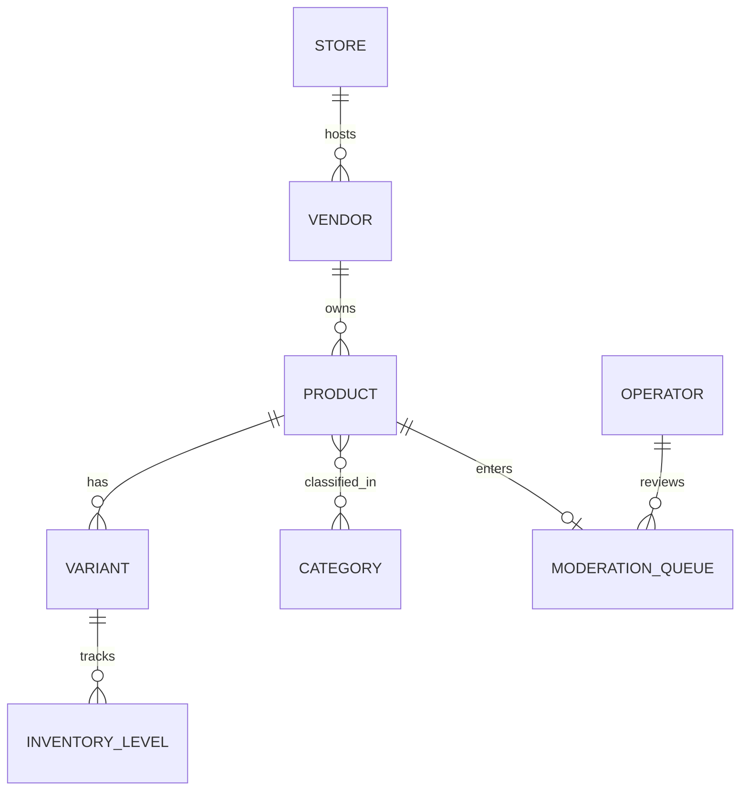

# Chapter 07: Multi-Vendor Catalog

**Document ID:** SCP-MKT-001-07  
**Version:** 1.0.0  
**Status:** ✅ Active  
**Traceability:** FR-020, Volume 5 Catalog  

---

## 1. Purpose

Define how products are owned, moderated, discovered, and displayed in a multi-vendor marketplace store — ensuring catalog quality without the centralized listing control that vendors resent on national marketplaces.

## 2. Scope

- Product–vendor ownership model
- Listing lifecycle and operator moderation
- Categories, attributes, and variants per vendor
- Storefront discovery (search, filters, vendor pages)
- Inventory isolation
- Bulk import/export
- Digital vs physical goods in marketplace context

## 3. Out of Scope

- Core product schema details (Volume 5)
- Search engine implementation (Volume 5 / Infrastructure)
- Theme rendering (Volume 6)

## 4. Ownership Model

Every marketplace product has mandatory `vendor_id` and inherits `tenant_id`, `store_id`.



**Rule:** A product belongs to exactly one vendor. Multi-vendor bundles are operator-created `collection` types in Phase 2.

## 5. Listing Lifecycle

| Status | Visible on Storefront | Vendor Editable |
|--------|:---------------------:|:---------------:|
| `draft` | No | Yes |
| `pending_review` | No | Limited (withdraw) |
| `published` | Yes | Yes (re-triggers review if configured) |
| `rejected` | No | Yes → resubmit |
| `suspended` | No | No (operator only) |
| `archived` | No | No |

### 5.1 Moderation Modes

| Mode | Behavior |
|------|----------|
| `pre_approval` (default) | New/changed listings → `pending_review` |
| `post_approval` | Publish immediately; operator can suspend |
| `trusted_vendor` | Vendors with trust ≥ 85 skip pre-approval |

Operator setting: `marketplace.listing_moderation_mode`.

### 5.2 Moderation Queue

Operator views:

- Title, vendor, category, price, primary image
- AI assist flags (Phase 2): prohibited category, price outlier, duplicate image
- Actions: approve, reject (reason), request changes

Target review SLA: 24 hours (operator metric, not hard SLA Phase 1).

## 6. Catalog Fields (Vendor-Provided)

| Field | Validation |
|-------|------------|
| `title` | 3–200 chars; no all-caps spam |
| `description` | Rich text; XSS sanitized |
| `category_id` | Must be operator-allowed category |
| `variants` | ≥ 1; SKU unique per vendor |
| `price_kobo` | ≥ 100 (₦1.00 minimum) |
| `compare_at_price_kobo` | Optional; must be ≥ price |
| `images` | 1–10; min 800×800; max 5MB each |
| `weight` | Required if physical shipping enabled |
| `condition` | `new`, `refurbished` (no used Phase 1 unless operator enables) |

## 7. Categories

Operator maintains category tree. Vendors assign leaf categories only.

| Setting | Purpose |
|---------|---------|
| `commission_rule` override per category | Chapter 04 |
| `restricted` flag | Requires extra approval |
| `prohibited` flag | Blocks listing |

**Nigeria retail norms:** Fashion, electronics, beauty, home, groceries (restricted cold chain Phase 2), digital goods (instant delivery).

## 8. Storefront Discovery

### 8.1 Product Card

Displays:

- Product image, title, price (NGN)
- Vendor name + trust badge if ≥ 85
- Rating aggregate
- "Sold by {vendor}" link

### 8.2 Filters

| Filter | Source |
|--------|--------|
| Category | Facet |
| Price range | Facet |
| Vendor | Facet |
| Rating | Facet |
| Trust badge | Boolean facet |

### 8.3 Vendor Store Page (Phase 1 basic)

Route: `/vendors/{slug}`

- Vendor logo, description, trust score, member since
- Product grid (published only)
- Does not expose vendor contact email (anti-poaching)

## 9. Search Index

Meilisearch document includes:

```json
{
  "product_id": "uuid",
  "tenant_id": "uuid",
  "store_id": "uuid",
  "vendor_id": "uuid",
  "vendor_name": "Amara Fashion",
  "vendor_trust_score": 88,
  "title": "...",
  "price_kobo": 1500000,
  "category_ids": [],
  "status": "published"
}
```

**Tenant isolation:** Index queries always filter `tenant_id` + `store_id`. Vendors never query search index directly.

## 10. Inventory

| Rule | Detail |
|------|--------|
| Scope | Inventory per variant per vendor |
| Oversell protection | Reserve on checkout start; commit on paid |
| Multi-vendor cart | Independent inventory locks per vendor line |
| Low stock | Vendor notification at threshold (default 5) |

Vendor cannot modify another vendor's inventory even if SKU string collides (unique constraint is vendor_id + sku).

## 11. Digital Goods

Vendors may sell digital products (courses, ebooks) if operator enables:

- Fulfillment: secure download link on payment
- Commission: same rules as physical
- Disputes: `not_as_described` still applies
- NDPA: customer PII not shared with vendor beyond email for delivery

Aligns with Sapphital education commerce strengths (Volume 7 cross-reference).

## 12. Bulk Operations

| Operation | Limit | Role |
|-----------|-------|------|
| CSV import | 200 products/job | vendor_owner |
| CSV export | 5000 rows | vendor_owner |
| Bulk price update | 500 variants | vendor_owner |
| Operator bulk suspend | 100 products | merchant_staff+ |

Import template columns: `sku`, `title`, `description`, `price_ngn`, `quantity`, `category_slug`, `image_urls`.

## 13. Business Rules

| ID | Rule |
|----|------|
| BR-CAT-001 | Product must have vendor_id when marketplace mode enabled |
| BR-CAT-002 | Suspended vendor → all products forced to `suspended` |
| BR-CAT-003 | Price change > 50% triggers re-moderation in pre_approval mode |
| BR-CAT-004 | Duplicate SKU within vendor blocked; across vendors allowed |
| BR-CAT-005 | Operator can delist without deleting vendor product record |
| BR-CAT-006 | Published product count limit per vendor: plan-based (default 500) |

## 14. Cross-Vendor Data Walls

| Data | Vendor A | Vendor B |
|------|----------|----------|
| Product drafts | Own | Hidden |
| Sales counts of B | Hidden | Own |
| Category performance | Own | Aggregated store-level only |

RLS policy on `products`: `vendor_id = current_setting('app.vendor_id') OR current_user_is_operator()`.

## 15. Events

| Event | Subscribers |
|-------|-------------|
| `ProductSubmittedForReview` | Operator notifications |
| `ProductPublished` | Search index, Analytics |
| `ProductSuspended` | Search remove, Vendor notify |
| `VendorSuspended` | Bulk product suspend job |

## 16. Performance

| Operation | Target |
|-----------|--------|
| Product list (vendor, 50 rows) | p95 ≤ 200ms |
| Search facet query | p95 ≤ 100ms |
| Moderation queue load | p95 ≤ 300ms |
| Bulk import 200 SKUs | ≤ 60s job |

## 17. Acceptance Criteria

1. Product without vendor_id rejected on marketplace store.
2. Pre-approval moderation blocks storefront visibility until approved.
3. Search results include vendor trust badge metadata.
4. Vendor A cannot read/update Vendor B product via API.
5. Suspended vendor products removed from search within 60s.

## 18. Sources

- Volume 5 Commerce Engine — Product Catalog
- Volume 1 — Fatima persona listing quality requirements
- Jumia listing policies (E3 competitive reference)
