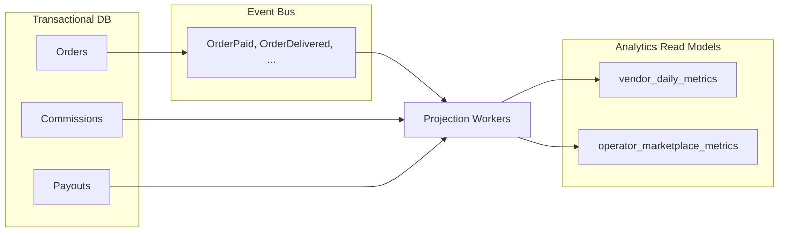

# Chapter 08: Vendor Analytics

**Document ID:** SCP-MKT-001-08  
**Version:** 1.0.0  
**Status:** ✅ Active  
**Traceability:** NFR-069, FR-006  

---

## 1. Purpose

Define analytics and reporting for marketplace vendors and operators — sales performance, payout reconciliation, trust metrics, and exportable reports in NGN — giving vendors Jumia-class visibility while preserving cross-vendor data walls.

## 2. Scope

- Vendor-facing analytics dashboards
- Operator marketplace analytics
- Metrics definitions and calculation rules
- Data pipeline from commerce events to read models
- Export formats and retention
- Real-time vs batch refresh strategy

## 3. Out of Scope

- Platform-wide SCP SaaS analytics (Sapphital internal BI)
- AI predictive forecasting (Volume 9, Phase 2)

## 4. Analytics Architecture



Projections are **eventually consistent** (≤ 5 min lag Phase 1; ≤ 60s Phase 2).

## 5. Vendor Metrics Definitions

### 5.1 Sales Metrics

| Metric | Definition | Grain |
|--------|------------|-------|
| `gross_sales_kobo` | Sum line subtotals before commission | Day / vendor |
| `net_sales_kobo` | Gross − vendor-funded discounts | Day / vendor |
| `units_sold` | Sum quantities fulfilled | Day / vendor / SKU |
| `orders_count` | Distinct sub-orders paid | Day / vendor |
| `avg_order_value_kobo` | gross_sales / orders_count | Day / vendor |

### 5.2 Earnings Metrics

| Metric | Definition |
|--------|------------|
| `commission_paid_kobo` | Sum COMMISSION type |
| `fees_paid_kobo` | Sum FIXED_FEE + payment pass-through |
| `net_earnings_kobo` | net_sales − commission − fees |
| `refunds_kobo` | Sum refunds in period |
| `payouts_received_kobo` | Sum completed payouts |

### 5.3 Operational Metrics

| Metric | Definition |
|--------|------------|
| `fulfillment_sla_rate` | % shipped within operator SLA (default 48h) |
| `cancellation_rate` | Vendor-cancelled / total |
| `dispute_rate` | Disputes opened / orders |
| `return_rate` | Phase 2 |

### 5.4 Trust Metrics

Surfaced from Chapter 06: `trust_score`, component breakdown, strike count.

## 6. Vendor Dashboard Views

### 6.1 Overview (default 30 days)

- Line chart: gross sales vs net earnings (NGN)
- Bar chart: top 5 products by revenue
- Table: daily rollup (exportable)

### 6.2 Products

| Column | Description |
|--------|-------------|
| SKU | Vendor SKU |
| Title | Product name |
| Views | Storefront PDP views |
| Units sold | Period |
| Conversion rate | units / views |
| Revenue | NGN |

**Note:** View tracking respects cookie consent (NDPA); aggregate only.

### 6.3 Payout Reconciliation

Compare `net_earnings` in period vs `payouts_received` + `pending_balance` + `held_balance` — must reconcile to zero variance.

Displays:

```text
Opening balance + Net earnings - Refunds - Payouts = Closing balance
```

### 6.4 Traffic Sources (Phase 2)

UTM attribution from storefront analytics.

## 7. Operator Marketplace Analytics

| Report | Metrics |
|--------|---------|
| GMV dashboard | Total GMV, operator commission, vendor count active |
| Vendor performance | Sortable by GMV, trust, dispute rate |
| Category mix | GMV by category |
| Payout summary | Scheduled vs completed, failed |
| Moderation throughput | Avg time to approve listings |
| Cohort | Vendor retention by join month |

Operator sees **all vendors**; vendor sees **self only**.

## 8. Data Model (Read)

**vendor_daily_metrics**

| Column | Type |
|--------|------|
| `vendor_id` | UUID |
| `store_id` | UUID |
| `date` | date |
| `gross_sales_kobo` | bigint |
| `net_earnings_kobo` | bigint |
| `orders_count` | integer |
| `units_sold` | integer |
| `commission_kobo` | bigint |
| `refunds_kobo` | bigint |
| `disputes_opened` | integer |

Unique index: `(vendor_id, date)`.

**operator_marketplace_daily**

| Column | Type |
|--------|------|
| `store_id` | UUID |
| `date` | date |
| `gmv_kobo` | bigint |
| `commission_earned_kobo` | bigint |
| `active_vendors` | integer |
| `new_vendors` | integer |
| `orders_count` | integer |

## 9. NDPA & Privacy in Analytics

| Rule | Implementation |
|------|----------------|
| No cross-vendor benchmarks to vendors | Vendor dashboard excludes other vendor names/data |
| Customer PII in reports | Never included in vendor analytics exports |
| Aggregates only | Minimum k-anonymity 5 for operator category reports |
| Export audit | Log who exported what when |
| Retention | Daily rollups 3 years; raw events 90 days |

## 10. Export

| Format | Contents | Role |
|--------|----------|------|
| CSV | Daily metrics, product performance | vendor_owner |
| CSV | Full marketplace report | merchant_owner |
| PDF | Payout statement | vendor_owner (Phase 2) |

Export limits: 10 exports/day/vendor; 100MB max file.

## 11. API Surfaces

| Method | Path | Role |
|--------|------|------|
| GET | `/api/v1/vendor/analytics/overview` | vendor |
| GET | `/api/v1/vendor/analytics/products` | vendor |
| GET | `/api/v1/vendor/analytics/payout-reconciliation` | vendor |
| GET | `/api/v1/stores/{store}/analytics/marketplace` | merchant_staff+ |
| POST | `/api/v1/vendor/analytics/export` | vendor_owner |

Query params: `from`, `to` (ISO date, max 366 day range), `timezone` (default `Africa/Lagos`).

## 12. Background Jobs

| Job | Schedule | Purpose |
|-----|----------|---------|
| `ProjectVendorDailyMetrics` | Hourly + nightly reconcile | Rollups |
| `ProjectOperatorMarketplaceMetrics` | Hourly | Operator dashboard |
| `ReconcileAnalyticsToLedger` | Nightly | Detect drift |
| `PurgeRawAnalyticsEvents` | Weekly | 90-day retention |

## 13. Performance Targets

| Query | Target |
|-------|--------|
| Vendor overview 30-day | p95 ≤ 300ms |
| Operator GMV dashboard | p95 ≤ 500ms |
| Export generation 1 year daily | ≤ 30s job |

Redis cache for overview cards: 60s TTL.

## 14. Observability

| Metric | Alert |
|--------|-------|
| `analytics.projection_lag_seconds` | > 600 |
| `analytics.reconciliation_drift_kobo` | > 10000 |
| `analytics.export_failures` | > 5/hour |

## 15. Acceptance Criteria

1. Vendor overview matches sum of paid sub-orders for period ± 1 kobo.
2. Payout reconciliation equation balances for test vendor.
3. Vendor API returns 403 for other vendor_id query tampering.
4. Operator dashboard shows all vendors; vendor dashboard shows one.
5. Export CSV opens correctly in Excel Nigeria locale (NGN numbers).

## 16. Sources

- NFR-069 Business metrics dashboard
- Volume 1 Success metrics — Marketplace GMV share
- NDPA analytics guidance — aggregate/minimize
