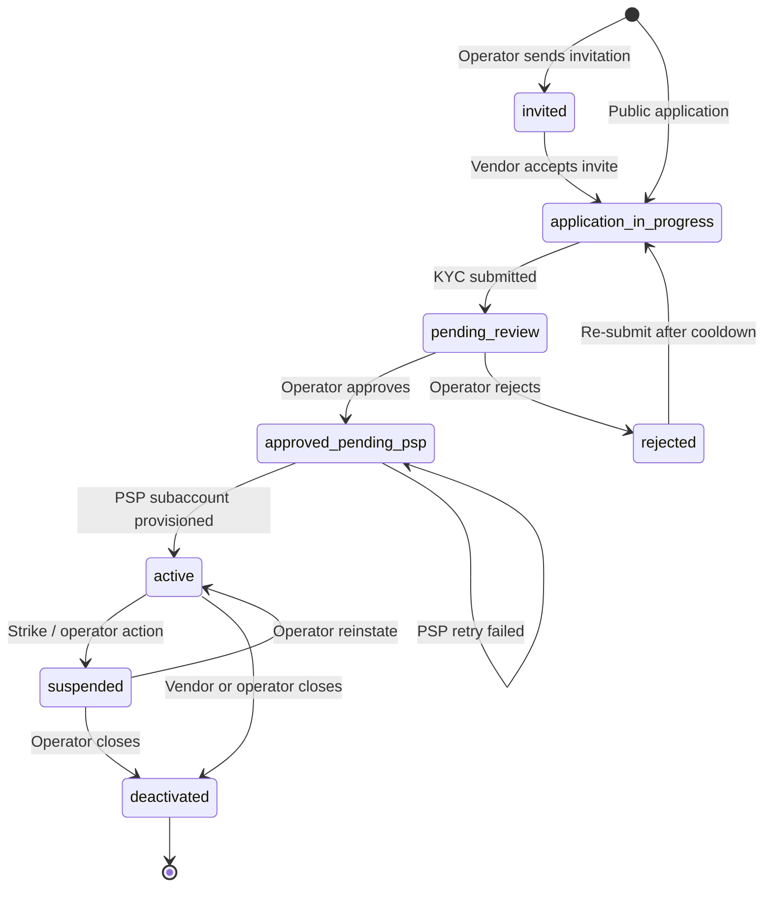
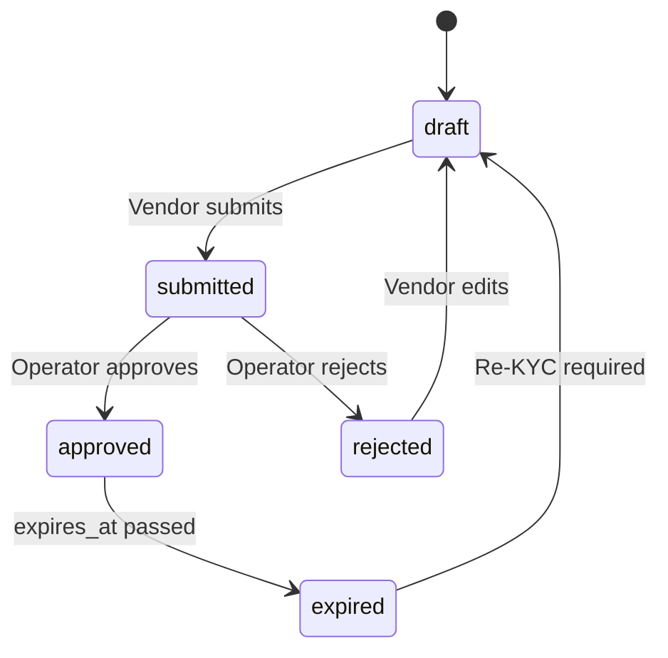
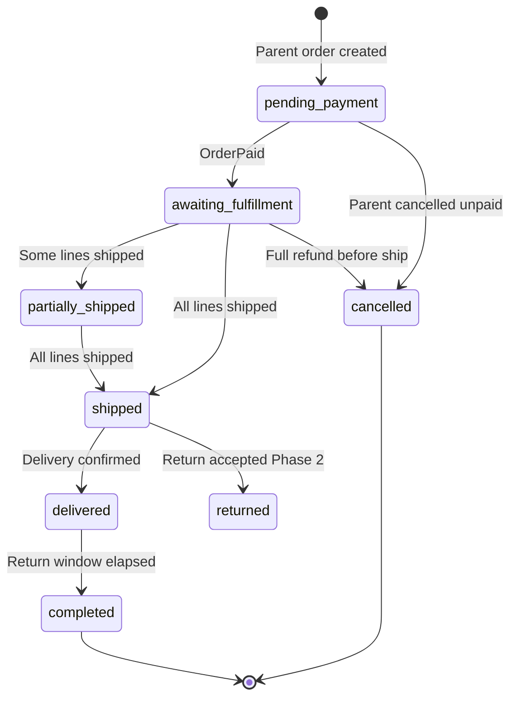
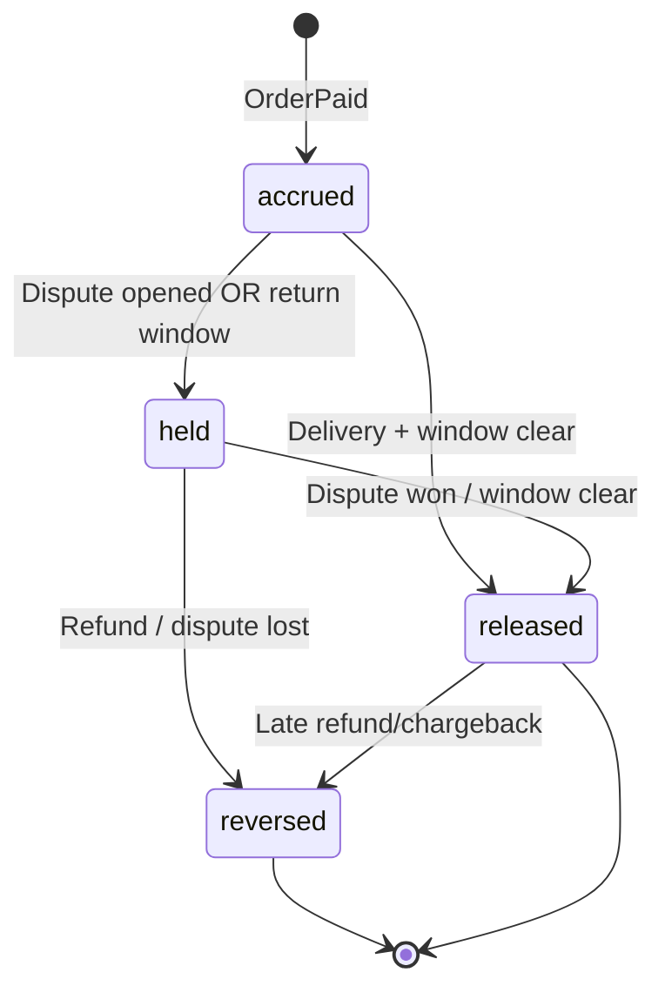
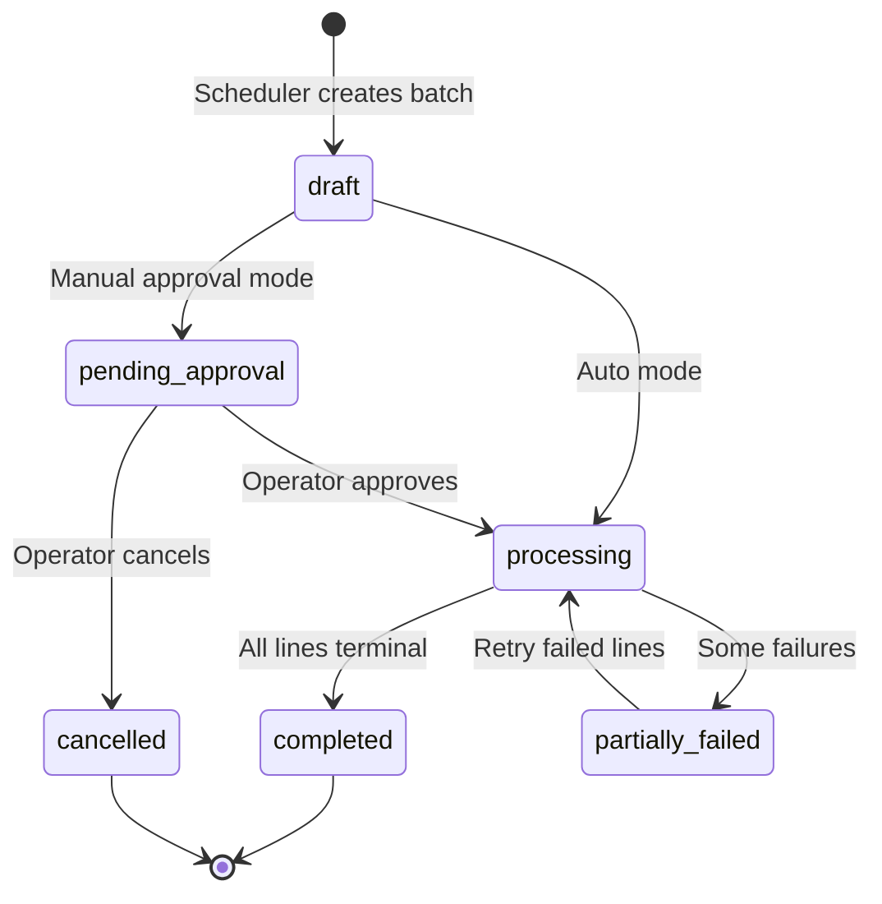
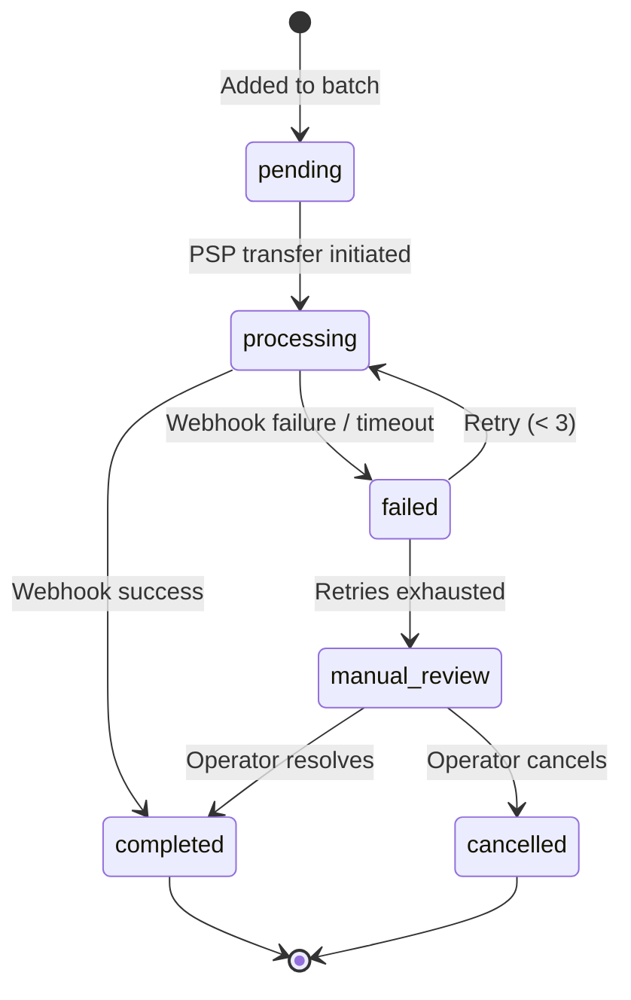
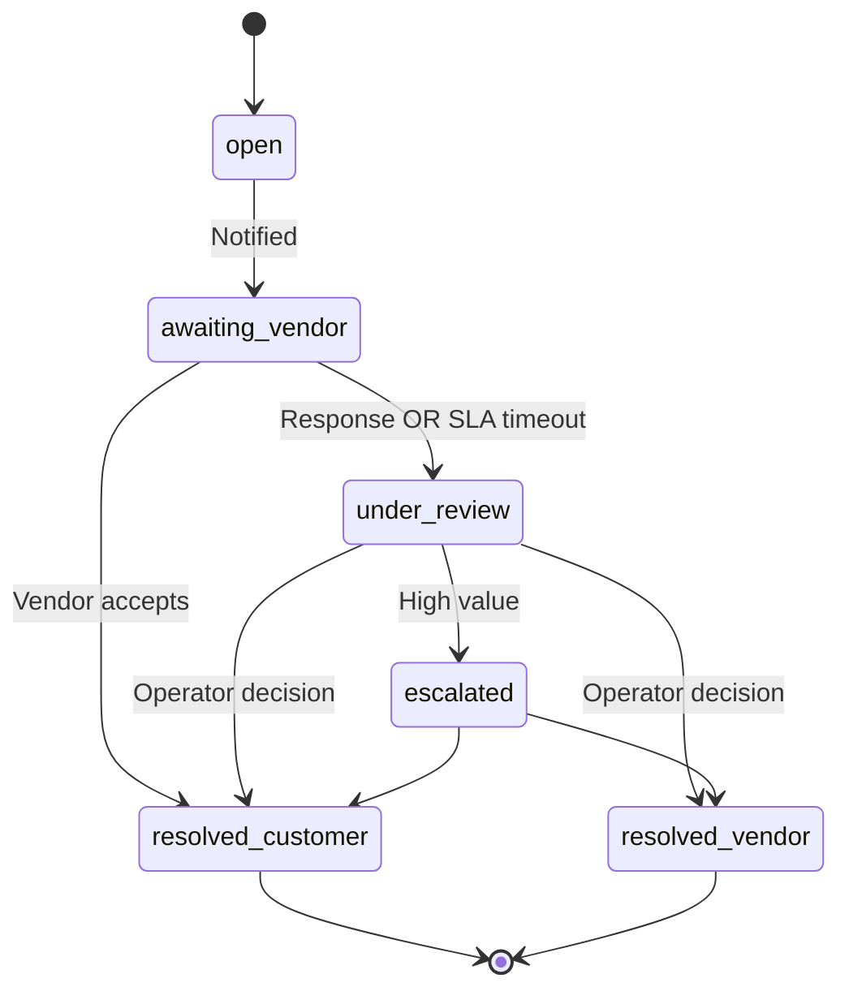
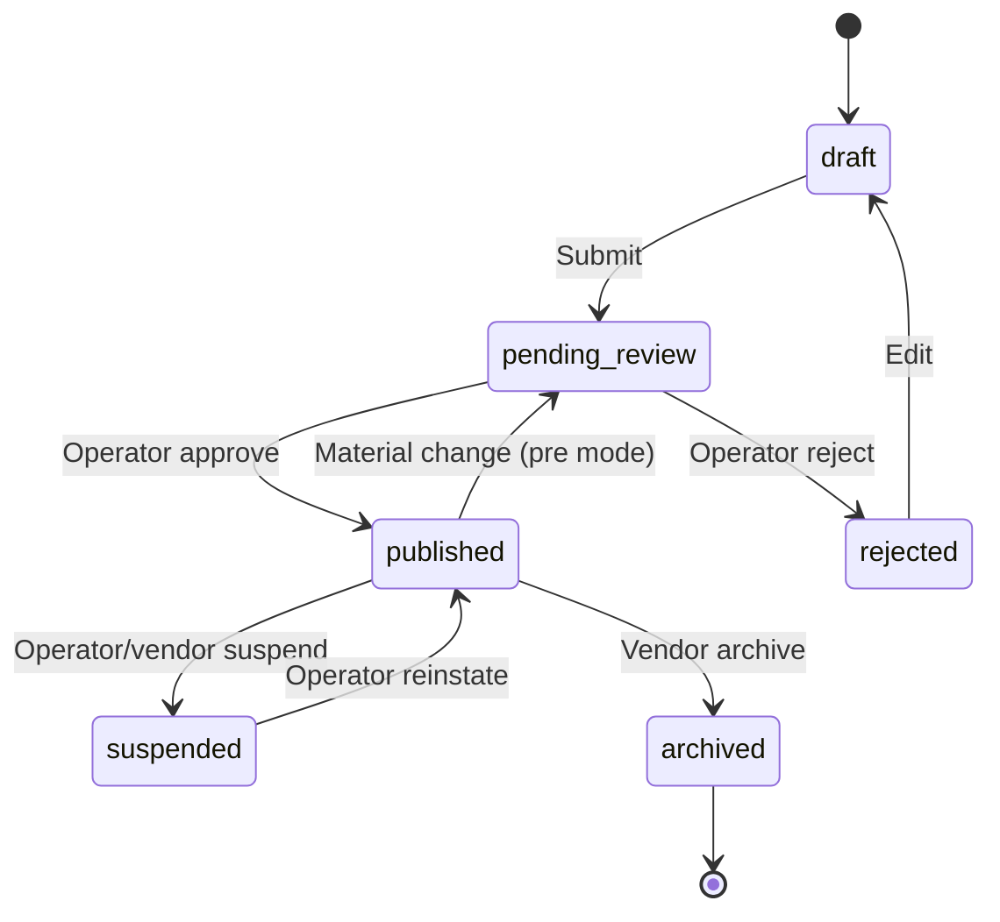

# Chapter 09: State Machines

**Document ID:** SCP-MKT-001-09  
**Version:** 1.0.0  
**Status:** ✅ Active  
**Traceability:** FR-023, Volume 5 Orders  

---

## 1. Purpose

Document authoritative state machines for all marketplace domain aggregates. State transitions are enforced in aggregate root methods — not controller logic — and are immutable once recorded with audit events.

## 2. Scope

- Vendor lifecycle
- Vendor KYC review
- Order vendor split fulfillment
- Commission accrual
- Payout batch and payout line
- Dispute resolution
- Product listing (marketplace)
- Transition guards and side effects

## 3. Out of Scope

- Parent order payment states (Volume 5)
- PSP payment provider internal states

---

## 4. Vendor Lifecycle

### Transition Table

| From | To | Guard | Side Effects |
|------|-----|-------|--------------|
| `invited` | `application_in_progress` | Valid invite token | Create vendor_user membership |
| `application_in_progress` | `pending_review` | Required KYC fields complete | Notify operator |
| `pending_review` | `approved_pending_psp` | Operator role | `VendorApproved` event |
| `pending_review` | `rejected` | Operator role | Notify vendor with reason |
| `approved_pending_psp` | `active` | PSP subaccount exists | Enable listing |
| `active` | `suspended` | Strike critical OR operator | Suspend all products |
| `suspended` | `active` | Operator only | Restore products |
| `*` | `deactivated` | Operator or vendor_owner | Cancel pending listings |

**Terminal restrictions:** `deactivated` vendor cannot reactivate Phase 1; new application required.

---

## 5. Vendor KYC Review

---

## 6. Order Vendor Split (Fulfillment)

Each `order_vendor_split` tracks marketplace fulfillment independently.

### Guards

| Transition | Guard |
|------------|-------|
| → `shipped` | All lines have tracking OR digital delivery sent |
| → `delivered` | Carrier webhook OR vendor manual + customer confirm |
| → `completed` | `now > delivered_at + hold_days` AND no open disputes |
| → `cancelled` | Operator/vendor cancel rules; inventory released |

---

## 7. Commission Status

**Invariant:** Sum of `released` − `reversed` = vendor earnable commission for line.

---

## 8. Payout Batch

---

## 9. Payout Line

---

## 10. Dispute

---

## 11. Product Listing (Marketplace)

**Material change triggers:** price ±50%, title change, category change, primary image change.

---

## 12. Implementation Rules

| Rule | Detail |
|------|--------|
| SM-001 | State stored as PostgreSQL enum + `status_changed_at` |
| SM-002 | Invalid transitions throw `InvalidStateTransitionException` |
| SM-003 | Every transition emits domain event with `{from, to, actor_id}` |
| SM-004 | Background jobs only advance states via aggregate service methods |
| SM-005 | Admin override transitions require `merchant_owner` + audit reason |
| SM-006 | State history table `status_transitions` append-only per entity |

### status_transitions schema

| Column | Type |
|--------|------|
| `id` | UUID |
| `entity_type` | string |
| `entity_id` | UUID |
| `from_status` | string |
| `to_status` | string |
| `actor_user_id` | UUID nullable |
| `reason` | text nullable |
| `created_at` | timestamp |

---

## 13. Concurrency

- Optimistic locking via `version` column on aggregates
- Payout batch processing uses row-level lock `FOR UPDATE SKIP LOCKED`
- Dispute resolution idempotent on dispute_id + target status

---

## 14. Testing Strategy

| Test Type | Coverage |
|-----------|----------|
| Unit | Every allowed transition |
| Unit | Every forbidden transition throws |
| Integration | Side effects (events, jobs) fire once |
| Property | Commission released only from valid fulfillment path |

---

## 15. Acceptance Criteria

1. All marketplace aggregates have documented state diagrams.
2. Invalid vendor transition `active → invited` rejected in tests.
3. Payout retry capped at 3 from `failed`.
4. Commission cannot reach `released` while dispute `open`.
5. Status history records every transition with actor.

## 16. Related Chapters

- Chapter 02 — Vendor onboarding transitions
- Chapter 05 — Payout processing
- Chapter 06 — Dispute flows
- Chapter 07 — Product listing
