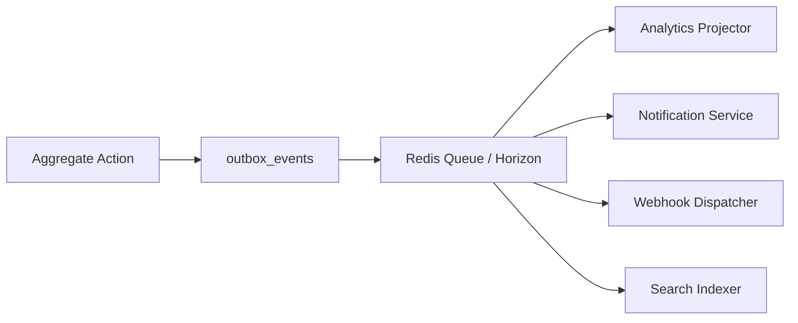

# Chapter 10: API & Events

**Document ID:** SCP-MKT-001-10  
**Version:** 1.0.0  
**Status:** ✅ Active  
**Traceability:** FR-024, API-First principle  

---

## 1. Purpose

Define REST API contracts, domain events, webhooks, and background job interfaces for the Marketplace module — enabling vendor portal, operator admin, and future developer integrations.

## 2. Scope

- API versioning and authentication
- Operator marketplace endpoints
- Vendor-scoped endpoints
- Request/response schemas (representative)
- Domain events catalog
- Outbound webhooks
- Idempotency and error conventions

## 3. Out of Scope

- GraphQL (Phase 2, Volume 12)
- Public third-party vendor API (Phase 2)

## 4. API Conventions

| Convention | Value |
|------------|-------|
| Base URL | `/api/v1` |
| Auth | Bearer Sanctum token |
| Tenant context | `X-Tenant-Id` or subdomain resolution |
| Vendor context | Token claim `vendor_id` or `/vendor/*` routes |
| Pagination | Cursor-based `?cursor=&limit=` (default 25, max 100) |
| Money | Integer kobo in JSON (`amount_kobo`) + `currency: "NGN"` |
| Idempotency | `Idempotency-Key` header on POST (24h window) |
| Errors | RFC 7807 Problem Details |

### Error Example

```json
{
  "type": "https://scp.sapphital.com/errors/invalid-state-transition",
  "title": "Invalid State Transition",
  "status": 422,
  "detail": "Vendor cannot transition from suspended to application_in_progress",
  "instance": "/api/v1/stores/abc/vendors/def/approve"
}
```

---

## 5. Operator Endpoints

### 5.1 Vendors

| Method | Path | Description |
|--------|------|-------------|
| GET | `/stores/{store_id}/vendors` | List vendors |
| POST | `/stores/{store_id}/vendors/invitations` | Invite vendor |
| GET | `/stores/{store_id}/vendors/{vendor_id}` | Vendor detail |
| POST | `/stores/{store_id}/vendors/{vendor_id}/approve` | Approve KYC |
| POST | `/stores/{store_id}/vendors/{vendor_id}/reject` | Reject KYC |
| POST | `/stores/{store_id}/vendors/{vendor_id}/suspend` | Suspend |
| POST | `/stores/{store_id}/vendors/{vendor_id}/reinstate` | Reinstate |
| GET | `/stores/{store_id}/vendors/kyc-queue` | Pending KYC |

**List response (abbreviated):**

```json
{
  "data": [
    {
      "id": "550e8400-e29b-41d4-a716-446655440000",
      "business_name": "Amara Fashion Ltd",
      "slug": "amara-fashion",
      "status": "active",
      "trust_score": 88,
      "commission_tier": { "id": "...", "name": "Standard", "rate_bps": 800 },
      "created_at": "2026-03-15T10:00:00+01:00"
    }
  ],
  "meta": { "next_cursor": "..." }
}
```

### 5.2 Commission Configuration

| Method | Path | Description |
|--------|------|-------------|
| GET | `/stores/{store_id}/commission-tiers` | List tiers |
| POST | `/stores/{store_id}/commission-tiers` | Create tier |
| PATCH | `/stores/{store_id}/commission-tiers/{id}` | Update tier |
| GET | `/stores/{store_id}/commission-rules` | List overrides |
| POST | `/stores/{store_id}/commission-rules` | Create override |

### 5.3 Payouts (Operator)

| Method | Path | Description |
|--------|------|-------------|
| GET | `/stores/{store_id}/payout-batches` | List batches |
| POST | `/stores/{store_id}/payout-batches` | Trigger manual batch |
| POST | `/stores/{store_id}/payout-batches/{id}/approve` | Approve draft batch |
| GET | `/stores/{store_id}/payouts` | List all payout lines |
| POST | `/stores/{store_id}/vendors/{vendor_id}/hold` | Manual hold |

### 5.4 Disputes (Operator)

| Method | Path | Description |
|--------|------|-------------|
| GET | `/stores/{store_id}/disputes` | List disputes |
| GET | `/stores/{store_id}/disputes/{id}` | Dispute detail |
| POST | `/stores/{store_id}/disputes/{id}/resolve` | Resolve |

**Resolve request:**

```json
{
  "decision": "resolved_customer",
  "resolution_amount_kobo": 1500000,
  "notes": "Tracking never confirmed; full refund",
  "issue_strike": { "severity": "major", "reason": "not_received" }
}
```

### 5.5 Moderation

| Method | Path | Description |
|--------|------|-------------|
| GET | `/stores/{store_id}/moderation/queue` | Pending products |
| POST | `/stores/{store_id}/products/{product_id}/approve` | Approve listing |
| POST | `/stores/{store_id}/products/{product_id}/reject` | Reject listing |

---

## 6. Vendor Endpoints

Base: `/api/v1/vendor` — requires token with `vendor_id`.

| Method | Path | Description |
|--------|------|-------------|
| GET | `/profile` | Vendor profile + trust |
| PATCH | `/profile` | Update public profile |
| GET | `/kyc` | KYC status (masked PII) |
| PUT | `/kyc` | Submit/update KYC |
| POST | `/bank-account/verify` | Verify NUBAN |
| GET | `/products` | List own products |
| POST | `/products` | Create product |
| GET | `/orders` | List sub-orders |
| POST | `/orders/{split_id}/fulfill` | Mark shipped |
| GET | `/commissions` | Commission ledger |
| GET | `/payouts` | Payout history |
| GET | `/balance` | Current balances |
| GET | `/disputes` | List disputes |
| POST | `/disputes/{id}/respond` | Submit response |
| GET | `/analytics/overview` | Analytics |
| POST | `/analytics/export` | Request export |

**Balance response:**

```json
{
  "currency": "NGN",
  "pending_balance_kobo": 2500000,
  "available_balance_kobo": 8750000,
  "held_balance_kobo": 500000,
  "next_payout_at": "2026-07-18T09:00:00+01:00"
}
```

---

## 7. Domain Events

All events include: `event_id`, `tenant_id`, `store_id`, `occurred_at`, `correlation_id`.

### 7.1 Vendor Events

| Event | Trigger | Key Payload |
|-------|---------|-------------|
| `VendorInvitationSent` | Invite created | invitation_id, email |
| `VendorApplicationSubmitted` | KYC submitted | vendor_id |
| `VendorApproved` | Operator approve | vendor_id, approved_by |
| `VendorRejected` | Operator reject | vendor_id, reason |
| `VendorSuspended` | Suspension | vendor_id, reason |
| `VendorReinstated` | Reinstate | vendor_id |
| `VendorPspProvisioned` | Subaccount ready | vendor_id, psp, subaccount_code |

### 7.2 Catalog Events

| Event | Trigger | Key Payload |
|-------|---------|-------------|
| `ProductSubmittedForReview` | Vendor submit | product_id, vendor_id |
| `ProductPublished` | Approved | product_id, vendor_id |
| `ProductRejected` | Moderation reject | product_id, reason |
| `ProductSuspended` | Suspension | product_id, vendor_id |

### 7.3 Financial Events

| Event | Trigger | Key Payload |
|-------|---------|-------------|
| `CommissionAccrued` | OrderPaid | commission_id, order_item_id, amount_kobo |
| `CommissionReleased` | Hold cleared | commission_id, vendor_id |
| `CommissionReversed` | Refund/dispute | commission_id, amount_kobo |
| `VendorBalanceUpdated` | Ledger entry | vendor_id, account, delta_kobo |
| `PayoutBatchCreated` | Scheduler | batch_id, line_count |
| `PayoutInitiated` | Transfer started | payout_id, vendor_id, amount_kobo |
| `PayoutCompleted` | Transfer success | payout_id, psp_reference |
| `PayoutFailed` | Transfer failed | payout_id, failure_reason |

### 7.4 Dispute Events

| Event | Trigger | Key Payload |
|-------|---------|-------------|
| `DisputeOpened` | Customer open | dispute_id, order_id, vendor_id |
| `DisputeEscalated` | SLA breach | dispute_id |
| `DisputeResolved` | Final state | dispute_id, decision, amount_kobo |

### 7.5 Trust Events

| Event | Trigger | Key Payload |
|-------|---------|-------------|
| `VendorTrustScoreUpdated` | Daily job | vendor_id, old_score, new_score |
| `VendorStrikeIssued` | Operator/system | strike_id, severity |

---

## 8. Event Delivery



Outbox pattern ensures atomic write + event publish (FR-024).

---

## 9. Outbound Webhooks (Operator-Configured)

Operators subscribe to marketplace events via Volume 12 webhook system.

| Topic | Example Use |
|-------|-------------|
| `marketplace.vendor.approved` | ERP vendor master sync |
| `marketplace.payout.completed` | Accounting journal |
| `marketplace.dispute.opened` | CRM ticket |

Payload signed with HMAC-SHA256; retry 5× exponential backoff.

---

## 10. Inbound Webhooks (PSP)

| Source | Path | Handler |
|--------|------|---------|
| Paystack | `/webhooks/paystack` | Payment + transfer events |
| Flutterwave | `/webhooks/flutterwave` | Payment + transfer events |

Not duplicated here — cross-reference Volume 5 Payments; marketplace module listens to `PaymentReceived` and `TransferCompleted` internal events.

---

## 11. Background Jobs

| Job | Queue | Priority |
|-----|-------|----------|
| `ProvisionPspSubaccount` | marketplace | high |
| `CalculateCommissionOnOrderPaid` | marketplace | high |
| `ReleaseCommissionsJob` | marketplace | default |
| `GeneratePayoutBatch` | marketplace-payouts | default |
| `ProcessPayoutLine` | marketplace-payouts | high |
| `RecalculateTrustScores` | marketplace-low | low |
| `ProjectVendorDailyMetrics` | analytics | low |

---

## 12. Authorization Matrix (Summary)

| Resource | platform_admin | merchant_owner | merchant_staff | vendor_owner | vendor_staff |
|----------|:--------------:|:--------------:|:--------------:|:------------:|:------------:|
| Approve vendor | ✓ | ✓ | ✗ | ✗ | ✗ |
| View all vendor KYC | ✓ | ✓ | read | ✗ | ✗ |
| Own vendor KYC | — | — | — | ✓ | ✗ |
| Trigger payout batch | ✓ | ✓ | ✗ | ✗ | ✗ |
| Resolve dispute | ✓ | ✓ | ✓ | ✗ | ✗ |
| Respond dispute | — | — | — | ✓ | ✓ |
| Moderate products | ✓ | ✓ | ✓ | ✗ | ✗ |
| CRUD own products | — | — | — | ✓ | ✓ |

Enforced via Laravel Policies + `@can` gates; 100% route coverage in authz test matrix (Volume 11).

---

## 13. Rate Limits

| Endpoint Group | Limit |
|----------------|-------|
| Vendor public application | 5/hour/IP |
| Vendor API general | 300/min/token |
| Operator marketplace API | 600/min/token |
| Webhook endpoints | 1000/min/IP (PSP ranges) |

Return `429` with `Retry-After` (NFR-036).

---

## 14. Acceptance Criteria

1. OpenAPI 3.1 spec generated for all endpoints listed.
2. Every domain event published through outbox with tenant context.
3. Vendor token scoped to single vendor_id; tamper returns 403.
4. Idempotency key prevents duplicate invitations and payout batches.
5. Webhook topics documented and registered in developer portal schema.

## 15. Sources

- Volume 12 Developer Platform (webhook framework)
- ADR-006 Authentication stack
- Paystack webhook docs: https://paystack.com/docs/payments/webhooks/
