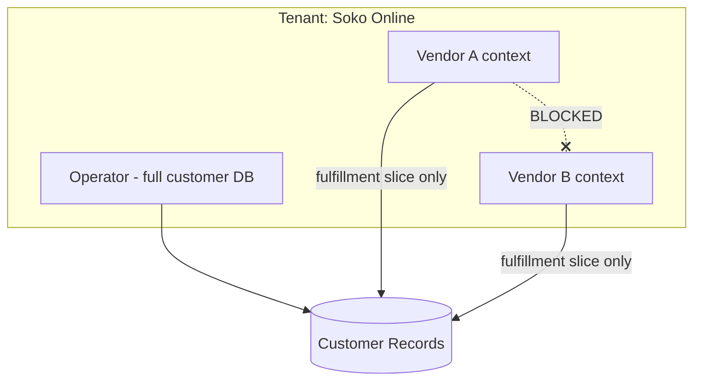

# Chapter 11: Compliance & Tax

**Document ID:** SCP-MKT-001-11  
**Version:** 1.0.0  
**Status:** ✅ Active  
**Traceability:** NFR-083, NFR-085, NFR-071, Volume 11 Ch. 02  

---

## 1. Purpose

Define regulatory, tax, and data protection obligations specific to SCP marketplace operations in **Nigeria** — including NDPA vendor data walls, VAT treatment, vendor tax reporting, and processor/controller responsibilities between operator, platform, and vendors.

## 2. Scope

- NDPA roles and vendor PII isolation
- Nigeria VAT (7.5%) on marketplace sales
- Withholding tax awareness on vendor settlements
- FIRS e-invoicing readiness (Phase 2)
- Vendor agreement requirements (engineering hooks)
- Cross-border expansion preview (Kenya)

## 3. Out of Scope

- Legal text of vendor contracts
- Platform SaaS invoice tax (Sapphital → operator)
- NAFDAC product registration process

## 4. Regulatory Roles

### 4.1 Role Matrix

| Party | NDPA Role | Context |
|-------|-----------|---------|
| **Sapphital (SCP)** | Controller for platform account data; **Processor** for merchant customer data and vendor KYC processed on operator instruction | Multi-tenant SaaS |
| **Marketplace operator (tenant)** | **Controller** for store customers, vendor relationships, marketplace policies | Fatima's Soko Online |
| **Vendor** | Independent controller for their own staff data; **not** controller for shared customer checkout data | Amara Fashion |
| **Paystack / Flutterwave** | Subprocessors | Payment + settlement |
| **Customer** | Data subject | Shopper |

### 4.2 Processing Activities (RoPA Excerpt)

| Activity | Data | Lawful Basis | Retention |
|----------|------|--------------|-----------|
| Vendor KYC | NIN, BVN, ID scans | Contract + legal obligation | Life + 7y financial |
| Customer checkout | Name, address, phone | Contract | Order lifecycle + 7y |
| Vendor fulfillment view | Minimal shipping PII | Contract | Active order + 90d |
| Dispute evidence | Photos, statements | Legitimate interest | 2y post-close |
| Analytics | Aggregates | Legitimate interest / consent | 3y rollups |

---

## 5. NDPA Vendor Data Walls (Mandatory Controls)

Volume 11 requires marketplace **cross-vendor PII walls**. Implementation specification:

### 5.1 Logical Isolation

### 5.2 Technical Controls

| Layer | Control |
|-------|---------|
| API | Policy denies cross-vendor_id access |
| RLS | `vendor_id = current_setting('app.vendor_id')` on splits, disputes, commissions |
| Search | No vendor-scoped customer index |
| Export | Vendor export excludes customer records |
| Logs | PII scrubbed; vendor_id in context |
| AI (Phase 2) | RAG corpus scoped per vendor; no cross-vendor retrieval |

### 5.3 DPIA Trigger

Marketplace mode requires **DPIA** before Nigeria GA covering:

- Large-scale processing of seller and buyer PII
- Automated trust scoring (profiling)
- Cross-border subprocessors (Paystack, Cloudflare, etc.)

DPO sign-off recorded in compliance register.

### 5.4 Data Subject Requests

| Request | Handler |
|---------|---------|
| Customer access/deletion | Operator (controller); SCP tooling assists |
| Vendor access/deletion | Operator + SCP; vendor portal self-service export |
| Vendor requests customer deletion | Operator decides; SCP executes |

SLA: 14 days target (30 days statutory max NDPA §34–38).

### 5.5 Breach Scenarios

| Scenario | Notification |
|----------|--------------|
| Cross-vendor data leak | SEV1; NDPC ≤ 72h if rights/freedoms risk |
| KYC document exposure | SEV1; affected vendors notified |
| PSP breach | Processor notification from Paystack/Flutterwave |

Runbook: Volume 11 Chapter 06.

---

## 6. Nigeria VAT (Value Added Tax)

### 6.1 Current Rate

**7.5% VAT** on vatable goods and services (Finance Act amendments — verify rate at implementation with tax advisor).

### 6.2 Marketplace VAT Model (Phase 1)

SCP implements **operator-configurable VAT display** aligned with common Nigerian e-commerce practice:

| Mode | Behavior |
|------|----------|
| `vat_inclusive` (default) | Display prices include VAT; checkout shows VAT breakdown |
| `vat_exclusive` | VAT added at checkout |

**Tax snapshot** on order placement stores:

- `vat_rate_bps` (750 = 7.5%)
- `vat_amount_kobo` per line
- `vendor_id` for vendor-attributed lines

### 6.3 Vendor vs Operator VAT Responsibility

| Scenario | Responsibility |
|----------|----------------|
| Vendor sells own goods | Vendor remits VAT (operator may collect and remit if agency model — operator setting) |
| Operator sells own goods on same store | Operator remits |
| Platform fee invoice (SCP → operator) | Sapphital VAT on SaaS fees (separate billing module) |

**Assumption:** Legal confirms whether operator acts as **VAT collection agent** for vendors. Engineering supports `marketplace.vat_collection_agent = true|false`.

When agent mode enabled:

- Checkout collects VAT on vendor lines
- Operator liability report includes vendor attribution
- Payout to vendor is **net of VAT** held in operator tax wallet

### 6.4 VAT Reporting Exports

Operator dashboard exports:

- Daily/weekly VAT summary by vendor
- CSV: order_id, vendor_id, taxable_base_kobo, vat_kobo, date

---

## 7. Withholding Tax (WHT)

Nigeria WHT may apply to vendor payments for services (typical rates 5–10% depending on classification — **tax advisor confirmation required**).

SCP Phase 1:

| Feature | Status |
|---------|--------|
| WHT rate config per vendor category | Supported |
| WHT deduction on payout | Optional operator setting |
| WHT certificate tracking | Phase 2 |
| Remittance reporting | Export CSV |

**Default:** WHT **not** auto-deducted until operator enables with documented rate schedule.

---

## 8. FIRS E-Invoicing (Phase 2 Readiness)

Nigeria is progressing toward mandatory e-invoicing via FIRS systems.

| Phase 1 | Phase 2 |
|---------|---------|
| Store structured invoice JSON on order | Integrate FIRS API when mandated |
| UUID invoice number per order | Real-time fiscalization |
| Operator export for manual filing | Automated submission |

Invoice record links `order_vendor_split_id`, VAT breakdown, operator TIN, vendor TIN (optional field).

---

## 9. Vendor Compliance Requirements

Engineering enforces prerequisites; legal owns policy text.

| Requirement | Gate |
|-------------|------|
| Accepted vendor terms | Before KYC submit |
| Prohibited categories acknowledgment | Before first listing |
| Valid KYC | Before publish + payout |
| Tax ID (TIN) optional Phase 1 | Required Phase 2 for WHT |
| NDPR/NDPA consent notice | Vendor signup |

Vendor terms checkbox version stored: `vendor_terms_accepted_version`, `accepted_at`.

---

## 10. Kenya Expansion (Parallel)

When marketplace launches in Kenya:

| Topic | Kenya Approach |
|-------|----------------|
| Privacy | ODPC registration; KE-region data (NFR-084) |
| VAT | 16% VAT — separate rate table |
| M-Pesa payouts | Phase 2 split via Paystack KE / native M-Pesa |
| Vendor KYC | IPRS verification Phase 2 |

Pan-Africa privacy core (NFR-085) unified consent and export APIs.

---

## 11. Record Retention

| Record | Retention |
|--------|-----------|
| Orders and commissions | 7 years |
| KYC documents | Life of vendor + 7 years |
| Payout records | 7 years |
| Dispute evidence | 2 years post-close |
| Analytics rollups | 3 years |
| Rejected vendor application | 90 days then purge |

Automated purge jobs with DPO-approved schedule.

---

## 12. Audit & CAR Support

Nigeria NDPC Compliance Audit Return (CAR) requires evidence of technical measures. Marketplace contributes:

- RLS isolation test reports
- KYC encryption verification
- Access logs for KYC views
- DPIA for marketplace + trust scoring
- Subprocessor register entries for Paystack/Flutterwave

---

## 13. Business Rules

| ID | Rule |
|----|------|
| BR-REG-001 | No payout to vendor with expired KYC |
| BR-REG-002 | Customer marketing use of phone/email by vendor prohibited without consent |
| BR-REG-003 | VAT snapshot immutable after order paid |
| BR-REG-004 | Cross-border customer PII transfer follows NDPA §41–43 mechanisms |
| BR-REG-005 | Vendor TIN change triggers operator review |

---

## 14. Acceptance Criteria

1. DPIA checklist completed for marketplace feature set.
2. Vendor cannot access other vendor or full customer PII — isolation tests pass.
3. VAT breakdown stored on order and visible in operator export.
4. Vendor terms acceptance version recorded.
5. RoPA includes all marketplace processing activities listed in §4.2.
6. KYC purge job respects 90-day rejected application rule.

## 15. Sources

- Nigeria NDPA 2023: https://ndpc.gov.ng/
- NDPC GAID 2025: https://ndpc.gov.ng/wp-content/uploads/2025/03/NDP-ACT-GAID-2025-MARCH-20TH.pdf
- Volume 11 Chapter 02 — Africa Regulatory Compliance
- FIRS VAT guidance (verify current with tax advisor — E2)
- ADR-011 Data residency Nigeria primary
