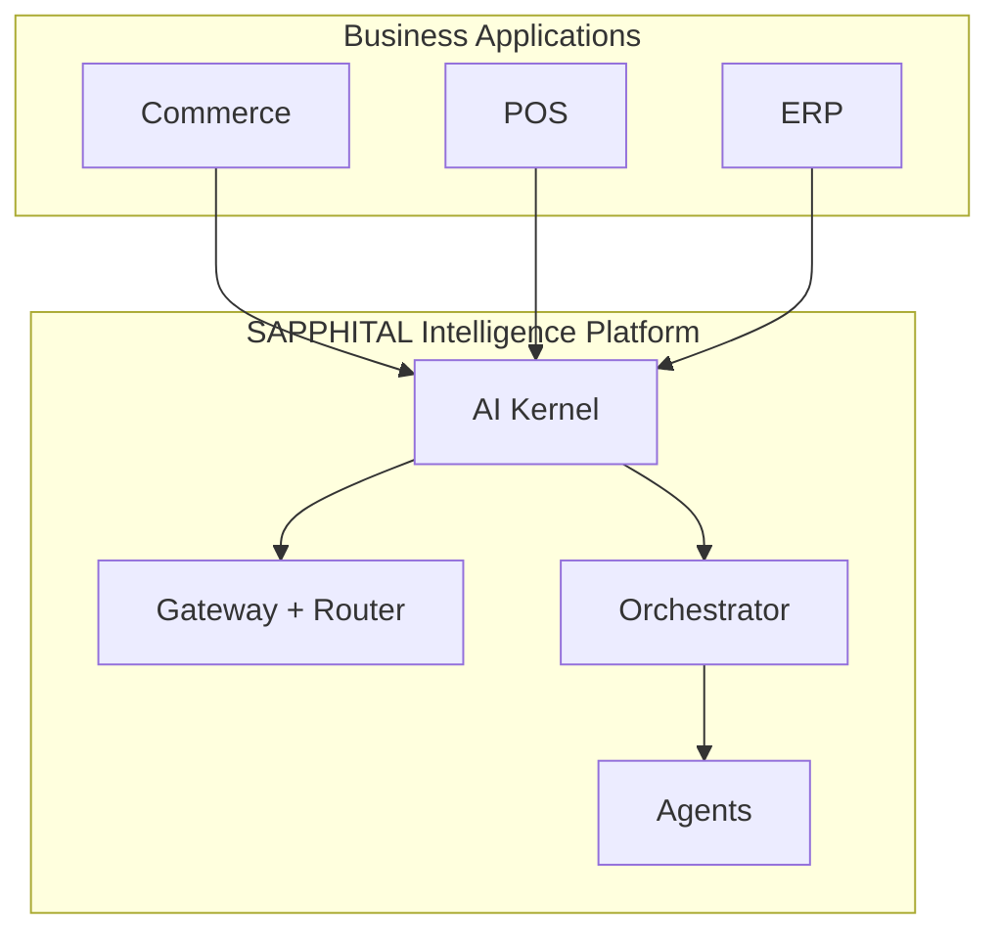

# Chapter 01: AI Platform Overview

**Document ID:** SCP-AI-001-01  
**Version:** 1.1.0  
**Status:** ✅ Active  
**Traceability:** PRD-AI-001, NFR-040, NFR-062 – NFR-068, NFR-079, NFR-083, NFR-085  

---

## 1. Purpose

Define **SAPPHITAL Intelligence Platform (SIP)** — the **AI Operating System** for SAPPHITAL products. AI is not a chatbot on a website. It is the **intelligence layer** powering commerce, admin, support, developer tools, and future ERP/POS/Learning applications through a shared kernel (ADR-020).

**Design question for every feature:** *How can AI make this faster, smarter, or easier?*

## 2. Scope

- Platform capabilities and agent catalog
- High-level architecture and module boundaries
- Functional requirements (FR-AI-*)
- Integration points with commerce, CMS, CRM, inventory
- Language and localization strategy for Nigeria
- Phase rollout

## 3. Out of Scope

- Provider-specific SDK code
- Fine-tuning or custom model hosting (Phase 3)
- Autonomous checkout without human confirmation (never in Phase 1–2)

## 4. User & Business Value

| Persona | AI Value |
|---------|----------|
| **Customer** | Natural-language product discovery, order tracking, returns guidance in English or Pidgin |
| **Merchant** | Product descriptions, inventory alerts, campaign copy, operational Q&A |
| **Support agent** | Ticket summarization, suggested replies, policy-grounded answers |
| **Platform admin** | Cost dashboards, abuse detection, model health |

**Nigeria context:** Many customers prefer Pidgin or local languages for chat while business admin remains English. SCP optimizes for code-switching and mixed-language queries common in Lagos, Abuja, and Port Harcourt commerce.

## 5. Architecture Impact

Intelligence is a **platform module** (`App\Domains\Intelligence`) consumed by Commerce and other SAPPHITAL apps — not embedded inside checkout or catalog.



See [Ch. 17 — AI OS Architecture](./17-ai-operating-system-architecture.md) for seven layers and three-platform ecosystem.

**Phase 3 extraction candidate:** Gateway and embedding workers when sustained AI RPS exceeds 500 (NFR-017).

## 6. Capability Map

| Capability | Description | Primary Agent / Service |
|------------|-------------|-------------------------|
| Conversational commerce | Guided shopping, cart assistance | Shopping Assistant |
| Merchant copilot | Catalog, orders, analytics Q&A | Merchant Ops Agent |
| Customer support | Ticket assist, FAQ, escalation | Support Agent |
| Content generation | Product copy, blog, email drafts | Marketing Agent |
| Demand signals | Stock alerts, reorder suggestions | Inventory Agent |
| Semantic search | Natural language product discovery | RAG + Commerce Search |
| Tool execution | CRUD and workflow actions via guarded tools | Agent Orchestrator |

## 7. Functional Requirements

| ID | Requirement | Phase |
|----|-------------|-------|
| FR-AI-001 | Multi-model gateway with tenant-configurable primary model | 1 |
| FR-AI-002 | Tenant-scoped RAG over products, policies, CMS pages | 1 |
| FR-AI-003 | Shopping assistant on storefront (opt-in per store) | 1 |
| FR-AI-004 | Merchant ops copilot in admin | 1 |
| FR-AI-005 | Support agent assist in helpdesk console | 1 |
| FR-AI-006 | Tool calling with authorization checks per tool | 1 |
| FR-AI-007 | Short-term (session) and long-term (profile) memory | 1 |
| FR-AI-008 | Per-tenant AI usage metering and plan limits | 1 |
| FR-AI-009 | Pidgin English conversational mode | 1 |
| FR-AI-010 | Hausa, Yoruba, Igbo assistant modes | 1.5 |
| FR-AI-011 | Human-in-the-loop for publish, refund, price change | 1 |
| FR-AI-012 | AI feature disable per tenant / per module | 1 |
| FR-AI-013 | Full audit trail of agent tool invocations | 1 |
| FR-AI-014 | DPIA register entry before GA of each new agent | 1 |
| FR-AI-016 | Task-based model router (no user model selection) | 1 |
| FR-AI-017 | Prompt versioning with rollback | 2 |
| FR-AI-018 | AI workflow engine on domain events | 2 |
| FR-AI-019 | Multi-agent orchestration for complex tasks | 2 |
| FR-AI-020 | Recommendation explainability + confidence | 1 |
| FR-AI-021 | AI observability dashboard (health, cost, CSAT) | 2 |
| FR-AI-022 | Skills marketplace install (Phase 3) | 3 |

## 8. Data Ownership

| Entity | Owner Module | Tenant Scoped |
|--------|--------------|---------------|
| `ai_conversations` | AI Platform | Yes |
| `ai_messages` | AI Platform | Yes |
| `ai_memory_facts` | AI Platform | Yes |
| `ai_embeddings` | AI Platform | Yes |
| `ai_prompt_templates` | AI Platform | Platform + tenant overrides |
| `ai_usage_ledger` | AI Platform / Billing | Yes |
| `ai_tool_invocations` | AI Platform | Yes |
| Product/catalog source data | Commerce | Yes (read by RAG) |

All `ai_*` tables include `tenant_id UUID NOT NULL` and RLS policies per ADR-002.

## 9. API Surfaces (Summary)

| Endpoint | Method | Auth | Purpose |
|----------|--------|------|---------|
| `/api/v1/ai/chat` | POST | Customer session / Sanctum | Storefront assistant turn |
| `/api/v1/ai/admin/chat` | POST | Merchant staff | Merchant ops copilot |
| `/api/v1/ai/support/suggest` | POST | Support role | Suggested reply |
| `/api/v1/ai/embeddings/reindex` | POST | Merchant owner | Trigger catalog re-embed |
| `/api/v1/ai/usage` | GET | Merchant owner | Usage and limits |

Full OpenAPI contracts live in Volume 12 Developer Platform; this volume defines behavior and authorization rules.

## 10. Events

| Event | Payload Highlights | Consumers |
|-------|-------------------|-----------|
| `AIConversationStarted` | tenant_id, channel, agent_type, locale | Analytics |
| `AIMessageCompleted` | tokens_in, tokens_out, model, latency_ms | Billing meter, observability |
| `AIToolInvoked` | tool_name, args_hash, result_status | Audit log |
| `AIContentProposed` | entity_type, diff_summary | Admin UI approval queue |
| `AIContentPublished` | entity_id, actor | CMS / Commerce |
| `AIEmbeddingIndexCompleted` | document_count, duration | Merchant notification |
| `AISafetyViolationDetected` | category, action_taken | Security SIEM |

## 11. Background Jobs

| Job | Trigger | SLA |
|-----|---------|-----|
| `EmbedProductCatalogJob` | Product create/update, nightly reconcile | p95 ≤ 5 min per 1K products |
| `EmbedCmsPagesJob` | Page publish | p95 ≤ 2 min per 100 pages |
| `PruneAIConversationJob` | Retention policy | Daily |
| `AggregateAIUsageJob` | Hourly | For billing dashboard |
| `RedactExpiredMemoryJob` | DSAR deletion, retention | Within 24h of request |

## 12. Security Considerations

- **No cross-tenant retrieval:** RAG queries always filter `tenant_id` + `store_id` when applicable
- **Tool authorization:** Every tool call re-validates Laravel policy + tenant membership
- **Prompt injection:** System prompts treat user content as untrusted; see Ch. 09
- **PII minimization:** Memory stores facts, not raw payment or government ID data
- **Subprocessors:** Model providers listed in privacy subprocessor register (Ch. 11)
- **Fail-closed:** Missing tenant context aborts AI request (NFR-040, OWASP A10)

## 13. Performance Targets

| Metric | Target | Phase |
|--------|--------|-------|
| First token (streaming chat, p95) | ≤ 800 ms | 1 |
| Full turn with 1 tool call (p95) | ≤ 3.5 s | 1 |
| RAG retrieval (p95) | ≤ 120 ms | 1 |
| Embedding batch (1K products) | ≤ 10 min | 1 |
| Concurrent agent sessions per tenant | 50 | 1 → 500 Phase 3 |

## 14. Observability Requirements

Every agent turn emits an OpenTelemetry span tree:

```text
ai.agent.turn
├── ai.gateway.completion
├── ai.rag.retrieve
├── ai.tool.{tool_name}  (0..n)
└── ai.safety.evaluate
```

Structured log fields (required): `tenant_id`, `store_id`, `conversation_id`, `agent_type`, `model`, `tokens_in`, `tokens_out`, `cost_usd_micros`, `locale`, `trace_id`.

Business metrics: conversations/day, tool success rate, human approval rate, safety block rate.

## 15. Tenant Isolation Rules

1. Conversation and memory keys include `tenant_id`
2. Vector search SQL: `WHERE tenant_id = $1` before `ORDER BY embedding <=> $2`
3. Cache keys: `ai:{tenant_id}:{resource}`
4. Queue jobs carry `tenant_id`; workers call `SET LOCAL app.tenant_id`
5. Isolation test suite covers AI tables (Ch. 12)

## 16. Accessibility

- Chat widget: WCAG 2.2 AA, keyboard navigable, screen reader labels for messages
- AI-generated storefront content must pass same a11y checks as merchant-authored content
- Reduced motion: disable typing animations when `prefers-reduced-motion`

## 17. Operational Implications

- Provider outages: gateway fallback chain (Ch. 02)
- Cost spikes: per-tenant budgets auto-throttle (Ch. 10)
- Model deprecation: prompt template versioning + regression eval suite before switch
- DPO review: annual AI RoPA update including new agents

## 18. Risks & Tradeoffs

| Risk | Mitigation |
|------|------------|
| Hallucinated product claims | RAG grounding + cite sources + merchant approval for publish |
| Cross-tenant data leak via embeddings | RLS + isolation tests + no shared vector namespaces |
| Runaway token costs | Hard caps, streaming stop, plan entitlements |
| Regulatory scrutiny on automated decisions | DPIA, human-in-the-loop for material actions |
| Low-resource language quality | Phase 1.5 eval harness per language; fallback to English with notice |

## 19. Phase Rollout

| Phase | Deliverables |
|-------|--------------|
| **1** | Gateway, RAG, orchestrator, shopping + merchant + support agents, English + Pidgin |
| **1.5** | Hausa, Yoruba, Igbo; improved code-switching |
| **2** | Marketing + inventory agents; advanced memory |
| **3** | Optional dedicated AI service; on-prem enterprise gateway |

## 20. Acceptance Criteria (Chapter)

- [ ] FR-AI-001 through FR-AI-014 mapped to modules and tests
- [ ] Architecture diagram reviewed against Volume 3 C4 model
- [ ] All `ai_*` entities in domain model appendix
- [ ] Nigeria language roadmap agreed with product

## 21. Sources

- OpenAI function calling: https://platform.openai.com/docs/guides/function-calling
- Anthropic tool use: https://docs.anthropic.com/en/docs/build-with-claude/tool-use
- pgvector: https://github.com/pgvector/pgvector
- NDPA 2023: https://ndpc.gov.ng/
- Nigeria language demographics (E1/E3): NPC, ethnologue patterns for Hausa/Yoruba/Igbo digital adoption

## 22. Related Documents

- [Ch. 02 Model Gateway](./02-model-gateway.md)
- [Ch. 11 DPIA & NDPA](./11-dpia-compliance-ndpa.md)
- [Volume 11 Security — AI checklist](../11-security/04-security-architecture.md)
- [Product Principle 4 — AI invisible until needed](../01-vision/04-product-principles.md)
