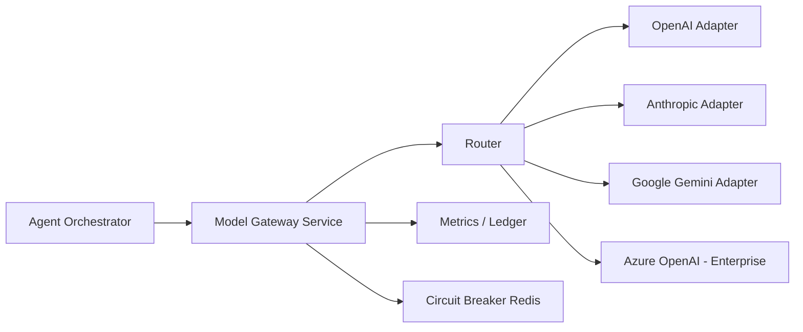

# Chapter 02: Model Gateway

**Document ID:** SCP-AI-001-02  
**Version:** 1.0.0  
**Status:** 📝 Draft  
**Traceability:** FR-AI-001, NFR-003, NFR-004, NFR-045, NFR-071, ADR-007, ADR-011  

---

## 1. Purpose

Specify the **multi-model gateway** that abstracts LLM providers behind a single internal API. The gateway handles routing, retries, fallbacks, streaming, token accounting, and tenant-aware configuration without leaking provider details to storefront clients.

## 2. Scope

- Provider matrix and selection policy
- Request/response contract
- Streaming semantics
- Fallback and circuit breaking
- Secret management and residency
- Cost attribution
- Observability hooks

## 3. Out of Scope

- Prompt template content (orchestrator + per-agent chapters)
- Fine-tuned model hosting
- Image/video generation (Phase 2+ evaluation)

## 4. Architecture



**Design principle:** Orchestrator never calls providers directly. All completions pass through gateway for consistent telemetry, policy enforcement, and key rotation.

## 5. Provider Matrix (Phase 1)

| Provider | Models | Use Case | Nigeria Notes |
|----------|--------|----------|---------------|
| OpenAI | `gpt-4.1-mini`, `gpt-4.1` | Default chat, tool calling | Strong Pidgin/English; disclose in subprocessor list |
| Anthropic | `claude-sonnet-4` | Long context merchant ops | Fallback primary |
| Google | `gemini-2.0-flash` | High-volume, lower cost turns | Good latency from African egress via Google edge |
| Azure OpenAI | Tenant-dedicated deployment | Enterprise tier Phase 3 | EU/US regions only when contract requires |

**Assumption:** Phase 1 default model is `gpt-4.1-mini` for cost/latency balance.  
**Validation needed:** A/B eval on Nigerian commerce prompts before GA lock.

Local/open-weight models (e.g., Llama via dedicated GPU) are **Phase 3** for tenants requiring no third-party prompt processing.

## 5.1 Task-Based Model Router

The router selects models by **task type** — users and agents never pick providers directly.

| Task | Primary route | Fallback |
|------|---------------|----------|
| Long-form writing (descriptions, blogs) | Claude | GPT quality tier |
| Fast chat / high volume | GPT mini / Gemini Flash | DeepSeek |
| Vision (product, receipt, barcode) | GPT Vision | Gemini Pro Vision |
| Code / theme scaffold | Claude Opus / GPT | — |
| Translation / multilingual | Gemini | GPT |
| Deep reasoning / analysis | OpenAI reasoning tier | Claude |
| Embeddings | OpenAI / dedicated embed model | — |
| Self-hosted (enterprise Phase 3) | Llama / Mistral | Cloud fallback |

Router inputs: `task_type`, `tenant_policy`, `latency_budget_ms`, `cost_budget_micros`, provider circuit breaker state.

See [Ch. 17](./17-ai-operating-system-architecture.md) and [Ch. 21](./21-ai-observability-prompts-security-learning.md).

## 6. Internal API Contract

### Request (`CompletionRequest`)

```json
{
  "tenant_id": "uuid",
  "store_id": "uuid | null",
  "conversation_id": "uuid",
  "agent_type": "shopping_assistant | merchant_ops | support | marketing | inventory",
  "model_preference": "auto | fast | quality",
  "messages": [
    { "role": "system", "content": "..." },
    { "role": "user", "content": "..." }
  ],
  "tools": [ { "name": "search_products", "parameters": {} } ],
  "tool_choice": "auto | none | required",
  "stream": true,
  "max_tokens": 1024,
  "temperature": 0.3,
  "locale": "en-NG | pcm-NG | ha | yo | ig",
  "metadata": { "trace_id": "...", "user_id": "uuid" }
}
```

### Response (`CompletionResponse`)

```json
{
  "id": "completion_uuid",
  "model_used": "gpt-4.1-mini",
  "provider": "openai",
  "message": { "role": "assistant", "content": "...", "tool_calls": [] },
  "usage": { "tokens_in": 450, "tokens_out": 120, "cost_usd_micros": 890 },
  "latency_ms": 1240,
  "finish_reason": "stop | tool_calls | length | safety"
}
```

## 7. Routing Policy

| `model_preference` | Behavior |
|--------------------|----------|
| `auto` | Router picks by agent_type defaults + tenant plan |
| `fast` | Prefer flash-class models; max 2s target first token |
| `quality` | Prefer largest available within plan cap |

**Tenant overrides:** Merchant owner may set primary/fallback in Settings → AI (Enterprise: custom deployment ID).

**Routing algorithm:**

1. Check tenant entitlement for model tier
2. Check circuit breaker state per provider
3. Apply locale hint (some models better for Yoruba — config table updated after Phase 1.5 eval)
4. Select primary; on retryable error, fall back within 300 ms budget

## 8. Streaming

- Server-Sent Events (SSE) from `/api/v1/ai/chat` through gateway
- Chunks: `delta.content`, `delta.tool_call`, `usage`, `done`
- Client disconnect cancels upstream provider request within 500 ms
- Partial streams never persisted until turn completes or `cancelled` event logged

## 9. Retries & Circuit Breaking

| Error Class | Action |
|-------------|--------|
| 429 rate limit | Exponential backoff, alternate provider |
| 5xx provider | 2 retries then fallback |
| 400 policy violation | No retry; safety layer handles |
| Timeout (>30s) | Abort; return graceful error to user |

Circuit breaker (Redis): 5 failures / 60s → open 120s → half-open probe.

## 10. Secrets Management

Per ADR-007:

- Provider keys in encrypted env / Vault; never in DB
- Keys scoped: platform default + optional per-tenant enterprise key
- Rotation: quarterly or on incident; gateway supports dual-key warm period

## 11. Data Residency & Cross-Border Transfer

Model API calls transmit prompts containing tenant commerce data. This is a **cross-border transfer** under NDPA §41–43.

| Control | Implementation |
|---------|----------------|
| Transparency | OpenAI, Anthropic, Google listed on subprocessor page |
| Transfer mechanism | Standard contractual clauses + provider DPA |
| Minimization | Strip payment PAN, passwords, national IDs before gateway |
| Regional preference | When provider offers region pinning (Azure, Vertex), enterprise tenants may elect |

Primary DB and embeddings remain in Nigeria/West Africa per ADR-011; only inference payload crosses border.

## 12. Cost Attribution

Every completion writes to `ai_usage_ledger`:

| Field | Purpose |
|-------|---------|
| `tokens_in`, `tokens_out` | Metering |
| `cost_usd_micros` | Internal finance; converted to NGN for merchant dashboard |
| `agent_type`, `model`, `provider` | Analytics |
| `billable` | false for platform-internal eval jobs |

## 13. Business Rules

1. Gateway rejects requests without `tenant_id` (fail-closed)
2. `max_tokens` capped by plan (Starter: 2K, Growth: 4K, Enterprise: 8K per turn)
3. Platform admin may globally disable a provider without deploy
4. Tool definitions sanitized: JSON Schema only, no code execution strings
5. Temperature capped at 0.7 for customer-facing agents (reduce hallucination)

## 14. Observability

**Metrics (Prometheus):**

- `ai_gateway_requests_total{provider, model, status}`
- `ai_gateway_latency_seconds{quantile}`
- `ai_gateway_tokens_total{direction}`
- `ai_gateway_fallback_total{from_provider, to_provider}`
- `ai_gateway_circuit_open{provider}`

**Traces:** Span `ai.gateway.completion` with attributes above.

**Alerts:**

- P2: fallback rate > 10% for 15 min
- P1: all providers circuit open
- P2: cost per tenant > 3× 7-day baseline (possible abuse)

## 15. Security

- Request body size limit: 256 KB
- No merchant-supplied model endpoints in Phase 1 (SSRF risk)
- Prompt content logged at `redacted` level in production; full content staging only
- ASVS V14: PII fields masked in logs

## 16. Test Strategy

- Contract tests per provider adapter (VCR cassettes, no live calls in CI)
- Chaos test: simulate 503 → verify fallback
- Load test: 100 concurrent streams per tenant plan limit enforcement
- Secret scan: no keys in repo

## 17. Acceptance Criteria

- [ ] Single internal interface used by all agents
- [ ] Fallback completes within 3s when primary fails
- [ ] Token usage recorded with ±1% accuracy vs provider bills
- [ ] Circuit breaker verified in integration test
- [ ] Subprocessor register includes all Phase 1 providers

## 18. Sources

- OpenAI API reference: https://platform.openai.com/docs/api-reference
- Anthropic Messages API: https://docs.anthropic.com/en/api/messages
- Google Gemini API: https://ai.google.dev/gemini-api/docs
- ADR-007, ADR-011
