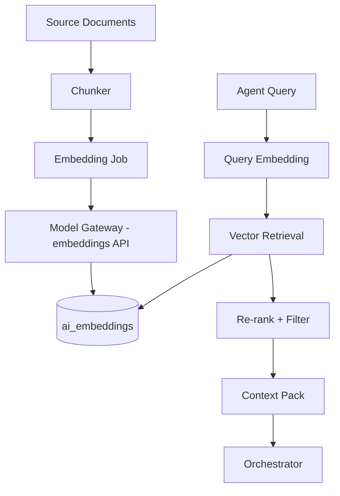

# Chapter 03: RAG & pgvector

**Document ID:** SCP-AI-001-03  
**Version:** 1.0.0  
**Status:** 📝 Draft  
**Traceability:** FR-AI-002, NFR-005, NFR-007, NFR-040, NFR-071, ADR-002, ADR-005  

---

## 1. Purpose

Define SCP's **Retrieval-Augmented Generation (RAG)** pipeline using PostgreSQL `pgvector` extension. Commerce data (products, collections, policies, CMS pages, FAQs) is embedded into tenant-scoped vectors so agents answer with **grounded, citeable** context — critical for Nigerian consumer protection expectations and merchant trust.

## 2. Scope

- Embedding model and dimensions
- Document chunking strategy
- Index schema and RLS
- Ingestion triggers and jobs
- Retrieval API and ranking
- Multilingual embedding behavior (English, Pidgin, Hausa/Yoruba/Igbo roadmap)

## 3. Out of Scope

- Meilisearch lexical search (Volume 5 owns; RAG complements)
- Web crawling external sites
- Customer PII in vector index (explicitly forbidden)

## 4. Architecture



## 5. Data Model

### Table: `ai_embeddings`

| Column | Type | Notes |
|--------|------|-------|
| `id` | UUID PK | |
| `tenant_id` | UUID NOT NULL | RLS |
| `store_id` | UUID NULL | Store-scoped docs |
| `source_type` | enum | `product`, `collection`, `cms_page`, `policy`, `faq`, `shipping_rule` |
| `source_id` | UUID | FK to source entity |
| `chunk_index` | int | 0-based |
| `content_hash` | char(64) | Dedup |
| `content_text` | text | Chunk plain text |
| `metadata` | jsonb | title, locale, price_band, in_stock |
| `embedding` | vector(1536) | Model-dependent dimension |
| `locale` | varchar(10) | `en-NG`, `pcm-NG`, `ha`, `yo`, `ig` |
| `indexed_at` | timestamptz | |

**Indexes:**

```sql
CREATE INDEX ai_embeddings_tenant_source_idx
  ON ai_embeddings (tenant_id, source_type, source_id);

CREATE INDEX ai_embeddings_hnsw_idx
  ON ai_embeddings USING hnsw (embedding vector_cosine_ops)
  WITH (m = 16, ef_construction = 64);
```

**RLS policy:** `tenant_id = current_setting('app.tenant_id')::uuid`

### Table: `ai_embedding_jobs`

Tracks batch status, errors, and merchant-visible reindex progress.

## 6. Embedding Model

| Phase | Model | Dimensions | Rationale |
|-------|-------|------------|-----------|
| 1 | `text-embedding-3-small` (OpenAI) | 1536 | Cost-effective; strong multilingual |
| 3 | Evaluate `voyage-3` or local model | TBD | Cost / residency |

**Nigeria languages:** `text-embedding-3-small` handles English and Pidgin well. Hausa/Yoruba/Igbo quality validated in Phase 1.5 eval set (50 queries per language per vertical).

## 7. Chunking Strategy

| Source Type | Chunk Size | Overlap | Notes |
|-------------|------------|---------|-------|
| Product | 400 tokens | 50 | Title + description + attributes + variants summary |
| CMS page | 500 tokens | 80 | Respect heading boundaries |
| Policy/FAQ | 300 tokens | 40 | One Q&A pair per chunk when possible |
| Shipping rule | 250 tokens | 0 | Structured rule text |

**Rules:**

- Strip HTML to markdown-like plain text
- Include structured metadata in `metadata` jsonb, not duplicated in embedding text
- Never embed customer data, order details, or staff notes

## 8. Ingestion Pipeline

### Real-time triggers

| Domain Event | Action |
|--------------|--------|
| `ProductCreated`, `ProductUpdated` | Queue `EmbedProductJob` |
| `ProductDeleted` | Soft-delete embeddings |
| `CmsPagePublished` | Queue `EmbedCmsPageJob` |
| `PolicyDocumentUpdated` | Re-embed policy chunks |

### Nightly reconcile

`ReconcileEmbeddingsJob` compares `content_hash` vs source; re-embeds drift.

### Merchant-initiated

`POST /api/v1/ai/embeddings/reindex` — owner only; rate limit 1/hour.

## 9. Retrieval API

Internal service `RagRetriever::search(RagQuery $q): RagResult`

```php
// Conceptual — implementation in App\Domains\AI\Services\RagRetriever
RagQuery:
  tenant_id: UUID (required)
  store_id: UUID (optional filter)
  query_text: string
  locale: string
  source_types: array (optional)
  top_k: int (default 8, max 20)
  min_score: float (default 0.72 cosine similarity)
```

**Retrieval steps:**

1. Embed query via gateway embedding endpoint
2. SQL vector search with `tenant_id` + optional `store_id` + `locale` preference
3. Boost in-stock products (+0.05) for shopping assistant
4. MMR deduplication across chunks from same `source_id`
5. Return `ContextPack` with citations: `{source_type, source_id, title, url, excerpt}`

## 10. Performance Targets

| Operation | Target |
|-----------|--------|
| Query embedding | p95 ≤ 150 ms |
| Vector search (top 8, 100K chunks/tenant) | p95 ≤ 80 ms |
| End-to-end RAG retrieve | p95 ≤ 120 ms |
| Re-embed 10K products | ≤ 2 hours background |

**Scaling:** HNSW index per tenant is logical partition via `tenant_id` filter — at >500K chunks platform-wide, evaluate partitioned table by `tenant_id` hash (Phase 3).

## 11. Multilingual RAG

| Locale | Phase | Strategy |
|--------|-------|----------|
| `en-NG` | 1 | Default index |
| `pcm-NG` | 1 | Index English catalog; query-time Pidgin → retrieval uses same vectors; system prompt instructs Pidgin response |
| `ha`, `yo`, `ig` | 1.5 | Optional translated chunk fields in `metadata.translations`; query expansion to English + target language |

**Code-switching:** Queries mixing English and Pidgin ("Abeg show me red sneakers wey dey under 15k") use single embedding; agent responds in matched register.

## 12. Security & Tenant Isolation

- Retrieval SQL must use parameterized `tenant_id` bind
- Integration test: Tenant A query never returns Tenant B chunk even with adversarial embedding
- Prompt injection in product descriptions: chunks tagged `untrusted_merchant_content`; system prompt warns model
- No `SELECT *` without tenant predicate — ASVS access control

## 13. Observability

Spans: `ai.rag.embed`, `ai.rag.retrieve`  
Metrics: `ai_rag_retrieval_latency`, `ai_rag_chunks_returned`, `ai_rag_empty_results_total`  
Log empty retrieval at WARN — may indicate index lag or catalog gap.

## 14. Business Rules

1. Unpublished products never embedded
2. Draft CMS pages not embedded until publish event
3. Marketplace: vendor products embedded only for stores where vendor is active
4. Embeddings deleted within 24h of tenant offboarding cascade
5. DSAR erasure removes embeddings tied to erased customer-linked documents (rare — customer PII not indexed)

## 15. UI Surfaces

- Merchant Admin → Settings → AI → **Search Index Status** (last run, errors, reindex button)
- Platform Admin → tenant drill-down → embedding chunk count

## 16. Test Strategy

- Golden set: 200 Nigeria commerce questions with expected product IDs
- Isolation fuzz: random tenant_id injection attempts
- Regression: chunk hash change detection on product edit
- Language eval Phase 1.5: precision@5 per locale

## 17. Acceptance Criteria

- [ ] pgvector enabled on PostgreSQL 16+ production
- [ ] RLS enabled on `ai_embeddings`
- [ ] Product update reflected in retrieval within 5 min p95
- [ ] Citations returned for every RAG-backed agent answer
- [ ] Zero cross-tenant retrieval in isolation suite

## 18. Sources

- pgvector documentation: https://github.com/pgvector/pgvector
- OpenAI embeddings: https://platform.openai.com/docs/guides/embeddings
- RAG patterns (E2): Anthropic contextual retrieval blog, 2024
