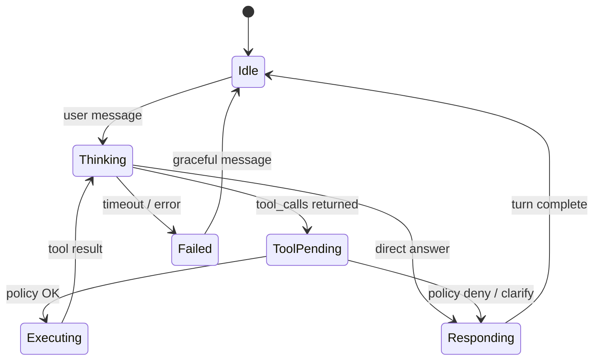
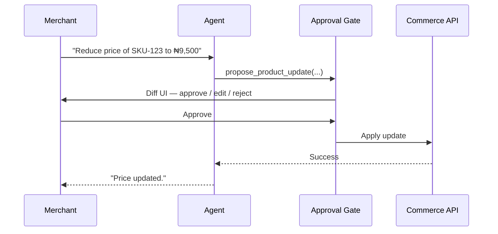

# Chapter 04: Agent Orchestration

**Document ID:** SCP-AI-001-04  
**Version:** 1.0.0  
**Status:** 📝 Draft  
**Traceability:** FR-AI-006, FR-AI-007, FR-AI-011, FR-AI-013, NFR-040, NFR-064  

---

## 1. Purpose

Specify the **agent runtime** that plans multi-step tasks, invokes tools, manages memory, streams responses, and enforces human-in-the-loop gates. Orchestration is the control plane that turns LLM completions into **safe commerce operations**.

## 2. Scope

- Agent loop (plan → act → observe)
- Tool registry and authorization
- Memory tiers (session, long-term)
- Conversation state machine
- Streaming UX contract
- Error recovery

## 3. Out of Scope

- Individual agent personas (Ch. 05–08)
- Model routing (Ch. 02)
- Raw vector retrieval (Ch. 03)

## 4. Architecture



## 5. Agent Runtime Components

| Component | Responsibility |
|-----------|----------------|
| `AgentRunner` | Main loop, max steps enforcement |
| `ToolRegistry` | Discovers tools by agent_type |
| `ToolExecutor` | Authz, idempotency, audit |
| `MemoryManager` | Read/write session + long-term memory |
| `ContextAssembler` | System prompt + RAG + memory + tools |
| `SafetyInterceptor` | Pre/post generation checks (Ch. 09) |
| `ApprovalGate` | Human confirm for sensitive tools |

## 6. Tool Calling

### Tool definition schema

```json
{
  "name": "search_products",
  "description": "Search catalog by natural language query",
  "parameters": {
    "type": "object",
    "properties": {
      "query": { "type": "string" },
      "max_price_ngn": { "type": "number" }
    },
    "required": ["query"]
  },
  "risk_class": "read",
  "required_permissions": ["catalog.read"]
}
```

### Risk classes

| Class | Examples | Gate |
|-------|----------|------|
| `read` | search_products, get_order_status | Auto-execute |
| `draft` | propose_product_description | Returns draft; merchant approves |
| `write` | update_inventory_level | Merchant confirm in UI |
| `financial` | initiate_refund | Owner + MFA step-up |
| `forbidden` | export_all_customers | Not exposed to agents |

### Execution flow

1. Model returns `tool_calls[]`
2. Safety scans arguments (injection patterns, excessive limits)
3. `ToolExecutor` checks Laravel policy + permission + tenant
4. Idempotency key: `{conversation_id}:{turn}:{tool_call_id}`
5. Result truncated to 8 KB JSON for model context
6. Emit `AIToolInvoked` audit event

### Standard tool catalog (platform)

| Tool | Agent(s) | Class |
|------|----------|-------|
| `search_products` | Shopping, Merchant | read |
| `get_product_details` | Shopping, Merchant | read |
| `add_to_cart` | Shopping | write |
| `get_order_status` | Shopping, Support | read |
| `search_orders` | Merchant, Support | read |
| `propose_product_update` | Merchant | draft |
| `propose_refund` | Support | financial |
| `get_inventory_snapshot` | Merchant, Inventory | read |
| `propose_campaign_email` | Marketing | draft |

## 7. Memory

### Tier 1: Session memory (conversation)

- Stored in `ai_messages` for full transcript
- Sliding window: last 20 turns in model context
- Summarization job when > 30 turns: `ConversationSummarizeJob` produces `rolling_summary` field

### Tier 2: Long-term memory (customer / merchant user)

Table `ai_memory_facts`:

| Column | Notes |
|--------|-------|
| `subject_type` | `customer`, `merchant_user` |
| `subject_id` | UUID |
| `fact_key` | e.g. `preferred_size`, `budget_ngn` |
| `fact_value` | JSON |
| `confidence` | 0–1 |
| `source_conversation_id` | Provenance |
| `expires_at` | Optional TTL |

**Rules:**

- Only store facts explicit in conversation or confirmed by user ("Remember I wear size 42")
- Never store payment credentials, PINs, government IDs
- Customer can view/delete via privacy portal (NFR-077)
- Merchant staff memory scoped to merchant_user, not whole tenant

### Tier 3: Episodic RAG (not memory)

Retrieved catalog/policy chunks are **not** persisted as memory — only cited per turn.

## 8. Conversation State Machine

| State | Meaning |
|-------|---------|
| `active` | Normal operation |
| `awaiting_approval` | Draft/financial action pending |
| `escalated` | Handed to human support |
| `closed` | Resolved or idle timeout |
| `redacted` | DSAR erasure applied |

**Timeouts:**

- Customer chat: 30 min idle → `closed` (resumable with history)
- Merchant copilot: 8 hours idle

## 9. Orchestration Limits

| Limit | Value |
|-------|-------|
| Max tool steps per turn | 5 |
| Max turns per conversation (customer) | 100 |
| Max wall time per turn | 45 s |
| Duplicate tool call dedup window | 10 s |

## 10. Human-in-the-Loop

Per Product Principle 4, irreversible operations require confirmation.



Financial tools never auto-execute in Phase 1–2.

## 11. API Behavior

`POST /api/v1/ai/chat` returns SSE stream:

```text
event: delta
data: {"content":"Here are "}

event: tool_call
data: {"name":"search_products","args":{...}}

event: tool_result
data: {"name":"search_products","summary":"3 items"}

event: done
data: {"usage":{...},"citations":[...]}
```

## 12. Observability

Span: `ai.agent.turn` with child spans per tool.  
Attributes: `agent_type`, `step_count`, `tools_invoked`, `approval_required`, `memory_facts_read`.

**Dashboards:**

- Tool failure rate by name
- Average steps per resolution
- Approval acceptance rate

## 13. Security

- Tool args validated against JSON Schema; reject unknown keys
- `add_to_cart` verifies customer session owns cart
- No arbitrary SQL or shell tools — fixed registry only
- OWASP LLM Top 10: excessive agency mitigated by risk classes

## 14. Nigeria / Language

- `locale` passed to context assembler; system prompts localized
- Pidgin mode: orchestrator unchanged; prompt templates differ (Ch. 05)
- Tool schemas remain English keys; model maps Pidgin intents

## 15. Test Strategy

- Unit: tool authz matrix per role
- Integration: multi-step loop with mocked gateway
- E2E: shopping flow search → add_to_cart with approval skipped (read/write split)
- Abuse: attempt 100 tool calls → throttled

## 16. Acceptance Criteria

- [ ] Tool registry enforces risk classes
- [ ] Memory write requires explicit user confirmation pattern
- [ ] Max 5 tool steps enforced
- [ ] All tool invocations in audit log within 1s
- [ ] SSE stream cancels on client disconnect

## 17. Sources

- OpenAI function calling loop patterns
- OWASP LLM Top 10 (2025): https://owasp.org/www-project-top-10-for-large-language-model-applications/
- LangGraph / agent loop industry patterns (E3)
