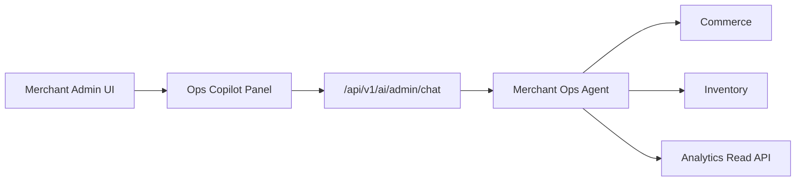

# Chapter 06: Merchant Ops Agent

**Document ID:** SCP-AI-001-06  
**Version:** 1.0.0  
**Status:** 📝 Draft  
**Traceability:** FR-AI-004, FR-AI-011, FR-AI-012, NFR-006, NFR-041  

---

## 1. Purpose

Define the **merchant operations copilot** in admin: catalog management assistance, order lookup, inventory snapshots, analytics Q&A, and draft content — accelerating Nigeria SME merchants who often run stores from mobile admin between market runs.

## 2. Scope

- Admin UX integration
- Role-based tool access
- Draft-and-approve workflows
- Analytics grounding
- Mobile admin behavior

## 3. Out of Scope

- Full autonomous catalog migration
- Accounting journal entries (ERP integration Phase 3)
- Platform admin cross-tenant views

## 4. User Personas

| Persona | Typical Tasks |
|---------|---------------|
| **Owner** | Revenue questions, refund approval, AI settings |
| **Store manager** | Product updates, inventory checks |
| **Staff** | Order search, customer lookup (masked PII) |

## 5. Architecture Placement

Copilot panel: right-side drawer on desktop; bottom sheet on mobile (thumb reach).

## 6. Tool Catalog

| Tool | Permission | Risk |
|------|------------|------|
| `search_products` | `catalog.read` | read |
| `propose_product_update` | `catalog.write` | draft |
| `propose_product_create` | `catalog.write` | draft |
| `search_orders` | `orders.read` | read |
| `get_order_details` | `orders.read` | read |
| `get_inventory_snapshot` | `inventory.read` | read |
| `propose_inventory_adjustment` | `inventory.write` | write |
| `query_analytics` | `analytics.read` | read |
| `explain_metric` | `analytics.read` | read |

No direct `delete_product` or `initiate_refund` — proposals only.

## 7. Representative Journeys

### Journey A: Product description (English)

1. Merchant on product edit screen opens copilot
2. "Write description for this Ankara two-piece, highlight dry clean only"
3. Agent reads current product context + RAG similar products
4. Returns draft in approval card → merchant edits → publishes

### Journey B: Hausa listing (Phase 1.5)

1. "Rubuta taken product a Hausa don wannan rigar"
2. Agent produces Hausa title/description draft; English canonical SKU unchanged

### Journey C: Operations check

1. "How many orders still dey pending shipment today?"
2. `query_analytics` with predefined safe query templates (no raw SQL)

## 8. Analytics Grounding

**Safe query templates only** — agent selects template ID + parameters:

| Template | Returns |
|----------|---------|
| `orders_pending_fulfillment_count` | int |
| `revenue_7d_ngn` | Money |
| `top_products_30d` | list SKU + units |

Prevents SQL injection and cross-store data leaks in multi-store tenants.

## 9. Business Rules

| ID | Rule |
|----|------|
| BR-MO-01 | Drafts never auto-publish |
| BR-MO-02 | Inventory adjustments > 100 units require owner approval |
| BR-MO-03 | Customer PII in order details masked for `staff` role (email/phone partial) |
| BR-MO-04 | Copilot disabled if tenant AI usage over hard cap |
| BR-MO-05 | Suggestions cite data timestamp ("as of 14:32 WAT") |

## 10. Memory

- Per `merchant_user` memory: preferred description tone, default language
- Not shared across staff without tenant owner enable

## 11. Events

- `MerchantCopilotDraftCreated`
- `MerchantCopilotDraftApproved`
- `MerchantCopilotDraftRejected`

Audit log links draft ID to approving user (NFR-041).

## 12. Observability

Metrics: drafts created/approved ratio, time-to-approve, tool errors by permission denial.

## 13. Security

- Sanctum session + staff role middleware
- Tenant + store context from admin session — never from client body alone
- Impersonation (ADR-010): copilot available but banner shown; all actions attributed to impersonator in audit

## 14. Performance

- Admin chat p95 ≤ 4s including one analytics tool call
- Copilot JS chunk ≤ 40 KB gzipped lazy bundle

## 15. Merchant Settings

Settings → AI → Merchant Copilot:

- Enable per role
- Allow inventory write proposals: on/off
- Default content language: EN / HA / YO / IG

## 16. Test Strategy

- RBAC matrix: staff cannot approve inventory write
- Draft diff renders correctly for long descriptions
- Mobile bottom sheet usability test

## 17. Acceptance Criteria

- [ ] All write paths go through approval UI
- [ ] Analytics answers use template IDs only
- [ ] PII masking verified for staff role
- [ ] Audit trail links draft to publisher
- [ ] Copilot respects tenant AI disable flag

## 18. Sources

- ADR-010 Admin impersonation
- Volume 5 Commerce catalog module (cross-ref when synthesized)
