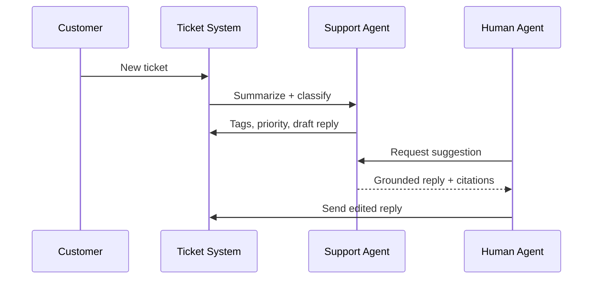

# Chapter 07: Support Agent

**Document ID:** SCP-AI-001-07  
**Version:** 1.0.0  
**Status:** 📝 Draft  
**Traceability:** FR-AI-005, FR-AI-011, NFR-041, NFR-083  

---

## 1. Purpose

Define the **support agent** that assists human agents and customers: ticket summarization, suggested replies grounded in policies, order lookup, and escalation — reducing response times for Nigerian merchants handling high WhatsApp-adjacent support expectations on platform channels.

## 2. Scope

- Helpdesk console integration
- Customer self-serve support chat (optional per store)
- Suggested reply API
- Escalation and handoff
- PII handling for NDPA

## 3. Out of Scope

- Fully autonomous ticket closure without human review (Phase 1)
- Legal advice generation
- Medical or financial advice beyond order facts

## 4. Modes

| Mode | Actor | Surface |
|------|-------|---------|
| **Assist** | Human support staff | Ticket sidebar |
| **Deflect** | Customer | Storefront help tab / chat |
| **Summarize** | System on ticket create | Background job |

## 5. Architecture

## 6. Tool Catalog

| Tool | Mode | Risk |
|------|------|------|
| `search_orders` | Assist, Deflect | read |
| `get_order_details` | Assist, Deflect | read |
| `search_tickets` | Assist | read |
| `get_policy_document` | All | read |
| `propose_ticket_reply` | Assist | draft |
| `propose_refund` | Assist | financial |
| `escalate_to_human` | Deflect | read |

## 7. RAG Sources

- Shipping/return/refund policies
- FAQ articles
- Known issue bulletins (platform-maintained)
- **Excluded:** other customers' tickets, internal runbooks with credentials

## 8. Business Rules

| ID | Rule |
|----|------|
| BR-SU-01 | Customer deflect mode cannot see other customers' data |
| BR-SU-02 | Refund proposals require human agent + owner policy limits |
| BR-SU-03 | Suggested replies must include citation or tool source |
| BR-SU-04 | Auto-escalate on 3 failed deflection turns |
| BR-SU-05 | Tickets involving fraud flagged → no AI refund suggestion |
| BR-SU-06 | NDPA data subject requests routed to DPO workflow, not AI |

## 9. PII & NDPA

- Order lookup in deflect mode: verify email + order ID or authenticated session
- Ticket summaries redact full card numbers, bank accounts, national IDs
- Support staff see full PII per existing CRM permissions
- AI memory does not retain customer PII beyond ticket retention policy
- DSAR: delete `ai_messages` linked to customer_id on erasure request

## 10. Localization

| Locale | Use |
|--------|-----|
| `en-NG` | Default ticket replies |
| `pcm-NG` | Customer deflect — conversational |
| `ha`, `yo`, `ig` | Phase 1.5 suggested reply translation with human review |

Human agent always reviews localized suggestions before send in Phase 1.5.

## 11. UI — Assist Panel

- **Summary:** 3 bullet ticket summary
- **Suggested reply:** editable textarea with citations
- **Actions:** Insert reply, Regenerate, Escalate
- **Confidence:** high/medium/low badge

## 12. Events

| Event | Consumer |
|-------|----------|
| `SupportSuggestionGenerated` | QA sampling |
| `SupportSuggestionAccepted` | Model quality metrics |
| `SupportDeflectionFailed` | Routing rules |
| `SupportEscalated` | SLA timers |

## 13. Observability

- Suggestion acceptance rate target ≥ 60% Phase 1
- Mean time to first response reduction target 25%
- Track hallucination reports via agent feedback thumbs-down

## 14. Security

- Support role required for assist mode APIs
- Ticket ID validated against tenant scope
- Prompt injection from customer ticket body: delimited untrusted blocks

## 15. Test Strategy

- Verify customer A cannot query customer B order via deflect
- Refund proposal blocked for staff without financial permission
- Citation required validation unit test

## 16. Acceptance Criteria

- [ ] Assist mode deployed in helpdesk console
- [ ] Deflect mode optional per store
- [ ] 100% refund paths require human approval
- [ ] PII redaction in summaries verified
- [ ] Escalation after 3 failed turns

## 17. Sources

- Volume 11 NDPA data subject rights
- ITIL / support copilot patterns (E3)
