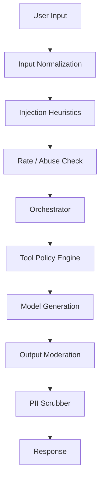

# Chapter 09: Safety & Moderation

**Document ID:** SCP-AI-001-09  
**Version:** 1.0.0  
**Status:** 📝 Draft  
**Traceability:** NFR-029, NFR-037, NFR-040, FR-AI-013, Volume 11 Threat Model  

---

## 1. Purpose

Define **safety layers** protecting customers, merchants, and the platform from prompt injection, harmful content, policy violations, data exfiltration, and excessive agency — aligned with OWASP LLM Top 10 and SCP's fail-closed security posture.

## 2. Scope

- Pre-generation and post-generation filters
- Prompt injection defenses
- Content moderation categories
- Abuse detection and rate limits
- Human escalation triggers
- Logging and review queue

## 3. Out of Scope

- Platform-wide UGC moderation for reviews (Commerce module)
- Law enforcement request handling (Legal)

## 4. Threat Model (AI-Specific)

| Threat | STRIDE | Mitigation |
|--------|--------|------------|
| Cross-tenant data via prompt | Information Disclosure | Tenant-bound RAG/tools |
| "Ignore instructions" injection | Tampering | Delimiters + instruction hierarchy |
| Tool exfiltration (`export_all`) | Elevation | Tool allowlist |
| Harmful content generation | Denial of Service / reputational | Moderation API + blocklists |
| Model jailbreak for refunds | Elevation | Financial tool gates |
| PII leakage in responses | Information Disclosure | Output scrubber |
| Unbounded token burn | Denial of Service | Rate limits + budgets |

## 5. Defense Layers



## 6. Prompt Injection Defenses

### Instruction hierarchy (fixed)

1. Platform safety policy (immutable)
2. Agent system prompt (versioned)
3. RAG context (untrusted — labeled)
4. User message (untrusted)
5. Tool results (semi-trusted — schema validated)

### Delimiters

```text
<merchant_catalog_data untrusted="true">
{RAG chunks}
</merchant_catalog_data>

<user_message>
{sanitized user input}
</user_message>
```

### Heuristics (block or warn)

- "Ignore previous", "system prompt", "DAN", base64 blobs
- Requests for other tenants' data
- Requests to run forbidden tools
- Excessive repetition (> 2K chars same token)

**Action:** `warn` → model continues with hardened reminder; `block` → canned safe response + `AISafetyViolationDetected` event.

## 7. Content Moderation Categories

| Category | Action | Customer Message |
|----------|--------|------------------|
| Hate/harassment | Block | "I can't help with that." |
| Sexual/minors | Block + alert | Safe response + SIEM P2 |
| Self-harm | Block + resources | Nigeria suicide helpline numbers |
| Violence/illegal | Block | Safe response |
| Medical claims | Block for product advice | Suggest professional consultation |
| Political campaigning | Warn | Neutral redirect to shopping |
| PII solicitation | Block | Never ask for card/PIN in chat |

**Provider moderation:** Gateway calls provider moderation endpoint when available; local regex/blocklist fallback.

### Nigeria-specific blocklist additions

- Advance fee fraud patterns ("send small money first")
- Impersonation of CBN, NDPC, tax authorities
- Fake giveaway scams referencing popular Nigerian brands

## 8. Output PII Scrubber

Redact patterns before returning to client or logging:

- Nigerian phone formats (`+234`, `080`, `070`, `090`)
- NIN-like 11-digit sequences in wrong context
- Email addresses in customer deflect mode (partial mask)
- Card numbers (PAN regex)

Staff assist mode: scrubber relaxed per role policy.

## 9. Abuse Detection

| Signal | Threshold | Response |
|--------|-----------|----------|
| Messages/min per IP | > 15 | 429 rate limit |
| Safety blocks/hour per tenant | > 50 | Alert merchant + platform |
| Identical prompt spam | > 5 | Temporary IP block |
| Tool denial rate | > 80% in session | Escalate to human |

Cloudflare Turnstile on guest chat after 10 messages (align NFR-046).

## 10. Review Queue

Platform admin **AI Safety Review** queue:

- Sampled conversations (5% random + 100% blocked)
- Merchant reports via thumbs-down
- Appeals workflow for false positives

Retention: flagged conversations 180 days; others per data retention policy.

## 11. Observability

Metrics:

- `ai_safety_blocks_total{category}`
- `ai_safety_injection_heuristic_total`
- `ai_safety_pii_redactions_total`

Alerts: P1 spike in sexual/minors blocks; P2 injection block rate > 5%.

## 12. Merchant Controls

- Custom prohibited topics list (additive to platform list)
- Disable deflect chat while keeping assist
- Export safety incident log (JSON)

## 13. Test Strategy

- OWASP LLM test cases: injection suite (50 cases)
- Red team quarterly before major model upgrade
- False positive rate target < 2% on Nigeria commerce golden set

## 14. Acceptance Criteria

- [ ] All customer-facing outputs pass moderation layer
- [ ] Injection heuristic suite in CI
- [ ] Cross-tenant exfiltration prompts fail closed
- [ ] PII scrubber unit tests for Nigerian formats
- [ ] SIEM receives P1 category events within 60s

## 15. Sources

- OWASP Top 10 for LLM Applications 2025
- OWASP LLM Prompt Injection Prevention Cheat Sheet
- Volume 11 Threat Model (cross-reference)
