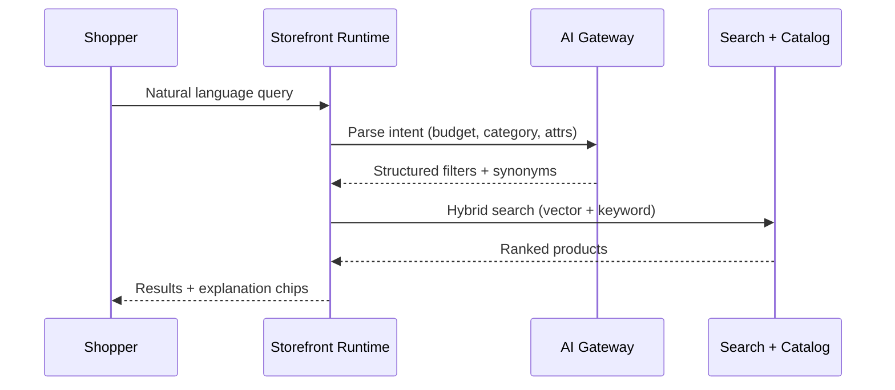

# Chapter 13: AI Storefront Commerce

**Document ID:** SCP-AI-001-13  
**Version:** 1.0.0  
**Status:** ✅ Active  
**Traceability:** FR-AI-003, FR-AI-011–FR-AI-018, ADR-017, NFR-079, NFR-083  

---

## Purpose

Define **AI-native storefront commerce** — intent search, product comparison, personal shopper, voice, and visual search — integrated into shopping flows, not isolated in a chat widget.

---

## 1. Design Principle

> The storefront is a digital salesperson. AI advises, compares, and discovers — it does not replace merchant trust or checkout confirmation.

Every AI output that affects money or inventory must cite **live Commerce API data**.

---

## 2. Capability Matrix

| Capability | User example | Phase | Surface |
|------------|--------------|-------|---------|
| Intent search | “Gaming laptop under ₦800,000” | 2 | Search bar, AI finder |
| Use-case search | “Laptop for AutoCAD” | 2 | Search |
| Gift search | “Gift for my mother” | 2 | AI finder |
| Product comparison | MacBook vs Dell vs Lenovo | 2 | Compare drawer |
| Personal shopper | “Welcome back — robotics supplies?” | 2 | Homepage segment |
| Conversational advisor | “Software engineering laptop budget 500k” | 2 | Assistant + finder |
| Voice shopping | “Show Samsung phones under 50k” | 3 | Mic button |
| Visual search | Upload dress photo → similar SKUs | 3 | Search / PLP |
| Order voice query | “Where is my order?” | 3 | Assistant |

**Currency:** Prompts and examples use tenant locale — ₦ Nigeria, KSh Kenya.

---

## 3. Intent Search Architecture



### 3.1 Parsed Intent Schema

```json
{
  "category_hints": ["laptops"],
  "price_max_minor": 80000000,
  "currency": "NGN",
  "attributes": { "use_case": "gaming", "ram_gb_min": 16 },
  "sort_preference": "value",
  "locale": "en-NG"
}
```

### 3.2 Business Rules

| Rule | Detail |
|------|--------|
| AI-SR-01 | Never invent products not in catalog |
| AI-SR-02 | Price filters use current variant prices |
| AI-SR-03 | Out-of-stock may appear with “notify me” only |
| AI-SR-04 | Marketplace shows vendor on multi-seller results |
| AI-SR-05 | Log queries for ASI search suggestions (anonymized) |

---

## 4. AI Product Comparison

Customer selects 2–4 products → **Compare** → AI generates structured comparison.

### 4.1 Output Template

```text
MacBook Air M3  vs  Dell XPS 15  vs  Lenovo ThinkPad X1

Summary
Best for students: MacBook Air (battery, weight)
Best for developers: Dell XPS (RAM, Linux-friendly options)
Best value: Lenovo (price/performance)

Pros / Cons (per product)
Battery · Performance · Warranty · Availability in Lagos

Recommendation
[Add recommended SKU to cart]
```

### 4.2 Grounding

- Specs from product attributes + RAG on descriptions
- “Best for X” requires explicit reasoning chain in logs (merchant audit)
- Comparison UI uses native Product Card Compact components
- Merchant can disable comparison for categories (e.g. medical)

---

## 5. Personal Shopper (Returning Customer)

Triggered by authenticated session or consented cookie.

```text
👋 Welcome back, Stephen.

Continue shopping: [Robotics kit — in cart]
Recommended: Sensors bundle (often bought with your last order)
Need help? Ask anything.
```

| Data source | Consent |
|-------------|---------|
| Recent orders | Account contract |
| Recently viewed | Session or opt-in |
| Segment (instructor, VIP) | Merchant rules + consent |
| Cross-session memory | Explicit opt-in |

Pidgin/English code-switching supported (Chapter 05).

---

## 6. Voice Shopping

### 6.1 Scope

| Command type | Example | Auth |
|--------------|---------|------|
| Search | “Find black shoes size 43” | Public |
| Add to cart | “Add two packs of milk” | Confirm chip |
| Order status | “Where is my order?” | Verified customer |

### 6.2 Architecture

- Browser Web Speech API (Phase 3 web); native speech in mobile app (Volume 18)
- Audio not stored by default; transcript only with consent
- Nigerian English + Pidgin acoustic bias in test matrix
- Fallback to text input when mic denied

---

## 7. Visual Search

1. Customer uploads image (JPEG/PNG/WebP, max 5 MB)
2. Platform generates embedding (tenant-scoped index)
3. Similar products ranked from catalog vectors + color/shape heuristics
4. Results show “Visual match” badge + similarity score band

**Verticals:** Fashion, furniture, electronics, décor (Phase 3).

**Privacy:** Images deleted after 24h unless customer saves to account.

**NDPA:** Upload notice; no facial recognition for identity.

---

## 8. Integration Points (Not a Corner Bot)

| Location | AI mode |
|----------|---------|
| Homepage | Embedded product finder |
| Search | Intent parsing + chips |
| PLP | Refine by natural language |
| PDP | “Ask about this product” |
| Compare page | Narrative comparison |
| No results | Suggest alternatives |
| Floating launcher | Secondary help entry |

---

## 9. Performance & Cost

| Surface | Load strategy | Budget |
|---------|---------------|--------|
| Search intent | Server-side parse | p95 ≤ 400ms |
| Finder widget | Lazy after idle 5s or interaction | +≤ 30 KB JS |
| Voice | On mic tap | No preload |
| Visual search | On upload | Async job ≤ 3s p95 |

Token costs metered per tenant (Volume 9 Ch. 10).

---

## 10. Safety

- No medical/legal/financial advice beyond product facts
- No negotiation on price unless merchant enables dynamic rules
- Prompt injection scrub on product titles in RAG (Ch. 09)
- Human escalation path to support

---

## 11. Acceptance Criteria

- [ ] Intent search returns products matching parsed budget and category
- [ ] Comparison view grounded in catalog attributes; no fabricated specs
- [ ] Personal shopper requires consent for cross-session memory
- [ ] Voice add-to-cart requires visible confirmation
- [ ] Visual search deletes ephemeral uploads within 24h
- [ ] All surfaces lazy-load within Volume 4 performance budgets
- [ ] Kenya prompts display KSh when tenant currency is KES

---

## References

- [Chapter 05 — Shopping Assistant](./05-shopping-assistant-agent.md)
- [Chapter 14 — ASI](./14-adaptive-storefront-intelligence.md)
- [Volume 4 Ch. 13 — Visual Direction](../04-design-system/13-storefront-visual-direction.md)
- [Volume 6 Ch. 12 — Eight Layers](../06-theme-engine/12-storefront-engine-eight-layers.md)
