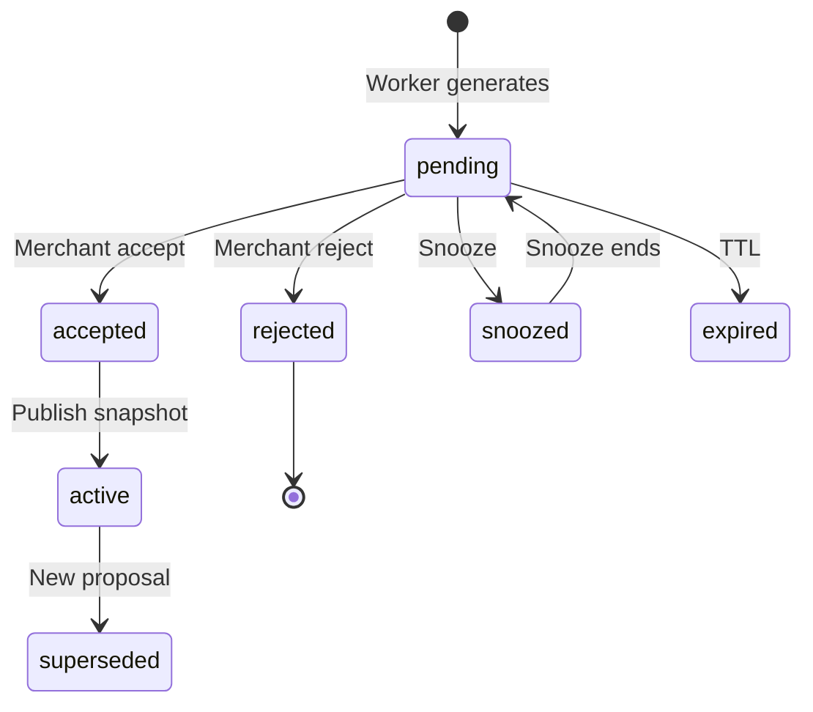

# Chapter 14: Adaptive Storefront Intelligence (ASI)

**Document ID:** SCP-AI-001-14  
**Version:** 1.0.0  
**Status:** ✅ Active  
**Traceability:** ADR-018, FR-AI-019–FR-AI-024, NFR-083  

---

## Purpose

Specify **Adaptive Storefront Intelligence (ASI)** — transparent, merchant-controlled optimization that makes the storefront learn from behavior without silent black-box changes.

---

## 1. Problem Statement

Static homepages leave conversion on the table. Fully automatic “AI optimization” erodes trust. ASI sits in the middle: **propose, explain, merchant decides**.

---

## 2. Proposal Types

| Type | Example proposal | Risk tier |
|------|------------------|-----------|
| `module_reorder` | Move Best Sellers above Trending | Low |
| `collection_sort` | Sort by conversion not manual order | Low |
| `hero_swap` | Suggest campaign hero underperforming | Medium |
| `cta_variant` | Test “Shop now” vs “Browse deals” | Medium |
| `recommendation_tweak` | Increase weight on viewed category | Low |
| `search_boost` | Boost synonym “sneakers” → “trainers” | Low |
| `new_section` | Add FAQ block (high bounce on shipping) | High |

| Tier | Auto-apply allowed? |
|------|---------------------|
| Low | Only if merchant enables auto-apply scope |
| Medium | Never auto — requires accept |
| High | Never auto — requires accept + preview |

---

## 3. Proposal Schema

```json
{
  "id": "asi_prop_abc",
  "tenant_id": "uuid",
  "type": "module_reorder",
  "status": "pending",
  "title": "Move Best Sellers above Trending",
  "explanation": "Best Sellers had 12% higher add-to-cart over 14 days. Trending section had high exits.",
  "evidence": {
    "metric": "add_to_cart_rate",
    "window_days": 14,
    "delta_percent": 12
  },
  "diff": {
    "template": "index",
    "order_before": ["hero", "trending", "best-sellers"],
    "order_after": ["hero", "best-sellers", "trending"]
  },
  "expected_impact": "moderate_positive",
  "created_at": "2026-07-12T09:00:00Z",
  "expires_at": "2026-07-19T09:00:00Z"
}
```

---

## 4. Merchant UX (Visual Builder)

```text
┌─────────────────────────────────────────────┐
│ Storefront suggestions (3)                  │
├─────────────────────────────────────────────┤
│ Move Best Sellers above Trending            │
│ Why: +12% add-to-cart over 14 days          │
│ [Preview] [Accept] [Reject] [Snooze 7d]     │
├─────────────────────────────────────────────┤
│ Boost search: "trainers" → sneakers category│
│ Why: 240 failed searches this week          │
│ [Accept] [Reject]                           │
└─────────────────────────────────────────────┘
```

**Preview** opens mobile + desktop diff in preview iframe.

---

## 5. Lifecycle



On **accept**, API writes `asi_overrides` into draft; merchant still clicks **Publish** unless auto-apply enabled for low-risk tier.

---

## 6. Data Sources

| Source | Use |
|--------|-----|
| `analytics_daily_store` | GMV, sessions |
| `analytics_product_sales` | Conversion by SKU |
| `analytics_funnel` | Drop-off by step |
| Search query logs | Failed/zero-result queries |
| Section impression events | Module engagement |

No cross-tenant raw data in merchant-visible explanations.

---

## 7. Personalization vs ASI

| | Personalization | ASI |
|---|-----------------|-----|
| Audience | Individual shopper | Store layout for all/segments |
| Control | Consent + customer opt-out | Merchant accept |
| Runtime | Segment recipes (Ch. 12) | Module order/sort overrides |
| Transparency | “Based on what you viewed” | “Because sales data shows…” |

Both compose: ASI sets store-wide defaults; personalization tailors within rules.

---

## 8. A/B and Experimentation

Phase 3: ASI may propose **controlled experiments**:

- 50/50 traffic split on CTA copy
- Minimum sample size before recommendation
- Results shown with statistical confidence band
- Experiment ends → winner proposed as permanent change

---

## 9. API

```http
GET /api/v1/stores/{id}/asi/proposals?status=pending
POST /api/v1/stores/{id}/asi/proposals/{id}/accept
POST /api/v1/stores/{id}/asi/proposals/{id}/reject
PATCH /api/v1/stores/{id}/asi/settings
```

Settings include `auto_apply_low_risk: boolean`, `digest_email: weekly`.

---

## 10. Compliance

- NDPA: profiling documented in RoPA; customer-facing personalization separate consent
- Audit: accept/reject logged (ADR-009)
- No discriminatory pricing via ASI — pricing rules remain Commerce module
- Merchant may export proposal history

---

## 11. Acceptance Criteria

- [ ] Default mode: no ASI change live without merchant accept
- [ ] Every proposal includes human-readable explanation + evidence
- [ ] Preview shows diff before accept
- [ ] Low-risk auto-apply is opt-in and scoped
- [ ] Proposals expire after 7 days if untouched
- [ ] ASI worker tenant-isolated (RLS)
- [ ] Rejecting proposal prevents re-proposal of same change for 14 days unless metric shifts > 20%

---

## References

- [ADR-018](../00-meta/adr/018-adaptive-storefront-intelligence.md)
- [Volume 6 Ch. 12](../06-theme-engine/12-storefront-engine-eight-layers.md)
- [Volume 17 Ch. 08 — Analytics](../17-database-data-architecture/08-analytics-pipeline-olap.md)
