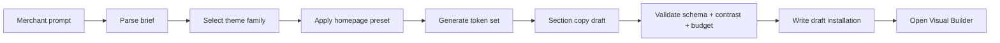

# Chapter 15: AI Theme Generator

**Document ID:** SCP-AI-001-15  
**Version:** 1.0.0  
**Status:** ✅ Active  
**Traceability:** FR-AI-025, PRD-002, ADR-003, ADR-012, ADR-017  

---

## Purpose

Define **AI Theme Generator** — first-class merchant experience that creates a complete storefront draft from a natural-language brief, then hands off to Visual Builder for fine-tuning.

---

## 1. User Journey

Merchant: *“Build a luxury jewelry store for Lagos — elegant, dark, gold accents.”*

Platform generates:

1. Recommended theme family (Retail → jewelry preset)
2. Homepage section order + copy draft
3. Color palette + typography (contrast-validated)
4. Navigation structure
5. Collection placeholders
6. Hero/media **placeholders** (stock or merchant upload prompts)
7. FAQ and trust sections for category

Merchant reviews in Visual Builder → edits → publishes.

**Target:** Draft storefront in ≤ 10 minutes vs 45+ manual.

---

## 2. Input Brief Schema

```json
{
  "industry": "jewelry",
  "tone": ["luxury", "elegant"],
  "market": "NG",
  "audience": "affluent women 25-45",
  "primary_products": "gold necklaces, engagement rings",
  "brand_words": ["timeless", "craftsmanship"],
  "avoid": ["flashy discounts", "cartoon fonts"]
}
```

Free-text prompt parsed to this schema via LLM + validation.

---

## 3. Generation Pipeline



---

## 4. Outputs (Not Code Generation)

AI **does not** generate arbitrary React code. It produces:

| Output | Format |
|--------|--------|
| Template JSON | Valid section instances |
| Theme settings | `theme.schema.json` compliant |
| Copy | Merchant-editable strings |
| Image prompts | Optional; merchant uploads final assets |
| Navigation menu | CMS navigation entries |

This preserves Theme Engine portability and security (ADR-003).

---

## 5. Quality Gates (Automated)

| Gate | Action if fail |
|------|----------------|
| WCAG contrast | Adjust palette automatically |
| Five-second test heuristics | Inject trust + category headline |
| JS budget estimate | Remove heavy sections |
| Schema validation | Retry generation with error feedback |
| Nigeria defaults | NGN, Paystack trust icons if payments enabled |

---

## 6. Merchant Controls

- Regenerate single section vs full store
- Lock brand color while regenerating copy
- “Make it more minimal / more bold” refinement prompts
- Revert to blank preset
- All AI copy marked “Review before publish”

---

## 7. Relationship to Theme Store

| Path | Use case |
|------|----------|
| AI Generator | Cold start, rebranding |
| Theme Store | Pro-designed vertical themes |
| Built-in presets | Fast default |

AI-generated drafts may recommend purchasing a matching Theme Store theme.

---

## 8. Cost & Limits

| Plan | Generations/month |
|------|-------------------|
| Starter | 3 full / 20 section |
| Growth | 10 full / 100 section |
| Pro | 30 full / unlimited section |

Metered via AI gateway (Volume 9 Ch. 10).

---

## 9. Acceptance Criteria

- [ ] Prompt → valid draft installation without manual JSON editing
- [ ] Generated theme passes schema + contrast validation
- [ ] No executable code in AI output — JSON settings only
- [ ] Merchant must explicitly publish — no auto-live
- [ ] Generated copy editable in Visual Builder
- [ ] Industry presets cover Retail, Food, Services, Education, Digital minimum
- [ ] Nigeria briefs default NGN and local trust patterns

---

## References

- [Chapter 06 — Theme Editor](../06-theme-engine/05-theme-editor-merchant-ux.md)
- [Volume 6 Ch. 11 — Presets](../06-theme-engine/11-reference-themes-section-catalog.md)
- [Volume 4 Ch. 13 — Visual Direction](../04-design-system/13-storefront-visual-direction.md)
