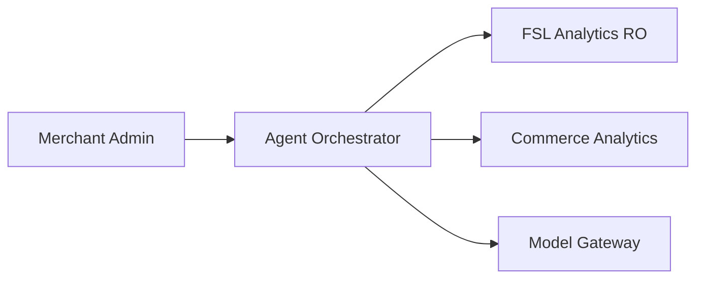

# Chapter 16: Africa Commerce AI Advisor

**Document ID:** SCP-AI-001-16  
**Version:** 1.0.0  
**Status:** ✅ Active  
**Traceability:** ADR-019, PRD-003, NFR-079  

---

## Purpose

Define **Africa-aware AI advisors** that understand local commerce — payment gateway selection, country-specific setup, and operational diagnostics — not generic eCommerce answers copied from Western platforms.

---

## 1. Gateway Recommendation Agent

### Merchant Question

> "Which payment gateway should I use?"

### Inputs

| Signal | Source |
|--------|--------|
| Country | Store / wizard |
| Business type | Vertical, B2B/B2C |
| Average order value | Analytics |
| Settlement requirements | Merchant preference (daily vs T+2) |
| Supported currencies | Currency Engine |
| Enabled methods | Customer payment mix |

### Output

Ranked gateway list with rationale:

```text
Kenya retail, AOV KSh 3,500 →
1. M-Pesa (Daraja) — highest conversion for your customer mix
2. Pesapal — backup mobile money + card
3. Paystack — if you sell to card-holding diaspora
```

Uses read-only FSL analytics: success rate, failure reasons, settlement latency per adapter.

---

## 2. AI Business Advisor

### Merchant Question

> "Sales are down this month."

### Analysis Dimensions

| Dimension | Actionable output |
|-----------|-------------------|
| Product performance | Top/bottom SKUs, margin impact |
| Conversion rate | Funnel drop by step |
| Cart abandonment | Recovery campaign suggestion |
| Payment failures | Gateway/method breakdown from FSL |
| Search trends | Zero-result queries → catalog gaps |
| Inventory | Stockouts on high-traffic SKUs |

### Guardrails

- Suggestions are **recommendations**, not auto-executed (merchant confirms)
- No access to other tenants' data
- Financial advice disclaimer for tax/settlement topics

---

## 3. Country Setup Copilot

Works with merchant setup wizard (Vol 5 Ch. 18):

- Confirms country → currency, language, tax, gateways
- Explains why M-Pesa appears before cards in Kenya
- Surfaces compliance checklist (NDPA, VAT registration)

---

## 4. Integration



Tools: `get_payment_failure_report`, `get_conversion_funnel`, `list_recommended_gateways`, `get_inventory_stockouts`.

---

### Onboarding Consultant Agent

Day-one and growth-mode agent for merchant setup — see [Volume 16 Ch. 09](../16-saas-multi-tenancy/09-ai-guided-merchant-onboarding.md).

| Capability | Tool |
|------------|------|
| Run business interview | `start_onboarding_interview` |
| Accept one-click config bundle | `apply_recommendation_bundle` |
| Read readiness score | `get_store_readiness` |
| Suggest next onboarding step | `get_next_onboarding_action` |

---

## 5. Acceptance Criteria

- [ ] Gateway recommendation uses country + AOV + failure rates
- [ ] Business advisor cites payment failure data from FSL
- [ ] No Stripe-first default when country is African
- [ ] Swahili/French responses where store language configured
- [ ] Onboarding consultant completes interview handoff to readiness score

---

## References

- [Volume 5 Ch. 16 — Financial Services Layer](../05-commerce-engine/16-financial-services-layer.md)
- [Volume 5 Ch. 17 — Gateway Adapters](../05-commerce-engine/17-payment-gateway-adapters-africa.md)
- [Merchant Ops Agent](./06-merchant-ops-agent.md)
