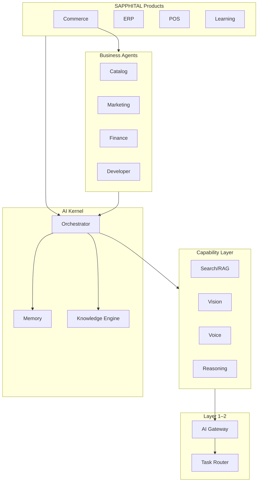

# Chapter 17: AI Operating System Architecture

**Document ID:** SCP-AI-001-17  
**Version:** 1.0.0  
**Status:** ✅ Active  
**Traceability:** ADR-020, PRD-AI-001, NFR-062–NFR-068  

---

## Purpose

Define the **SAPPHITAL Intelligence Platform (SIP)** as an **AI Operating System** — not a chatbot. Every SCP feature asks: *How can AI make this faster, smarter, or easier?*

---

## 1. Wrong vs Right Architecture

```text
WRONG                          RIGHT
Website                        SAPPHITAL AI Operating System (Brain)
  ↓                                      │
AI Chat                    Commerce Intelligence Engine
                                         │
                           ┌─────────────┼─────────────┐
                           │ Merchant AI │ Customer AI │
                           │ Admin AI    │ Developer AI│
                           └─────────────┴─────────────┘
                                         │
                              AI Skills / Agents
                                         │
                           Catalog │ Marketing │ Inventory │
                           Payments │ Analytics │ Themes │ …
```

---

## 2. Three-Platform Ecosystem

| Platform | Owns | Products Consume |
|----------|------|------------------|
| **SAPPHITAL Core** | Identity, multi-tenancy, billing, notifications, files, APIs, permissions, audit, feature flags | All |
| **SAPPHITAL Intelligence** | Gateway, router, memory, RAG, orchestrator, workflows, observability, prompts | All business apps |
| **SAPPHITAL Business Applications** | Commerce, Marketplace, ERP, CRM, POS, Learning, HR, Finance | End-user value |

Commerce is **one consumer** of Intelligence — not the owner of AI logic.

---

## 3. Seven Layers

### Layer 1 — AI Gateway

Application never calls OpenAI/Anthropic/Google directly.

```text
Application → AI Gateway → Provider Router → Adapters → LLM APIs
```

Capabilities exposed: `complete()`, `embed()`, `vision()`, `transcribe()`, `moderate()`.

### Layer 2 — AI Router

Task-based routing; **user never chooses model**.

| Task | Routed model (example) | Preference |
|------|------------------------|------------|
| Product description | Claude (long-form writing) | quality |
| Image analysis | GPT Vision | vision |
| Fast chat | GPT mini / Gemini Flash | fast |
| Code / theme scaffold | Claude Opus / GPT | code |
| Translation | Gemini | multilingual |
| Deep reasoning | OpenAI reasoning tier | quality |
| Cost-sensitive batch | DeepSeek / Gemini Flash | economy |

Router reads: `task_type`, `tenant_policy`, `latency_budget`, `cost_budget`, provider health.

### Layer 3 — AI Memory

| Tier | Scope | Storage |
|------|-------|---------|
| Short-term | Current turn context | In-memory / Redis |
| Session | Shopping or admin session | `ai_conversations` |
| Merchant | Brand, tone, policies, settings | `ai_merchant_profile` |
| Long-term knowledge | Docs, FAQs, manuals | pgvector + object storage |
| Global | World knowledge | LLM weights (not stored) |
| Timeline | Decisions, campaigns, spikes | `ai_memory_timeline` Phase 2 |

### Layer 4 — Knowledge Engine

```text
Merchant uploads PDF → chunk + embed → index
Customer asks "How long is warranty?" → RAG retrieve → grounded answer
```

Sources: products, CMS, uploaded PDFs, invoices, training materials, policies.

### Layer 5 — AI Agents

Specialized agents with tools — see [Ch. 19](./19-ai-agents-skills-multi-agent.md).

### Layer 6 — AI Workflow Engine

Event-driven automation — see [Ch. 20](./20-ai-workflow-engine-event-bus.md).

Example: product image upload triggers background removal → title → SEO → tags → social posts.

### Layer 7 — Multi-Agent Collaboration

Orchestrator coordinates agents for complex goals:

```text
"I'm opening a pharmacy in Nairobi. Build my store."
  → Theme Agent → Catalog Agent → SEO Agent → Payment Agent → Tax Agent → Shipping Agent → Marketing Agent
```

---

## 4. AI Kernel Diagram



---

## 5. Technology Stack

```text
Next.js (storefront/admin)
    ↓
Laravel API (modular monolith)
    ↓
AI Gateway → Agent Orchestrator → Memory → Vector DB → Workflow Engine → Model Router → LLMs
```

Module namespace: `App\Domains\Intelligence` (alias `App\Domains\AI` Phase 1).

---

## 6. Intelligence API (Internal)

| Method | Consumer | Purpose |
|--------|----------|---------|
| `intelligence.chat()` | Storefront, admin | Conversational turn |
| `intelligence.runAgent()` | Commerce jobs | Single agent task |
| `intelligence.runWorkflow()` | Event bus | Pipeline execution |
| `intelligence.retrieve()` | Any module | RAG search |
| `intelligence.embed()` | Indexing jobs | Vector upsert |
| `intelligence.recommend()` | Decision engine | Scored suggestion + explanation |

**Forbidden:** `OpenAI::client()` outside `Intelligence\Gateway\Adapters\*`.

---

## 7. Phase Rollout

| Phase | Deliverables |
|-------|--------------|
| 1 | Gateway, router, memory, RAG, orchestrator, core agents, security pipeline |
| 2 | Workflow engine, event bus, prompt versioning, observability dashboard |
| 3 | Skills marketplace, digital twin, multi-agent debate, simulator |
| 4 | Voice commerce, advanced vision, on-prem/local models |

---

## 8. Acceptance Criteria

- [ ] Zero direct LLM SDK usage outside Intelligence module
- [ ] Task router selects model by task type
- [ ] Commerce calls Intelligence only via capability API
- [ ] Seven layers documented in runbooks
- [ ] Three-platform boundary enforced in architecture reviews

---

## References

- [ADR-020](../00-meta/adr/020-sapphital-intelligence-platform.md)
- [Ch. 02 — Model Gateway](./02-model-gateway.md)
- [Ch. 04 — Agent Orchestration](./04-agent-orchestration.md)
