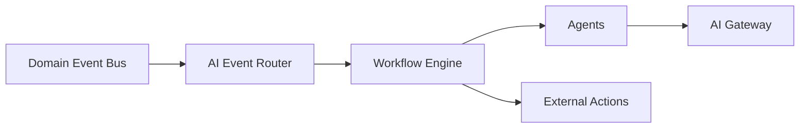

# Chapter 20: AI Workflow Engine & Event Bus

**Document ID:** SCP-AI-001-20  
**Version:** 1.0.0  
**Status:** ✅ Active  
**Traceability:** ADR-020, Volume 19 Automation  

---

## Purpose

Define the **AI Workflow Engine** and **AI Event Bus** — turning every platform event into an automation opportunity (Zapier + n8n + AI).

---

## 1. AI Event Bus

Every domain event may trigger intelligence:

```text
ProductCreated → AI Analysis → SEO + Social + Price suggestion + Category + Image optimize
OrderPaid → Fraud check → WhatsApp → Invoice → Inventory → Warehouse notify
InventoryLow → Decision Engine → Reorder recommendation → Draft PO
```

### Integration



AI Event Router filters: tenant AI enabled, workflow subscribed, cost budget OK.

---

## 2. Workflow Engine

### Visual Workflow Builder (Phase 2)

Merchant-facing: drag triggers → AI steps → actions.

| Node type | Example |
|-----------|---------|
| Trigger | `New Order`, `Product Uploaded`, `Stock Below Threshold` |
| AI step | `Detect Fraud`, `Generate Caption`, `Summarize Ticket` |
| Action | `Send WhatsApp`, `Update Inventory`, `Create Draft` |
| Condition | `Order value > ₦50,000` |
| Approval | `Merchant confirm before send` |

### Product Upload Pipeline (Reference)

```text
Image → Background removal → Enhancement → Title → Description → SEO → Price suggest → Category → Tags → Social content → Ready for review
```

No manual clicks required; merchant approves batch at end.

---

## 3. AI Decision Engine

Proactive recommendations — not only Q&A:

```text
Inventory running low
  → Compare supplier prices
  → Estimate demand
  → Suggest quantity
  → Draft purchase order
  → Merchant approves
```

Outputs: `Recommendation` + `Explanation` + `Confidence` + `Evidence[]`.

---

## 4. AI Workflow Builder vs Automation Volume

| Concern | Volume 19 | Volume 9 Ch. 20 |
|---------|-----------|-----------------|
| Non-AI workflows | Primary | Consumes |
| AI-specific nodes | Basic | Primary |
| Agent invocation | Via action | Native |
| Prompt/version binding | — | Yes |

Automation engine executes; Intelligence owns AI node definitions.

---

## 5. Idempotency & Cost

- Workflow runs keyed by `(tenant_id, event_id, workflow_id)`
- AI steps respect per-tenant token budgets (Ch. 10)
- Failed steps retry with exponential backoff; dead-letter queue for ops

---

## 6. Acceptance Criteria

- [ ] `ProductCreated` triggers configurable AI workflow
- [ ] Visual builder supports AI + action nodes (Phase 2)
- [ ] Decision engine returns explanation + confidence
- [ ] Workflows idempotent on duplicate events
- [ ] Integration with Volume 19 event catalog documented

---

## References

- [Volume 19 Ch. 02 — Workflow Engine](../19-automation-integrations/02-workflow-engine.md)
- [Volume 19 Ch. 03 — Event Action Catalog](../19-automation-integrations/03-event-action-catalog.md)
