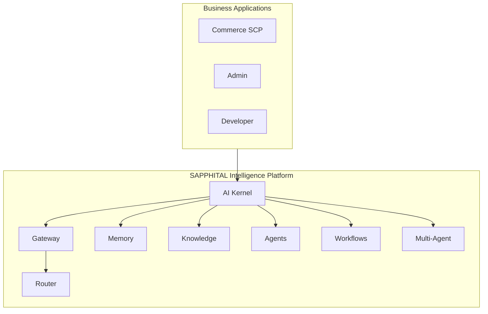

# Volume 9: SAPPHITAL Intelligence Platform

**Document ID:** SCP-AI-001  
**Version:** 2.0.0  
**Status:** ✅ Active  
**Depends On:** Volume 3 (Architecture), Volume 5 (Commerce), Volume 11 (Security), ADR-002, ADR-020  
**Owner:** Sapphital Learning Company  

---

## Purpose

Volume 9 defines **SAPPHITAL Intelligence Platform (SIP)** — the **AI Operating System** for all SAPPHITAL products. Not a chatbot. The intelligence layer: gateway, router, memory, knowledge, agents, workflows, observability.

> **Build an AI Operating System, not an AI chatbot.**

Commerce, ERP, POS, CRM, and Learning **consume** Intelligence through capability APIs (ADR-020).

## Scope

- AI OS seven-layer architecture and kernel
- Multi-model gateway and task-based router
- Memory tiers, knowledge engine, business graph, digital twin
- Agent catalog, multi-agent orchestration, skills marketplace
- AI workflow engine and event bus
- Observability, prompt versioning, security pipeline, learning loop
- Voice, vision, image AI, copilot, simulator, experimentation
- NDPA compliance and tenant isolation

## Out of Scope

- Custom model training (Phase 3+ research)
- Autonomous irreversible actions without human confirmation

## Architecture Position

## Chapters

| # | Chapter | Status |
|---|---------|--------|
| 01 | [AI Platform Overview](./01-ai-platform-overview.md) | ✅ |
| 02 | [Model Gateway](./02-model-gateway.md) | ✅ |
| 03 | [RAG & pgvector](./03-rag-pgvector.md) | 📝 |
| 04 | [Agent Orchestration](./04-agent-orchestration.md) | 📝 |
| 05–08 | Production agents | 📝 |
| 09–12 | Safety, isolation, DPIA, acceptance | 📝 |
| 13–16 | Storefront AI, ASI, themes, Africa advisor | ✅ |
| 17 | [AI Operating System Architecture](./17-ai-operating-system-architecture.md) | ✅ |
| 18 | [Memory, Knowledge & Business Graph](./18-ai-memory-knowledge-business-graph.md) | ✅ |
| 19 | [Agents, Skills & Multi-Agent](./19-ai-agents-skills-multi-agent.md) | ✅ |
| 20 | [Workflow Engine & Event Bus](./20-ai-workflow-engine-event-bus.md) | ✅ |
| 21 | [Observability, Prompts, Security](./21-ai-observability-prompts-security-learning.md) | ✅ |
| 22 | [Advanced Capabilities](./22-advanced-ai-capabilities.md) | ✅ |

## Related ADRs

| ADR | Relevance |
|-----|-----------|
| [ADR-020](../00-meta/adr/020-sapphital-intelligence-platform.md) | AI OS; three-platform ecosystem |
| [ADR-019](../00-meta/adr/019-financial-services-layer.md) | Finance Agent, Payment Advisor |
| [ADR-018](../00-meta/adr/018-adaptive-storefront-intelligence.md) | ASI |
| [ADR-002](../00-meta/adr/002-multi-tenancy-shared-db-rls.md) | Tenant scoping |

## Nigeria Language Roadmap

| Phase | Languages | Surfaces |
|-------|-----------|----------|
| Phase 1 | English, Pidgin | All agents |
| Phase 1.5 | Hausa, Yoruba, Igbo | Storefront + ops |
| Phase 2 | French, Swahili | East/West Africa |
